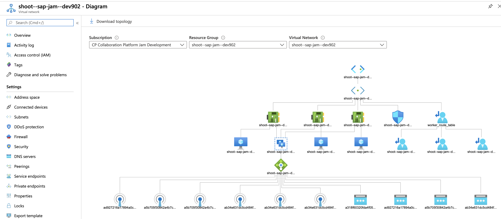
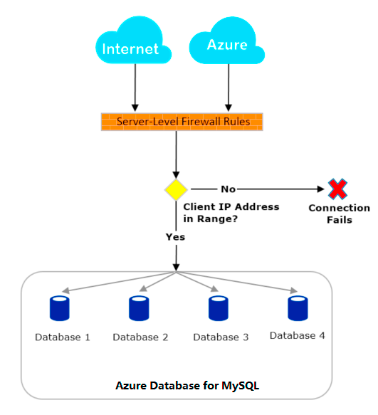
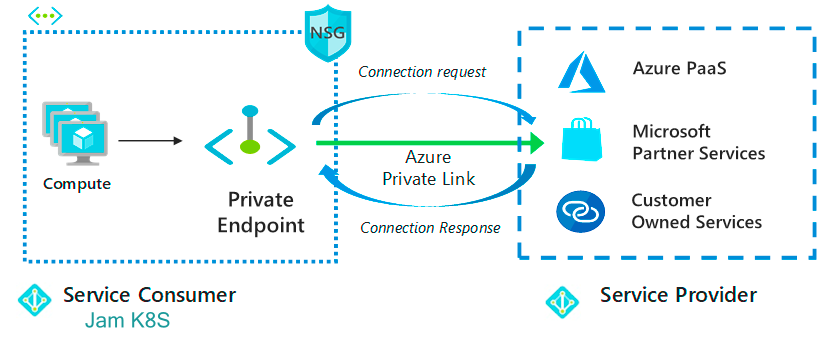
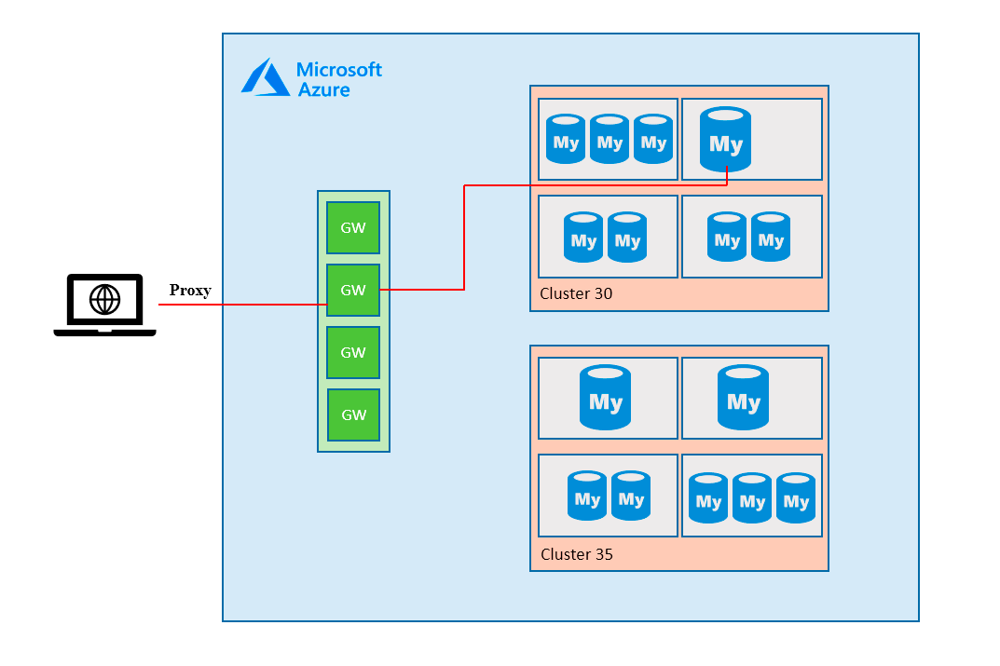

# Azure Terraform

## Azure IaaS Overview



### Azure Resources and Network Access Control

Azure takes most of maintenance role of the common PaaS services as:

* Azure Storage
* Azure SQL Database ...

Those services are allocated by region and do not direct connect to specific virtual networks. To access the Azure PaaS services, it is necessary to configure proper firewall rules.

By default, the requests from virutal network to access the Azure PassS services still route through public network.



**To have stict and consistent access control of the services**, we could leverage the private link and private endpoints to connect virtual network and Azure PaaS services.

**Traffic between the virtual network and the service travels the Microsoft backbone network**. Exposing the `data-sensitive` services to the public internet is no longer necessary.




### MySQL

**Connections to an Azure Database for MySQL server are first routed through a regional gateway**. The gateway has a publicly accessible IP, while the server IP addresses are protected.

A newly created Azure Database for MySQL server has a firewall that blocks all external connections. Though they reach the gateway, they are not allowed to connect to the server.




### Storage Account

By default the Azure storage account could be access publicly, user set the accessibility value of the sub container. It is recommended to have more strict access rule:

* Only allow explicit virtual network/subnet accessing the service.
* Leverage private endpoints to have more secured data transition

## Prepare Azure Access Permission

> Please note: Terraform supports a number of different methods for authenticating to Azure:

> * Authenticating to Azure using the Azure CLI
> * Authenticating to Azure using Managed Service Identity
> * Authenticating to Azure using a Service Principal and a Client Certificate
> * Authenticating to Azure using a Service Principal and a Client Secret

You need to have user **role administrator permission** to use 'service principal' based authenticating provider. This document will introduce how to leverage normal az cli.

## Obtain Access Credential


Make sure to obtain access to Azure, please ask for approval from your manager to grant access role. You can either login from [azure portal](https://portal.azure.com/) or command line.

Run the login command.

```
$ az login
You have logged in. Now let us find all the subscriptions to which you have access...
[
  {
    "cloudName": "AzureCloud",
    "id": "c39ac57b-719f-4e84-a558-7f2a95cb1357",
    "isDefault": true,
    "name": "CP Collaboration Platform Jam Development",
    "state": "Enabled",
    "tenantId": "42f7676c-f455-423c-82f6-dc2d99791af7",
    "user": {
      "name": "@sap.com",
      "type": "user"
    }
  }
]
```

Sign in with your account credentials in the browser. You can check your account info by az cli:

```
$ az account list 
[
  {
    "cloudName": "AzureCloud",
    "id": "c39ac57b-719f-4e84-a558-7f2a95cb1357",
    "isDefault": true,
    "name": "CP Collaboration Platform Jam Development",
    "state": "Enabled",
    "tenantId": "42f7676c-f455-423c-82f6-dc2d99791af7",
    "user": {
      "name": "jacob.xi@sap.com",
      "type": "user"
    }
  }
]
```

**Note**: You need to take notes of the **subscription id** and **tenantId** value to update the tfvars.

* id: `c39ac57b-719f-4e84-a558-7f2a95cb1357`
* tenantId: `42f7676c-f455-423c-82f6-dc2d99791af7`

### Azure Access for Gardener and Terraform


There is a pre-defined **'Contributor'** for Gardener to create/update Azure Infrastructure under the `SAP-JAM` subscription, which means no need to configure this account's service pricipal, you can skip this step if leverage using Gardener to provision the initial K8S cluster.

If no existing IAM user for this purpose, You need to contact SAP-JAM subscription administrator to grant necessary role from Azure AD.

## Prepare values

Prepare the environment variables: e.g.

```
export JAM_INSTANCE=jam99
```

Get a copy of values needed to create azure resoures:

```
cp terraform/azure/terraform.tfvars.example terraform/azure/terraform.tfvars
```

You need to fill the values in `terraform.tfvars file`. There are four modules: `database`, `storageaccount` and `cdn`, we will build them one by one.

For now, you can fill follwing value for `terraform.tfvars`:

```
# region for your cluster
region           = "westeurope"
# CDN region for your cluster
cdn_region       = "westeurope"

# Get from az cli
# az account show
az_subscription_id = "87654321-1234-1234-1234-1234567890ab"
az_tenant_id       = "12345678-1234-1234-1234-1234567890ab"

# Azure Resource Group name created by Gardener
# The resource name is the string concentration: shoot--${gardener_namespace}--${JAM_INSTANCE}
JAM_INSTANCE   = "dev901"

# root username/password for db, need be filled in `kustomize/templates/filled_secrets/$JAM_INSTANCE/db-admin.yaml`.
ADMIN_USERNAME = "jam"
ADMIN_PASSWORD = "jam_db_password"
# sapjam for production and sapjam-integration for integration/stage
DNS_ZONE = "sapjam-integration"

# The namespace of gardener, "sap-jam" by default
gardener_namespace = "sap-jam"
```

Then init terraform and get availability zones from azure:

**Note**: To keep the terraform states consistent, we setup to use the same s3 bucket backend as aws platform.

```
cd terraform/azure
# initialize terraform, make sure that terraform.tfstate file is empty.
terraform init
# create new work space
terraform workspace new $JAM_INSTANCE
```

## Build Infrastructures

After built the cluster, you can continue to build all of the Infrastructures

```
cd terraform/azure
```

## DB

It will take `3 mins`

```
terraform apply --target=module.database
```

Terraform will show you the resources to be created. Type `yes` to continue. After the DB is created, make a note of `mysql_hostname` from output, it will be used at helm. You can also get the value bu running


```
terraform state show module.database.azurerm_mysql_server.db
```

Take a note of the **fqdn** value (mysql host fqdn), you will need to fill this value at `instances/$JAM_INSTANCE-k8s.yaml` in further steps.


## Storage Account


```
terraform apply --target=module.storageaccount
```

Terraform will show you the resources to be created. Type `yes` to continue. After the storage account is created, make a note of `docconversion_access_key_id` and `objectstore_access_key_id` from output, it will be used at helm.

```
terraform show -json | jq '.values.outputs.docconversion_access_secret.value'
terraform show -json | jq '.values.outputs.objectstore_access_secret.value'
```

**Tips: If the secret is marked as (sensitive value), you can get the value at `terraform.tfstate`**.

This is available for local states dump mechanism. If you are using s3 remote backend for terraform states, you need to get the states by

```
terraform state pull
```


## Certificate

`termination-cert-for-load-balancer.yaml`

```
# Only used for Azure. Contains the cert and private key for SSL termination
apiVersion: v1
kind: Secret
metadata:
  name: termination-cert-for-load-balancer
stringData:
  # SSL termination is done at the external load-balancer for the main domain
  termination_certificate.pem: |
    <Certificates_Content>
    Secrets
    CA Secrets
    Private key
```

## CDN


**Note**: Terraform does not support create CDN custom domain endpoints, it should be done by **`az cli`**

Terraform create CDN profile and default origin CDN endpoint will take `~3 mins`

```
terraform apply --target=module.cdn
```

Terraform will show you the resources to be created. Type `yes` to continue. After complete, note down `cdn_domain_name` in the response.

### CDN custom domain (It will take up to 6 hours)

```
for name in cdn assets0 assets1 assets2 assets3; do
    az cdn custom-domain create -n $name -g shoot--sap-jam--${JAM_INSTANCE} -l westeurope --endpoint-name ${JAM_INSTANCE} --hostname $name-${JAM_INSTANCE}.sapjam-integration.com --profile-name ${JAM_INSTANCE}-cdn
    az cdn custom-domain enable-https -n $name -g shoot--sap-jam--${JAM_INSTANCE} --endpoint-name ${JAM_INSTANCE} --profile-name ${JAM_INSTANCE}-cdn
done
```

You need to create CNAME resolve to `<JAM_INSTANCE>.sapjam-integration.com.` for:

* `assets0-$JAM_INSTANCE.sapjam(-integration).com.`
* `assets1-$JAM_INSTANCE.sapjam(-integration).com.`
* `assets2-$JAM_INSTANCE.sapjam(-integration).com.`
* `assets3-$JAM_INSTANCE.sapjam(-integration).com.`
* `cdn-$JAM_INSTANCE.sapjam(-integration).com.`

