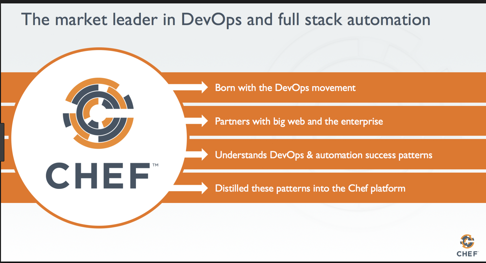

# Chef Automation Tool

## Chef Basic

1. [Chef Introduction and Chef architecture](chef_basic1.md)
2. [Deployment Automation with Chef](chef_basic2.md)
3. [Chef Recipes Introduction](chef_basic3.md)
4. [Chef Cookbook run local and remote chef client](chef_basic4.md)

## Chef Adv.

1. [How to Perform Chef Knife SSL Check and Fetch to Verify Certificate](chef_adv1.md)
2. [12 Chef Knife Cookbook Command Examples](chef_adv2.md)

## Chef Practice

1. [LAMP Chef Cookbook](chef_basic5.md)
2. [LAMP Chef Cookbook Analysis](chef_basic6.md)