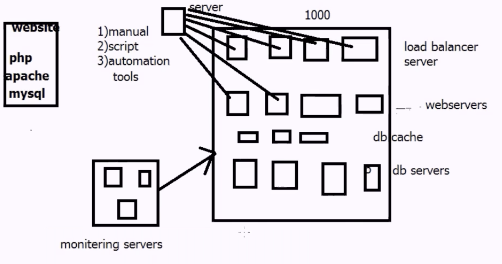
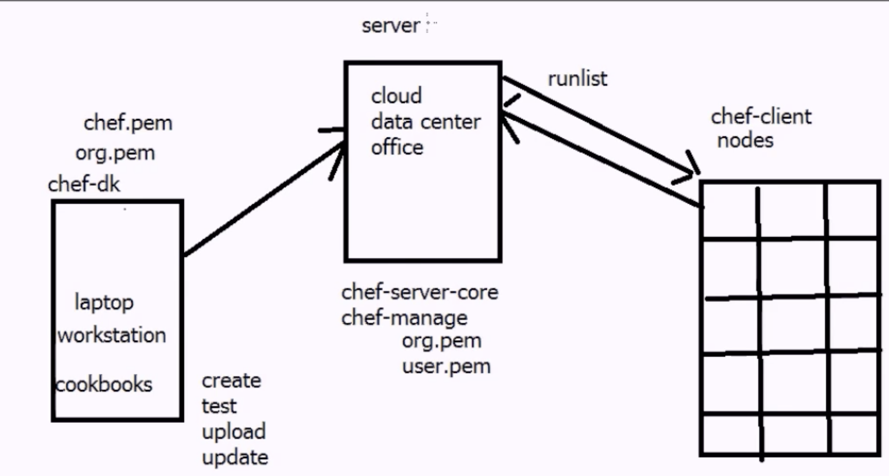

# Chef Basic Tutorial

## Chef Introduction

### Chef:

**What is Chef?**

chef is configuration management tool ...

**What is configuration management tool?**

It is maintain number (100 and 1000's) of machine automation ...

**What it maintain**

it maintain he system resource such as:

	1. install a application
	2. configuration
	3. updates
	4. maintain and so on 

**Why configuration management tool?**

	--> reduce management complexity
	--> save time
	
**Configuration management tools:**

	puppet  -------> 2005     pull
	chef    -------> 2008     pull
	ansible -------> 2011     push
	

**Infrastructure as code**

	--> chef ensures each node compiles with policy
	--> policy determined by the configurations in each node's result
	--> reduce management complexity through abstraction
	--> your policy states what each resource should be in.

**What is resource**

resource is a piece of system and it's desired state

	file ----> create and delete
	user ----> create and delete
	package -> install and not
	

**managing complexity**

	1. organization
	2. environment
	3. roles
	4. nodes
	5. recipes
	6. cookbooks
	7. runlist

1.**organization**: it's independent tenant. eg: company, department

2.**environment**: environment reflect your patterns and workflow, can be used to model the life stages of your applications

* development env
* testing env
* staging env
* production env
	   
	   
3.**roles**: roles represents the type of server in your infrastructure

* lb server
* db server
* web server  
   

4.**nodes**: nodes represents the server in your infrastructure, it could be a physical server and virtual server

could also be network hardwares, switches, routes. etc

5.**recipes**: recipe is a collection of resources, file, app

6.**cookbooks**: collection of recipes and templates and custom resource 
 
7.**runlist**: runlist is a collection of cookbooks, and every machine has it's own runlist

## Chef architecture

### disadvantage: 

hard to learn

### advantages:

	1.more scalability
	2.fully automation
	
### Chef architecture:  

`3-tier architecture`

	workstation ---->   chef-server  <---- nodes (chef client)
	                                       webservers
	                                       dbservers
	                                       cache servers
	                                       email servers
	                                       monitoring servers
                                   
                                       

