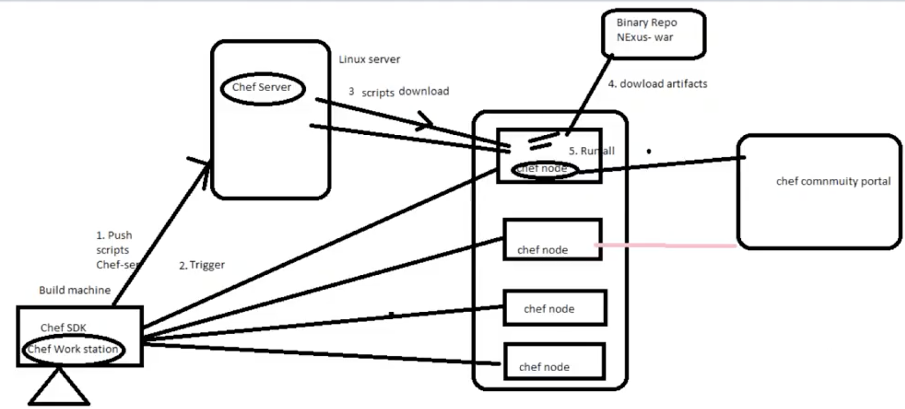

# Chef Basic Tutorial

## Deployment Automation with Chef

* Tracking 
* History
* Complex application (parallel)
* Monitoring with agents on your server

### Agentless (Scripting, RunDesk, Ansible) 

### Agent based (Chef / Puppet / Deploit / BMC BladeLogic)


## Chef Architecture




## Chef Setup

### perquisite 

	Chef Server: 192.168.33.19/24      chefserver
	Chef WorkStation: 192.168.33.20/24 workstation
	
	Node (Deployment server):  192.168.33.18/24
	
**Centos 7** 

	chef in cloud: 5 instances free
	on premises: 20 instances free
	

## Chef Installation

### Chef Server

**change hostname**

```
sudo vi /etc/hosts
192.168.33.19 chefserver chefserver
```

```
sudo vi /etc/hostname
chefserver
```

```
vagrant reload
```

**chef package download:** [https://downloads.chef.io/](https://downloads.chef.io/)

### Install chef-server

**1. Download chef-server rpm and install install it below commands**

```
sudo yum update
sudo yum install wget
wget https://packages.chef.io/files/stable/chef-server/12.17.33/el/7/chef-server-core-12.17.33-1.el7.x86_64.rpm
```

[Install the Chef Server](https://docs.chef.io/install_server.html)

```
sudo chef-server-ctl reconfigure
```

**2. Run below command to create user and to create organization id**

Create user: [https://docs.chef.io/server_users.html#user-create](https://docs.chef.io/server_users.html#user-create)

```
$ chef-server-ctl user-create USER_NAME FIRST_NAME [MIDDLE_NAME] LAST_NAME EMAIL 'PASSWORD' (options)
-f FILE_NAME, --filename FILE_NAME
```

Create Org: [https://docs.chef.io/server_users.html#org-create](https://docs.chef.io/server_users.html#org-create)

```
$ chef-server-ctl org-create ORG_NAME "ORG_FULL_NAME" (options)
-a USER_NAME, --association_user USER_NAME
-f FILE_NAME, --filename FILE_NAME
```

My process: 

```
sudo ssh-keygen -f devops.pem

# Run the following command to create an administrator:
sudo chef-server-ctl user-create devopsjxi devops jxi xichao2017@gmail.com devops123 --filename /home/vagrant/devops.pem

# Run the following command to create an organization
sudo chef-server-ctl org-create devops-jxi "Wrevel，Inc." --association_user devopsjxi

#  username/email: devopsjxi / xichao2017@gmail.com
#  password: devops123
#  org association_user: devopsjxi
```

**3. Install Chef manage**

[Chef Manage 2.5.16](https://downloads.chef.io/manage/2.5.16)

Use Chef management console to manage **data bags, attributes, run-lists, roles, environments and cookbooks** from a web user interface

```
wget https://packages.chef.io/files/stable/chef-manage/2.5.16/el/7/chef-manage-2.5.16-1.el7.x86_64.rpm
sudo rpm -ivh chef-manage-2.5.16-1.el7.x86_64.rpm
sudo chef-manage-ctl reconfigure
```

**4. Verify the Chef by logging below URL in browser**

```
https://192.168.33.19/ (devopsjxi/devops123)
```

### Install Chef-DK on workstation

```
sudo vi /etc/hostname
chefworkstation
```

```
sudo vi /etc/hosts
192.168.33.20 chefworkstation chefworkstation
192.168.33.19 chefserver chefserver   #for workstation and server connection
```

**install Chef Development Kit**

```
sudo yum update
sudo yum install wget
sudo yum install unzip
```

[Chef Development Kit 3.6.57](https://downloads.chef.io/chefdk/3.6.57)


```
wget https://packages.chef.io/files/stable/chefdk/3.1.0/el/7/chefdk-3.1.0-1.el7.x86_64.rpm
sudo rpm -ivh chefdk-3.1.0-1.el7.x86_64.rpm
```

```
$ chef --version
Chef Development Kit Version: 3.1.0
chef-client version: 14.2.0
delivery version: master (6862f27aba89109a9630f0b6c6798efec56b4efe)
berks version: 7.0.4
kitchen version: 1.22.0
inspec version: 2.1.72
```

### Chef-WorkStation setup

Login into: `https://192.168.33.19/ (devopsjxi/devops123)`

Click on organization -> starter kit -> Download starter kit

unzip the starter kit, this will create `chef-repo` directory at home location

run below commands:

```
scp chef-starter.zip vagrant@192.168.33.20:/home/vagrant/
unzip chef-starter.zip
mkdir /home/vagrant/chef-repo/.chef/trusted_certs
```

To do the knife test:

```
cd ~/chef-repo
$ knife ssl check


TO FIX THIS ERROR:

If the server you are connecting to uses a self-signed certificate, you must
configure chef to trust that server's certificate.

By default, the certificate is stored in the following location on the host
where your chef-server runs:

  /var/opt/opscode/nginx/ca/SERVER_HOSTNAME.crt

Copy that file to your trusted_certs_dir (currently: /home/vagrant/chef-repo/.chef/trusted_certs)
using SSH/SCP or some other secure method, then re-run this command to confirm
that the server's certificate is now trusted.
```

**on chef server machine**

```
su -
cd /var/opt/opscode/nginx/ca/
sudo scp chefserver.crt vagrant@192.168.33.20:/home/vagrant/chef-repo/.chef/trusted_certs/
```

**Do the test again:**

```
$ cd ~/chef-repo
$ knife ssl check
Connecting to host ChefServer:443
Successfully verified certificates from `ChefServer'
```

**on chef workstation machine**

```
$ knife client fetch
FATAL: Cannot find subcommand for: 'client fetch'
Available client subcommands: (for details, knife SUB-COMMAND --help)

** CLIENT COMMANDS **
knife client bulk delete REGEX (options)
knife client create CLIENTNAME (options)
knife client delete [CLIENT [CLIENT]] (options)
knife client edit CLIENT (options)
knife client key create CLIENT (options)
knife client key delete CLIENT KEYNAME (options)
knife client key edit CLIENT KEYNAME (options)
knife client key list CLIENT (options)
knife client key show CLIENT KEYNAME (options)
knife client list (options)
knife client reregister CLIENT (options)
knife client show CLIENT (options)
```

```
$ knife client list
devops-jxi-validator
```

## Quick Test on Chef Workstation

```
mkdir learningchef/chap04
touch hello.rb

file 'hello.txt' do
  content 'Welcome to Chef'
end

$ chef-apply hello.rb
Recipe: (chef-apply cookbook)::(chef-apply recipe)
  * file[hello.txt] action create
    - create new file hello.txt
    - update content in file hello.txt from none to 40a30c
    --- hello.txt	2019-01-03 07:53:06.225972913 +0000
    +++ ./.chef-hello20190103-24137-1hvfb70.txt	2019-01-03 07:53:06.224972913 +0000
    @@ -1 +1,2 @@
    +Welcome to Chef
    - restore selinux security context
 
$ ls 
hello.rb  hello.txt
```
