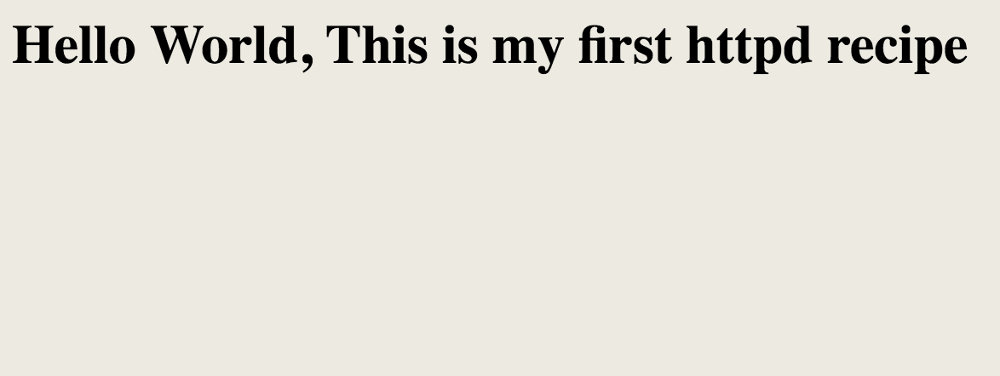

# Chef Basic Tutorial

## Chef Recipes Introduction

DSL  (domain specific language)

```
CookBook (LeadApp)
	recipe:
		resources:do
		- action
		- property
		end
	   resources:do
		- action
		resources:do
		- action
	recipe:
		resources:do
		- action
		- property
		end
	   resources:do
		- action
		resources:do
		- action
```

**resource: file, directory, service, template, file permission**

### Scripts: File


**Typical ruby syntax based snippets** 

**DSL (Domain Specific Language)**

1. First Launch an instance with chef SDK
2. Après unzip chef-repo (create a repo for chef scripts at home location)
3. Create a resource (file) with some text inside it `sampe.txt`
4. a resource can be anything of system of desired state
5. **Use the file resource to manage files directly on a node.**

**file:** [https://docs.chef.io/resource_file.html](https://docs.chef.io/resource_file.html)

```
cd chef-repo
mkdir recipes && cd recipes
```

```
vi hello.rb
```
```
file 'sample.txt' do
        content 'Hello World, and this is my first recipe after update'
        #defalut action is "create"
end
directory 'source' do
        owner 'vagrant'
        group 'vagrant'
        mode '0755'
        action :create
end

```

```
chef-apply hello.rb
```

This will create a `sample.txt` as **resource file**, and create a `source` folder, change owner, group and mode of this folder

**Now we run same again, it will not do anything as the files has been already created**

```
$ chef-apply hello.rb

Recipe: (chef-apply cookbook)::(chef-apply recipe)
  * file[sample.txt] action create (up to date)
  * directory[source] action create (up to date)
```

how to delete the same file using chef-script

Resource can have actions:

	:delete -- deleted resource
	:create -- create file(this is default, so need to be specify)

**This `hello.rb` is also called a recipe in chef terminology**

briefly a recipe mean collection of resource that describes a particular configuration policy

ex: **which manages files, deploys application, install and configure s/w components**


### Scripts: Package and Service

**Install apache package using chef**

```
vi apache.rb
```

```
package 'httpd'
service "httpd" do
        action :start
end

file '/var/www/html/index.html' do
        content '<html><body bgcolor="#ECEAE0"><h1>Hello World, This is my first httpd recipe</h1></body></html>'
end
```

```
$ sudo chef-apply apache.rb

Recipe: (chef-apply cookbook)::(chef-apply recipe)
  * yum_package[httpd] action install (up to date)
  * service[httpd] action start (up to date)
  * file[/var/www/html/index.html] action create (up to date)
```

Package is an another resource and we no need to mention the action as `:install` is the default action applicable

Run the above recipe, which install apache webserver in your server

```
package 'httpd'
service "httpd" do
        action [:enable, :start]
end
```

The above action :start will start the httpd server

```
$ sudo systemctl status httpd
● httpd.service - The Apache HTTP Server
   Loaded: loaded (/usr/lib/systemd/system/httpd.service; disabled; vendor preset: disabled)
   Active: active (running) since Wed 2018-08-15 05:22:55 UTC; 1min 26s ago
     Docs: man:httpd(8)
           man:apachectl(8)
 Main PID: 20665 (httpd)
   Status: "Total requests: 0; Current requests/sec: 0; Current traffic:   0 B/sec"
   CGroup: /system.slice/httpd.service
           ├─20665 /usr/sbin/httpd -DFOREGROUND
           ├─20666 /usr/sbin/httpd -DFOREGROUND
package 'httpd'
           ├─20667 /usr/sbin/httpd -DFOREGROUND
           ├─20668 /usr/sbin/httpd -DFOREGROUND
           ├─20669 /usr/sbin/httpd -DFOREGROUND
           └─20670 /usr/sbin/httpd -DFOREGROUND

Aug 15 05:22:55 chefworkstation systemd[1]: Starting The Apache HTTP Server...
Aug 15 05:22:55 chefworkstation httpd[20665]: AH00558: httpd: Could not reliably determine the serv...age
Aug 15 05:22:55 chefworkstation systemd[1]: Started The Apache HTTP Server.
```
`http://192.168.33.20/`



**Stop the iptables service to access it from external**

```
service 'iptables' do
        action :stop
end
```


 