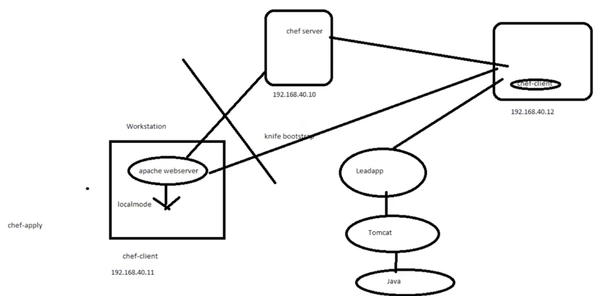
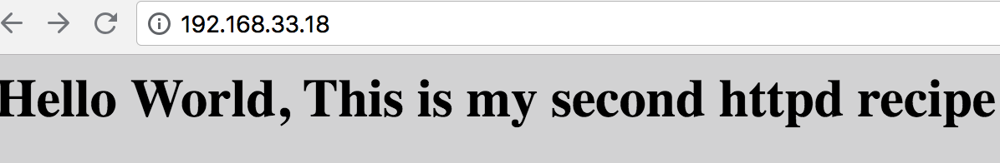
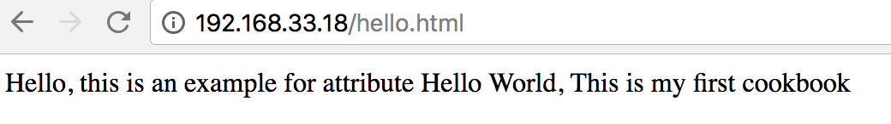

# Chef Basic Tutorial

## Chef Cookbook

### What is Cookbook

Cookbook serve as the **fundamental unit of configuration and policy details** that Chef uses to bring a node into a specific state. This just means that chef uses cookbooks to perform work and **make sure things are as they should be on the nodes**

### What is recipe

A recipe is the ***main workhouse*** for the cookbook, **A cookbook can contain more one recipes, or depend on outside recipes**. Recipes are used declare the state of different resources.

### What is resource

A resource can be anything of a system in desired state

* **package:** Used to manage packages on a node
* **services:** Used to manage services on a node
* **user:** Manager users on the node
* **group:** Mange groups
* **template:** Manage files with embedded ruby templates
* **cookbook_file:** Transfer files from files in subdirectory in the cookbook to a location on the node
* **file:** Manage contents of a file on node 
* **directory:** Manage directories on node
* **execute:** Execute a command on the node
* **cron:** Edit an existing cron file on the node


### Start a new cookbook on local workstation(dk) machine

**new cookname `ApacheWebserver`**

```
chef generate cookbook ApacheWebserver
cd ApacheWebserver/recipes/
vi default.rb
```

```
# Cookbook:: ApacheWebserver
# Recipe:: default
#
package 'httpd'
service "httpd" do
        action [:enable, :start]
end

file '/var/www/html/index.html' do
        content "<html><body bgcolor='#D2D2D3'><h1>Hello World, This is my second httpd recipe </h1></body></html>"
end
```

**Run on local machine `chef-client --local-mode`**

```
sudo chef-client --local-mode --runlist 'recipe[ApacheWebserver]'
```

`http://192.168.33.20/`


**Default recipes call another recipes(hello.rb)**

```
vi hello.rb
```
```
file '/var/www/html/hello.html' do
        content "<html><body>Hello World, This is my first cookbook </body></html>"
end
```

```
vi default.rb
```

```
#
# Cookbook:: ApacheWebserver
# Recipe:: default
#
# Copyright:: 2018, The Authors, All Rights Reserved.
include_recipe 'ApacheWebserver::hello'
package 'httpd'
service "httpd" do
        action [:enable, :start]
end

file '/var/www/html/index.html' do
        content "<html><body bgcolor='#D2D2D3'><h1>Hello World, This is my second httpd recipe</h1></body></html>"
end
```

```
sudo chef-client --local-mode --runlist 'recipe[ApacheWebserver@hello.rb]'
```

**`'recipe[ApacheWebserver@hello.rb]'` run another recipe beside `default.rb`**

`http://192.168.33.20/hello.html`


### Start a new cookbook on remote chef node from chef server



**My node ip 192.168.33.18 centos 7**

**1.Update current cookbook to chef server from workstation**

```
$ cd /home/vagrant/chef-repo/cookbooks
$ sudo knife cookbook upload ApacheWebserver
Uploading ApacheWebserver [0.1.0]
Uploaded 1 cookbook.
```
### Run the cookbook on new node first time directly (brand new and empty machine)
**My node ip 192.168.33.18 centos 7**

Reference for `knife bootstrap`: [https://docs.chef.io/knife_bootstrap.html](https://docs.chef.io/knife_bootstrap.html)

```
knife bootstrap 192.168.33.18 --ssh-user vagrant --ssh-password 'vagrant' --sudo --use-sudo-password --node-name node1 --run-list 'recipe[ApacheWebserver]'
```

```
-x USERNAME, --ssh-user USERNAME.   The SSH user name.
-P PASSWORD, --ssh-password PASSWORD
The SSH password. This can be used to pass the password directly on the command line. If this option is not specified (and a password is required) knife prompts for the password.

--sudo Execute a bootstrap operation with sudo
--use-sudo-password Perform a bootstrap operation with sudo; specify the password with the '-P' (or '--ssh-password') option.

-N NAME, --node-name NAME  The name of the node
```

**There are some pain in ass errors I encountered:**

Reference for `trouble shooting for knife bootstrap`: [https://docs.chef.io/errors.html](https://docs.chef.io/errors.html)

**Error1:**

```
WARNING: Failed to connect to  -- Net::SSH::AuthenticationFailed: Authentication failed for user vagrant@192.168.33.18@192.168.33.18

failed for user vagrantd@192.168.33.18@192.168.33.18
```
**solution:**

copy workstation pub key to node machine (This maybe not 100% right)

```
less ~/.ssh/id_ras.pub
```

on the node machine, copy pub key to `authorized_keys`

```
cd /home/vagrant/.ssh
sudo vi authorized_keys
```

**Error2:**

```
ERROR: Error connecting to https:// ip-192-168-33-18.devopsjxi/organizations/nodes/node1 retry 1/5
ERROR: Error connecting to https:// ip-192-168-33-18.devopsjxi/organizations/nodes/node1 retry 2/5
ERROR: Error connecting to https:// ip-192-168-33-18.devopsjxi/organizations/nodes/node1 retry 3/5
ERROR: Error connecting to https:// ip-192-168-33-18.devopsjxi/organizations/nodes/node1 retry 4/5
ERROR: Error connecting to https:// ip-192-168-33-18.devopsjxi/organizations/nodes/node1 retry 5/5
Chef encountered an error attempting to load the node data for "Node"
```
**solution:**

On node machine add your `chef server ip info` to `/etc/hosts`

```
$ sudo vi /etc/hosts
192.168.33.19 chefserver chefserver
```

**Error3:**

```
Failed to authenticate as . 
Synchronize the clock on your host. Hosted Chef Server/Knife
```
**solution:**

[http://geekinlinux.blogspot.com/2014/07/failed-to-authenticate-as-synchronize.html](http://geekinlinux.blogspot.com/2014/07/failed-to-authenticate-as-synchronize.html)

```
restart chef server machine
```

**Delete old wrong nodes**

```
 knife node delete node1
 knife client delete node1
```


**Then I successfully start the node with httpd installation**

```
$ sudo knife cookbook upload ApacheWebserver
$ knife bootstrap 192.168.33.18 --ssh-user vagrant --ssh-password 'vagrant' --sudo --use-sudo-password --node-name node1 --run-list 'recipe[ApacheWebserver]'

Node node1 exists, overwrite it? (Y/N) y
Client node1 exists, overwrite it? (Y/N) y
Creating new client for node1
Creating new node for node1
Connecting to 192.168.33.18
192.168.33.18 -----> Existing Chef installation detected
192.168.33.18 Starting the first Chef Client run...
192.168.33.18 Starting Chef Client, version 14.3.37
192.168.33.18 resolving cookbooks for run list: ["ApacheWebserver"]
192.168.33.18 Synchronizing Cookbooks:
192.168.33.18   - ApacheWebserver (0.1.0)
192.168.33.18 Installing Cookbook Gems:
192.168.33.18 Compiling Cookbooks...
192.168.33.18 Converging 4 resources
192.168.33.18 Recipe: ApacheWebserver::hello
192.168.33.18   * file[/var/www/html/hello.html] action create (up to date)
192.168.33.18 Recipe: ApacheWebserver::default
192.168.33.18   * yum_package[httpd] action install (up to date)
192.168.33.18   * service[httpd] action enable (up to date)
192.168.33.18   * service[httpd] action start (up to date)
192.168.33.18   * file[/var/www/html/index.html] action create (up to date)
192.168.33.18
192.168.33.18 Running handlers:
192.168.33.18 Running handlers complete
192.168.33.18 Chef Client finished, 0/5 resources updated in 04 seconds
```
**check node list**

```
$ knife client list
devops-jxi-validator
node1
```

[https://docs.chef.io/knife_node.html](https://docs.chef.io/knife_node.html)


`http://192.168.33.18`



`http://192.168.33.18/hello.html`


### Add attributes to cookbook

**About Attributes:** [https://docs.chef.io/attributes.html](https://docs.chef.io/attributes.html)

**Call the Attributes:** [https://docs.aws.amazon.com/opsworks/latest/userguide/cookbooks-101-basics-attributes.html](https://docs.aws.amazon.com/opsworks/latest/userguide/cookbooks-101-basics-attributes.html)

```
cd /home/vagrant/chef-repo/cookbooks/ApacheWebserver
mkdir attributes && cd attributes

```

```
$ vi default.rb
default['apache']['port']=80
default['apache']['htmlcontent']="Hello, this is an example for attribute"
```

```
cd /home/vagrant/chef-repo/cookbooks/ApacheWebserver/recipes
```

```
$ vi hello.rb

file '/var/www/html/hello.html' do
        content "<html><body> #{node['apache']['htmlcontent']} Hello World, This is my first cookbook </body></html>"
end
```

```
#
# Cookbook:: ApacheWebserver
# Recipe:: default
#
# Copyright:: 2018, The Authors, All Rights Reserved.
 include_recipe 'ApacheWebserver::hello'
package 'httpd'
service "httpd" do
        action [:enable, :start]
end

file '/var/www/html/index.html' do
        content "<html><body bgcolor='#D2D2D3'><h1>Hello World, This is my second httpd recipe, with port: #{node['apache']['port']}</h1></body></html>"
end
```

Normally, call the attribute

**node['createdir']['group']**

If you want to incorporate an attribute value into a string, wrap it with #{}. 

**" #{node['apache']['port']} "**

```
$ sudo knife cookbook upload ApacheWebserver
$ knife bootstrap 192.168.33.18 --ssh-user vagrant --ssh-password 'vagrant' --sudo --use-sudo-password --node-name node1 --run-list 'recipe[ApacheWebserver]'
```

```
sudo knife cookbook upload ApacheWebserver
knife bootstrap 192.168.33.18 --ssh-user vagrant --ssh-password 'vagrant' --sudo --use-sudo-password --node-name node1 --run-list 'recipe[ApacheWebserver]'
```
`http://192.168.33.18`


`http://192.168.33.18/hello.html`




## Chef Cookbook install mysql quickly


```
$ chef generate cookbook LeadAppDB
$ cd LeadAppDB
$ vi metadata.rb

depends 'mysql2_chef_gem', '~> 8.5.1'
depends 'mysql', '~> 6.1.3'
depends 'database', '~> 6.1.1'
```

`MySQL Cookbook` [https://supermarket.chef.io/cookbooks/mysql](https://supermarket.chef.io/cookbooks/mysql)

`mysql2_chef_gem` [https://supermarket.chef.io/cookbooks/mysql2_chef_gem/versions/2.0.0](https://supermarket.chef.io/cookbooks/mysql2_chef_gem/versions/2.0.0)

`database` [https://supermarket.chef.io/cookbooks/database/versions/6.1.1](https://supermarket.chef.io/cookbooks/database/versions/6.1.1)


```
$ cd recipes
$ vi default.rb

mysql2_chef_gem 'default' do
  action :install
end

#configure mysql client
mysql_client 'default' do
  action :create
end

#give name to mysql server and assign root user password
mysql_service 'leadapp_test' do
  port '3306'
  version '5.5'
  initial_root_password 'root'
  action [:create, :start]
end

#cretae a normal app user account and password and grant access to the Database
mysql_database_user 'lead' do
  connection(
    :host => '127.0.0.1',
    :username => 'root',
    :password => 'root'
  )
  password 'lead'
  database_name 'leadAppDB'
  host '127.0.0.1'
  action [:create, :grant]
end

 #create the database leadAppDB
mysql_database 'leadAppDB' do
  connection(
    :host => '127.0.0.1',
    :username => 'lead',
    :password => 'lead'
    )

  action :create
end
```

### About Berkshelf 
[https://docs.chef.io/berkshelf.html#berks-install](https://docs.chef.io/berkshelf.html#berks-install)

```
$ sudo berks install

sudo berks install
Resolving cookbook dependencies...
Fetching 'LeadAppDB' from source at .
Fetching cookbook index from https://supermarket.chef.io...
Using LeadAppDB (0.1.10) from source at .
Using build-essential (8.1.1)
Using database (6.1.1)
Using inifile_chef_gem (0.1.0)
Using mariadb (1.5.4)
Using mingw (2.1.0)
Using mysql (8.5.1)
Using mysql2_chef_gem (2.1.0)
Using openssl (8.5.2)
Using postgresql (7.1.0)
Using selinux_policy (2.1.0)
Using seven_zip (3.0.0)
Using windows (5.0.0)
Using yum (5.1.0)
Using yum-epel (3.2.0)
Using yum-scl (0.2.0)
Using apt (7.0.0)
```


```
$ sudo berks upload --ssl-verify=false

Skipping windows (5.0.0) (frozen)
Skipping seven_zip (3.0.0) (frozen)
Skipping mingw (2.1.0) (frozen)
Skipping build-essential (8.1.1) (frozen)
Skipping openssl (8.5.2) (frozen)
Skipping postgresql (7.1.0) (frozen)
Skipping database (6.1.1) (frozen)
Skipping mysql (8.5.1) (frozen)
Skipping apt (7.0.0) (frozen)
Skipping selinux_policy (2.1.0) (frozen)
Skipping yum (5.1.0) (frozen)
Skipping yum-epel (3.2.0) (frozen)
Skipping inifile_chef_gem (0.1.0) (frozen)
Skipping yum-scl (0.2.0) (frozen)
Skipping mariadb (1.5.4) (frozen)
Skipping mysql2_chef_gem (2.1.0) (frozen)
Uploaded LeadAppDB (0.1.0) to: 'https://chefserver/organizations/devops-jxi'
```

```
$ sudo knife cookbook upload LeadAppDB
Uploading LeadAppDB      [0.1.0]
ERROR: Version 0.1.0 of cookbook LeadAppDB is frozen. Use --force to override.
WARNING: Not updating version constraints for LeadAppDB in the environment as the cookbook is frozen.
ERROR: Failed to upload 1 cookbook.

$ sudo knife cookbook upload LeadAppDB --force
Uploading LeadAppDB      [0.1.0]
Uploaded 1 cookbook.
```

```
$ knife bootstrap 192.168.33.18 --ssh-user vagrant --ssh-password 'vagrant' --sudo --use-sudo-password --node-name node1 --run-list 'recipe[LeadAppDB]'
```
