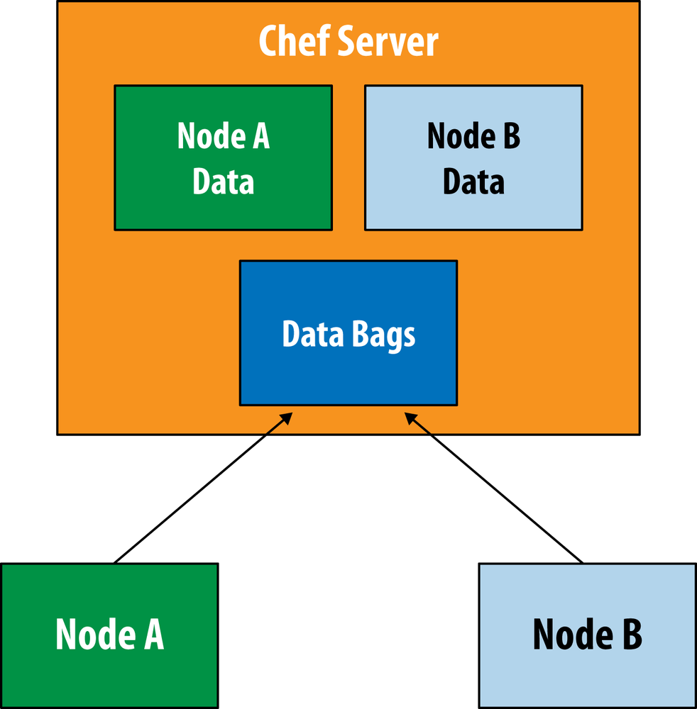
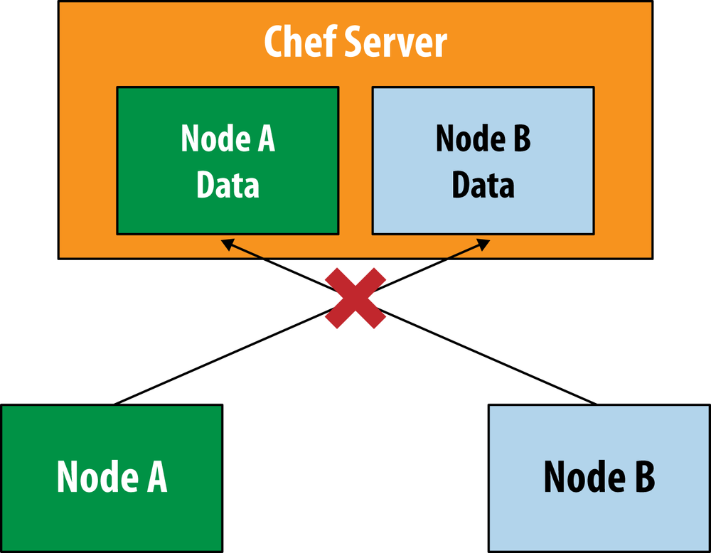
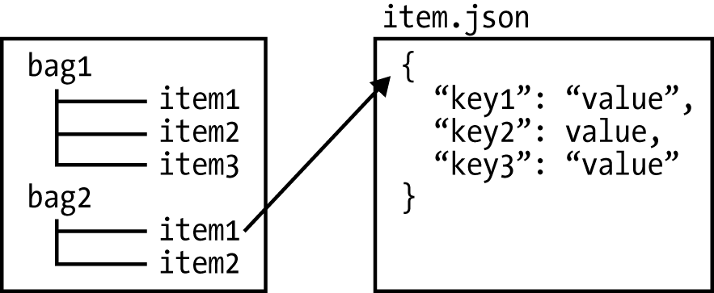
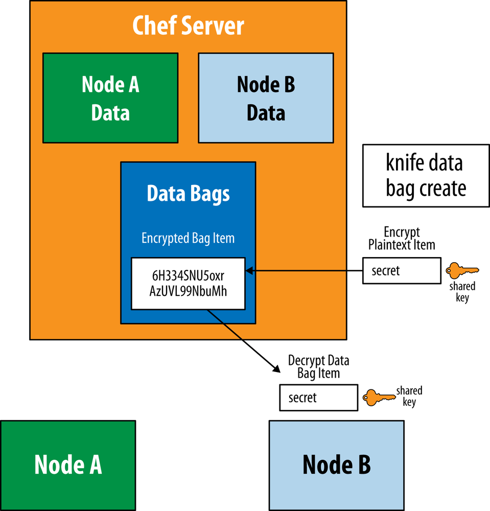

# 数概包 

* 使用Knife在命令行进行数据包的基本操作
* 在配方单中使用数据包项目的数据创建本地用户
* 加密数据包 
* Chef-valut

**`Chef`服务器支持存储全局的、可以在不同点上节点上使用的数据存储。这个功能称作数据包（`data bag`)**。 

**在`Chef`的概念中，数据包是包含代表你的基础架构而并不针对某一个节点的信息的容器。数据包包含需要在多个节点共享的信息**

* 通用的密码 
* 软件安装的许可证钥匙 
* 通用的用户或组的列表

**除了数据包外,`Chef`节点之间无法共享数据**。

 

**虽然`chef-client`会在成功运行后发送节点的属性信息到`Chef`服务器，但是如图所示，某一节点无法直接访问其他节点的信息**。 

 

### 数据包是唯一的Chef内建的用来存储和访问节点间通用的数据的机制。 

 


展示了数据包的样子。

* 每个数据包包含一个或多个项目。
* 每个项目都是一个以`JSON`格式表示的键值对儿集合。
* 根据约定，一个数据包中的每个项目应该共享一样的键；然而不同数据包中的项目的键可以完全不一样。


当然这只是约定，技术上，可以在任何数据包项目中存储任何的键和值。根据`JSON`格式，字符串需要被双引号引用，而整数值则不需要。值也可以为字符串或整数的列表。


 

## 使用Knife在命令行进行数据包的基本操作 


让我们以用`knife`命令在命令行执行一个搜索查询开始, 假设想确保我们的员工`alice`和`bob`在所有节点上都有他们的用户账户， 则可以用数据包来存错这些这样一来， 解决方案 
蔽以将新员工添加到这个列表中井自剩触们的账户。 数据包是最好的因为我们想让用户列表在所有节点上都可以访问。

Use the same dual command prompt setup you used there. Start the chef-zero server on an open port in one window. We will be using port `9501` in the examples in this chapter:

```
$ cd chap10/chef-playground
$ chef-zero --port 9501
```

```
$ cd chef-playground
```

在`chef-playground`目录中创建`data-bags`子目录。同时，创建一个新的数据包井命名为 `users`。可以通过在`data_bags`目录下创建一个新的`users`目录来完成。 

```
$ mkdir -p data_bags/users
```

**`chef-playground/data_bags/users/alice.json`**

```
{
  "id": "alice",
  "comment": "Alice Jones",
  "uid": 2000,
  "gid": 0,
  "home": "/home/alice",
  "shell": "/bin/bash"
}
```

**`chef-playground/data_bags/users/bob.json`**

```
{
  "id": "bob",
  "comment": "Bob Smith",
  "uid": 2001,
  "gid": 0,
  "home": "/home/bob",
  "shell": "/bin/bash"
}
```

在`Chef`服务器上创建名为`users`的数据包，运行`knife data create`命令 

```
$ knife data_bag create users
Created data_bag[users]
```
创建数据包项目，运行`knife data_bag from file`命令。

`knife data_bag from file`命令假设表示数据包项目的`.json`文件在`data_bag`，目录下的以数据包名字命名的子目录中： 

```
$ knife data_bag from file users alice.json
Updated data_bag_item[users::alice]

$ knife data_bag from file users bob.json
Updated data_bag_item[users::bob]
```

要搜索服务器上的数据包，以数据包名字作为`index`参数使用`knife search`。在本例中， 我们的数据包名为`users`。以下命令将搜索我们在`users`数据包中创建的所有数据包项目： 

```
$ knife search users "*:*"
2 items found

chef_type: data_bag_item
comment:   Alice Jones
data_bag:  users
gid:       0
home:      /home/alice
id:        alice
shell:     /bin/bash
uid:       2000

chef_type: data_bag_item
comment:   Bob Smith
data_bag:  users
gid:       0
home:      /home/bob
id:        bob
shell:     /bin/bash
uid:       2001
```

**可以在搜索查询中指定特定的键值对儿**。以下查询将返回`users`数据包中拥有`Id == alice` 数据的数据包项目： 

```
≈
1 items found

chef_type: data_bag_item
comment:   Alice Jones
data_bag:  users
gid:       0
home:      /home/alice
id:        alice
shell:     /bin/bash
uid:       2000
```

**查询的内容是数据包项目中的内容而不是节点的属性**。

比如，以下查询将返回在`users`数据 包中`id`的值是`alice`或`bob的`数据包项目： 

```
$ knife search users "id:alice OR id:bob" 
2 items found

chef_type: data_bag_item
comment:   Alice Jones
data_bag:  users
gid:       0
home:      /home/alice
id:        alice
shell:     /bin/bash
uid:       2000

chef_type: data_bag_item
comment:   Bob Smith
data_bag:  users
gid:       0
home:      /home/bob
id:        bob
shell:     /bin/bash
uid:       2001
```

搜索结果可以由`-a`参数过滤。比如`-a shell`只返回结果中`shell`的值：  

```
$ knife search users "*:*" -a shell
2 items found

:
  shell: /bin/bash

:
  shell: /bin/bash
```

## 在配方单中使用数据包项目的数据创建本地用户 

到现在为止，我们创建几个数据包项目, 并用我们来表示用户账户，但我们尚末实际在配方单中使用数据包项目的数据创建本地用户来创建这些用户账户。 让我们用`chef`菜谱根据这些数据来创建这些账户

```
$ cd /chef-playground/cookbooks

```

然后在`chef_playground/cookbooks`目录下生成一个`users`菜谱。

**Chef Development Kit:**

```
$ chef generate cookbook users
$ cd users
```
**Chef Client:**

```
$ knife cookbook create users --cookbook-path .
$ cd users
$ kitchen init --create-gemfile
$ bundle install
```

```
$ chef generate cookbook users
Generating cookbook users
- Ensuring correct cookbook content
- Committing cookbook files to git

Your cookbook is ready. Type `cd users` to enter it.

There are several commands you can run to get started locally developing and testing your cookbook.
Type `delivery local --help` to see a full list of local testing commands.

Why not start by writing an InSpec test? Tests for the default recipe are stored at:

test/integration/default/default_test.rb

If you'd prefer to dive right in, the default recipe can be found at:

recipes/default.rb
```

注意我们在`provisioner:`中添加`data_bags_path`来指定数据包的位置。 

```
provisioner:
  name: chef_zero
  data_bags_path: ../../data_bags
```

`data_bags_path`是一个指向`chef_playground/databags`目录（在上一节我们在这个目录中创建了数据包夹和项目文件）的相对路径。这和我们在过的关于`node`测试数据的例子类似 


**`data_bags_path:`指向的目录中的所有文件将作为数据包上传到`chef-zero`服务器。在生 产环境中数据包的数据通常不会包含在菜谱文件结构中。**

我们将测试数据存储在`chef_playground/databags`而不是在`users`菜谱的`cookbooks/users`文件结构中 

**`/users/kitchen.yml`**

```
---
driver:
  name: vagrant
  provider: vmware_desktop

provisioner:
  name: chef_zero
  data_bags_path: ../../data_bags
  always_update_cookbooks: true

platforms:
  - name: centos65
    driver:
      box: learningchef/centos65
      box_url: learningchef/centos65

suites:
  - name: default
    run_list:
      - recipe[users::default]
    attributes:
```
让我们写一个配方单来查询`user`数据包中定义的用户数据并为每个数据包项目创建一个相应的本地用户。

你可以使用`search(）`方法来执行数据包查询就像在搜索节点一样。然后，可以使用`Chef`的`use`资源基干数据包中定义的数据创建用户。 

**`cookbooks/users/recipes/default.rb`**

```
#
# Cookbook:: users
# Recipe:: default
#
# Copyright:: 2019, The Authors, All Rights Reserved.
search("users", "*:*").each do |user_data|
    user user_data["id"] do
      comment user_data["comment"]
      uid user_data["uid"]
      gid user_data["gid"]
      home user_data["home"]
      shell user_data["shell"]
    end
end
```

**我们使用`each do`结构。在这里，遍历数据包的每个项目并将每个项目的内容存在`user_data`变量中。`user_data`是一个字典（哈希）包含数据包项目的键值对儿** 

**`search(）`代码块中的`user`语句是一个`Chef`资源。`user`资源在节点上创建本地用户。它接受以下属性:** 


* `comment` 关于要创建的用户的信白 
* `uid` 以数字表示的用户ID 
* `gid` 以数字表示的用户的组的ID 
* `home` 用户跟目录的位置 
* `shell` 用户登录的壳 

在我们的配方单中的代码读取`user_data`哈希并将其传递进`Chef`的`user`资源

**现在运行`kitchen converge`如果一切正确，`Test Kitchen`应该上传菜谱代码到沙盒环境 并在`cehf-zero`实例中创建数据包**。

然后在沙盒节点上运行菜谱代码并查询我们的数据包项目以及通过使用`user`资源创建相应的用户 

```
$ kitchen converge
-----> Starting Kitchen (v2.3.3)
-----> Creating <default-centos65>...
       ==> vagrant: A new version of Vagrant is available: 2.2.6 (installed version: 2.2.5)!
       ==> vagrant: To upgrade visit: https://www.vagrantup.com/downloads.html
       
       Bringing machine 'default' up with 'vmware_desktop' provider...
       ==> default: Cloning VMware VM: 'learningchef/centos65'. This can take some time...
       ==> default: Checking if box 'learningchef/centos65' version '1.0.7' is up to date...
       ==> default: Verifying vmnet devices are healthy...
       ==> default: Preparing network adapters...
       WARNING: The VMX file for this box contains a setting that is automatically overwritten by Vagrant
       WARNING: when started. Vagrant will stop overwriting this setting in an upcoming release which may
       WARNING: prevent proper networking setup. Below is the detected VMX setting:
       WARNING: 
       WARNING:   ethernet0.pcislotnumber = "33"
       WARNING: 
       WARNING: If networking fails to properly configure, it may require this VMX setting. It can be manually
       WARNING: applied via the Vagrantfile:
       WARNING: 
       WARNING:   Vagrant.configure(2) do |config|
       WARNING:     config.vm.provider :vmware_desktop do |vmware|
       WARNING:       vmware.vmx["ethernet0.pcislotnumber"] = "33"
       WARNING:     end
       WARNING:   end
       WARNING: 
       WARNING: For more information: https://www.vagrantup.com/docs/vmware/boxes.html#vmx-whitelisting
       ==> default: Fixed port collision for 22 => 2222. Now on port 2201.
       ==> default: Starting the VMware VM...
       ==> default: Waiting for the VM to receive an address...
       ==> default: Forwarding ports...
           default: -- 22 => 2201
       ==> default: Waiting for machine to boot. This may take a few minutes...
           default: SSH address: 127.0.0.1:2201
           default: SSH username: vagrant
           default: SSH auth method: private key
           default: 
           default: Vagrant insecure key detected. Vagrant will automatically replace
           default: this with a newly generated keypair for better security.
           default: 
           default: Inserting generated public key within guest...
           default: Removing insecure key from the guest if it's present...
           default: Key inserted! Disconnecting and reconnecting using new SSH key...
       ==> default: Machine booted and ready!
       ==> default: Setting hostname...
       ==> default: Configuring network adapters within the VM...
       ==> default: Machine not provisioned because `--no-provision` is specified.
       [SSH] Established
       Vagrant instance <default-centos65> created.
       Finished creating <default-centos65> (0m41.51s).
-----> Converging <default-centos65>...
       Preparing files for transfer
$$$$$$ You must set your run_list in your Policyfile instead of kitchen config. The run_list in your config will be ignored.
$$$$$$ Ignored run_list: ["recipe[users::default]"]
       Policy lock file doesn't exist, running `chef install` for Policyfile /Users/i515190/Devops_sap/Chef_Doc/learningchef/chap10/chef-playground/cookbooks/users/Policyfile.rb...
       Building policy users
       Expanded run list: recipe[users::default]
       Caching Cookbooks...
       Installing users >= 0.0.0 from path
       
       Lockfile written to /Users/i515190/Devops_sap/Chef_Doc/learningchef/chap10/chef-playground/cookbooks/users/Policyfile.lock.json
       Policy revision id: 263bb112d0b5a701a8ad5ee38e0a9b0f95d2ab849722f5a6738fcc588c9593fc
       Updating policy lock using `chef update`
       Attributes already up to date
       Building policy users
       Expanded run list: recipe[users::default]
       Caching Cookbooks...
       Installing users >= 0.0.0 from path
       
       Lockfile written to /Users/i515190/Devops_sap/Chef_Doc/learningchef/chap10/chef-playground/cookbooks/users/Policyfile.lock.json
       Policy revision id: 263bb112d0b5a701a8ad5ee38e0a9b0f95d2ab849722f5a6738fcc588c9593fc
       Preparing dna.json
       Exporting cookbook dependencies from Policyfile /var/folders/r7/nml_dsbn44gcd2jlqh7s2w940000gn/T/default-centos65-sandbox-20191206-83494-uckuo1...
       Exported policy 'users' to /var/folders/r7/nml_dsbn44gcd2jlqh7s2w940000gn/T/default-centos65-sandbox-20191206-83494-uckuo1
       
       To converge this system with the exported policy, run:
         cd /var/folders/r7/nml_dsbn44gcd2jlqh7s2w940000gn/T/default-centos65-sandbox-20191206-83494-uckuo1
         chef-client -z
       Removing non-cookbook files before transfer
       Preparing data_bags
       Preparing validation.pem
       Preparing client.rb
-----> Installing Chef install only if missing package
       Downloading https://omnitruck.chef.io/install.sh to file /tmp/install.sh
       Trying wget...
       Trying curl...
       Download complete.
       el 6 x86_64
       Getting information for chef stable  for el...
       downloading https://omnitruck.chef.io/stable/chef/metadata?v=&p=el&pv=6&m=x86_64
         to file /tmp/install.sh.3170/metadata.txt
       trying wget...
       trying curl...
       sha1     c332e5aef6cf70d1df1e1786926c474eedae1dc2
       sha256   ddb6e94a65568e6247aa335ef7d2dd69c300c9d2e2df098997b08cf9f6f0c473
       url      https://packages.chef.io/files/stable/chef/15.5.17/el/6/chef-15.5.17-1.el6.x86_64.rpm
       version  15.5.17
       downloaded metadata file looks valid...
       downloading https://packages.chef.io/files/stable/chef/15.5.17/el/6/chef-15.5.17-1.el6.x86_64.rpm
         to file /tmp/install.sh.3170/chef-15.5.17-1.el6.x86_64.rpm
       trying wget...
       trying curl...
       Comparing checksum with sha256sum...
       
       WARNING WARNING WARNING WARNING WARNING WARNING WARNING WARNING WARNING
       
       You are installing a package without a version pin.  If you are installing
       on production servers via an automated process this is DANGEROUS and you will
       be upgraded without warning on new releases, even to new major releases.
       Letting the version float is only appropriate in desktop, test, development or
       CI/CD environments.
       
       WARNING WARNING WARNING WARNING WARNING WARNING WARNING WARNING WARNING
       
       Installing chef 
       installing with rpm...
       warning: /tmp/install.sh.3170/chef-15.5.17-1.el6.x86_64.rpm: Header V4 DSA/SHA1 Signature, key ID 83ef826a: NOKEY
       Preparing...                ########################################### [100%]
          1:chef                   ########################################### [100%]
       Thank you for installing Chef Infra Client! For help getting started visit https://learn.chef.io
       Transferring files to <default-centos65>
       +---------------------------------------------+
       ✔ 2 product licenses accepted.
       +---------------------------------------------+
       Starting Chef Infra Client, version 15.5.17
       Creating a new client identity for default-centos65 using the validator key.
       Using policy 'users' at revision '263bb112d0b5a701a8ad5ee38e0a9b0f95d2ab849722f5a6738fcc588c9593fc'
       resolving cookbooks for run list: ["users::default@0.1.0 (6ad8a6c)"]
       Synchronizing Cookbooks:
         - users (0.1.0)
       Installing Cookbook Gems:
       Compiling Cookbooks...
       Converging 2 resources
       Recipe: users::default
         * linux_user[alice] action create
           - create user alice
         * linux_user[bob] action create
           - create user bob
       
       Running handlers:
       Running handlers complete
       Chef Infra Client finished, 2/2 resources updated in 01 seconds
       Downloading files from <default-centos65>
       Finished converging <default-centos65> (1m43.52s).
-----> Kitchen is finished. (2m25.60s)
```

### 验证用户 

让我们来验证`Chef`在沙盒环境中创建了相应的用户。登录到沙盒环境，然后运行`getent` `password`来验证我们的用户存在。完成后退回到宿主机器： 

```
$ kitchen login 
Last login: Fri Dec  6 03:25:26 2019 from 172.16.72.2
Welcome to your Packer-built virtual machine.
[vagrant@default-centos65 ~]$  getent passwd alice
alice:x:2000:0:Alice Jones:/home/alice:/bin/bash
[vagrant@default-centos65 ~]$ getent passwd bob
bob:x:2001:0:Bob Smith:/home/bob:/bin/bash
```

可以在`users`数据包中再添加一个新用户的信息。让我们来添加一个名为`eve`的用户。回到`chef-playground`目录并创建·chef-playground/data_bags/users/eve.json·文件，

```
{
  "id": "eve",
  "comment": "Eavesdrop",
  "uid": 2002,
  "gid": 0,
  "home": "/home/eve",
  "shell": "/bin/bash"
}
```
```
$ cd chef-playground
$ knife data_bag from file users eve.json
Updated data_bag_item[users::eve]
```


Make your `users` recipe the current working directory.

```
$ cd cookbooks/users/
```

```
$ kitchen converge
$ kitchen login
Last login: Fri Dec  6 03:33:27 2019 from 172.16.72.2
Welcome to your Packer-built virtual machine.
[vagrant@default-centos65 ~]$ getent passwd eve
eve:x:2002:0:Eavesdrop:/home/eve:/bin/bash
```

你会注意到`Chef`创建了`eve`账号。你的配方单是数据驱动的基于`users`数据包中的数据创建相应的用户。

每当数据包中的数据改变时节点将在下次`Chef`运行时应用这些改变而井不需要对配方单代码做出任何改变 

## 加密数据包 

数据包项目可以被共享密钥加密使其可以在`Chef`服务器中存储高度安全的信包。比如 可以使用加密数据包存储 

* SSL证书 
* SSH密钥 
* 密码 
* 许可证号码 


因为节点的属性是以明文存储的―即使每个节点无法访问其他节点的属胜―这不代表这些属性是安全的。加密数据包是存储私密信息很好的选择虽然这些私密信息往往不是针对某一个节点，但即使你只想为某一个节点加密一些信息也依然可以使用 


当使用` knife data bag create`命令创建一个数据包时，一个包含秘钥的文件被传递进来，数据包的内容被这个密钥加密后存储.当节点试图解密并访问数据包内容，他需要使用一个秘钥


 

让我们来做一个加密数据包的实例。确保`chef-playground`目录为你的当前工作目录 

 * 首先生成一个作为密钥的密码， 以下命令将生成一个512字节的随机密钥井保存至 **` encrypted_data_bag_secret`**

```
$ openssl rand -base64 512 | tr -d '\r\n' > encrypted_data_bag_secret
```

当使用对称秘钥加密时，往往密码应该由机器生成而不是人工指定， 因此我们使用`openssl`工具生成一个`512`字节的随机密钥。

为了表示密钥中的进制数州我们告诉`openssl`用`base64`编码来将二进制数据表示为ASCII字符串， 此外，由于`openssl`命令的默认输出包含换行符等在不同平台下不同的字符， 我们使用`tr`命令来移除秘钥中此类字符， 这样确保了密钥中的字节在不同平台下依然会相通 

作为测试，假设让我们创建一个包含访问信用卡付款系统的`API`秘钥的`.json`文件作为数据包项目， 很明显我们希望将这些信急加密。

假设这个数据包项目包含`id:`以及`api_key`来存储`API`密钥

首先创建数据包目录

```
$ mkdir -p data_bags/api_keys
``` 

**`chef-playground/data_bags/api_keys/payment.json`**

```
{
  "id": "payment",
  "api_key": "592c879e-f37d-43e6-8b54-8c2d97cf04d4"
}
```

```
$ knife data bag create api_keys
Created data_bag[api_keys]
```

**当数据包项目需要加密时,使用`--secret-file`参数来传递密钥** 

```
$ knife data bag from file api_keys payment.json \
--secret-file encrypted_data_bag_secret data_bag_item[api_keys::payment]
```


如何知迈我们创建的数据包项目在服务器上是否被加密？让我们通过`knife dtata bag`命令但并不传递密钥看看 

```
$ knife data bag show api_keys payment
WARNING: Encrypted data bag detected, but no secret provided for decoding. Displaying encrypted data.
api_key:
  auth_tag:       eWn37afy9KpD7ACCsBipnA==
  
  cipher:         aes-256-gcm
  encrypted_data: iLnKRDbkTwcC4cs5KJL92Fip2SjRooYovBSskpBvZuUyNrEnEJv4sOGhRFSb
  VVTIGpl+tRDZ/w==
  
  iv:             +yBoizTgPaUdgh6k
  
  version:        3
id:      payment
```

看起来加密了，不是吗？ 

你在输出中看不到api_key内容的原文。只有`id：`是明文表示。

**`id：`不能被加密 ，因为服务器需要使用它来索引以及搜索加密的数据。**


如果想解密数据包项目的数据，如下所示，使用`--secret-fil`e参数，可以看到输出中项目的值是原文： 

```
$ knife data bag show api_keys payment \
> --secret-file encrypted_data_bag_secret
Encrypted data bag detected, decrypting with provided secret.
api_key: 592c879e-f37d-43e6-8b54-8c2d97cf04d4
id:      payment
```

有一个问题`Chef`公司并未对此提供官方的解决方案。

节点如何得到用来解密数据包的密钥？节点需要获得这个密钥才能访问加密数据包的内容，不幸的事，Chef不能将这些密钥存储在被E们加密的同一个系统中，这样违反了计算机安全的核心原则。因此 当你使用加密数据包时，需要解决分发密钥的问题。 


幸运的是我们下一节将讲述一个第三方的解决方案使用比`cehf-valut`工具来进行密钥的分发。`chef-valut`已经被包含在`Chef`开发包中 

## Chef-valut

> For those using Chef Client, you will need to install an additional gem to use chef-vault. Run the following to install the chef-vault gem:

```
$ sudo gem install chef-vault --no-ri --no-rdoc
```


在开始试用`chef-vault`之前，让我们为`devhost`节点从`chef-zero`服务器注册一个个正式的客户端密钥。
 
现在，如果运行`knife client list`，你会注意到`devhost`并不在客户端列表中。

**我们的 `Chef`服务器并不知道`devhost`是一个合法节点，也不知道这个节点拥有允许它在服务器上存储数据的客户端密钥**。

要使用`chef-vault`来让节点访问加密数据包项目，我们需要让该节点满足这两个条件。 

```
cd chap10/chef-repo/playground
$ knife client list
ja-validator
node-centos65.vagrantup.com
$ knife node list

```

> 注意：对于这个试验，节点列表必须为空，因为我们在第11章中创建的假节点并没有相应的客户 
端密钥。如果你看到有任何节点列出，重启`chef-zero`服务器将它们消除即可。 


在开发工作站（我们将在`chef-playground/.chef/knife.rb`中将其称作`devhost`）上生成一对新的私钥、公钥。因为`chef一zero`并不检查.

`chef-playground/.chef/knife.rb`文件的内容，所以我们可以重新生成。然而，如果重新生成客户端密钥，就需要在`Chef`服务器上存有与其相应的公钥。运行以下命令重新生成客户端密钥。 

```
$  knife client create devhost  --disable-editing --file .chef/devhost.pem
Created client[devhost]
```

`--admin`选项允许其创建的客户端针对它相对的节点以外的其他节点使用`knife client show`和`knife node commands`背后的`API`。默认情况下，`knife client create`将客户端 信息显示在一个编辑器内，允许你在。

`client.pem`密钥生成之前对客户端作出修改。在我们的例子中，默认值就可以满足我们的要求，因此我们传递`--disable-editing`参数来直接使用默认值。`--file`参数将客户端密钥。`client.pem`写出到一个指定的文件。

```
$ knife client list
chef-validator
chef-webui
devhost
```

运行以下命令，创建一个和客户端相符的节点： 


```
$ knife node create devhost --disable-editing
Created node[devhost]
```

现在`devhost`同时显示在节点列表中。做的这个过程模拟了真实环境中当一个新节点（机器）注册时发生的事情―生成客户端密钥、创建节点并与`Chef`服务器注册。 

```
$ knife node list
devhost
```

现了创建一个新的密数据包，并使用`chef-vault`.假设我们需要用它来存储`root`密码。 创建`chef-plauground/data_bags/passwords`目录来存储数据包项目`.json`文件

**Linux/Mac OS X:**

```
$ mkdir -p data_bags/passwords
``` 

**`chef-playground/data_bags/passwords/mysql_root.json`**

```
{
   "id": "mysql_root",
   "password": "This is a very secure password"
}
```

`chef-vault`会安装一个`knife`命令的插件来管理加密数据包。

**这个插件将`chef-valut`的命令整合到`knife vault`命令中。运行以下命令来创建一个加密数据包项目并用`chef-vdult` 管理密钥**： 

```
$ knife vault create passwords mysql_root --json data_bags/passwords/mysql_root.json --search "*:*"  --mode client
```

必须通过`--search`或`--admin`参数指定拥有合法客户端密钥的用户或节点．在我们的例子， 因为没有设定`admin`用户的客户端密钥如果运行`knife client list`, 是看不到`admin`用户的。 

使`chef`服务器时必须，使用`node client`选项 


`knife vault`命令的用法和`chef data_bags`不同。

`chef-vault`只有在`Chef`服务器拥有有效的`客户端＿密钥`时才可以加密数据在`chef-zero`工。环境下达可能不易配置我们在本节中到现在为止的例子中做了能在`chef-zero`环境下展示`chef-valut`的 `chef-valut`最少的工作 

```
$ knife data bag show passwords mysql_root
WARNING: Encrypted data bag detected, but no secret provided for decoding. Displaying encrypted data.
id:       mysql_root
password:
  auth_tag:       XRKutwTzzRuQ+QuVHzZMRQ==
  
  cipher:         aes-256-gcm
  encrypted_data: 2w/iYmF9EdWmTqM4x3SfRpdP8N8dau9Eop87LY80ufKbQ8ivVbyODYlr4ocM
  tEWiSQ==
  
  iv:             pifuG1R7a9rH9/o0
  
  version:        3
```

```
$ knife vault show passwords mysql_root --mode client
id:       mysql_root
password: This is a very secure password
```


 