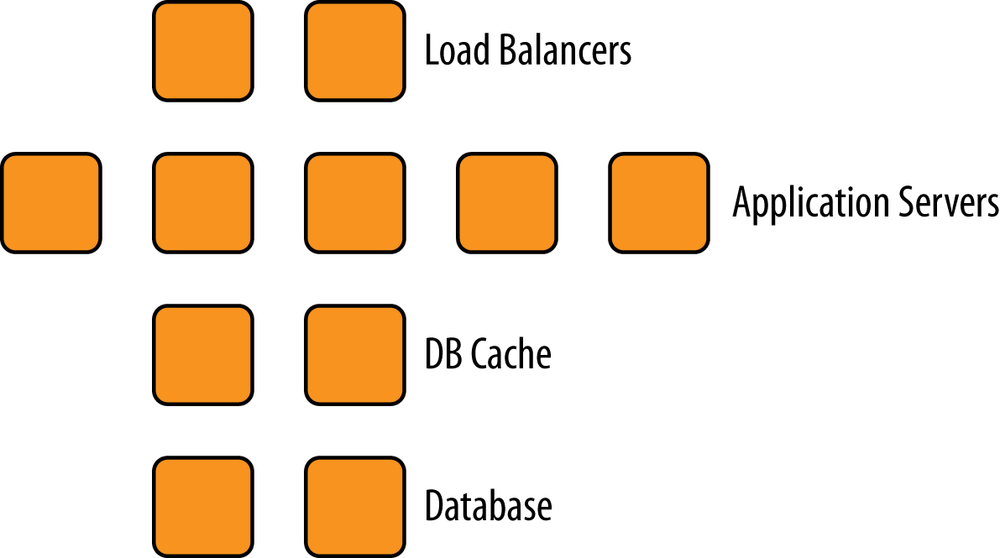
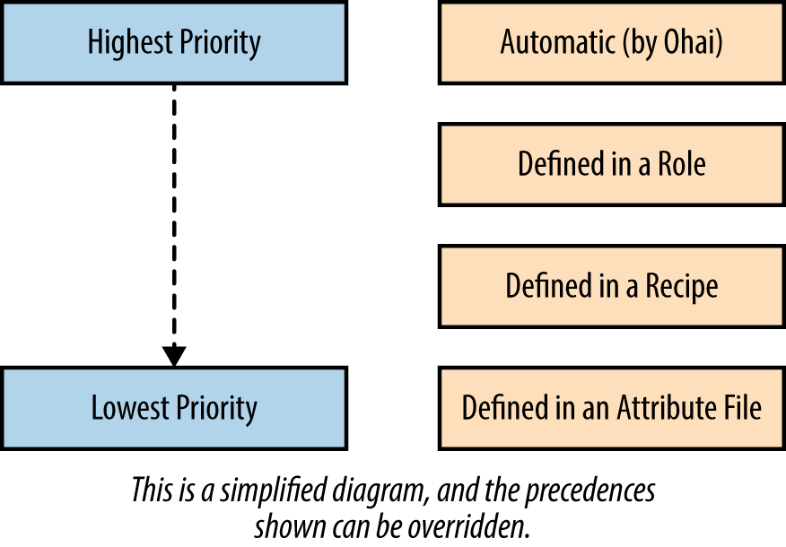

# 角色

* 创建一个网页服务器角色
* 属性和角色 
* 角色和搜索
* 角色菜谱 

角色可以帮助我们将基础架构内的不同服务分类如图



角色可以用来表示基础架构内的不同服务器:

* 负载均衡服务器 
* 应用程序服务器 
* 数据库组存 
* 数据库 
* 监视服务器 

可以通过角色方便地指定配方单和属性，将某台服务器配置成理想的服务器。通过使用角色可以同时将许多节点配置成某种服务器而无需重复工作 

除了这些明显的角色（比如”网页服务器“）以外，将些常用的功能集合在一起作为一个角色也是很常见的。最明显的例子是创建一个包含墓础架构内银一个节点都需要 行的配方单基本角色，然后让每个其他角色包含这个基本角色。 


## 创建一个网页服务器角色

我们可以使用和创建数据包的同样方法创建角色。默认清况下，我们将角色文件保存在`chef-playground`目录下的`roles`目录。 
 
 
```
$ cd chap10/chef-playground
$  chef-zero --port 9501
>> Starting Chef Zero (v14.0.13)...
>> WEBrick (v1.5.0) on Rack (v2.0.7) is listening at http://127.0.0.1:9501
>> Press CTRL+C to stop
```

```
$ cd chef-playground

$ knife upload nodes
Created nodes/snowman.json
Created nodes/susu.json
Created nodes/atwood.json
```

```
$ mkdir roles
```

我们将创建一个`.json`文件来表示角色的数据。

一个最基本的角色包含`name`:（名字）、 `description`:（描述）和`run_list`（运行清单）。


一个角色可以用来把一个很长的配方单清单组织成一个单位。下面我们使用示例14-I中所示的代码创建`chef-playground/roles/webserver.json`文件 

```
$ touch roles/webserver.json 
```

```
{
  "name": "webserver",
  "description": "Web Server",
  "json_class": "Chef::Role",
  "chef_type": "role",
  "run_list": [
    "recipe[motd]",
    "recipe[users]",
    "recipe[apache]"
  ]
}
```

然后运行`knife role from file`命令将`webserver.json`作为参数传递，在`Chef`服务器中创建这个角色。

和数据包一样` knife role from file`命令假设`webserver.json`位于名为`roles`的子目录中，而不是在当前目录 

```
$ knife role from file webserver.json
Updated Role webserver
```

紧接着让我们运行`knife show role`查看刚刚在服务器上创建的`webserver`角色 

```
$ knife role show webserver
chef_type:           role
default_attributes:
description:         Web Server
env_run_lists:
json_class:          Chef::Role
name:                webserver
override_attributes:
run_list:
  recipe[motd]
  recipe[users]
  recipe[apache]
```

**可以通过`knife node set`命令在服务器上设定节点的运行清单。让我们将`snowman`节点的 运行清单设定为刚刚创建的`webserver`角色** 

```
$ knife node run_list set snowman "role[webserver]"
snowman:
  run_list: role[webserver]
```

在`Chef`运行时，运行清单中的网页服务器(`webserver`)角色将展开至该角色的运行清单 

* `recipe[motd]`
* `recipe[users]`
* `recipe[apache]`

角色是一个强大的抽象概念，它允许你按功能将基础架构加以分类。一个角色包含很多配方单是很常见的如果没有角色功能，想象一下你需要重复将数十个配方单一添加 到数百个节点的每个运行清单中。角色使这项工作变得十分容易。 


## 属性和角色 

角色同时可以包含属性。 


让我们创建一个`.json`文件来表示一个基本角色。这个角色包含我们在前面推荐运行在每个节点上的`chef-client::delete_validation`和`chef-client::default`配方单。

**在这个案例中，我们同时需要设定一个属性告`chef-client::default`配方单我们希望使用 `runit`作为`init_style`的值。**

`touch roles/base.json`

```
{
    "name": "base",
    "description": "Common recipes for all nodes",
    "json_class": "Chef::Role",
    "chef_type": "role",
    "run_list": [
      "recipe[chef-client::delete_validation]",
      "recipe[chef-client]"
    ],
    "default_attributes": {
      "chef_client": {
        "init_style": "runit"
      }
    }
  }
```

```
$ knife role from file base.json
Updated Role base
```
```
 knife role show base
chef_type:           role
default_attributes:
  chef_client:
    init_style: runit
description:         Common recipes for all nodes
env_run_lists:
json_class:          Chef::Role
name:                base
override_attributes:
run_list:
  recipe[chef-client::delete_validation]
  recipe[chef-client]
```

我们推荐在角色中只使用默认优先级的属性这样可以让多个来源的属性组合更容易理解 

由于角色可以包含属性兔色中的属胜也在所有属性中佣有它的优先级。

我们展示属性优先级的结构，

* 角色的属性可以重写配方单或属性文件中定义的属性
* 但优先级比`ohai`定义的自动属性要低 
* 角色中的属性设计为全局设定
* 并比在菜诗中设定的属性拥有更高的优先级。 




## 角色和搜索 

`Chef`搜索功能支持角色。以下例子展示如何搜索包含某个配方单的角色。注意，必须使用`\`字符来转义查询字符串中的`[`和`]` 

```
$ knife search role "run_list:recipe\[apache\]"
1 items found

chef_type:           role
default_attributes:
description:         Web Server
env_run_lists:
json_class:          Chef::Role
name:                webserver
override_attributes:
run_list:
  recipe[motd]
  recipe[users]
  recipe[apache]
```

由于在角色中的运行清单可以展开（包含其他角色或配方单），要搜索一个节点的运行清单中有两种方法： 


```
knife search node "recipe:<recipe_name>"
```
**When you `do not` want the search to include the expanded set of recipes within roles**

```
knife search node "recipes:<recipe name>"
```

**When you `do` want the search to expand role references**


让我们重新来看早先使用的`webserver`角色案例

* 将`webserver`角色加人到`snowman`节点的运行清单中。当`Chef`运行时`webserver`角色展开实际节点将运行以下`web server`角色的运行清单中包含的配方单： 


* recipe[motd]
* recipe[users]
* recipe[apache]


然而如果通过`recipe:`进行搜索，比如搜索`recipe[apache::config]`结果中不会得到 `snowman`节点： 

```
$ knife search node "recipe:apache"
2 items found

Node Name:   atwood
Environment: _default
FQDN:        atwood.playground.local
IP:          192.168.33.31
Run List:    recipe[apache], recipe[motd]
Roles:       
Recipes:     apache, motd
Platform:    centos 6.5
Tags:        

Node Name:   susu
Environment: _default
FQDN:        susu.playground.local
IP:          192.168.33.33
Run List:    recipe[apache], recipe[motd]
Roles:       
Recipes:     apache, motd
Platform:    centos 6.5
Tags:        
```


**因为`snowman`节点的运行清单中并没有直接引用`recipe[apache::config]`
`snowman`节包含`"role[webserner]"`角色展开后才包含`"recipe[apache]"`配方单。**


然而如果使用**`recipes:`**进行搜索结果中会得到`snowman`节点． 

**NOTE**

Similar to the square bracket characters `([])`, the colon (`::`) characters in a cookbook recipe reference must be individually escaped on a command line with the backslash (`\`) character: chef-client`\:\:`config. This is treated as if it were `chef-client::config`.


```
  knife search node "recipes:apache"
3 items found

Node Name:   atwood
Environment: _default
FQDN:        atwood.playground.local
IP:          192.168.33.31
Run List:    recipe[apache], recipe[motd]
Roles:       
Recipes:     apache, motd
Platform:    centos 6.5
Tags:        

Node Name:   snowman
Environment: _default
FQDN:        snowman.playground.local
IP:          192.168.33.32
Run List:    role[webserver]
Roles:       
Recipes:     apache, motd, motd-attributes
Platform:    ubuntu 14.04
Tags:        

Node Name:   susu
Environment: _default
FQDN:        susu.playground.local
IP:          192.168.33.33
Run List:    recipe[apache], recipe[motd]
Roles:       
Recipes:     apache, motd
Platform:    centos 6.5
Tags: 
```

劝于通过角色搜索节点也一样可以指定是否展开角色的运行清单 


```
knife search node role:<role_name>
```
When you **do not** want the search to include the expanded set of role references

```
knife search node "roles:<role_name>"
```

When you **do** want the search to expand role references

## 角色菜谱 

当一个角色被改变时，它会实时影响整个基础架构。然而目前角色还不支持多版本． 

通常，运行清单对此的影响最大。举例而言`Chef`基础架构的其中一名工程师决定将` recipe[apache]`配方单从我们本章前面使用的`webserver`角色中移除假设这位工程师 

这样做因为她不想让网页服务器默认使用`Apache`而想让开发菜谱的工程师决定使用`Apache`还是`Nginx`服务器 

```
{
  "name": "webserver",
  "description": "Web Server",
  "json_class": "Chef::Role",
  "chef_type": "role",
  "run_list": [
    "recipe[motd]",
    "recipe[users]"
  ]
}
```

如果`webserver`角色在基础架构中被广泛使用，以上的改变就会对假设`recipe[apache]`配 方单会在`webserver`角色中存在的菜谱造成意料之外的影响。

相反，如果工程师们都相当 谨慎而不敢对现有角色做出改变，则会造成拥有许多功能类似但名字不同的角色。

举例而言`Chef`工程师可能会创建两个新的角色`webserver-apache`和`webservex-nginx`更请楚地表明她想用这些来补充现有的`webserver`角色的意图 

因为菜谱是支持版本的许多`Chef`工程师使用**角色菜谱**来代替**角色中的运行清单** 它们仍然使用角色中的属性只是把运行清单移到了菜谱中。

一个配方单可以通过使用`include_recipe`命令来轻松模拟运行清单例.


如在我们的实例中可以创建一个`webserver`菜谱： 

```
include_recipe "motd"
include_recipe "user"
include_recipe "apache"
```

**作为分类用途以及使用角色属性，节点仍然适用`webserver`角色，`webserver`角色的运行清单中仅包含`webserver`菜谱**。这样，我们仍然可以通过搜索找到所有网页服务器： 

```
knife search node role:webserver
```

在这个情景中，`webserver`角色的运行清单为空，节点的运行清单则包含 `recipe[webserver]`菜谱（也可以将`recipe[webserver]`菜谱作为`webserver`角色的唯一运行清单项目，然后节点仍然包含`webserver`角色）。

**菜谱支持多版本，配合使用下一章将会介绍的环境功能，你可以指定哪些节点使用哪些特定版本的菜谱。这称为节点的版本计划** 


