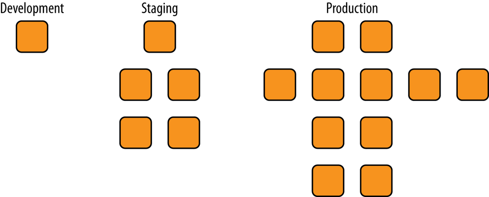
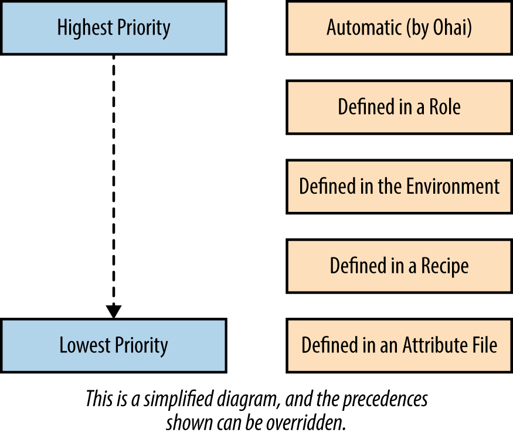
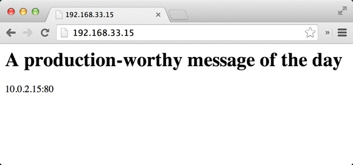
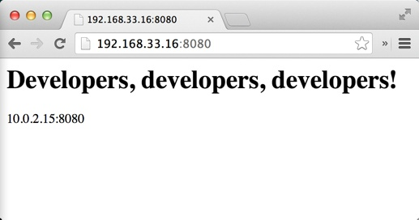

# 环境

* 创建一个开发环境 
* 属性和环境 
* 完整实例

`Chef`服务器支持“环境”功能为软件开发生命周期中的每一个阶段建模




环境反映模式和工作流， 可以用来表示应用程序的各个生命阶段

* 开发 
* 测试 
* 模拟生产环境 
* 生产环境 

默认情况下，`Chef`服务器只有一个名为`default`的环境。 

环境可以包含配置基础架构所需的属性, 比如 某

* 付款服务`API`的`URL` 
* 程序包存储源的位置 
* 所需使用的`Chef`配置文件的版本 


和角色不一样，环境支持版本约束（指定在该环境下使用的菜谱的版本），因此允许在`Chef`服务器上对不同的环境提供不同的资源。


你可能会认为如果使用`Test Kitchen`进行测试井在测试后销毁侧试节点便不需要使用多个环境，但事实不是这样，即使你使用`Test Kitchen`常常也会希望在发布到生产环境前在和生产环境类似的真实的服务器环境中部署自己的`Chef`配置代码 

## 创建一个开发环境 

我们可以使用像创建`Chef`数据包或角色一样的方法创建环境。在本书的例子中我们可以在`chef-playground`目录下创建一个表示环境的目录,默认可命名为`envrionments`。 

```
$ chef-zero --port 9501
>> Starting Chef Zero (v14.0.13)...
>> WEBrick (v1.5.0) on Rack (v2.0.7) is listening at http://127.0.0.1:9501
>> Press CTRL+C to stop
...
```

```
$ cd chef-playground
$ mkdir environments
```

我们将创建一个`.json`文件来表示新的环境。基本的环境需要拥有`name:（名字）`和 `description:（描述）`环境也同时可以包含对菜谱的版本约束。

能够在某个环境内指定特定的菜讲版本是环境最有用的功能, 请创建`chef-playground/roles/dev.json`文件 

**`chef-playground/environments/dev.json`**

```
{
  "name": "dev",
  "description": "For developers!",
  "cookbook_versions": {
    "apache": "= 0.2.0"
  },
  "json_class": "Chef::Environment",
  "chef_type": "environment"
}
```

运行`knife environment from file`并传递刚创建的`dev.json`文件。

**`knife environment from file`命令会假设`dev.json`文件在名为`environment`的子目录中而不是当前目录**

```
$ knife environment from file dev.json
Updated Environment dev
``` 
```
$ knife environment show dev
chef_type:           environment
cookbook_versions:
  apache: = 0.2.0
default_attributes:
description:         For developers!
json_class:          Chef::Environment
name:                dev
override_attributes:
```

## 属性和环境 

环境可以包含属性让我们通过创建一个表示生产（`production`) 环境的`.json`文件, 这个环境将会约束`apache`菜谱的版本到`0.1.1`版本

同时， 让我们确保在生产环境下 每日消急显示一个对于生产环境自己的特别牙肖息。现在让我们来创建`chef-playground/roles/production.json`文件

**`chef-playground/roles/production.json`**

```
{
  "name": "production",
  "description": "For prods!",
  "cookbook_versions": {
    "apache": "= 0.1.0"
  },
  "json_class": "Chef::Environment",
  "chef_type": "environment",
  "override_attributes": {
    "motd": {
      "message": "A production-worthy message of the day"
    }
  }
}
```


```
$  knife environment from file production.json
Updated Environment production

$ knife environment show production
chef_type:           environment
cookbook_versions:
  apache: = 0.1.0
default_attributes:
description:         For prods!
json_class:          Chef::Environment
name:                production
override_attributes:
  motd:
    message: A production-worthy message of the day
```


考虑到属性的优先级别时环境属性的优先级可能会使整个溉念变得有些复杂。如图所示，**环境属性的优先级比角色属性的优先级低，但比菜谱配方单或属性文件的属性优先级高** 



**由于环境可以搜盖并指定特定的菜谱版本，环境的属性也应拥有比默认更高的优先级**


因此在使用环填属性时往往使用`override attributes`而不是`default attributes`

```
override_attributes:
  motd:
    message: A production-worthy message of the day
```


## 完整实例


`apache`菜谱并使用要在生产环魔巾用到的环境和角色来进行次完整的实例。 


### 模拟生产环境 

创建个名为`cehf-zero`的目录。其结构与`chef-playgound`和`chef-repo`差不多拥有`cookbooks`, `environments,` 和 `roles`子目录口在创建这个目录后将其作为工作目录： 
 
```
$ mkdir chef-zero
$ cd chef-zero
```

让我们假设我们的`apache`菜谱已经准备就绪, 我们将在生产环境中使用属性环魄和角色, 首先让我们用`Test Kitchen`来模拟生产环境。 

**`chef-zero/environments`目录中创建一个环境定义。这会代表一个`production`（生产）环境．在此环境中我们也将以重写级别定义`node['motd']['message']`属性** 

**`chef-zero/environments/production.json`**

```
{
  "name": "production",
  "description": "For prods!",
  "cookbook_versions": {
    "apache": "= 0.1.0"
  },
  "json_class": "Chef::Environment",
  "chef_type": "environment",
  "override_attributes": {
    "motd": {
      "message": "A production-worthy message of the day"
    }
  }
}
```


```
$ mkdir roles
$ touch /roles/webserver.json
```

我们在生产环境中使用一个`webserver`角色来表示网页服务器节点。创建`chef-zero/roles/webserver.json`文件。它的运行清单包含`apahce`配方单和默认级别的`node['apache']['port']`属性。我们将使用这个属性来展示如何根据环境改变菜谱的行为 


**`chef-zero/roles/webserver.json`**

```
{
  "name": "webserver",
  "description": "Web Server",
  "json_class": "Chef::Role",
  "chef_type": "role",
  "default_attributes": {
    "apache": {
      "port": 80
    }
  },
  "run_list": [
    "recipe[apache]"
  ]
}
```

```
$ tree chef-zero/
chef-zero/
├── cookbooks
├── environments
│   └── production.json
└── roles
    └── webserver.json

3 directories, 2 files
```

我们将为本章的例子创建个新版本的`apache`菜谱，向它添加一些新东西。我们可以通过运行`chef generate cookbook`或`knife cookbook create`命令创建`apache`菜谱取决于 你使用`Chef`研发包还是客户端。 


**Chef Development Kit:**

```
$ cd cookbooks
$ chef generate cookbook apache
$ cd apache
```

**Chef Client:**

```
$ knife cookbook create apache --cookbook-path .
$ cd apache
$ kitchen init --create-gemfile
$ bundle install
```
在本例中，我们用`chef_zero`启动器，因为我们需要用到`Chef`服务器的功能。确保`provisoner：`板块设定了正确的值。我们需要`Test Kitchen`为我们启动`Chef Zero`实例。 

同时在`provisioner：`中，告诉`Test Kitchen`在哪里寻找`roles`和`environments`目录(相对于`kitchen.yml`的位置）: 


```
provisioner:
  name: chef_zero
  nodes_path: ../../nodes
  environments_path: ../../environments
  always_update_cookbooks: true
```

注意，我们在`suites：`设定中设定`Test Kitchen`套件名字为`prod`

每一个环境都会拥有它自己的测试套件配置，我们通过这种方式区分它们的测试配置。在本例中，我们设定测试生产环境的套件名为`prod`

 
同时，我们借此介绍`suites:`设定的新语句。

通过`client_rb`和`environment`语句为我们的沙盒节点在它的`/etc/chef/client.rb`中设定环境 

```
suites:
  - name: prod
    provisioner:
      client_rb:
        environment: production
  ...
```

**一个节点在同一时间只能隶属于一个环境。环境在节点的`/etc/chef/client.rb`文件中指定。 如果文件中没有设定环境，节点则使用默认环境，名为`defau1t`。** 

**在此虚拟环境中，我们用`Test Kitchen`将想要的环境写到测试节点的`/etc/chef/client.rb`文件中**

**然而在真实环境中，应该用`chef-client::config`配方单来设定目标节点的`/etc/chef/client.rb`文件中的`environment`设定。**

可以通过使用以下属性来控制设定的`ssl_verify_node`一样： 

```
node.default['chef_client']['config']['environment'] = 'production'
```

以下例子同时展示了我们可以通过`suites:`设定来设定`private_network`（私有网络）IP地址

```
suites:
  - name: prod
  ...
  driver:
    network:
    - ["private_network", {ip: "192.168.33.15"}]
```

当一个值在`Test Kitchen`的`provisioner:`中被设定时会披继承到所有`suites:`设定中．

在本例中我们只想要我们生产环掩的测试沙盒环境拥有不同的IP地址因此我们只在`suites`下我们的特定环境内指定`private_network`设定 

```
---
driver:
  name: vagrant
  provider: vmware_desktop

provisioner:
  name: chef_zero
  nodes_path: ../../nodes
  environments_path: ../../environments
  always_update_cookbooks: true

platforms:
  - name: centos65
    driver:
      box: learningchef/centos65
      box_url: learningchef/centos65

suites:
  - name: prod
    provisioner:
      client_rb:
        environment: production
    driver:
      network:
      - ["private_network", {ip: "192.168.33.15"}]
    run_list:
      - recipe[apache::default]
    attributes:
```
使用`kitchen list`检查`kitchen.yml`否有语法错误。输出应该和一下类似

```
$ kitchen list
Instance       Driver   Provisioner  Verifier  Transport  Last Action    Last Error
prod-centos65  Vagrant  ChefZero     Busser    Ssh        <Not Created>  <None>
```

编辑`apache/metadata.rb`文件, 填入`maintainer`, `maintainer_email`, and `license`信息。

```
name 'apache'
maintainer 'ja xi'
maintainer_email 'jx@ss.com'
license 'All Rights Reserved'
description 'Installs/Configures apache'
long_description 'Installs/Configures apache'
version '0.1.0'
chef_version '>= 14.0'
```
因为我们会在达个版本的`apache`菜谱中使用属性请创建`default.rb`属性文件。 

Chef Development Kit:

```
$ chef generate attribute default
```
Chef Client:

```
$ touch attributes/default.rb
```

```
$ chef generate attribute default
Recipe: code_generator::attribute
  * directory[/Users/i515190/Devops_sap/Chef_Doc/learningchef/chap11/chef-zero/cookbooks/apache/attributes] action create
    - create new directory /Users/i515190/Devops_sap/Chef_Doc/learningchef/chap11/chef-zero/cookbooks/apache/attributes
  * template[/Users/i515190/Devops_sap/Chef_Doc/learningchef/chap11/chef-zero/cookbooks/apache/attributes/default.rb] action create
    - create new file /Users/i515190/Devops_sap/Chef_Doc/learningchef/chap11/chef-zero/cookbooks/apache/attributes/default.rb
    - update content in file /Users/i515190/Devops_sap/Chef_Doc/learningchef/chap11/chef-zero/cookbooks/apache/attributes/default.rb from none to e3b0c4
    (diff output suppressed by config)
```

如示例`attributes/default.rb`中设定一些默认属性。为了展示属性的优先级我们在这设定`node['apache']['port'] `和` node['motd']['message']`的默认值井设定成与在角色和环境文件中不同的值口我们同时也添加了一个`node['apache']['document_root'] `属性来设定网页服务器`index.html`文件的位置

```
touch attributes/default.rb
```

**`/apache/attributes/default.rb`**

```
default['apache']['document_root'] = '/var/www/html'
default['apache']['port'] = 3333
default['motd']['message'] = 'Default message'
```

###  `recipes/default.rb`

加一个新的`template`资源在目标节点上创建`custom.conf`文件以及`directory`资源以创建所需的目录。

`custom.conf`即可是一个配置`apache`网页服务器设定的可选的配置文件。在这个配置文件中，我们将设定默认的监听端口和文档根目录。 


```
template '/etc/httpd/conf.d/custom.conf' do
  ...
  variables(
    :document_root => node['apache']['document_root'],
    :port => node['apache']['port']
  )
  ...
end
```

在创建模板文件时, 你可以通过`varibales()`属性传递一个映射来指定模板中变量的值。 这样我们可以从配方单中传递变量给模板， 使模板中也可以使用更短的变量名

**`apache/recipes/default.rb`**


```
#
# Cookbook Name:: apache
# Recipe:: default
#
# Copyright (C) 2014
#
#
#

package 'httpd'

service 'httpd' do
  action [ :enable, :start ]
end

# Add a template for Apache virtual host configuration
template '/etc/httpd/conf.d/custom.conf' do
  source 'custom.erb'
  mode '0644'
  variables(
    :document_root => node['apache']['document_root'],
    :port => node['apache']['port']
  )
  notifies :restart, 'service[httpd]'
end

document_root = node['apache']['document_root']

# Add a directory resource to create the document_root
directory document_root do
  mode '0755'
  recursive true
end

template "#{document_root}/index.html" do
  source 'index.html.erb'
  mode '0644'
  variables(
    :message => node['motd']['message'],
    :port => node['apache']['port']
  )
end
```

**Chef Development Kit:**

```
$ chef generate template index.html
```

**Chef Client - Linux/Mac OS X:**

```
$ touch templates/default/index.html.erb
```


```
$ chef generate template index.html
Recipe: code_generator::template
  * directory[/Users/i515190/Devops_sap/Chef_Doc/learningchef/chap11/chef-zero/cookbooks/apache/templates] action create
    - create new directory /Users/i515190/Devops_sap/Chef_Doc/learningchef/chap11/chef-zero/cookbooks/apache/templates
  * template[/Users/i515190/Devops_sap/Chef_Doc/learningchef/chap11/chef-zero/cookbooks/apache/templates/index.html.erb] action create
    - create new file /Users/i515190/Devops_sap/Chef_Doc/learningchef/chap11/chef-zero/cookbooks/apache/templates/index.html.erb
    - update content in file /Users/i515190/Devops_sap/Chef_Doc/learningchef/chap11/chef-zero/cookbooks/apache/templates/index.html.erb from n
one to e3b0c4
    (diff output suppressed by config)
```

**`/templates/default/index.hmtl.erb`**

```
<html>
  <body>
    <h1><%= @message %></h1>
    <%= node["ipaddress"] %>:<%= @port %>
  </body>
</html>
```

**Chef Development Kit:**

```
$ chef generate template custom
```

**Chef Client - Linux/Mac OS X:**

```
$ touch templates/default/custom.erb
```

填充文件内容。我们使用这个`apache`配置文件来设定网页服务器监听的端口（`Listen`设置）以及`DocumentRoot`设置。 


可以在模板中通过` <% %>`格式写条件逻辑（而用`＜％= %>`来表示变量）。

同时，如果结尾的符号以横杠开头，比如` -%>`这一行将不会被渲染在输出的文件中。

这三行将被处理` <% if @port != 80 -%>`, Listen `<%= @port %>` and `<% end -%>`而不会都输出。当输出最后的结果文件时，这三行变为一行Listen `<%= @port %>`因为其他两行的结尾符号为 `-%>`, 同时, **输出的这一行只有当`if`语旬中的条件返回真时才会坡轴出否则将会被略过**

我们需要达样的条件逻辑因为`apache`只有在监听端口不为`80`时才需要在配置文门中指定 `Listen`配置。如果端口`80`井在`Listen`中指定，`apache`将会报错。

**`/templates/default/custom.erb`**

```
<% if @port != 80 -%>  
  Listen <%= @port %> 
<% end -%>

<VirtualHost *:<%= @port %>>
  ServerAdmin webmaster@localhost

  DocumentRoot <%= @document_root %>
  <Directory />
    Options FollowSymLinks
    AllowOverride None
  </Directory>
  <Directory <%= @document_root %>>
    Options Indexes FollowSymLinks MultiViews
    AllowOverride None
    Order allow,deny
    allow from all
  </Directory>
</VirtualHost>
```

* 这一行不会写入到最终输出的文件 
* 只有这一行将会写入到输出的文件 
* 这一行不写入到最终输出出的文件 

 


### 模拟开发环境 

假设我们要对`apache`菜谱开始一个新的开发周期， 加一些新的功能。对于本戏的展示意图
我们不在乎新功能具体是什么， 只希望新的开发不会形响现有的生产环境下的`0.1.0`版本的菜谐。我们使用一个`dev`环境进行开发

**`apache/metadata.rb`**

```
name             'apache'
maintainer       'Mischa Taylor'
maintainer_email 'mischa@misheska.com'
license          'MIT'
description      'Installs/Configures apache'
long_description 'Installs/Configures apache'
version          '0.2.0'
```

```
$ kitchen converge prod-centos65
...
       Missing Cookbooks:
       ------------------
       Could not satisfy version constraints for: apache
...
Chef Client failed. 0 resources updated in 1.626076356 seconds
       [2014-08-22T17:59:26-07:00] ERROR: 412 "Precondition Failed "
       [2014-08-22T17:59:26-07:00] FATAL: Chef::Exceptions::ChildConvergeError:
       Chef run process exited unsuccessfully (exit code 1)
>>>>>> Converge failed on instance <prod-centos65>.
>>>>>> Please see .kitchen/logs/prod-centos65.log for more
details
>>>>>> ------Exception-------
>>>>>> Class: Kitchen::ActionFailed
>>>>>> Message: SSH exited (1) for command: [sudo -E
chef-client -z --config /tmp/kitchen/client.rb --log_level info
--chef-zero-port 8889 --json-attributes /tmp/kitchen/dna.json]
>>>>>> ----------------------
```

**`environments/dev.json`**

```
{
  "name": "dev",
  "description": "For developers!",
  "cookbook_versions": {
    "apache": "= 0.2.0"
  },
  "json_class": "Chef::Environment",
  "chef_type": "environment",
  "override_attributes": {
    "apache": {
      "port": 8080
    },
    "motd": {
      "message": "Developers, developers, developers!"
    }
  }
}
```

**`apache/.kitchen.yml`**

```
---
driver:
  name: vagrant
  provider: vmware_desktop

provisioner:
  name: chef_zero
  nodes_path: ../../nodes
  environments_path: ../../environments
  # always_update_cookbooks: true

platforms:
  - name: centos65
    driver:
      box: learningchef/centos65
      box_url: learningchef/centos65

suites:
  - name: prod
    provisioner:
      client_rb:
        environment: production
    driver:
      network:
      - ["private_network", {ip: "192.168.33.15"}]
    run_list:
      - recipe[apache::default]
    attributes:

  - name: dev
    provisioner:
      client_rb:
        environment: dev
    driver:
      network:
      - ["private_network", {ip: "192.168.33.16"}]
    run_list:
      - recipe[apache::default]
    attributes:
```

```
$ kitchen list
Instance       Driver   Provisioner  Last Action
prod-centos65  Vagrant  ChefZero     Converged
dev-centos65   Vagrant  ChefZero     <Not Created>
```

```
$ kitchen converge dev-centos65
```

 
