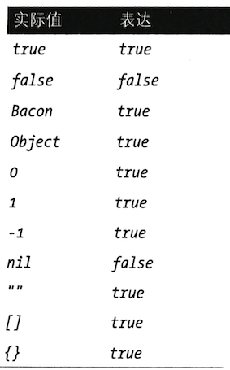

# Ruby和Chef语法

* `Ruby`语法和案例 
* `Chef`语法和案例
* 常用的`Chef`语法

## Ruby语法和案例 


提示语法检奋 

Ruby提供内建的机制来验证文件是否包含有效的`Ruby`语法. 可以通过传递`-c`参数和文件路径到`Ruby`解释器来检查`Ruby`文件 

```
$ ruby -c /path/to/ruby/file 
```

如果语法是正确的此命令会返回`Syntax OK`, 否则它会返回一个堆栈轨迹来帮你找到哪行代码出错了。 

### 注释 

在`Ruby`中, 井号(\#)代表注释口注释是代码中的文档`\＃`符号之后的代码将被解释器忽略, 只供人阅读:

```
variable = 2 # This is comment
 # This multiple lines comment
 # "#" This is start of line
```


```
# Why buy bacon.strips
if bacon.strips < 5
	buy_bacon
end
```

### 变量 

从前面的例子中我们否到，`Ruby`中的变量将符号右边的值赋予左边的变散名 

```
variable=2 #这将数值2赋给变量名为variable的变量
```

因为`Ruby`不是静态类型语言, 所以不需要在给变量赋值时声明变量类型。

下面的例子展示将不同类型的值队给变量：

一个数字一个宇符串`hello`和一个对象。 **赋值之前你不需要告诉Ruby一个变量要储存什么类型的内容**： 

```
a = 1
b = 'hello'
c = Object.new 
```

**在Ruby中变量可以在它声明的最远范围内访问。** 


下面的例子更好地展示变量范内的访问，首先我们声明一个名字为`bacon_type`（培根类型）的顶级变量， 并赋值`crispy`。

然后这培根烤两次, 一个额外的变量`temperature`被赋值`300`,最后脚本尝试访问`temperature`变量但它已经在可访问范围之外 

```
bacon_type = 'crispy'

2.times do
	puts bacon_type
	temperature = 300
end

puts temperature
```

* 在顶级范围`bacon_type`变量， 因此它在此情境下的任何地方可以被访问 
* 我们可以在一个更加特定的范围内（比如一个循环）访问`bacon_type`变量。 
* 在一个范围内声明的变最只能在这个范围内被访问 
* 在变量声明的范围外尝试访问这个变最会得到一个异常`undefined local variable or method 'temperature'`


### 数学运算

```
if hours % 3
	puts "It's bacon time"
end
```

```
Math.hypot(43, 57)
```

 
[Arithmetic Operators](https://github.com/Chao-Xi/JacobTechBlog/blob/master/ruby/2Arithmetic_Operators.md)

### 字符串

在`Ruby`创建字符串有两种普遍的方法, 用单引号或者双引号， 

* 单引号的好处是占更少的位置并不会应用内插的变量
* 双引号字符串的优势是支持给作为字符串一部分的变量赋值；这样的赋值过程称作字符串内插。

在双引号内的字符串中，我们用井号和大括号来表示需要内插的变量，Ruby则会用这个变量的值替换这个变量作为字符串的一部分。在以下例子中，`#\{x`｝在字符串中代表变量`x`的值。 


双引号字符串和单引号字符串都用反斜杠（\）字符来转义特殊字符。

``` 
"double quoted string" #=> 'single quoted string' 
'double quoted string" #=> "single quoted string" 

x="hello" 

"#{x} world" #=>  "hello world" 
'#{x} world' #=>  '#{x} world'
```

* 双引号字符串内插变量，输出结果中变量值替换了变量名。
* 单引号字符串不支持内插变量，输出结果就是引号内内容.
*
```
"quotes in \"quotes\"" #=> "quotes in \"quotes\"" 
'quotes in \'quotes\'' #=> "quotes in \"quotes\"" 
```

有时候需要转义特殊字符。

**你需要转义名字中的单引号**： 

```
player=’Jim O\'Rourke' 
```
或者也可以用双引号字符串来避免使用转义字符： 

```
player="Jim O'Rourke" 
```

### Heredoc表示法 

在`Chef`中，你有时会见到字符串的`“heredoc”`表示法。`heredoc`在表示多行字符串时尤 为有用。

`heredoc`表示法由两个`“小于号”`(<<)动开始，然后跟着一些用来描述文本的标 识。这些标识可以包含任何字符串，但不应该是一个在要表示的文本本身中包含的字符串。在下面的例子中，我们使用`METHOD_DESCRPTION`作为描述文本的标识： 

```
<<METHOD_DESCRIPTION 
This is a multiline string. 

All the whitespace is preserved,and I can even apply# {interpolation}inside this block. 
METHOD DESCRIPTION 
```

例子中显示了在用`heredoc`表示的字符串中可以包含多行文本或空白符，甚至可以应用内 

### True and False 表示法 



#### `! -> not `

```
!true => false
not true => false
not flase => true
!!true => true
not nil => true
```

### 数组 

可以通过使用`Ruby`数组来创建列表。如以下例子所示，`Ruby`的数组使用中括号来表示．数组的索引从零开始，当你往数组中添加新项目时，**`Ruby`的解释器会自动分配所需的内存，因此你不需要考虑动态调整数组大小**：

```
types = ['crispy,'raw','crunchy','grilled'] 
types.length   #4
types.size     #4
types.push 'smoked'  #  ['crispy,'raw','crunchy','grilled','smoked']
types << 'deep fried' # ['crispy,'raw','crunchy','grilled','smoked','deep fried']

types[0]   #crispy
types.first #crispy
types.last  #deep fried
types[0..1] #['crispy,'raw']
```


```
emp[0]  #Morgan
emp[1]  #Citi
```

```
emp << 'Bob'
emp.last #Bob
```

### 散列（哈希） 

`Ruby`支持散列的内容是键值对 （哈希）（有时候在其他语言中叫字典或映像）。散列和数组类似，但它 （一个键对应一个值），而不是单个项目。散列可以通过大括号来创建 `(+_{})`: 

```
prices = { oscar: 4.55, boars: 5.23, wright: 4.65, beelers: 6.99}
prices[:oscar]   #4.55
prices[:boars]   #5.23

prices[:oscar]=1.00
prices.values  #[4.55, 5.23, 4.65, 6.99]
```

#### 字符串，符号和`Mash`

`key: value`   <=>   `:key => value<1>`

* **`=>` 散列火箭（hash rocket)**

```
hash = { 'key' => value }
hash['key'] #value
```

* **字符串作为键**

```
mash = HashieMash.new((key: value)) 

mash[:key]   # value
mash['key']  # value
mash.key     # value
```

```
players = {
   'M, A' => {
     'AVG' => 0.311,
     	'OBP' => 0.385,
     	'SLG' => 0.507,
   },
   'A, P' => {
   	'AVG' => 0.235,
     	'OBP' => 0.297,
     	'SLG' => 0.477,
   }
}
```

```
players['M, A'] # {'AVG' => 0.311, 'OBP' => 0.385, 'SLG' => 0.507}
```
```
players['M, A']['AVG']  # 0.311
```

### 条件和控制流

* `if`   `if not`<=>`unless`

```
if some condition 
	puts "happened" 
else 
	puts "didn't happen" 
end 

# unless 
some condition 
	puts "didn't happen" 
else 
	puts "happened" 
end 
```

```
if false 
	puts "this can't possibly happen" 
elsif nil  # nil is false
	puts "this won't happen either" 
elsif true 
	puts "this will definitely happen" 
else 
	puts "this won't happen, because the method is short-circuited end 
```

* `case`

```
case some_condition 
when "literal string" 
	# ...
when /regular expression/ 
	# when list, of, items 
	# ...
else  
	# ...
end 
```

```
case player.age 
when 0..12 
	'Minor League' 
when 13..18 
	'Developing' 
when 19..30 
	'Prime' 
when 31..40 
	'Decline' 
else 
	'Retirement' 
end 
```

### 方法、类和模块 

虽然在学习和`Chef`更高级的交互之前，不需要用到这些，但`Ruby`支持方法、类、模块和面向对象的结构。在Ruby中，

**我们用`def`关键字来定义方法，用`class`关键字来定义类， 用`module`关键字来定义模块**： 

```
class Bacon
 def cook(temperature)
 	#...
 end
end

module Edible
	#...
end
```


* 用`class`关键字创建类。 
* 用`def`关键字创建方法，并且可以接受参数。 
* `module`关键字创建模块。 


我们可以通过方法的名字将其调用。调用时，`Ruby`并不要求对参数使用括号，但我们强烈推荐养成使用括号的习惯来增加代码的可读性： 


* `my_method(5)` 
* `my_method 5` 

* 执行名字为`my_method`的方法，并使用参数`5`
* 同样执行`my_method`方法及使用参数`5`，但不使用括号。 

在Ruby中，方法是可以连续执行的。 如果一个方法的返回结果可以执行另一个方法，可 
以将它们写在一行执行`downcase`方法 下面的例子用一行代码对 
`"String"`，字符串执行`upcase`方法，对其结果然后对共结果执行`reverse`方法： 


`"String".upcase.downcase.reverse #=> "gnirts"` 

 
## Chef语法和案例

`Chef`使用的领域专用语言（`DSL`）是`Ruby`的一个子集。在`Chef`代码里，你不仅可以使用 它的领域专用语言，也可以使用`Ruby`编程语言的全部功能。这允许了开发者在`Chef`代码中使用条件、执行数学运算以及和其他服务沟通，等等。在深入讨论`Chef`的领域专用语言之前，我们先来看看基本语法。 


以下是一个`Chef`领域专用语言的例子，展示如何通过使用`Chef`的“用户”资源来创建一个用户账户。在`Chef`中，“资源”是用来定义你的基础架构特定部分的组件。

**比如说，以下的例子管理一个名为`alice`、用户`ID`为`503`的用户账号**： 

```
user 'alice' do
	uid '50
end
```


以下的例子更抽象地展示调用`Chef`领域专用语言方法的综合语法，以上的例子基于这个法： 

```
resource 'NAME' do 
	parameter1 value1 
	parameter2 value2 
end 
```
第一个部分指定要使用的资源（比如说`template`、 `package`或`service`)，然后跟着该资 源的名字属性（`name_attribute`)。


这名字的意义和用途在不同的资源中有所不同。比如，在`package`资源中，名字（`name_attribute`)代表你要安装（或管理）的程序包的名字；

在`template`资源中，名字代表使用该模板最终渲染的文件在目标机器上的路径。在定义资源的名字属性之后，我们使用`Ruby`的关键字`do`。**在`Ruby`中，使用`do`关键字永远需要配合一个`end`关键字来结尾。在`do`和`end`中间的代码称作一个代码块**。

在此代码块中， 我们可以声明资源的参数和他们的值。这些参数和值在不同的资源中也是不同的，

* 比如 `package`资源有`version`参数可以定义要安装的程序包版本，
* `template`资源支持`source`参数来定义源模板的位置以上`Chef`领域专用语言代码也可以用`Ruby`面向对象的方法来理解，像下面的例子一样以上的`Chef`的领域专用语言其实为你创建了一个资源对象，设定正确的属胜和参数，然后在`Chef`运行那段代码时执行该资源，它等同于： 

```
resource = Reosuce.new('NAME')
resource.parameter1 = value1
resource.parameter2 = value2
resource.run
```

以下案例展示如何使用`template`, `package`和`service`资源，这些资源只是`Chef`濒域专用语言支持的许多资源中的三个： 

```
template '/etc/resolv.conf' do 
	source 'my_resolv.conf.erb' 
	owner 'root' 
	group 'root' 
	mode '0644' 
end
 
package 'ntp' do 
	action :upgrade 
end 

service 'apache2' do 
	restart_command ./etc/init.d/apachez restart' 
end 
```

**如果在资源的代码块中指定了无效的参数（不存在或拼写错误）`Chef`会抛出异常**

```
NoMethodError 
...... undefined method 'not a real parameter' for ChefResourre 
``` 

`Chef`使用多阶段执行模式，这允许你在`Chef`想针对一个数组中所有的对象执行一个资源

**`file`资源是用来管理文件的，`content`参数用来指定写到文件的内容**

```
['bacon', 'eggs', 'sausage'].each do |type| 
	file "/tmp/#{type}" do 
		content "#{type} is delicious!" 
	end 
end 
```

Chef 动态分解循环

```
file 'itmp/bacon' do 
	content 'bacon is delicious!' 
end 

file 'Amp/eggs' do 
	content 'eggs is delicious!' 
end 

file '/tmp/sausage' do 
	content 'sausage is delicious!' 
end 
```

当`Chef`动态计算某个值时， 数值都是在第一阶段被计算和存储

```
free_memory = node['memory']['total'] 

file '/tmp/free' do 
	contents "#{free_memory} bytes free on #{Time.now}" 
end 
```

执行第二阶段时

```
file '/tmp/free' do 
	contents "12904899202 bytes free on 2013-07-24 17:47:01 -0400" 
end 
```

`file`, `service`,`template`,`package`都是`Chef`的核心包， 可以在（[https://docs.chef.io/resource_reference.html](https://docs.chef.io/resource_reference.html)）查看


## 常用的`Chef`语法

### 1.bash

* 使用`bash`执行多行`shell(bash)`脚本

```
bash 'echo "hello"'
```

### 2.Chef_gem

在`Chef`内安装一个`Ruby`程序(gem)，在Chef内部使用。 如果你的`Chef`代码需要额外一个
的`gem`来执行一个函数, 可以用这个资源来在`Chef`内部安装这个额外的`gem `

```
# 安装'HTTParty gem', 这样在Chef代码中我们可以用它来发送'RESTful'请求
chef_gem 'httprty' 
```

### 3.Cron

**每周重启电脑**

```
cron 'weekly_restart' do 
	weekday '1' 
	minute '0' 
	hour '0' 
	command 'sudo reboot' 
end 
```

### 4. deploy_revision

**控制和管理应用程序部署部署, 在代码版本控制工具中的代码（如`Rails`应用程序)** 

```
# 从版本控制工具中复制和同步代码
deploy_revision 'opt/my_app' do 
	repo 'git://github.com/username/apo.git' 
end 
``` 

### 5. directory

管理目录或目录树处理权限和所有者 

```
# 用递归来确保 '/opt/my/deep/directory'录树中的每层目录都存在 

directory 'opt/my/deep/directory' do
	owner 'root' 
	group 'root' 
	mode '0644' 
	recursive true 
end 
```

### 6. execute

执行任何单行的命令

```
# 将内容写到文件
execute 'write status' do 
	command 'echo "delicious" > /tmp/bacon' 
end 
```


### 7. file

**管理已经存在（但不受`Chef`管理）的文件**

```
# 删除/tmp/bacon文件
file ‘/tmp/bacon' do 
	action :delete 
end 
```

### 8. gem_package

**在`Chef`外安装一个`Ruby`程序（`gem`),比如在目标机器的系统中安装个应用程序或工具**:

```
# 安装bundler来管理应用程序依赖
gem_package 'bundler'
```

### 9. group

**创建或管理一个包含本地用户账户的本地组**

```
# 创建bacon组
	group 'bacon'
```

### 10. link

**创建和管理符号和硬链接**

```
# Link /tmp/bacon to /tmp/delicious 
link '/tmp/bacon' do 
	to '/tmp/delicious' 
end 
```

### 11. mount

**挂载和卸载文件系统**

```
# 挂载/dev/sda8
mount '/dev/sda8'
```

### 12. package

**用操作系统提供的程序安装管理器安装一个程序包** 

```
＃安装`apache2`程序包（在`Debian`系统里） 
package 'apache2'
```

### 13. remote_file

**从一个远程位置（比如网站）传输一个文件**

``` 
# 下载远程文件到'/tmp/bacon'
remote_file 'tmp/bacon' do 
	source 'http://bacon.org/bits.tar.gz' 
end
```

### 14. service

**停止或重启一个服务** 

```
# 重启apache2服务 
service 'apache2' do 
	action :restart 
end 
```

### 15. template


管理以纯文本为内容的嵌人式 `Ruby (ERB）`模板 

```
# 用'bits.erb'模板渲染/tmp/bacon文件
template '/tmp/bacon' do 
	source 'bits.erb' 
end 
```

### 16.User

**创建管理本地用户账号**

```
# 创建Bacon 用户

user 'bacon'
```


