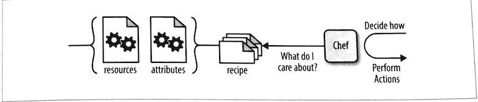

# 3. 如何写`Chef`配方

* `chef-apply` 
* 验证第一个`Chef`配方单
* 用配方指定理想配置


```
$ tree learningchef/
learningchef/
└── chap04

1 directory, 0 files
```


```
file 'hello.txt' do 
    content 'Welcome to Chef' 
end 
```

* 创建`hello.txt`文件。 
* 把`Welcome to Chef`文本写到`hello.tx`t文件中。 
* 使用`chef-apply`命令可以让Chef执行刚才创建的hello.rb文件中的指定的动作： 


### `chef-apply` 

`chef-apply`工具是在`Chef Solo`基础上建立的一个小工具。`Chef Solo`可以让你在没有`Chef`服务器的 
我们会提情况下在本地运行`Chef`代码。


```
$ chef-apply hello.rb 
Recipe: (chef-apply cookbook)::(chef-apply recipe)
  * file[hello.txt] action create
    - create new file hello.txt
    - update content in file hello.txt from none to 40a30c
    --- hello.txt       2019-11-21 10:17:25.810706235 +0800
    +++ ./.chef-hello20191121-23912-z55r6x.txt  2019-11-21 10:17:25.810459223 +0800
    @@ -1 +1,2 @@
    +Welcome to Chef
```

## 验证第一个`Chef`配方单

```
$ more hello.txt 
Welcome to Chef
```

`Welcome to Chef` 字符串被传递到`file`资源的`content`属性。`file`资源则将`Content`属性的字符串写入`hello. txt`文件。 


## 用配方指定理想配置



**在给某个文件指定文件名时，应该使用绝对路径**

```
file "#{ENV['HOME']}/Devops_sap/Chef_Doc/learningchef/chap04/stone.txt" do
    content "Written in stone"
end
```

* `"#{ENV['HOME']}"`

`"#{ENV['HOME']}"` 是一个指向现在用户的跟目录的变量。

字符串定义中的变量使用`＃{＜变 量＞｝` 来表示（井号跟着大括号，大括号中包含变量名）。

包含变量的字符串必须使用双引号来定义，否则，Chef不会执行和替换字符串中的变量，而会认为那是字符串本身 

```
$ chef-apply stone.rb 
Recipe: (chef-apply cookbook)::(chef-apply recipe)
  * file[/Users/i515190/Devops_sap/Chef_Doc/learningchef/chap04/stone.txt] action create
    - create new file /Users/i515190/Devops_sap/Chef_Doc/learningchef/chap04/stone.txt
    - update content in file /Users/i515190/Devops_sap/Chef_Doc/learningchef/chap04/stone.txt from none to ba4fda
    --- /Users/i515190/Devops_sap/Chef_Doc/learningchef/chap04/stone.txt        2019-11-21 13:33:32.834565261 +0800
    +++ /Users/i515190/Devops_sap/Chef_Doc/learningchef/chap04/.chef-stone20191121-25291-1jglr40.txt    2019-11-21 13:33:32.834330945 +0800
    @@ -1 +1,2 @@
    +Written in stone
```

```
$ more $HOME/Devops_sap/Chef_Doc/learningchef/chap04/stone.txt
Written in stone
```

```
$ chef-apply stone.rb 
Recipe: (chef-apply cookbook)::(chef-apply recipe)
  * file[/Users/i515190/Devops_sap/Chef_Doc/learningchef/chap04/stone.txt] action create (up to date)
```


* 如果`stone.txt`不存在，`chef-apply`创建文件，并写入相应的内容 
* 如果`stone.txt`已经存在并且内容正确，`chef-apply`不做任何事情 


修改`stone.txt`

```
Written in stone, modify this file
```

```
$ chef-apply stone.rb 
Recipe: (chef-apply cookbook)::(chef-apply recipe)
  * file[/Users/i515190/Devops_sap/Chef_Doc/learningchef/chap04/stone.txt] action create
    - update content in file /Users/i515190/Devops_sap/Chef_Doc/learningchef/chap04/stone.txt from 7139d7 to ba4fda
    --- /Users/i515190/Devops_sap/Chef_Doc/learningchef/chap04/stone.txt        2019-11-21 13:40:25.388303782 +0800
    +++ /Users/i515190/Devops_sap/Chef_Doc/learningchef/chap04/.chef-stone20191121-25655-18xmqfk.txt    2019-11-21 13:40:44.011358154 +0800
    @@ -1,2 +1,2 @@
    -Written in stone, modify this file
    +Written in stone
```

这展示了`Chef`如何避免意外的配置变动。`Chef`不仅检查文件是否存在，并且还检查其内容。当`Chef`管理的文件在`Chef`外部被意外更改时，`Chef`会确保当其运行时将其恢复至配方单中指定的版本（生产环境中，许多人配置`Chef`作为后台程序循环运行，使系统一直保持配方单中指定的配置）。 

## 用配方指定理想配置


卸载时，须明确指定不要做什么你可能会疑惑，在配方单中删除内容时，是否可能让`Chef`自动卸载所有其安装的东西。 其实并不然。**但是你可以通过明确告诉`Chef`不要做什么来做等同于卸载的事情**。 

这听起来好像是`Chef`在卸载方面的不足，其实并不然。记住，`Chef`尝试作为一个聪明的工具。你不需要告诉Chef如何做什么，只需要在配方单中告诉`Chef`你的理想配置，然后让`Chef`决定做什么。


**你的配方单通过定义理想配置是什么样的来告诉`Chef`什么时候该停止思考机器的配置**。 


`Chef`只能确保将其管理的机器达到你现在版本的配方单中明确指定的理想配置，**如果把某些东西从配方单中去除，`Chef`没有办法明确知道你想从管理的机器中删除这些还是不做关于这些的任何事情（因为新的配方单己经不存在这些配置）**。

如果选择自动卸载这些内容，这些非明确性暗示的卸载动作和将系统依照明确的理想配置来配置配方单来配置成好的系统在理论上是相悖的。

每个系统管理员多多少少都经历过在由于一些机器上 不知道为何发生的改变造成的问题的排错时无法找到原因而放弃，将机器所有内容擦掉并从头开始。 

**因此，如果想让`Chef`卸载什么， 必须在配方单中明确指定不要安装这些东西。所有的资源都支持这样的定义。 如果是一个文件， 你可以告诉`Chef`系统不需要这个文件， 然后`Chef`可以确保系统中没有这个文件**。 


* 如果文件存在`chef-apply`则会将其删除。 
* 如果文件不存在`chef-appply`不做任何事情。 

**cleanup.rb**

```
file "#{ENV['HOME']}/Devops_sap/Chef_Doc/learningchef/chap04/stone.txt" do
    action :delete
end
```


```
$ chef-apply cleanup.rb 
Recipe: (chef-apply cookbook)::(chef-apply recipe)
  * file[/Users/i515190/Devops_sap/Chef_Doc/learningchef/chap04/stone.txt] action delete
    - delete file /Users/i515190/Devops_sap/Chef_Doc/learningchef/chap04/stone.txt
```


* 配方单(`recipe`) 

一系列用Ruby领域专用语言（DSL）来写的描述理想配置的指令。 

* 资源(`resource`) 

对于`Chef`所管理的东西（比如文件）的一个跨平台的抽象表达。资源是`Chef`代码的组成部分。通过在配方单中使用不同的资源来告诉`Chef`你的理想配置。 

* 属性（`attribute`) 

传递给资源的参数。 

