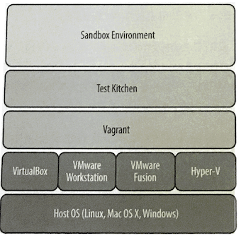
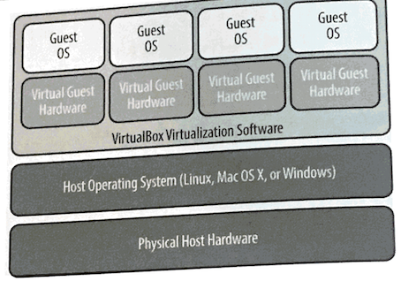
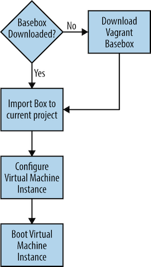

# 用`Test Kitchen`管理沙盒测试环境 

* 宿主和虚拟机
* 启动自己的虚拟机
* YAML Overview
* 用`kitchen.yml`配置`Test Kitchen`

###  vagrant 为虚拟软件提供`API`



##  宿主和虚拟机



```
$ mkidr kitchen
$ cd kitchen
```

* 在你创建的`kitchen`文件夹中运行`kitchen init --create-gemfile`命令。
* `kitchen init`命令会创建让一个项目支持`Test Kitchen`所需的配置文件。

我们需要使用`-create-gemfile`选项，否则`Test Kitchen`会直接尝试作为普通用户而非管理员运行`gem install`。在某些平台上这会失败，因为`Chef`开发包并不总是对其`gem`目录赋予一般用户写入的权限： 

```
$ kitchen init --create-gemfile
      create  kitchen.yml
      create  chefignore
      create  test/integration/default
      create  Gemfile
      append  Gemfile
You must run `bundle install' to fetch any new gems.
```

**以上命令行输出中显示的`bundle install`命令指的是使用名称为`Bundle`的工具。**

**`Bundler`是一个用来下载和管理`Ruby`程序的工具。**

`Test Kitchen`需要你运行`bundle install`来下载和安装`kitchen-vagrant`驱动以及一些支持它的`Ruby`程序（`gem`)。 
 
```
$ bundle install
Fetching gem metadata from https://rubygems.org/.........
Fetching gem metadata from https://rubygems.org/.
Resolving dependencies...
Using bcrypt_pbkdf 1.0.1
Using builder 3.2.3
Using bundler 2.0.2
Using ed25519 1.2.4
Using equatable 0.6.1
Using erubi 1.9.0
Fetching ffi 1.11.2
Installing ffi 1.11.2 with native extensions
Using gssapi 1.3.0
Using gyoku 1.3.1
Using httpclient 2.8.3
Using tty-color 0.5.0
Using pastel 0.7.3
Using tomlrb 1.2.8
Using strings-ansi 0.2.0
Using unicode-display_width 1.6.0
Using unicode_utils 1.4.0
Using strings 0.1.7
Using tty-cursor 0.7.0
Using tty-box 0.5.0
Using necromancer 0.5.0
Using tty-screen 0.7.0
Using wisper 2.0.1
Using tty-reader 0.6.0
Using tty-prompt 0.19.0
Using license-acceptance 1.0.13
Using little-plugger 1.1.4
Using multi_json 1.14.1
Using logging 2.2.2
Using mixlib-shellout 3.0.7
Using mixlib-versioning 1.2.7
Using thor 0.20.3
Using mixlib-install 3.11.21
Using net-ssh 5.2.0
Using net-scp 2.0.0
Using net-ssh-gateway 2.0.0
Using nori 2.6.0
Using rubyntlm 0.6.2
Using rubyzip 2.0.0
Using winrm 2.3.3
Using winrm-fs 1.3.4
Using winrm-elevated 1.1.2
Using test-kitchen 2.3.4
Bundle complete! 1 Gemfile dependency, 42 gems now installed.
Use `bundle info [gemname]` to see where a bundled gem is installed.
```

**Error solutions for gem install `ffi`**

```
brew install coreutils
```

```
$ tree .
.
├── Gemfile
├── Gemfile.lock
├── chefignore
├── kitchen.yml
└── test
    └── integration
        └── default

3 directories, 4 files
```

* **`kitchen.yml`** 

用来配置`Test Kitchen`的虚拟环境 

* `Gemfile` 

`Bundler`使用此文件来配置`Ruby`程序（`gem`）存储库以及需要下载、安装的`gem`列表。`Bundler`自动决定每个`gem`的依赖的其他`gem`,所以你只需要指定需要安装的顶级`gem`列表 

* `Gemfile.lock` 

记录`Bundler`下载的当前项目的所有`gem`的版本，和所有这些`gem`依赖的`gem`的版本。 其他`Chef`开发者可以用这个文件通过`bundle install`重现你的`gem`环境。

* `.kitchen/` 

`Test Kitchen`用来储存其工作文件的隐藏文件夹。 

* `.kitchen/logs/kitchen.log` 

包含上次运行`Test Kitchen`的输出的日志的文本文件 

* `test/` 

包含测试( 最初只包含一个框架和子目录`test/integeration/default/`. 你可以自己添加 具体的侧试代码）的目录结构 


## 启动自己的虚拟机

### 修改`kitchen.yml`

```
---
driver:
  name: vagrant

provisioner:
  name: chef_solo

platforms:
  - name: centos65
    driver:
      box: learningchef/centos65
      box_url: learningchef/centos65

suites:
  - name: default
    run_list:
    attributes:
```

对配置文件达样的改变的意图是让`Test Kitchen`从`VagrantCloud`下载`CentOS 6.5`映 像。

* `box`:部分必须符合在`https://app.vagrantup.com/learningchef/boxes/centos65 `列出的 `VagrantCloud`中机器的名称。

* 机器的名称是`learningchef/ oentos65`。
* 在`platforms`下的`name`：部分我们简称它为`centos65`因为我们会在`Test Kitchen`的命令中输人这个名称 所以我们给它这个短一些的名字。

 
在`Test Kitchen`的世界里一个实例是指一个可以创建包含操作系统的虚拟机以及可以部署自动化代码的环境。运行`kitchen list`命令可以看到现在可用的实例列表 

```
$ kitchen list
Instance          Driver   Provisioner  Verifier  Transport  Last Action    Last Error
default-centos65  Vagrant  ChefSolo     Busser    Ssh        <Not Created>  <None>
```

### ! 因为我们用的是`vmware_desktop`和`vmfusion`作为虚拟机

**修改`kitchen.yml`**

```
---
driver:
  name: vagrant
  provider: vmware_desktop

provisioner:
  name: chef_solo

platforms:
  - name: centos65
    driver:
      box: learningchef/centos65
      box_url: learningchef/centos65

suites:
  - name: default
    run_list:
    attributes:
```

```
$ kitchen create default-centos65
-----> Starting Kitchen (v2.3.3)
-----> Creating <default-centos65>...
       Bringing machine 'default' up with 'vmware_desktop' provider...
       ==> default: Box 'learningchef/centos65' could not be found. Attempting to find and install...
           default: Box Provider: vmware_desktop, vmware_fusion, vmware_workstation
           default: Box Version: >= 0
       ==> default: Loading metadata for box 'learningchef/centos65'
           default: URL: https://vagrantcloud.com/learningchef/centos65
       ==> default: Adding box 'learningchef/centos65' (v1.0.7) for provider: vmware_desktop
           default: Downloading: https://vagrantcloud.com/learningchef/boxes/centos65/versions/1.0.7/providers/vmware_des
ktop.box
    default: Download redirected to host: cdn.learningchef.com
==> default: Successfully added box 'learningchef/centos65' (v1.0.7) for 'vmware_desktop'!
       ==> default: Cloning VMware VM: 'learningchef/centos65'. This can take some time...
       ==> default: Checking if box 'learningchef/centos65' version '1.0.7' is up to date...
       ==> default: Verifying vmnet devices are healthy...
       ==> default: Preparing network adapters...
       WARNING: The VMX file for this box contains a setting that is automatically overwritten by Vagrant
       WARNING: when started. Vagrant will stop overwriting this setting in an upcoming release which may
       WARNING: prevent proper networking setup. Below is the detected VMX setting:
       WARNING: 
       WARNING:   ethernet0.pcislotnumber = "33"
       WARNING: 
       WARNING: If networking fails to properly configure, it may require this VMX setting. It can be manually
       WARNING: applied via the Vagrantfile:
       WARNING: 
       WARNING:   Vagrant.configure(2) do |config|
       WARNING:     config.vm.provider :vmware_desktop do |vmware|
       WARNING:       vmware.vmx["ethernet0.pcislotnumber"] = "33"
       WARNING:     end
       WARNING:   end
       WARNING: 
       WARNING: For more information: https://www.vagrantup.com/docs/vmware/boxes.html#vmx-whitelisting
       ==> default: Starting the VMware VM...
       ==> default: Waiting for the VM to receive an address...
       ==> default: Forwarding ports...
           default: -- 22 => 2222
       ==> default: Waiting for machine to boot. This may take a few minutes...
           default: SSH address: 127.0.0.1:2222
           default: SSH username: vagrant
           default: SSH auth method: private key
           default: 
           default: Vagrant insecure key detected. Vagrant will automatically replace
           default: this with a newly generated keypair for better security.
           default: 
           default: Inserting generated public key within guest...
           default: Removing insecure key from the guest if it's present...
           default: Key inserted! Disconnecting and reconnecting using new SSH key...
       ==> default: Machine booted and ready!
       ==> default: Setting hostname...
       ==> default: Configuring network adapters within the VM...
       ==> default: Machine not provisioned because `--no-provision` is specified.
       [SSH] Established
       Vagrant instance <default-centos65> created.
       Finished creating <default-centos65> (5m39.65s).
-----> Kitchen is finished. (5m40.09s)
```




### List

```
$ kitchen list
Instance          Driver   Provisioner  Verifier  Transport  Last Action  Last Error
default-centos65  Vagrant  ChefSolo     Busser    Ssh        Created      <None>
```

```
$ vagrant global-status
id       name    provider       state       directory  
ac9f37f  default vmware_desktop running     /Users/.../Devops_sap/Chef_Doc/learningchef/chap04/kitchen/.kitchen/kitchen-vagrant/default-centos65 
```

### Login

```
$ kitchen login default-centos65
Last login: Fri Nov 22 06:02:56 2019 from 172.16.72.2
Welcome to your Packer-built virtual machine.
[vagrant@default-centos65 ~]$ 


[vagrant@default-centos65 ~]$ exit
logout
Connection to 127.0.0.1 closed.
```

### Destroy

```
$ kitchen destroy default-centos65
-----> Starting Kitchen (v2.3.3)
-----> Destroying <default-centos65>...
       ==> default: Stopping the VMware VM...
       ==> default: Deleting the VM...
       Vagrant instance <default-centos65> destroyed.
       Finished destroying <default-centos65> (0m18.49s).
-----> Kitchen is finished. (0m18.93s)
```

## YAML Overview

The `.kitchen.yml` configuration file used to configure Test Kitchen is in the YAML file format. 

YAML is a recursive acronym that stands for `YAML Ain’t Markup Language`. A sequence of three hyphens (`---)` denote the beginning of a YAML document, so you’ll see this at the beginning of every `.kitchen.yml `file. 

Comments are indicated by the hash symbol (`#`), just like in Ruby. Space and indentation matter in a `YAML` file. Tab characters should never be used in a YAML file, only spaces.


YAML files work with two fundamental kinds of a data:

* Key-value pair
* List

```
name: vagrant
```

The space after the colon is required. The value for `name` is `vagrant`. The value `vagrant` can be looked up by the `name` key.


Key-value pairs can be nested, so that the value for a key is another key-value pair. 

When a key-value pair is nested, the value portion for the parent is written on separate lines, indented by at least one space. For example:

```
driver:
  name: vagrant
  aws_access_key_id: 12345
```

Having more spaces is perfectly fine, as long as the values belonging to the same nested key-value pair are all aligned vertically, with the same number of spaces:

```
driver:
             name: vagrant
             aws_access_key_id: 12345
```

You can also include as many spaces as you like before the colon, like so:


```
driver:
  name              : vagrant
  aws_access_key_id : 12345
```

If there were no spaces before each line, the nested values would not be interpreted correctly, however:


```
driver:
name: vagrant
aws_access_key_id: 12345
```


There is an alternate format for nested key-value pairs. They can also be in the form of `{<key>: <value>, <key>: <value>, …}`, also known as JavaScript Object Notation format, or JSON. For example:

```
mysql: {server_root_password: "rootpass", server_debian_password: "debpass"}
```

It is interpreted the same as:


```
mysql:
  server_root_password: "rootpass"
  server_debian_password: "debpass"
```

列表是可以用`YAML`文件储存的另一种数据类型。

**列表包含有序数据。每一个值不会像键值对儿一样与一个键关联。列表的每一个项目都应使用新的一行，和嵌套的键值对儿类似每一个项目由一个横杠开始，然后接着一个空格。以下的例子展示用一个列表 在`kitchen.yml`中指定多个支持的平台，列表中每个项目是一个以`name`为键的键值对儿**

```
platforms:
- name: ubuntu-10.04
- name: ubuntu-12.04
- name: ubuntu-12.10
- name: ubuntu-13.04
- name: centos-5.9
- name: centos-6.4
- name: debian-7.1.0
```

上面的例子同时展示了如何将键值对儿放在一个列表中。（你也可以把一个列表放在键 值对儿的值中。）和在键值对儿中一样，列表中的每个项目之前可以有任意多的空格， 但每个项目前面必须有一样多的空格数。以下例子等同于上面的例子 


```
platforms:
    - name: ubuntu-10.04
    - name: ubuntu-12.04
    - name: ubuntu-12.10
    - name: ubuntu-13.04
    - name: centos-5.9
    - name: centos-6.4
    - name: debian-7.1.0
```


YAML文件中的值同时可以拥有类型。`kitchen.yml`文件大多数只需要用到整数、字符串或数组。以数字开始的值会坡解释为整数。以字以开始了以单引号`('')`以及双引号`("")`包括的值被解释为宇符串(`[]`)。

```
network:
- ["forwarded_port", {guest: 80, host: 8080}]
- ["private_network", {ip: "192.168.33.33"}]
``` 

## 用`kitchen.yml`配置`Test Kitchen` 

理解`YAML`基础之后让我们回到`Test Kitchen`创建的`Kitchen.yml`文件 

```
---
driver:
  name: vagrant
  provider: vmware_desktop

provisioner:
  name: chef_solo

platforms:
  - name: centos65
    driver:
      box: learningchef/centos65
      box_url: learningchef/centos65

suites:
  - name: default
    run_list:
    attributes:
```

### `kitchen.ymi`文件包含四个主要的部分。 

* `driver`: 指定要使用的驱动动以及管理`Test Kitchen`环境的配的参数。你可以通过运行`kitchen driver discover`命令来得到一个可用的驱动列表


 
* 	`provision`: 指定使用哪个配界管理工其来创建指定驱动的环掩,以上的例子中我们使用`chef_solo`,当你运行`kitchen setup`时它将在实例上安装`Chef`客户端（如果目前尚未安 装的话）。 

* `platforms`: 你希望`Test kitchen`创建的实例操作系统列表

* `suites`: 在使用`Chef`作为配置管理工具时（`Test Kitchen不`仅仅支持`Chef`)，指定每个实例上运行的配置。这包括指定在每个实例上运行的`Chef`配方单的列表来。 

```
---
platforms:
  - name: ubuntu-12.04
  - name: centos-6.4
```


Test Kitchen expands the values to the following internally:


```
platforms:
- name: ubuntu-12.04
  driver:
    box: opscode-ubuntu-12.04
    box_url: https://opscode-vm-bento.s3.amazonaws.com/vagrant/\
             opscode_ubuntu-12.04_provisionerless.box
- name: centos-6.4
  driver:
    box: opscode-centos-6.4
    box_url: https://opscode-vm-bento.s3.amazonaws.com/vagrant/\
             opscode_centos-6.4_provisionerless.box
```

## 小结

* `kitchen init` 

向一个项目中添加`Test Kitchen`支持 

* `kitchen list` 

显示`Test Kitchen`实例的信急 

* `kitchen create` 

启动个`Test Kitchen`实例（如果非已经运行） 

* `kitchen login` 

登录进人一个`Test Kitchen`实例 

* `kitchen destroy` 

关闭一个实例并删除其虚拟机 

我们介绍了控制`Test Kitchen`行为的以下配置文件： 

* `kitchen.yml` 配置`Test Kitchen`环境设置 


* `Gemfile`
 
`Bundler`可以通过`bundle install`安装的所需的`gem` (`Ruby`程序）以及存储库位置 

* `Gemfile.lock`

当`bundle install`运行时`Bundler`所需的`gem`和它所依赖的`gem`的列表 
可以用来在另一个开发者的电脑上重现一样的环境。 


