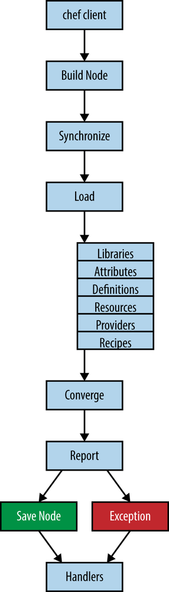
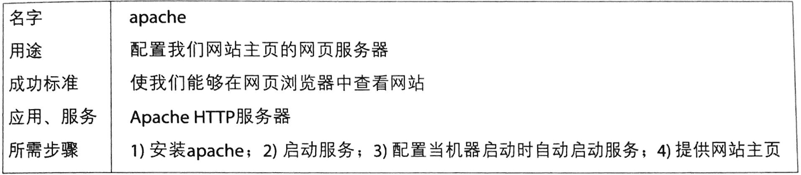
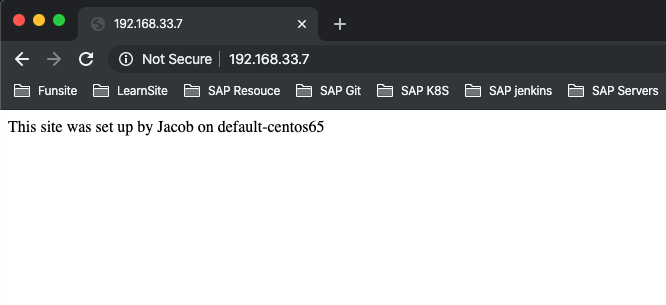

# 撰写和使用菜谱 

* 第一个菜谱：每日消息
  * 第一个菜谱：每日消息（使用`Chef`开发包）
  * `Cookbook_file`资源简介 
  * 第一个菜谱：每日消息（`Chef`客户端)
* 第一次运行`Chef`
* 剖析`Chef`运行 
* 菜谱架构
* The Four Resources You Need to Know
* Apache菜谱：手把手教你创建菜谱
	* 生成菜谱结构
	* 编辑`README.md`文件 
	* 更新`metadata.rb`
	* `Package`资源简介
	* `Service`资源简介
	* `Template`资源简介 
	* 验证达到成功标准 
* 小结 

**“菜谱”(`Cookbook`)是使用`chef`进行基础架构管理的基础组件**；

可以将其想象为些配方单的集合。每个菜谱表示配置个单位的基础架构（比如网服务器，数据库或应用程序）所需的指令集合。

配方单则是整个个过程中包含代码的小部分，菜谱包含一个或多个配方单， 也包含其他用来支持配方单运行的组件，比如存档图像或程序库。

除此之外，菜谱中存有配置信息针对平台的实现以及需要用`Chef`需要管理础架构的资源的声明 


## 第一个菜谱：每日消息 

**作为你的第一个菜谱让找们试试内我们的`CentOS 6`虚拟节点上自动化每日消息 
(`motd`)配置，让我们用`Chef`配置它在登录时候显示一条消息说明达是虑拟机节点** 


取决于你使用的是`chef`开发包还是`chef`客户端, 用来生成初始的菜语目录结构的命令有所不同

### Chef generate V.S. knife

现在，有了`Chef`开发包，我们推荐使用`chef generate`命令来管理菜语的目录结构。`knife`工具不会消失它将继续成为在生产环境下和`Chef`服务器交流的主要命行工具。

然而，`chef generate`命令拥有一些`knife`没有的功能。

* `chef generate`允许你自定义生成的配方单和菜谱模板。
* 同时`chef generate`允许你逐步创建目录结构, 每次只添加你所雳要的组件。
* **`knife`则只能一次性生成包含所有组件的目录结构** 


可能包含许多你不需要的文件，这并不会影响什么，但许多人喜欢 `chef generate`的逐步生成功能

### 第一个菜谱：每日消息（使用`Chef`开发包） 

**你将使用一个叫`chef`的工具来生成`motd`(每日消息)菜谱的初始目录结构**。

`chef`是一个和`Chef`开发包一同发布的新工具。在命令行运行`chef generate cookbook motd`命令可以创建菜谱的目录结构。`chef generate`将创建称为`motd`的菜谱主目录：

```
cd chap07

$ chef generate cookbook motd
+---------------------------------------------+
            Chef License Acceptance

Before you can continue, 1 product license
must be accepted. View the license at
https://www.chef.io/end-user-license-agreement/

License that need accepting:
  * Chef Development Kit

Do you accept the 1 product license (yes/no)?

> yes

Persisting 1 product license...
✔ 1 product license persisted.

+---------------------------------------------+
Generating cookbook motd
- Ensuring correct cookbook content
- Committing cookbook files to git

Your cookbook is ready. Type `cd motd` to enter it.

There are several commands you can run to get started locally developing and testing your cookbook.
Type `delivery local --help` to see a full list of local testing commands.

Why not start by writing an InSpec test? Tests for the default recipe are stored at:

test/integration/default/default_test.rb

If you'd prefer to dive right in, the default recipe can be found at:

recipes/default.rb
```

```
cd motd

chap07/motd/kitchen.yml

---
driver:
  name: vagrant
  provider: vmware_desktop

provisioner:
  name: chef_solo

platforms:
  - name: centos65
    driver:
      box: learningchef/centos65
      box_url: learningchef/centos65

suites:
  - name: default
    run_list:
      - recipe[motd::default]
    attributes:
```

**运行`kitches list`以确保你的`kitchen.yml`文件没有语法错误。如果命令返回错误而非以 下输出结果，就说明文件中很可能有错别字之类的错误**（是使用制表键代替空格还是没有缩进正确的空格数？) 


```
$ kitchen list
Instance          Driver   Provisioner  Verifier  Transport  Last Action    Last Error
default-centos65  Vagrant  ChefSolo     Busser    Ssh        <Not Created>  <None>
```

在`CentOS`中，要更新每日消息我们需要在节点上创建一个叫`etc/motd`的文件。


`etc/motd`文件将包含每消息的文本。我们会在菜谱中创建`motd`文件的副本, 这是`Chef`管理文件的方法。然后我们在配方单中添加代码来使菜谱中的文件被复制到相应节点的正确位置 (`/etc`目录）中 


**使用`chef generate file motd`命令在菜谱中生成`motd`文件所需的目录结构。我们只需要文件名，而不是路径**

```
$ chef generate file motd
Recipe: code_generator::cookbook_file
  * directory[/Users/i515190/Devops_sap/Chef_Doc/learningchef/chap07/motd/files] action create
    - create new directory /Users/i515190/Devops_sap/Chef_Doc/learningchef/chap07/motd/files
  * template[/Users/i515190/Devops_sap/Chef_Doc/learningchef/chap07/motd/files/motd] action create
    - create new file /Users/i515190/Devops_sap/Chef_Doc/learningchef/chap07/motd/files/motd
    - update content in file /Users/i515190/Devops_sap/Chef_Doc/learningchef/chap07/motd/files/motd from none to e3b0c4
    (diff output suppressed by config)
```
```
$ tree files
files
└── motd

0 directories, 1 file
```

**`files/motd`**

```
  _________________________________________________
  < YOU ARE ON A SIMULATED CHEF NODE ENVIRONMENT! >
   -----------------------------------------------
          \   ^__^
           \  (oo)\_______
              (__))\/\    \
                  ||----w |
                  ||     ||

```

### `Cookbook_file`资源简介 


我们要用`Chef`来帮助我们自动化`Linux`的每日消息(`motd`)。在`Linux`上，当用户登录到 系统时每日消息将在命令行中显示。每日消息是`Linux`系统管理员和用户沟通的一种方式。

你可以通过修改`/etc/motd`来更新消息。当用户成功登录`/etc/motd`文件的内容将作为当天的消息、显示出来。

`chef cookbook generate`命令创建了`recipes/default.rb`文件。根据约定，这是你的`Chef`代码的默认位置。


所有包含`Chef`代码的配方单的`.rb`文件都应位于菜谱的`recipes/`子目录中。 

现在，`recipes/default.rb`只包含一些注释，除此以外基本是空的： 

```
#
# Cookbook:: motd
# Recipe:: default
#
# Copyright:: 2019, The Authors, All Rights Reserved.
#
#
#
```

**编辑`recipes/default.rb`文件，使`Chef`在节点上更新`/etc/motd`**

```
#
# Cookbook:: motd
# Recipe:: default
#
# Copyright:: 2019, The Authors, All Rights Reserved.
#
#
#

cookbook_file "/etc/motd" do
  source "motd"
  mode "0644"
end
```

**`cookbook file`是一个`Chef`资源。`cookbook file`资源用来将菜谱中`files/`子目录下的文件传输到`Chef`管理的节点中**

**`source`定义此菜谱中`files／`子目录中源文件的名字**

### 第一个菜谱：每日消息（`Chef`客户端） 

你将使用`knife`工具来生成`motd`（每日消息）菜谱的初始目录结构。

`knife`是`Chef`的一个基本工具，随`Chef`客户端安装。

**在命令行中，运行`knife cookbook create`命令可以创建菜谱的目录结构。`knife`将创建`motd`菜谱的主目录**： 

```
$ cd motd
$ knife cookbook create motd --cookbook-path .
WARNING: No knife configuration file found
** Creating cookbook motd
** Creating README for cookbook: motd
** Creating CHANGELOG for cookbook: motd
** Creating metadata for cookbook: motd
```

```
$ cd motd
$ kitchen init --create-gemfile
      create  .kitchen.yml
      create  test/integration/default
      create  Gemfile
      append  Gemfile
      append  Gemfile
You must run `bundle install' to fetch any new gems.
```

运行`bundle install`安装`Test Kitchen`所依赖的`Ruby`程序： 

```
$ bundle install
Fetching gem metadata from https://rubygems.org/..........
Resolving dependencies...
Using mixlib-shellout (1.4.0)
Using net-ssh (2.9.1)
Using net-scp (1.2.1)
Using safe_yaml (1.0.3)
Using thor (0.19.1)
Using test-kitchen (1.2.1)
Installing kitchen-vagrant (0.15.0)
Using bundler (1.5.3)
Your bundle is complete!
Use `bundle show [gemname]` to see where a bundled gem is installed.
```

```
cd motd

chap07/motd/kitchen.yml

---
driver:
  name: vagrant
  provider: vmware_desktop

provisioner:
  name: chef_zero

platforms:
  - name: centos65
    driver:
      box: learningchef/centos65
      box_url: learningchef/centos65

suites:
  - name: default
    run_list:
      - recipe[motd::default]
    attributes:
```

**运行`kitches list`以确保你的`kitchen.yml`文件没有语法错误。如果命令返回错误而非以 下输出结果，就说明文件中很可能有错别字之类的错误**（是使用制表键代替空格还是没有缩进正确的空格数？) 


```
$ kitchen list
Instance          Driver   Provisioner  Verifier  Transport  Last Action    Last Error
default-centos65  Vagrant  ChefSolo     Busser    Ssh        <Not Created>  <None>
```

**`knife/motd/files/default/motd`**

```
 _________________________________________________
  < YOU ARE ON A SIMULATED CHEF NODE ENVIRONMENT! >
   -----------------------------------------------
          \   ^__^
           \  (oo)\_______
              (__))\/\    \
                  ||----w |
                  ||     ||
```


### `Cookbook_file`资源简介 

我们要用`Chef`来帮助自动化`Linux`的每日消息(`motd`)。在`Linux`上，当用户登录到系统 时每日消息将在命令行中显示。

每日消息是`Linux`系统管理员和用户沟通的一种方式。可以通过修改`/etc/mothd`来更新消息。

当用户成功登录时，`/etc/motd`文件的内容会作为当天的消息显示出来 `knife cookbook create`命令创建了`recipe/default.rb`文件。

根据约定，这是你的`Chef`代码的默认位置。所有包含`Chef`代码的配方单的`rb`文件都应位于菜谱的`recipe/`子目录中.

**现在`recipe/default.rb`只包含一些注释, 除此以外基本是空的**

```
#
# Cookbook:: motd
# Recipe:: default
#
# Copyright:: 2019, The Authors, All Rights Reserved.
#
``` 

**`cookbook file`是一个`Chef`资源。`cookbook file`资源用来将菜谱中`files/`子目录下的文件传输到`Chef`管理的节点中**

**`source`定义此菜谱中`files／`子目录中源文件的名字**


无论使用`chef generate cookbook`还是`knife cookook create`创建菜谱， 此后的步骤都是相同的 


## 第一次运行`Chef` 

`Chef`用数学术语"收敛"(converge)来表示通过运行`chef_client`把菜谱部署到节点并通过执行一个运行清单来将节点转化成理想的状态的过程.

这经常称为"收敛“一个节点。用`“Test Kitchen”`在节点上用`kitchen converge`命令执行一次运行． 

### 收敛简介

`Chef`可以动态调整如何将一个节点转换成理想状态需要做的事情。

比如， 如果一次`Chef`运行某种原因，中途被取消， 下次它会自劝从没完成的地万开始继续运行， 这种容错方法的关健是`Chef`用来配置节点所使用的计划完全以数据驱动， 取决于`ohai`运行后返回的结果。

另一个基于收效的工具的例子是`make`命令。它以类似的方式运行。`make`工具检查用于生成应用程序的组件的状态然后只生成未完成的部分。可以无数次运行`make`但它只做它需要做的尚未完成的部分

```
$ cd motd
$ kitchen converge default-centos65

 kitchen converge default-centos65
-----> Starting Kitchen (v2.3.3)
-----> Converging <default-centos65>...
       Preparing files for transfer
>>>>>> ------Exception-------
>>>>>> Class: Kitchen::ActionFailed
>>>>>> Message: 1 actions failed.
>>>>>>     Failed to complete #converge action: [policyfile detected, but provisioner Kitchen::Provisioner::ChefSolo doesn't support Policyfiles. Either use a different provisioner, or delete/rename /Users/i515190/Devops_sap/Chef_Doc/learningchef/chap07/motd/Policyfile.rb.] on default-centos65
>>>>>> ----------------------
>>>>>> Please see .kitchen/logs/kitchen.log for more details
>>>>>> Also try running `kitchen diagnose --all` for configuration
```

修改`kitchen.yml`

```
...
driver:
  name: vagrant
  provider: vmware_desktop

provisioner:
  name: chef_solo
...
```

```
$ kitchen converge default-centos65
-----> Starting Kitchen (v2.3.3)
-----> Converging <default-centos65>...
       Preparing files for transfer
$$$$$$ You must set your run_list in your Policyfile instead of kitchen config. The run_list in your config will be ignored.
$$$$$$ Ignored run_list: ["recipe[motd::default]"]
       Policy lock file doesn't exist, running `chef install` for Policyfile /Users/i515190/Devops_sap/Chef_Doc/learningchef/chap07/motd/Policyf
ile.rb...
       Building policy motd
       Expanded run list: recipe[motd::default]
       Caching Cookbooks...
       Installing motd >= 0.0.0 from path
       
       Lockfile written to /Users/i515190/Devops_sap/Chef_Doc/learningchef/chap07/motd/Policyfile.lock.json
       Policy revision id: 1be1d358a9f055ff7c7ad9c39551cd0731acf63e2ef470dd6eec4324ae19a384
       Preparing dna.json
       Exporting cookbook dependencies from Policyfile /var/folders/r7/nml_dsbn44gcd2jlqh7s2w940000gn/T/default-centos65-sandbox-20191125-92576-
5amqh5...
       Exported policy 'motd' to /var/folders/r7/nml_dsbn44gcd2jlqh7s2w940000gn/T/default-centos65-sandbox-20191125-92576-5amqh5
       
       To converge this system with the exported policy, run:
         cd /var/folders/r7/nml_dsbn44gcd2jlqh7s2w940000gn/T/default-centos65-sandbox-20191125-92576-5amqh5
         chef-client -z
       Removing non-cookbook files before transfer
       Preparing validation.pem
       Preparing client.rb
-----> Installing Chef install only if missing package
       Downloading https://omnitruck.chef.io/install.sh to file /tmp/install.sh
       Trying wget...
       Trying curl...
       Download complete.
       el 6 x86_64
       Getting information for chef stable  for el...
       downloading https://omnitruck.chef.io/stable/chef/metadata?v=&p=el&pv=6&m=x86_64
         to file /tmp/install.sh.3173/metadata.txt
       trying wget...
       trying curl...
       sha1     c332e5aef6cf70d1df1e1786926c474eedae1dc2
       sha256   ddb6e94a65568e6247aa335ef7d2dd69c300c9d2e2df098997b08cf9f6f0c473
       url      https://packages.chef.io/files/stable/chef/15.5.17/el/6/chef-15.5.17-1.el6.x86_64.rpm
       version  15.5.17
       downloaded metadata file looks valid...
       downloading https://packages.chef.io/files/stable/chef/15.5.17/el/6/chef-15.5.17-1.el6.x86_64.rpm
         to file /tmp/install.sh.3173/chef-15.5.17-1.el6.x86_64.rpm
       trying wget...
       trying curl...
       Comparing checksum with sha256sum...
       
       WARNING WARNING WARNING WARNING WARNING WARNING WARNING WARNING WARNING
       
       You are installing a package without a version pin.  If you are installing
       on production servers via an automated process this is DANGEROUS and you will
       be upgraded without warning on new releases, even to new major releases.
       Letting the version float is only appropriate in desktop, test, development or
       CI/CD environments.
       
       WARNING WARNING WARNING WARNING WARNING WARNING WARNING WARNING WARNING
       
       Installing chef 
       installing with rpm...
       warning: /tmp/install.sh.3173/chef-15.5.17-1.el6.x86_64.rpm: Header V4 DSA/SHA1 Signature, key ID 83ef826a: NOKEY
       Preparing...                ########################################### [100%]
          1:chef                   ########################################### [100%]
       Thank you for installing Chef Infra Client! For help getting started visit https://learn.chef.io
       Transferring files to <default-centos65>
       +---------------------------------------------+
       ✔ 2 product licenses accepted.
       +---------------------------------------------+
       Starting Chef Infra Client, version 15.5.17
       Creating a new client identity for default-centos65 using the validator key.
       Using policy 'motd' at revision '1be1d358a9f055ff7c7ad9c39551cd0731acf63e2ef470dd6eec4324ae19a384'
       resolving cookbooks for run list: ["motd::default@0.1.0 (eca9650)"]
       Synchronizing Cookbooks:
         - motd (0.1.0)
       Installing Cookbook Gems:
       Compiling Cookbooks...
       Converging 1 resources
       Recipe: motd::default
         * cookbook_file[/etc/motd] action create
           - update content in file /etc/motd from a7620c to 07a3b1
           --- /etc/motd        2014-12-04 21:39:40.303256605 +0000
           +++ /etc/.chef-motd20191125-3298-14tijbq     2019-11-25 09:40:39.350798262 +0000
           @@ -1,2 +1,9 @@
           -Welcome to your Packer-built virtual machine.
           +  _________________________________________________
           +  < YOU ARE ON A SIMULATED CHEF NODE ENVIRONMENT! >
           +   -----------------------------------------------
           +          \   ^__^
           +           \  (oo)\_______
           +              (__))\/\    \
           +                  ||----w |
           +                  ||     ||
       
       Running handlers:
       Running handlers complete
       Chef Infra Client finished, 1/1 resources updated in 01 seconds
       Downloading files from <default-centos65>
       Finished converging <default-centos65> (0m30.44s).
-----> Kitchen is finished. (0m30.81s)
```

说明：如果需要，`kitchen converge`会自动运行`kitchen create`和`kitchen setup`。在以上输出中，注意创建了虚拟机，然后`chef-client`在节点上被安装。这表示`Test Kitchen`运行了这两个步骤 

### 验证结果 

使用`kitchen login`来验证新每日消息被安装到节点上 

```
$ kitchen list
Instance          Driver   Provisioner  Verifier  Transport  Last Action  Last Error
default-centos65  Vagrant  ChefZero     Busser    Ssh        Converged    <None>
```

```
$ kitchen login default-centos65
Last login: Mon Nov 25 09:40:36 2019 from 172.16.72.2
  _________________________________________________
  < YOU ARE ON A SIMULATED CHEF NODE ENVIRONMENT! >
   -----------------------------------------------
          \   ^__^
           \  (oo)\_______
              (__))\/\    \
                  ||----w |
                  ||     ||
[vagrant@default-centos65 ~]$ 
```

```
[vagrant@default-centos65 ~]$ exit
logout
Connection to 127.0.0.1 closed.
```
```
$ kitchen destroy default-centos65
-----> Starting Kitchen (v2.3.3)
-----> Destroying <default-centos65>...
       ==> default: Stopping the VMware VM...
       ==> default: Deleting the VM...
       Vagrant instance <default-centos65> destroyed.
       Finished destroying <default-centos65> (0m18.75s).
-----> Kitchen is finished. (0m19.17s)
```

## 剖析Chef运行 

`kitchen converge`从宿主机器命令测试节点执行一次`chef`运行看起很方便! 你可以使用`kitche login`登录到侧试节点然后看看各种命令， 但`kitchen converge` 被设计为在开发菜谱时快速给出的反馈

**在生产环境中`chef-client`通常件为服务在背后持续定期运行， 比如15分钟执行一次`chef`随行．它查看服务器上有没有任何菜谱的改变或新的运行清单**。


**1. 开始运行`Chef`客户端** 

`chef-client` 进程在远程节点启动。 进程可能由一个服务， `cron`任务或某用户手动启 动。`chef-client`进程负责在目标节点上运行包含`Chef`代码的配方单的菜谱 

**2. 创建节点**

`chef-client` 进程在内存中构建`node`（节点）对象。它运行`ohai`并收集所有关于这个 节点的自动属性（比如主机名、FQDN平台、用户等）。 

**3.同步**

运行清单被发送到节点， 运行清单包含要在目标节点执行的配方单的清单， 运行清单是一个有序的、完全展开且要在目标节点运行的配方单清单. 运行清单所需的菜谱的`URL`也同样被下载到节点上。 目标节点将这些所需的菜谱下载井缓存到一个本地文件存储中。 

**4.加载**

菜谱和`Ruby`组件在此步骤被加载。菜谱级别的属性在此与第2步中`ohai`生成的自动属性相结合菜谱的不同组件按以下顺序加载 

* **库(`Libries`)**加载每个菜谱中`Libries/`目录下的所有文件， 这样语言扩展或更改将会在余下的`Chef`运行步骤中可用 
* **属性（`Attributes`)**加载每个菜谱中`attributes/`目录下的所有文件井与`ohai`属性结合
* **定义(`Definitions`)**加载每个菜谱中`definitions/`录下的所有文件。这些文件定义在配方单中用到的类似资源的可重用代码, 因此必须在加载配方单前加载.
* **资源(`Resource`)** 加载每个菜谱中(`resources/`)目录下的所有文件。资源必须在配方单之前加载因为配方单会使用资源代码
* **提供者(`Providers`)**加载每个菜谱中(`providers/`)目录下的所有文件，以便资源引用合适的提供者。 
* **配方单（`Recipes`)**加载执行每个菜谱中`recipes/`目录下的所有文件．在这个阶段， 配方单井未被执行来将节点转换为理想配置， 配方单中`Ruby`代码编译井转化成最后将在节点上执行的配方单， 每个资源也在此时被加人到资源集合中.

**5．收敛**

收敛阶段则是每次`Chef`运行中最重要的阶段。在这个时候`Chef`配方单在目标节点执行并改变节点到理想状态，比如安装尚未安装的程序包、复制渲染好的模板或文件到目标位置等等。 

**6．报告**
 
如果`Chef`客户端运行成功，节点会保存任何新的属性值；如果失败，客户端会抛出异常而节点对象也不会被更新，通知机制和异常处理器将运行来通知工作人员，比如发送`email`、发布消息到`IRC`或通知如`PagerDuty`之类的值班系统。 


我们通过运行清单来指定在某个节点需要运行的配方单。配方单在运行清单中以以下格式指定：

`recipe['＜菜谱名字＞::＜配方单名字＞']`，

比如`recipe['motd::default']`。

**当`Chef`代码在一个菜谱中的默认配方单文件`recipes/default.rb`时，配方单的名字在运行清单中可以省略，`Chef`会默认在菜谱中寻找`default`配方单。因此指定`recipe['motd']`等同于`recipe['motd::default']`。**注意，在运行清单中指定配方单时不需要指定`.rb`扩展名。 

在使用`Test Kitchen`测试运行`Chef`时，运行清单在`kitchen.yml`指定，然后通过`-o`参数在命令行传递给`chef-client`。

在生产环境中，运行清单作为节点的属性保存在`Chef`服务器中。 

我们刚刚描述了当你运行`kitchen converge`（或chef-client）时`Chef`一次运行过程中 都做了什么。




## 菜谱架构

`Chef`命令可以生成初始目录和文件

```
chef generate cookbook
```

```
knife cookbook create
```

基本的菜单目录包含以下文件

```
cookbook
├── .kitchen.yml
├── README.md
├── attributes
│    └── default/
├── chefignore
├── files/
│    └── default/
├── metadata.rb
├── recipes/
│    └── default.rb
└── templates/
    └── default/
```

### `\.kitchen.yml`

`kitchen.yml`文件是`Test Kitchen`的`YAML`格式的配置文件。你可以用`Test Kitchen`来创建沙盒测试环境，以便在开发过程中验证你的菜谱。 


### `README.md`

每个菜谱都应该附有文档。`README.md`是保存这些文档的`markdown`格式的纯文本文件。`Markdown`是一个简易的为文本文件添加格式的方法，因此你可以选择将文档转换为`HTML`。对于存储`README`, `Markdown`是一个非常流行的文件格式，它的可读性非常强，你不需要各种`HTML`标记和格式指令。很多常用的版本控制工具都会以`HTML`渲染`README.md`，包括`GitHub `、`GitLab`、`Stash`、`Bitbuckets`

### `attributes`

你可以在菜谱中提供自定义的属比来补充或搜盖`ohai`在目标节点上所生成的自动属性。属性经常用来定义应用程序分布路径、基于特定平台的值或在某个节点需要安装的软件的版本等。`attributes／`目录可以包含多个定义属胜的`rb`文件。如果包含了多个文件，**它们会按照字母表顺序执行**。如果只需要定义一个属性文件，你可以使用默认的文件名`default.rb`或任何意义上符合其用途的文件名 

### `chefignore`

此文件包含一个被`Chef`忽略的文件列表。当使用`Chef`服务器并将本地菜谱上传到服务器的时候，**这个列表中的文件将被忽略**。

默认隋况下，菜谱中的所有文件都会上传。然而，类似编辑器或版本控制系统的临时文件则没必要上传到`Chef`服务器，因此将它们列在`chefignore`文件中则可避免上传。 


### `files`

**`files`文件夹是此菜谱中集中存储将要分发到目标节点的文件的地方**。文件可以为纯文本、图像、zip文件等。**这些文件可以通过`cookbook_file`资源被分发到目标节点。`files／`目录下的文件结构控制是否将特定文件分发到特定节点。** 

**要分发到所有节点的文件都会放在`files/default/`子目录内**。 

### `metadata.rb`

`metadata.rb`文件包含该菜谱的所有元数据。每个菜谱必须有一个元数据文件 `metadata.rb` 来包含菜谱的名字、版本、依赖以及其他信息。

### `recipes`

`recipe`目录包含`Chef`配方单。配方单文件包含Chef代码。此目录中包含多个`.rb`配方单文件。

根据约定，默认的配方单文件称为`default.rb`。在每个节点上运行该节点的运行清单中指定的配方单。**运行清单存储在`Chef`务器中，`kitchen.yml`文件中（测试环境）或可作为参数传递给`＋chef-clfent＋`命令。**

### `templates`

`templates`目录存储`Chef`的模板。`templates`目录和`files`目录类似目的都是将文件分发到目标节点上。

然而，`templates`中的文件是嵌入式`Ruby`模板文件`(ERB)`，此类文件是可包含`Ruby`代码的纯文本文件，在复制到目标节点之前，文件中的`Ruby`代码被执行并渲染成相应的文件内容。

当你需要被分发到目标节点的文件中包含在不同情况下需要渲染成不同内容的情况下，你则可以用模板来完成这任务。`templates`目录和`files`目录使用一样的子目录命名方法来控制复制哪些文件到哪些特定的节点。 

对于高级用户，`Chef`菜谱包含一些其他组件可以使用，它们是`Berksfiie`、`definitions`、 `libraries`、 `providers` 和`resource`。

## The Four Resources You Need to Know

### package 

使用正确的安装包管理器(yum、 apt、 pacman等等）来安装一个程序包。 

### service 

管理用`package`安装的服务。 

### `Cookbook_file` 

从菜谱中复制文件到节点的制定的目录。我们在本章前面每日消息例子中展示了使用cookbook `file`资源来管理节点上的`／etc/motd`文件。 

### template 

类似`cookbook_file`的资源，允许你复制文件到目标节点，而由于文件为嵌入式`Ruby`模板，所以你可以用变量来控制复制到节点的文件内容。 

 

## Apache菜谱：手把手教你创建菜谱 

* 生成菜谱结构
* 编辑`README.md`文件 
* 更新`metadata.rb`
* `Package`资源简介
* `Service`资源简介
* `Template`资源简介 
* 验证达到成功标准 



### 生成菜谱结构 

**Chef开发包**

```
$ chef generate cookbook apache
$ cd apache
```

**Chef客户端**

```
$ knife cookbook create apache --cookbook-path .
$ cd apache
$ kitchen init --create-gemfile
$ bundle install
```

```
$ chef generate cookbook apache
Generating cookbook apache
- Ensuring correct cookbook content
- Committing cookbook files to git

Your cookbook is ready. Type `cd apache` to enter it.

There are several commands you can run to get started locally developing and testing your cookbook.
Type `delivery local --help` to see a full list of local testing commands.

Why not start by writing an InSpec test? Tests for the default recipe are stored at:

test/integration/default/default_test.rb

If you'd prefer to dive right in, the default recipe can be found at:

recipes/default.rb
```

`apache/kitchen.yml`

```
---
driver:
  name: vagrant
  provider: vmware_desktop

provisioner:
  name: chef_zero

platforms:
  - name: centos65
    driver:
      box: learningchef/centos65
      box_url: learningchef/centos65

suites:
  - name: default
    run_list:
      - recipe[apache::default]
    attributes:
```

运行清单`recipe[apache::default］`表示`apache`菜谱中。`recipe/default.rb`文件中的`Chef`代码将在我们运行`kitchen cenverge`时在测试节点上由`chef-client`命令运行． 

```
 kitchen list
Instance          Driver   Provisioner  Verifier  Transport  Last Action    Last Error
default-centos65  Vagrant  ChefZero     Busser    Ssh        <Not Created>  <None>
```

### 编辑`README.md`文件 

基于你在前面所定义的前提条， 你应该使用`README.md`文件来驱动整个菜谱的开发。

`apache/README.md`

```
# apache cookbook

This cookbook installs and configures a simple web site using the Apache HTTPD server.

Requirements
============
Supports only CentOS or other RHEL variants that use the +httpd+ package.

Usage
=====
Add `apache` to your node's `run_list`.

Testing
=======
A `.kitchen.yml` file is provided.  Run +kitchen converge+ to verify this cookbook.
```

### 更新`metadata.rb`

这是`Chef`生成的`metadata.rb`

```
name             'apache'
maintainer       ''
maintainer_email ''
license          ''
description      'Installs/Configures apache'
long_description 'Installs/Configures apache'
version          '0.1.0'
```


**注意`name`中的`apache`字符串。`Chef`使用这个名字来匹配运行请单中的菜谱的名字而不是通过菜谱文件夹的名字。**

但为了便于日后管理建议你将菜谱的文件夹命名为和这里指定的`name`一样的名字虽然你并不一定需要这样做 


**`apache/metadata.rb`**

```
name             'apache'
maintainer       'Jacob Xi'
maintainer_email 'jacobxi@jax.com'
license          'MIT'
description      'Installs/Configures apache'
long_description 'Installs/Configures apache'
version          '0.1.0'
chef_version     '>= 14.0'
```

### `Package`资源简介 

目前为止，我们还没有为我们的菜谱撰写任何配方单，在写代码之前，让我们运行第一次`kitchen converge`确保目前我们编辑过的文件中没有语法或格式错误。

**我们建议在撰写菜谱替时经常运行`kitchen converge`来验证进度**。

```
$ kitchen list
Instance          Driver   Provisioner  Verifier  Transport  Last Action    Last Error
default-centos65  Vagrant  ChefZero     Busser    Ssh        <Not Created>  <None>

 kitchen converge default-centos65

-----> Starting Kitchen (v2.3.3)
-----> Creating <default-centos65>...
       Bringing machine 'default' up with 'vmware_desktop' provider...
       ==> default: Cloning VMware VM: 'learningchef/centos65'. This can take some time...
       ==> default: Checking if box 'learningchef/centos65' version '1.0.7' is up to date...
       ==> default: Verifying vmnet devices are healthy...
       ==> default: Preparing network adapters...
       WARNING: The VMX file for this box contains a setting that is automatically overwritten by Vagrant
       WARNING: when started. Vagrant will stop overwriting this setting in an upcoming release which may
       WARNING: prevent proper networking setup. Below is the detected VMX setting:
       WARNING: 
       WARNING:   ethernet0.pcislotnumber = "33"
       WARNING: 
       WARNING: If networking fails to properly configure, it may require this VMX setting. It can be manually
       WARNING: applied via the Vagrantfile:
       WARNING: 
       WARNING:   Vagrant.configure(2) do |config|
       WARNING:     config.vm.provider :vmware_desktop do |vmware|
       WARNING:       vmware.vmx["ethernet0.pcislotnumber"] = "33"
       WARNING:     end
       WARNING:   end
       WARNING: 
       WARNING: For more information: https://www.vagrantup.com/docs/vmware/boxes.html#vmx-whitelisting
       ==> default: Starting the VMware VM...
       ==> default: Waiting for the VM to receive an address...
       ==> default: Forwarding ports...
           default: -- 22 => 2222
       ==> default: Waiting for machine to boot. This may take a few minutes...
           default: SSH address: 127.0.0.1:2222
           default: SSH username: vagrant
           default: SSH auth method: private key
           default: 
           default: Vagrant insecure key detected. Vagrant will automatically replace
           default: this with a newly generated keypair for better security.
           default: 
           default: Inserting generated public key within guest...
           default: Removing insecure key from the guest if it's present...
           default: Key inserted! Disconnecting and reconnecting using new SSH key...
       ==> default: Machine booted and ready!
       ==> default: Setting hostname...
       ==> default: Configuring network adapters within the VM...
       ==> default: Machine not provisioned because `--no-provision` is specified.
       [SSH] Established
       Vagrant instance <default-centos65> created.
       Finished creating <default-centos65> (0m46.41s).
-----> Converging <default-centos65>...
       Preparing files for transfer
$$$$$$ You must set your run_list in your Policyfile instead of kitchen config. The run_list in your config will be ignored.
$$$$$$ Ignored run_list: ["recipe[apache::default]"]
       Policy lock file doesn't exist, running `chef install` for Policyfile /Users/i515190/Devops_sap/Chef_Doc/learningchef/chap07/apache/Policyfile.rb...
       Building policy apache
       Expanded run list: recipe[apache::default]
       Caching Cookbooks...
       Installing apache >= 0.0.0 from path
       
       Lockfile written to /Users/i515190/Devops_sap/Chef_Doc/learningchef/chap07/apache/Policyfile.lock.json
       Policy revision id: ae351b7b70676a3b57cf2a87805c9c226677d50b224659443baa28550f06a258
       Preparing dna.json
       Exporting cookbook dependencies from Policyfile /var/folders/r7/nml_dsbn44gcd2jlqh7s2w940000gn/T/default-centos65-sandbox-20191127-13563-w35sjf...
       Exported policy 'apache' to /var/folders/r7/nml_dsbn44gcd2jlqh7s2w940000gn/T/default-centos65-sandbox-20191127-13563-w35sjf
       
       To converge this system with the exported policy, run:
         cd /var/folders/r7/nml_dsbn44gcd2jlqh7s2w940000gn/T/default-centos65-sandbox-20191127-13563-w35sjf
         chef-client -z
       Removing non-cookbook files before transfer
       Preparing validation.pem
       Preparing client.rb
-----> Installing Chef install only if missing package
       Downloading https://omnitruck.chef.io/install.sh to file /tmp/install.sh
       Trying wget...
       Trying curl...
       Download complete.
       el 6 x86_64
       Getting information for chef stable  for el...
       downloading https://omnitruck.chef.io/stable/chef/metadata?v=&p=el&pv=6&m=x86_64
         to file /tmp/install.sh.3168/metadata.txt
       trying wget...
       trying curl...
       sha1     c332e5aef6cf70d1df1e1786926c474eedae1dc2
       sha256   ddb6e94a65568e6247aa335ef7d2dd69c300c9d2e2df098997b08cf9f6f0c473
       url      https://packages.chef.io/files/stable/chef/15.5.17/el/6/chef-15.5.17-1.el6.x86_64.rpm
       version  15.5.17
       downloaded metadata file looks valid...
       downloading https://packages.chef.io/files/stable/chef/15.5.17/el/6/chef-15.5.17-1.el6.x86_64.rpm
         to file /tmp/install.sh.3168/chef-15.5.17-1.el6.x86_64.rpm
       trying wget...
       trying curl...
       Comparing checksum with sha256sum...
       
       WARNING WARNING WARNING WARNING WARNING WARNING WARNING WARNING WARNING
       
       You are installing a package without a version pin.  If you are installing
       on production servers via an automated process this is DANGEROUS and you will
       be upgraded without warning on new releases, even to new major releases.
       Letting the version float is only appropriate in desktop, test, development or
       CI/CD environments.
       
       WARNING WARNING WARNING WARNING WARNING WARNING WARNING WARNING WARNING
       
       Installing chef 
       installing with rpm...
       warning: /tmp/install.sh.3168/chef-15.5.17-1.el6.x86_64.rpm: Header V4 DSA/SHA1 Signature, key ID 83ef826a: NOKEY
       Preparing...                ########################################### [100%]
          1:chef                   ########################################### [100%]
       Thank you for installing Chef Infra Client! For help getting started visit https://learn.chef.io
       Transferring files to <default-centos65>
       +---------------------------------------------+
       ✔ 2 product licenses accepted.
       +---------------------------------------------+
       Starting Chef Infra Client, version 15.5.17
       Creating a new client identity for default-centos65 using the validator key.
       Using policy 'apache' at revision 'ae351b7b70676a3b57cf2a87805c9c226677d50b224659443baa28550f06a258'
       resolving cookbooks for run list: ["apache::default@0.1.0 (2230740)"]
       Synchronizing Cookbooks:
         - apache (0.1.0)
       Installing Cookbook Gems:
       Compiling Cookbooks...
       Converging 0 resources
       
       Running handlers:
       Running handlers complete
       Chef Infra Client finished, 0/0 resources updated in 01 seconds
       Downloading files from <default-centos65>
       Finished converging <default-centos65> (0m31.15s).
-----> Kitchen is finished. (1m18.05s)
```

**Now, let’s get to some coding**

**`/apache/recipes/default.rb`**

```
#
# Cookbook:: apache
# Recipe:: default
#
# Copyright:: 2019, The Authors, All Rights Reserved.

package "httpd" do
    action :install
end
```

```
$ kitchen converge default-centos65
-----> Starting Kitchen (v2.3.3)
-----> Converging <default-centos65>...
       Preparing files for transfer
$$$$$$ You must set your run_list in your Policyfile instead of kitchen config. The run_list in your config will be ignored.
$$$$$$ Ignored run_list: ["recipe[apache::default]"]
       Installing cookbooks for Policyfile /Users/i515190/Devops_sap/Chef_Doc/learningchef/chap07/apache/Policyfile.rb using `chef install`
       Installing cookbooks from lock
       Installing apache 0.1.0
       Preparing dna.json
       Exporting cookbook dependencies from Policyfile /var/folders/r7/nml_dsbn44gcd2jlqh7s2w940000gn/T/default-centos65-sandbox-20191127-1391
3-nepxu...
       Exported policy 'apache' to /var/folders/r7/nml_dsbn44gcd2jlqh7s2w940000gn/T/default-centos65-sandbox-20191127-13913-nepxu
       
       To converge this system with the exported policy, run:
         cd /var/folders/r7/nml_dsbn44gcd2jlqh7s2w940000gn/T/default-centos65-sandbox-20191127-13913-nepxu
         chef-client -z
       Removing non-cookbook files before transfer
       Preparing validation.pem
       Preparing client.rb
-----> Chef installation detected (install only if missing)
       Transferring files to <default-centos65>
       Starting Chef Infra Client, version 15.5.17
       Using policy 'apache' at revision '2a6f5101557a960f0f6da6a165f747dded595bdeb7cb278fff428aff4d9ee4fa'
       resolving cookbooks for run list: ["apache::default@0.1.0 (da7e087)"]
       Synchronizing Cookbooks:
         - apache (0.1.0)
       Installing Cookbook Gems:
       Compiling Cookbooks...
       Converging 1 resources
       Recipe: apache::default
         * yum_package[httpd] action install
           - install version 0:2.2.15-69.el6.centos.x86_64 of package httpd
       
       Running handlers:
       Running handlers complete
       Chef Infra Client finished, 1/1 resources updated in 28 seconds
       Downloading files from <default-centos65>
       Finished converging <default-centos65> (0m33.62s).
-----> Kitchen is finished. (0m34.07s)
```

```
$ kitchen login default-centos65
Last login: Wed Nov 27 03:00:22 2019 from 172.16.72.2
Welcome to your Packer-built virtual machine.
[vagrant@default-centos65 ~]$ rpm -q httpd
httpd-2.2.15-69.el6.centos.x86_64
[vagrant@default-centos65 ~]$ exit
logout
Connection to 127.0.0.1 closed.
```

像我们看到的，`httpd`服务被成功安装！`rpm -q`命令查询`rpm`程序包管理器数据库来看系 统中是否存在某个程序包。 


如果你阅读`Chef`官方`package`资源文档[Chef documentation on the package resource](https://docs.chef.io/resource_package.html), 就知道`package`基于`ohai`返回的`platform`和`platform_family`结果调用不同的提供者(`providers`)，在我们的例子中，因为`platform`是`rhel`，所以`Chef`使用的是`yum-package`提供者。

 
如果你阅读`yum_package`资源和提供者的官方文档[documentation on the yum_package provider](https://docs.chef.io/resource_yum_package.html)，你会注意到四个可以执行的动作：`:install`. `:upgrade`. `:remove`和`:purge`。

**因为`:install`是默认值，所以在我们的配方单中无需明确指出，更改配方单，删除多余的代码。** 
 
```
#
# Cookbook:: apache
# Recipe:: default
#
# Copyright:: 2019, The Authors, All Rights Reserved.

package "httpd"
```


### `Service`资源简介 

接下来，让我们使用`service`资源来启动`httpd`服务并使其在系统启动时自动启动。 

**`service`资源可以用`:start`动作来启动一个服务，并可用`:enable`动作在系统启动时启动服务。**
 
**你可以用数组将多个动作传递给`service`资源。我们讨论过数组的概念，即以逗号间隔，用中括号`("[]")`定义的的列表** 


```
#
# Cookbook:: apache
# Recipe:: default
#
# Copyright:: 2019, The Authors, All Rights Reserved.

package "httpd" do
    action :install
end

service "httpd" do
    action [ :enable, :start ]
end
```


```
$ kitchen converge default-centos65
-----> Starting Kitchen (v2.3.3)
-----> Converging <default-centos65>...
       Preparing files for transfer
$$$$$$ You must set your run_list in your Policyfile instead of kitchen config. The run_list in your config will be ignored.
$$$$$$ Ignored run_list: ["recipe[apache::default]"]
       Installing cookbooks for Policyfile /Users/i515190/Devops_sap/Chef_Doc/learningchef/chap07/apache/Policyfile.rb using `chef install`
       Installing cookbooks from lock
       Installing apache 0.1.0
       Preparing dna.json
       Exporting cookbook dependencies from Policyfile /var/folders/r7/nml_dsbn44gcd2jlqh7s2w940000gn/T/default-centos65-sandbox-20191127-14392-nrtm03...
       Exported policy 'apache' to /var/folders/r7/nml_dsbn44gcd2jlqh7s2w940000gn/T/default-centos65-sandbox-20191127-14392-nrtm03
       
       To converge this system with the exported policy, run:
         cd /var/folders/r7/nml_dsbn44gcd2jlqh7s2w940000gn/T/default-centos65-sandbox-20191127-14392-nrtm03
         chef-client -z
       Removing non-cookbook files before transfer
       Preparing validation.pem
       Preparing client.rb
-----> Chef installation detected (install only if missing)
       Transferring files to <default-centos65>
       Starting Chef Infra Client, version 15.5.17
       Using policy 'apache' at revision '51fca2941ea10db0a90f494d632149f09cdbd4828bb269bf0d0612cfe4036553'
       resolving cookbooks for run list: ["apache::default@0.1.0 (0444f5c)"]
       Synchronizing Cookbooks:
         - apache (0.1.0)
       Installing Cookbook Gems:
       Compiling Cookbooks...
       Converging 2 resources
       Recipe: apache::default
         * yum_package[httpd] action install (up to date)
         * service[httpd] action enable
           - enable service service[httpd]
         * service[httpd] action start
           - start service service[httpd]
       
       Running handlers:
       Running handlers complete
       Chef Infra Client finished, 2/3 resources updated in 01 seconds
       Downloading files from <default-centos65>
       Finished converging <default-centos65> (0m7.13s).
-----> Kitchen is finished. (0m7.61s
```

```
$ kitchen login default-centos65
Last login: Wed Nov 27 03:13:59 2019 from 172.16.72.2
Welcome to your Packer-built virtual machine.
[vagrant@default-centos65 ~]$ chkconfig --list httpd | grep 3:o
httpd           0:off   1:off   2:on    3:on    4:on    5:on    6:off

[vagrant@default-centos65 ~]$ service httpd status
httpd dead but subsys locked

[vagrant@default-centos65 ~]$ sudo service httpd status
httpd (pid  3760) is running...
```

**In our grep statement, we verified that the service is set to be onfor runlevel 3.**

### `Template`资源简介 

我们终通过生成网站需要的内容的文件来展示如何使用`template`资源。 

**`template`资源和`cookbook_file`都在目标节点上创建文件**。

然而，它拥有额外的功能可以在源文件里包含变量或其他`Ruby`逻辑控制写出目标节点的文件的内容。它的格式是嵌入式`ruby`(ERB).

```
#
# Cookbook:: apache
# Recipe:: default
#
# Copyright:: 2019, The Authors, All Rights Reserved.

package "httpd" do
    action :install
end

service "httpd" do
    action [ :enable, :start ]
end

template "/var/www/html/index.html" do
    source 'index.html.erb'
    mode '0644'
end
```

默认情况下, `httpd` 服务器在`/var/www/html`目录下寻找网页文件。默认网站的文件一般 为`/var/www/html/index.html`。文件需要为全局可读权限。和`file`资源相比这里多出来 的是`source`属性。

**`source`属性指定包含`ERB`语句的模板的源文件**。

在菜谱中， 模板在`template`子目录中, 和`files`目录拥有同样的子目录结构的约定。因此如果要将模板渲染到所有应用该菜谱的节点上确保这些模板位于`templates/default`子目录内。

### `default`子目录是用来做什么的 

`files/default`和`template/default`中的`default`子目录完竟是干什么用的，

`Chef`允许你在菜谱中根据目标节点的平台指定不同的文件。`Chef`要你在`files`或`templates` 目录下创建子目录来选行过滤。可

以通过以下子目录命名格式过滤： 

* 节点的主机名（比如`foo.bar.com`) 
* 节点的平台版木（比如`redhat-6.5.1`) 
* 节点的平台部分版本（比如`redhat-6.5`和`redhat-6`) 
* 节点的平台（比如`redhat`) 
* default 

在大多数时候都只用`default`作为子目录名表示其中的又件或模板将被复制到所有应用此菜谱的节点。 


让我们为`index.html`文件创建一个`ERB`模板。

根据约定`ERB`模板需要有`.erb`扩展名。当你使用`Chef`开发包时通过运行：

```
chef generate template index.html
```

它会自动帮你创建模板文件`template/default/index.html.erb`并使用正确的扩展名、如果使用`Chef`客户端，则必须手动创建这个文件。 

* `Chef`开发包

```
chef generate tempalte index.html
```

* `Chef`客户端

```
touch templates/default/index.html.erb
```

```

[chap07/apache]$ chef generate template index.html
Recipe: code_generator::template
  * directory[/Users/i515190/Devops_sap/Chef_Doc/learningchef/chap07/apache/templates] action create
    - create new directory /Users/i515190/Devops_sap/Chef_Doc/learningchef/chap07/apache/templates
  * template[/Users/i515190/Devops_sap/Chef_Doc/learningchef/chap07/apache/templates/index.html.erb] action create
    - create new file /Users/i515190/Devops_sap/Chef_Doc/learningchef/chap07/apache/templates/index.html.erb
    - update content in file /Users/i515190/Devops_sap/Chef_Doc/learningchef/chap07/apache/templates/index.html.erb from none to e3b0c4
    (diff output suppressed by config)
```

**`/apache/templates/default/index.hmtl.erb`**

```
This site was set up by Jacob on <%= node['hostname'] %>
```


在ERB文件里，当Chef看到包含在`＜％=`和`％＞`中间的语句时，`Chef`会去执行其中的变量并将它的值渲染在文件内容中替代这个变量，

* 比如以下的`index.html.erb`文件中的`＜%= node['hostname'] ％＞`变量。
* `Chef`读取`node['hostname']`变量的值，并以其替换`＜％= node['hostname'] %＞`的内容。


```
$ kitchen converge default-centos65
-----> Starting Kitchen (v2.3.3)
-----> Converging <default-centos65>...
       Preparing files for transfer
$$$$$$ You must set your run_list in your Policyfile instead of kitchen config. The run_list in your config will be ignored.
$$$$$$ Ignored run_list: ["recipe[apache::default]"]
       Installing cookbooks for Policyfile /Users/i515190/Devops_sap/Chef_Doc/learningchef/chap07/apache/Policyfile.rb using `chef install`
       Installing cookbooks from lock
       Installing apache 0.1.0
       Preparing dna.json
       Exporting cookbook dependencies from Policyfile /var/folders/r7/nml_dsbn44gcd2jlqh7s2w940000gn/T/default-centos65-sandbox-20191127-1580
6-1t9jy6n...
       Exported policy 'apache' to /var/folders/r7/nml_dsbn44gcd2jlqh7s2w940000gn/T/default-centos65-sandbox-20191127-15806-1t9jy6n
       
       To converge this system with the exported policy, run:
         cd /var/folders/r7/nml_dsbn44gcd2jlqh7s2w940000gn/T/default-centos65-sandbox-20191127-15806-1t9jy6n
         chef-client -z
       Removing non-cookbook files before transfer
       Preparing validation.pem
       Preparing client.rb
-----> Chef installation detected (install only if missing)
       Transferring files to <default-centos65>
       Starting Chef Infra Client, version 15.5.17
       Using policy 'apache' at revision '13bba8f1762da2368761cab02339f8d3234f7cfcb49f7d77c4a7736cf8e72c71'
       resolving cookbooks for run list: ["apache::default@0.1.0 (488d5f6)"]
       Synchronizing Cookbooks:
         - apache (0.1.0)
       Installing Cookbook Gems:
       Compiling Cookbooks...
       Converging 3 resources
       Recipe: apache::default
         * yum_package[httpd] action install (up to date)
         * service[httpd] action enable (up to date)
         * service[httpd] action start (up to date)
         * template[/var/www/html/index.html] action create
           - create new file /var/www/html/index.html
           - update content in file /var/www/html/index.html from none to bb8b36
           --- /var/www/html/index.html 2019-11-27 06:12:38.679041804 +0000
           +++ /var/www/html/.chef-index20191127-4063-1u05qd.html       2019-11-27 06:12:38.678041799 +0000
           @@ -1 +1,2 @@
           +This site was set up by Jacob on default-centos65
           - change mode from '' to '0644'
       
       Running handlers:
       Running handlers complete
       Chef Infra Client finished, 1/4 resources updated in 01 seconds
       Downloading files from <default-centos65>
       Finished converging <default-centos65> (0m7.04s).
-----> Kitchen is finished. (0m7.52s)
```

```
$ kitchen login default-centos65
Last login: Wed Nov 27 06:12:35 2019 from 172.16.72.2
Welcome to your Packer-built virtual machine.

[vagrant@default-centos65 ~]$ more /var/www/html/index.html
This site was set up by Jacob on default-centos65

[vagrant@default-centos65 ~]$ curl localhost
This site was set up by Jacob on default-centos65

[vagrant@default-centos65 ~]$ exit
logout
Connection to 127.0.0.1 closed.
```

### 验证达到成功标准 

要使宿住机器能够访问在测试节点上托管的网站， 需要给侧试节点分配一个静态的`IP`地址。可以通过编辑`kitchen.yml`来设定测试节点的`IP`地址。

```
driver:
  network:
  - ["private_network", {ip: "192.168.33.7"}]
```

The static IP address should be chosen from the TCP/IP reserved private address space that does not conflict with other machines on the same network. The IP address `192.168.33.7` should work for nearly everyone, as most routers don’t use this subnet by default, so modify your `kitchen.yml`

```
---
driver:
  name: vagrant
  provider: vmware_desktop

provisioner:
  name: chef_zero

platforms:
  - name: centos65
    driver:
      box: learningchef/centos65
      box_url: learningchef/centos65
      network:
      - ["private_network", {ip: "192.168.33.7"}]

suites:
  - name: default
    run_list:
      - recipe[apache::default]
    attributes:
```

不幸的是，`Test Kitchen`只在执行`＋kitchen create＋`创建沙盒环境时应用．`kitchen.yml`中的网络设定。

而我们已经创建了沙盒环境。我们需要运行`+kitchen destroy+`删除现有的沙盒环境，然后再运行`＋kitchen converge+`，所以它会创建一个新的沙盒环境。否则`Test Kitchen`会忽略我们刚刚加到`kitchen.yml`网络设定： 

```
$ kitchen destroy default-centos65

$ kitchen create default-centos65
-----> Starting Kitchen (v2.3.3)
-----> Creating <default-centos65>...
       Bringing machine 'default' up with 'vmware_desktop' provider...
       ==> default: Cloning VMware VM: 'learningchef/centos65'. This can take some time...
       ==> default: Checking if box 'learningchef/centos65' version '1.0.7' is up to date...
       ==> default: Verifying vmnet devices are healthy...
       ==> default: Preparing network adapters...
       WARNING: The VMX file for this box contains a setting that is automatically overwritten by Vagrant
       WARNING: when started. Vagrant will stop overwriting this setting in an upcoming release which may
       WARNING: prevent proper networking setup. Below is the detected VMX setting:
       WARNING: 
       WARNING:   ethernet0.pcislotnumber = "33"
       WARNING: 
       WARNING: If networking fails to properly configure, it may require this VMX setting. It can be manually
       WARNING: applied via the Vagrantfile:
       WARNING: 
       WARNING:   Vagrant.configure(2) do |config|
       WARNING:     config.vm.provider :vmware_desktop do |vmware|
       WARNING:       vmware.vmx["ethernet0.pcislotnumber"] = "33"
       WARNING:     end
       WARNING:   end
       WARNING: 
       WARNING: For more information: https://www.vagrantup.com/docs/vmware/boxes.html#vmx-whitelisting
       ==> default: Starting the VMware VM...
       ==> default: Waiting for the VM to receive an address...
       ==> default: Forwarding ports...
           default: -- 22 => 2222
       ==> default: Waiting for machine to boot. This may take a few minutes...
           default: SSH address: 127.0.0.1:2222
           default: SSH username: vagrant
           default: SSH auth method: private key
           default: 
           default: Vagrant insecure key detected. Vagrant will automatically replace
           default: this with a newly generated keypair for better security.
           default: 
           default: Inserting generated public key within guest...
           default: Removing insecure key from the guest if it's present...
           default: Key inserted! Disconnecting and reconnecting using new SSH key...
       ==> default: Machine booted and ready!
       ==> default: Setting hostname...
       ==> default: Configuring network adapters within the VM...
       ==> default: Machine not provisioned because `--no-provision` is specified.
       [SSH] Established
       Vagrant instance <default-centos65> created.
       Finished creating <default-centos65> (0m47.40s).
```

```
$ kitchen converge default-centos65
```



```
$ kitchen destroy default-centos65
-----> Starting Kitchen (v2.3.3)
-----> Destroying <default-centos65>...
       ==> default: Stopping the VMware VM...
       ==> default: Deleting the VM...
       Vagrant instance <default-centos65> destroyed.
       Finished destroying <default-centos65> (0m20.38s).
```

## 小结 

本章介绍了菜谱（cookbook）的概念。要自动化配置节点，Chef不仅需要包含代码的配方单文件，还需要其他相关的信息。菜谱包含这些信息，并将配方单和这些信息打包 为配置基础架构的一个单位。 
 
我们在本章覆盖了菜谱的以下元素：`metadata.rb`元文件、 `files`目录以及`template`目录。

我们也展示了在`recipe`目录下的配方单文件。 

我们介绍了在配方单代码中经常使用的四个基本资源： 

* `package` 使用系统程序包管理器来安装程序包 
* `service` 管理由`package`资源安装的所有后台进程／服务的生命周期 
* `cookbook_file` 从菜谱`files`目录复制文件到目标节点的指定位置 
* `template` 和`cookbook_flle`类似，从菜谱的`templates`复制文件到目标节点的指定位置，但源文件为嵌人式`Ruby` (`ERB`)模板，可包含变量及`Ruby`逻辑来决定在不同情况下不同的内容  


**最后，介绍我们推荐的创建菜谱的过程**。 

* 明确目标及前提条件。 
* 生成菜谱文件结构。 
* 在`README.md`撰写文档并用它来驱动开发。 
* 在`metadata.rb`文件中定义元数据
* 用`kitchn converge`和`kitchen login`来验证菜谱如期执行了你要它做的事。 
* 验证己达到预先定好的成功标准。 


