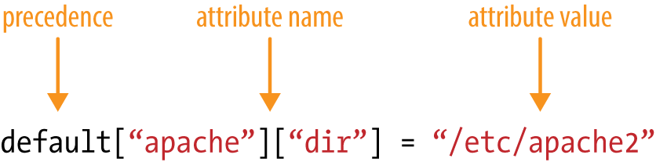
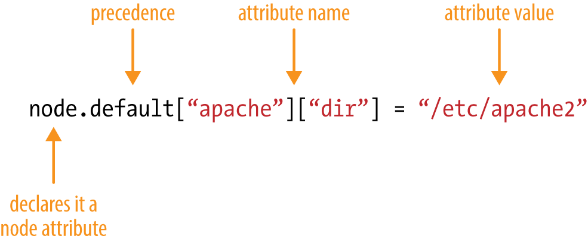
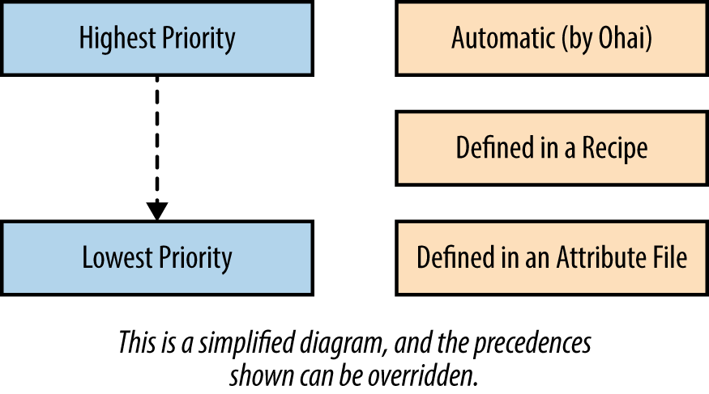
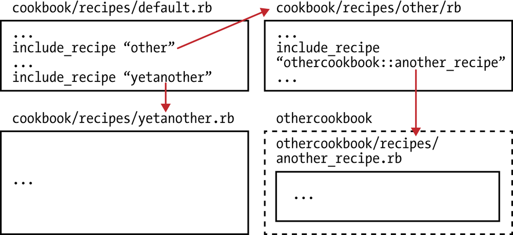
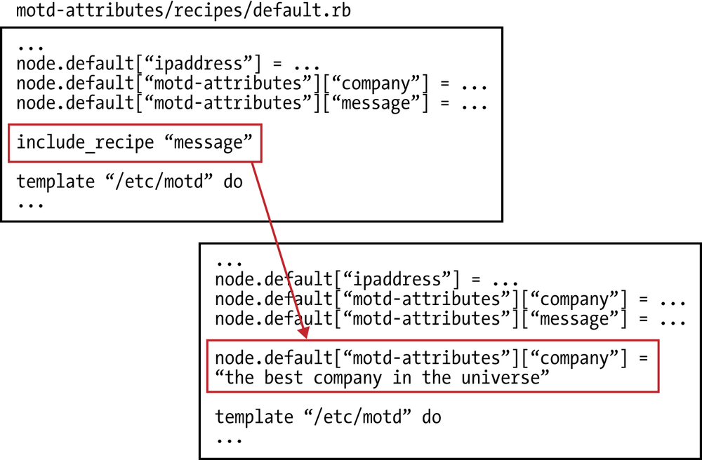
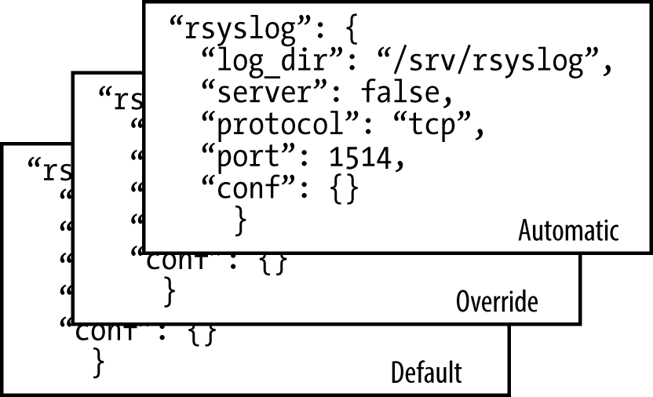

# 属性

* `Motd-Attributes`菜谱 
* Setting Attributes
* 属性优先级基础 
* `Include_Recipe`
* 属性优先级
* 属性排错 


**属性代表的是你的节点的相关信息。除了`ohai`自收集的节点相关信息之外， 你还可以在`chef`配方单或额外的属性文件中设定属性**


属性文件在菜谱的`attributes`此目录中。和配方单类似, 莫认属性文件叫`default.rb`

```
<cookbook>
└── attributes
    └── default.rb
```

使用菜谱中的属性文件来设定的属性的格式。 



属性也可以在配方单中设定，展示在配方单中所设定的属性的格式口在配方单中设定属性时必须使用`node．`前缀 



Because attributes can be defined in multiple places, all attribute values are composed together during a Chef run according to the priority levels as shown in Figure

Attributes defined by `ohai` have the highest priority, followed by attributes defined in a recipe, then attributes defined in an attribute file. 

In other words, recipe attributes have a **higher priority** than those defined in **attribute file**, and will **override them by default**. Attributes defined by `ohai` trump everything else.



`ohai` > **attributes defined in a recipe** > **attributes defined in an attribute file**

## `Motd-Attributes`菜谱 

我们用一个叫・`Motd-Attributes`的菜谱来试验菜谱中的属性，这里来写一个由属胜驱动的版本 。


首先，使用`chef generate cookbook`或`knife cookbook create`（取决于开发机器使用Chef开发包还是客户端）来生成`motd-attributes`菜谱的目录结构。 

**Chef开发包**

```
$ chef generate cookbook motd-attributes
 chef generate cookbook motd-attributes
Hyphens are discouraged in cookbook names as they may cause problems with custom resources. See https://docs.chef.io/ctl_chef.html#chef-generate-cookbook for more information.
Generating cookbook motd-attributes
- Ensuring correct cookbook content
- Committing cookbook files to git

Your cookbook is ready. Type `cd motd-attributes` to enter it.

There are several commands you can run to get started locally developing and testing your cookbook.
Type `delivery local --help` to see a full list of local testing commands.

Why not start by writing an InSpec test? Tests for the default recipe are stored at:

test/integration/default/default_test.rb

If you'd prefer to dive right in, the default recipe can be found at:

recipes/default.rb


$ cd motd-attributes
``` 


**Chef客户端**

```
$ knife cookbook create motd-attributes --cookbook-path .
$ cd motd-attributes
$ kitchen init --create-gemfile
$ bundle install
```

**`/motd-attributes/kitchen.yml`**

```
---
driver:
  name: vagrant
  provider: vmware_desktop

provisioner:
  name: chef_zero

platforms:
  - name: centos65
    driver:
      box: learningchef/centos65
      box_url: learningchef/centos65

suites:
  - name: default
    run_list:
      - recipe[motd-attributes::default]
    attributes:
```

创建一个配方单使用`template`资源来生成节点上的`/etc/motd`文件。但这一次，使用模板文件中的属胜。

**`motd-attributes/recipes/default.rb`**

```
#
# Cookbook:: motd-attributes
# Recipe:: default
#
# Copyright:: 2019, The Authors, All Rights Reserved.

template '/etc/motd' do
    source 'motd.erb'
    mode '0644'
end
```


**Generate a template file to generate `/etc/motd`.**


**Chef开发包**

```
$ chef generate template motd
Recipe: code_generator::template
  * directory[/Users/i515190/Devops_sap/Chef_Doc/learningchef/chap08/motd-attributes/templates] action create
    - create new directory /Users/i515190/Devops_sap/Chef_Doc/learningchef/chap08/motd-attributes/templates
  * template[/Users/i515190/Devops_sap/Chef_Doc/learningchef/chap08/motd-attributes/templates/motd.erb] action create
    - create new file /Users/i515190/Devops_sap/Chef_Doc/learningchef/chap08/motd-attributes/templates/motd.erb
    - update content in file /Users/i515190/Devops_sap/Chef_Doc/learningchef/chap08/motd-attributes/templates/motd.erb from none to e3b0c4
    (diff output suppressed by config)

```

**Chef Client - Linux/Mac OS X:**

```
$ touch templates/default/motd.erb
```

**`templates/default/motd.erb`**

```
The hostname of this node is <%= node['hostname'] %>
The IP address of this node is <%= node['ipaddress'] %>
```

```
$ kitchen list
Instance          Driver   Provisioner  Verifier  Transport  Last Action    Last Error
default-centos65  Vagrant  ChefZero     Busser    Ssh        <Not Created>  <None>


$ kitchen converge

$ kitchen login
Last login: Thu Nov 28 03:12:17 2019 from 172.16.72.2
The hostname of this node is default-centos65
The IP address of this node is 172.16.72.142

$ exit
```

## Setting Attributes

**Chef Development Kit:**

```
$ chef generate attribute default


Recipe: code_generator::attribute
  * directory[/Users/i515190/Devops_sap/Chef_Doc/learningchef/chap08/motd-attributes/attributes] action create
    - create new directory /Users/i515190/Devops_sap/Chef_Doc/learningchef/chap08/motd-attributes/attributes
  * template[/Users/i515190/Devops_sap/Chef_Doc/learningchef/chap08/motd-attributes/attributes/default.rb] action create
    - create new file /Users/i515190/Devops_sap/Chef_Doc/learningchef/chap08/motd-attributes/attributes/default.rb
    - update content in file /Users/i515190/Devops_sap/Chef_Doc/learningchef/chap08/motd-attributes/attributes/default.rb from none to e3b0c4
    (diff output suppressed by config)
```

**Chef Client - Linux/Mac OS X:**

```
$ touch attributes/default.rb
```

默认情况下，如果使用`Chef`开发包生成新菜谱的目录结构，它不会创建`attribute`目录，因为你不一定会用到它。然而，在需要在菜谱中使用属性文件时，你需要运行`chef generate`命令来创建其目录结构。

而如果使用`Chef`客户端创建新菜谱的目录结构，它永远会创建所有的目录（包括attribute、目录，无论你是否需要），但你需要自己手动创建`default.rb`属性文件。 

**`/attributes/default.rb`**

```
default['motd-attributes']['company'] = 'Chef'
```

根据约定，在菜谱的属性文件中设定属性时，属性的键和值应该存在以菜谱名字命名的顶级命名空间下。

比如`default['motd-attributes']['company'`］的值是字符串`Chef`,键`company`存在顶级命名空间`motd-attributes`下。


在这个例子中，菜谱的名字在`metadata.rb`中定义为`mot-attributes`。**这个属性使用default优先级。**

**`/recipes/default.rb`**

```
node.default['motd-attributes']['message'] = "It's a wonderful day today!"

template '/etc/motd' do
  source 'motd.erb'
  mode '0644'
end
``` 

编辑`mold.erb`模板。可以在`node`对象下访问通过任何途径设定的属胜属性文件菜谱或`ohai` 

**`templates/default/motd.erb`**


```
Welcome to <%= node['motd-attributes']['company'] %>
<%= node['motd-attributes']['message'] %>
The hostname of this node is <%= node['hostname'] %>
The IP address of this node is <%= node['ipaddress'] %>
```

```
$ kitchen converge
-----> Starting Kitchen (v2.3.3)
-----> Converging <default-centos65>...
       Preparing files for transfer
$$$$$$ You must set your run_list in your Policyfile instead of kitchen config. The run_list in your config will be ignored.
$$$$$$ Ignored run_list: ["recipe[motd-attributes::default]"]
       Installing cookbooks for Policyfile /Users/i515190/Devops_sap/Chef_Doc/learningchef/chap08/motd-attributes/Policyfile.rb using `chef in
stall`
       Installing cookbooks from lock
       Installing motd-attributes 0.1.0
       Preparing dna.json
       Exporting cookbook dependencies from Policyfile /var/folders/r7/nml_dsbn44gcd2jlqh7s2w940000gn/T/default-centos65-sandbox-20191129-2695
5-1g48hf7...
       Exported policy 'motd-attributes' to /var/folders/r7/nml_dsbn44gcd2jlqh7s2w940000gn/T/default-centos65-sandbox-20191129-26955-1g48hf7
       
       To converge this system with the exported policy, run:
         cd /var/folders/r7/nml_dsbn44gcd2jlqh7s2w940000gn/T/default-centos65-sandbox-20191129-26955-1g48hf7
         chef-client -z
       Removing non-cookbook files before transfer
       Preparing validation.pem
       Preparing client.rb
-----> Chef installation detected (install only if missing)
       Transferring files to <default-centos65>
       Starting Chef Infra Client, version 15.5.17
       Using policy 'motd-attributes' at revision '3e7401637721e60a1aa8475f5dd46efd6ad452ec2cb08118d94bbf112815ab5e'
       resolving cookbooks for run list: ["motd-attributes::default@0.1.0 (4b1d2ce)"]
       Synchronizing Cookbooks:
         - motd-attributes (0.1.0)
       Installing Cookbook Gems:
       Compiling Cookbooks...
       Converging 1 resources
       Recipe: motd-attributes::default
         * template[/etc/motd] action create
           - update content in file /etc/motd from 0397e6 to b17ece
           --- /etc/motd        2019-11-28 03:12:20.412305997 +0000
           +++ /etc/.chef-motd20191129-3585-p6oosp      2019-11-29 02:24:14.925471024 +0000
           @@ -1,3 +1,8 @@
           +# The hostname of this node is default-centos65
           +# The IP address of this node is 172.16.72.142
           +
           +Welcome to Chef
           +It's a wonderful day today!
            The hostname of this node is default-centos65
            The IP address of this node is 172.16.72.142
       
       Running handlers:
       Running handlers complete
       Chef Infra Client finished, 1/1 resources updated in 01 seconds
       Downloading files from <default-centos65>
       Finished converging <default-centos65> (0m8.64s).
-----> Kitchen is finished. (0m9.31s
```

```
$ kitchen login
Last login: Fri Nov 29 02:24:10 2019 from 172.16.72.2
# The hostname of this node is default-centos65
# The IP address of this node is 172.16.72.142

Welcome to Chef
It's a wonderful day today!
The hostname of this node is default-centos65
The IP address of this node is 172.16.72.142

[vagrant@default-centos65 ~]$ exit
logout
Connection to 127.0.0.1 closed.
```


## 属性优先级基础 

**现在， 让我们来试验一下不同属性的优先级**。 重新设定已经在其他地方设定过的属性值
编辑`recipe/default.rb`, **重设一个在属文件中已经由`ohai`设定的更高优先级的属性的值，同时重设一个在属性文件中已经设定的更低优先级的属性的值**

**`motd-attributes/recipes/default.rb`**

```
#
# Cookbook:: motd-attributes
# Recipe:: default
#
# Copyright:: 2019, The Authors, All Rights Reserved.

node.default['ipaddress'] = '1.1.1.1'
node.default['motd-attributes']['company'] = 'My Company'
node.default['motd-attributes']['message'] = "It's a wonderful day today!"

template '/etc/motd' do
  source 'motd.erb'
  mode "0644"
end
```

```
$ kitchen converge

$ kitchen login

Last login: Fri Nov 29 03:09:32 2019 from 172.16.72.2
Welcome to My Company
It's a wonderful day today!
The hostname of this node is default-centos65
The IP address of this node is 172.16.72.142
```

**Perform a Chef run and check to see the resulting values:**

* 在配方单中设定的`mode['motd_attributes']['company'］`的值`My Company`比属性文件中设定的值`Chef`拥有更高优先级，因此模板使用了配方单中设定的值。 
* 在配方单中设定的`node['ipaddeess'］`值比`ohai`自动设定的`10.0.2.15`值有更低优先 级，因此在配方单中设定的值被忽略，模板使用了高优先级的值。 


* 这些优先级体现了变量的使用方法在属胜文件中设定的值被设计为可以被配方单覆盖
* 而由`ohai`生成的自动属胜则不会被任何属性覆盖，因为它们代表重要的不应被篡改的系统信息，比如`IP`地址。 


## Include_Recipe 

你可能会想`Chef`这样的属性优先级机制有没有必要这是因为和很多其他编程语言一样，`Chef`配方单可以通过`include_recipe`语句引用其他`Chef`配方单。

当`Chef`运行并处理`Chef`代码时，它可能包含对许多不同的配方单（甚至在其他菜谱中的配方单）的引用.

由于你可以使用`include_recipe`，所以`Chef`代码可能会包含互相冲突的属性定义，这样便需要一个准则来决定相冲突的属性在定义时，哪个会胜出。 




> 说明：很多`Chef`用户遵循一个准则，将配方单代码的长度限制在一个屏幕能显示出来的范围内 > (20多行）以使代码可读。更长的代码通常可以考虑根据代码块的用途分割成多个不同的配方单> 文件，然后使用`include_ recip`来包含这些配方单 

在使用`include_recipe`语句时，你应该使用和在运行清草中一样的格式：`"＜菜谱>::<配方单＞"`。比如"`motd-attributes::message`"


**Chef开发包**

```
chef generate recipe message
```

**Chef Client - Linux/Mac OS X:**

```
touch recipes/message.rb
```

```
$ chef generate recipe message
Recipe: code_generator::recipe
  * directory[/Users/i515190/Devops_sap/Chef_Doc/learningchef/chap08/motd-attributes/spec/unit/recipes] action create (up to date)
  * cookbook_file[/Users/i515190/Devops_sap/Chef_Doc/learningchef/chap08/motd-attributes/spec/spec_helper.rb] action create_if_missing (up to date)
  * template[/Users/i515190/Devops_sap/Chef_Doc/learningchef/chap08/motd-attributes/spec/unit/recipes/message_spec.rb] action create_if_missing
    - create new file /Users/i515190/Devops_sap/Chef_Doc/learningchef/chap08/motd-attributes/spec/unit/recipes/message_spec.rb
    - update content in file /Users/i515190/Devops_sap/Chef_Doc/learningchef/chap08/motd-attributes/spec/unit/recipes/message_spec.rb from none to 6d73b3
    (diff output suppressed by config)
  * directory[/Users/i515190/Devops_sap/Chef_Doc/learningchef/chap08/motd-attributes/test/integration/default] action create (up to date)
  * template[/Users/i515190/Devops_sap/Chef_Doc/learningchef/chap08/motd-attributes/test/integration/default/message_test.rb] action create_if_missing
    - create new file /Users/i515190/Devops_sap/Chef_Doc/learningchef/chap08/motd-attributes/test/integration/default/message_test.rb
    - update content in file /Users/i515190/Devops_sap/Chef_Doc/learningchef/chap08/motd-attributes/test/integration/default/message_test.rb from none to 456a77
    (diff output suppressed by config)
  * template[/Users/i515190/Devops_sap/Chef_Doc/learningchef/chap08/motd-attributes/recipes/message.rb] action create
    - create new file /Users/i515190/Devops_sap/Chef_Doc/learningchef/chap08/motd-attributes/recipes/message.rb
    - update content in file /Users/i515190/Devops_sap/Chef_Doc/learningchef/chap08/motd-attributes/recipes/message.rb from none to f414d1
    (diff output suppressed by config)
```


**`recipes/message.rb`**

```
#
# Cookbook:: motd-attributes
# Recipe:: message
#
# Copyright:: 2019, The Authors, All Rights Reserved.


node.default['motd-attributes']['company'] = 'the best company in the universe(This info from message.rb)'
```

**提示:**
 
注意，我们`kitchen.yml`文件在运行清单中仍然只使用了`default`配方单。因为我们不想让人们直接使用`message`配方单。 

**只是使用`message`配方单来组织代码，使其可读，容易管理。因此, 我们需要在`default`配方单中使用`include_recipe`来引用需要引用的配方单， 而总的运行清单中只有`default`配方单** 

```
...
  run_list:
    - recipe[motd-attributes::default]
...
```

有些`Chef`用户将“私有”的配方单文件以下划线开头（"-“）作为一个约定来区分公开和私有的配方单文件 。他们同时将这个配方单文件命名为`”message.rb“`，使其私有性在菜谱的文件结构中显得更明显。 

**end:**


```
node.default['ipaddress'] = '1.1.1.1'
node.default['motd-attributes']['company'] = 'My Company'
node.default['motd-attributes']['message'] = "It's a wonderful day today!"

include_recipe 'motd-attributes::message'

template '/etc/motd' do
  source 'motd.erb'
  mode '0644'
end
```

You need to add an include_recipe statement to your `default.rb`.

**`recipes/default.rb`**

```
#
# Cookbook:: motd-attributes
# Recipe:: default
#
# Copyright:: 2019, The Authors, All Rights Reserved.

node.default['ipaddress'] = '1.1.1.1'
node.default['motd-attributes']['company'] = 'My Company'
node.default['motd-attributes']['message'] = "It's a wonderful day today!"

include_recipe 'motd-attributes::message'

template '/etc/motd' do
  source 'motd.erb'
  mode "0644"
end
```

**`include_recipe`语句可以放在配方单文件的任何位置。当`Chef`处理这些代码时`include_recipe`将被替换为它所引用用的配方单代码**




### 同个优先级同个属性被多次设定时，最后设定的值胜出。

在本例中，在`include_recipe`引用展开后，`node.defau1t["motd-attributes"]["company"]`属性被设定了两次；

在`template`资源应用之前最后被设定的一个胜出，即`“the best company in the universe(This info from message.rb)"`: 


```
$ kitchen converge

$ kitchen login
Last login: Fri Nov 29 06:27:57 2019 from 172.16.72.2
Welcome to the best company in the universe(This info from message.rb)
It's a wonderful day today!
The hostname of this node is default-centos65
The IP address of this node is 172.16.72.142
```


## 属性优先级

三个最常用的属性优先级别： 

**自动(`Autormatic`)**

自动属性为`ohai`所生成的属性。 

**默认(`Default`)** 

通常由菜谱及属性文件设定的属性。 

**重写(`Override`)**

最强的属性设定方法，务必请谨慎使用。  



在菜谱中设定一个属性时，通常应该设为默认属性。这个规则有一个例外，即当使用环境时使用`override`优先级。

除了使用“环境”的特例之外，属性优先级多自定义`Chef`的时候。在`Chef`中实现一个新的功能（比如自定义资源）时，`Chef`强大的属性优先级引擎能帮助你遵循本章讲述的基本属性优先级功能为其语言添加新的功能。


## 属性排错 

如果需要为属性拍错，比如找到他们哪里设定，`node`对象提供的`node.debug_value()`方法能给与很多帮助。

**比如如果你不知道`ohai`设定了自动属性`node['ipaddress']`得知它是由。可以通过运行`node.debug_value()`得知由`ohai`设定的**

修改`recipes/default.rb`文件，可以使用`Ruby`的pp程序，`pp`程序可以将对象`Ruby`以可读性强格式打印出来。`node.debug_value()`返回对象的内容， pp输出有较强的可读性 

```
#
# Cookbook:: motd-attributes
# Recipe:: default
#
# Copyright:: 2019, The Authors, All Rights Reserved.


require 'pp'
node.default['ipaddress'] = '1.1.1.1'
pp node.debug_value('ipaddress')

node.default['motd-attributes']['company'] = 'My Company'
node.default['motd-attributes']['message'] = "It's a wonderful day today!"

include_recipe 'motd-attributes::message'

template '/etc/motd' do
  source 'motd.erb'
  mode "0644"
end

```


```
$ kitchen converge
...
 Installing Cookbook Gems:
       Compiling Cookbooks...
       [["default", "1.1.1.1"],
        ["env_default", :not_present],
        ["role_default", :not_present],
        ["force_default", :not_present],
        ["normal", :not_present],
        ["override", :not_present],
        ["role_override", :not_present],
        ["env_override", :not_present],
        ["force_override", :not_present],
        ["automatic", "172.16.72.142"]]
       Converging 1 resources
       Recipe: motd-attributes::default
         * template[/etc/motd] action create (up to date)
       
       Running handlers:
       Running handlers complete
       Chef Infra Client finished, 0/1 resources updated in 01 seconds
       Downloading files from <default-centos65>
       Finished converging <default-centos65> (0m6.47s).
```

从这里， 可以看出`node[ipaddress]`]属性在`automatic`优先级被设定为`"172.16.72.142"`,在`default`优先级被设定为"`1.1.1.1`"

**`Chef`的确处理了"`1.1.1.1`"这个值，但最终结果被高优先级的自动属性覆盖。**

**要为同个优先级别被多次设定的属性排错比在不同优先级别设定的时候复杂一些**

**但仍然非常可行。你只需要在`include_recipe`前后分别打印`node.debug_value(）`的值。** 

比如，假设我们不知道`motd-attributes::message`配方单设定了`motd-attributes::message`属性，就可以通过在`recipes/default.rb`一中多次打印`node.debug_value()` 的值，在`include_recipe`前后分别打印`node.debug_value('motd-attributes','company')`

```
...
  Compiling Cookbooks...
       [["default", "1.1.1.1"],
        ["env_default", :not_present],
        ["role_default", :not_present],
        ["force_default", :not_present],
        ["normal", :not_present],
        ["override", :not_present],
        ["role_override", :not_present],
        ["env_override", :not_present],
        ["force_override", :not_present],
        ["automatic", "172.16.72.142"]]
       [["default", "My Company"],
        ["env_default", :not_present],
        ["role_default", :not_present],
        ["force_default", :not_present],
        ["normal", :not_present],
        ["override", :not_present],
        ["role_override", :not_present],
        ["env_override", :not_present],
        ["force_override", :not_present],
        ["automatic", :not_present]]
       [["default", "the best company in the universe(This info from message.rb)"],
        ["env_default", :not_present],
        ["role_default", :not_present],
        ["force_default", :not_present],
        ["normal", :not_present],
        ["override", :not_present],
        ["role_override", :not_present],
        ["env_override", :not_present],
        ["force_override", :not_present],
        ["automatic", :not_present]]
       Converging 1 resources
       Recipe: motd-attributes::default
         * template[/etc/motd] action create (up to date)
...
```

From this output, you could sort out that something in` motd-attributes::message` recipe set the attribute `node['motd-attributes']['company']` to `"the best company in the universe" using the default precedence`, overriding what was set earlier.

```
$ kitchen destroy
-----> Starting Kitchen (v2.3.3)
-----> Destroying <default-centos65>...
       ==> vagrant: A new version of Vagrant is available: 2.2.6 (installed version: 2.2.5)!
       ==> vagrant: To upgrade visit: https://www.vagrantup.com/downloads.html
       
       ==> default: Stopping the VMware VM...
       ==> default: Deleting the VM...
       Vagrant instance <default-centos65> destroyed.
       Finished destroying <default-centos65> (0m23.58s).
-----> Kitchen is finished. (0m24.15s)
```

## 小结


属性可以在多处设定

* `ohai`自动设定 
* 属性文件 
* 配方单 
* 其他菜谱 

由于属性可以在多处设定，所以`Chef`定义了优先级方案来控制多处设定属性如何调用设定属性时，`automatic`,`default`和`override`来控制属性的优先级。 总的来说，会用到`default`优先级，除非有特别需求或需要自定义Chef.


