# `Chef`服务器同时管理多个节点

* 使用菜谱来自动化安装企业`Chef`服务器 
* 幂等性简介(`Idempotence`)
* 配置企业`Chef`服务器 
* 准备一个新节点(`chef-client`)
* 用`Knife`启动并准备节点
* 用`Chef Solo`配置`Chef`服务器 


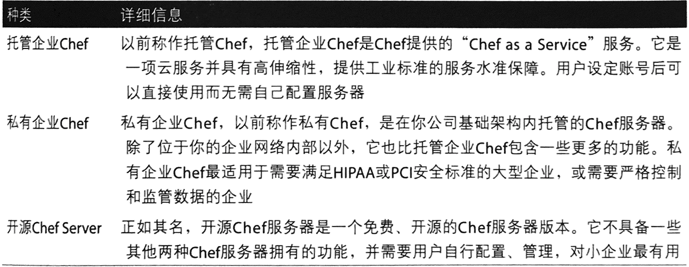


`Chef`服务器是你基础架构配置数据的中央存储。它存储并索引菜谱、环境、模板、元数 据、文件和分布策略。`Chef`服务器包含所有其管理的机器的信息、。 


**`Chef`服务器同时包含一个页面服务器， 菜谱存储， 网页界面， 消息队列以及后端数据库**

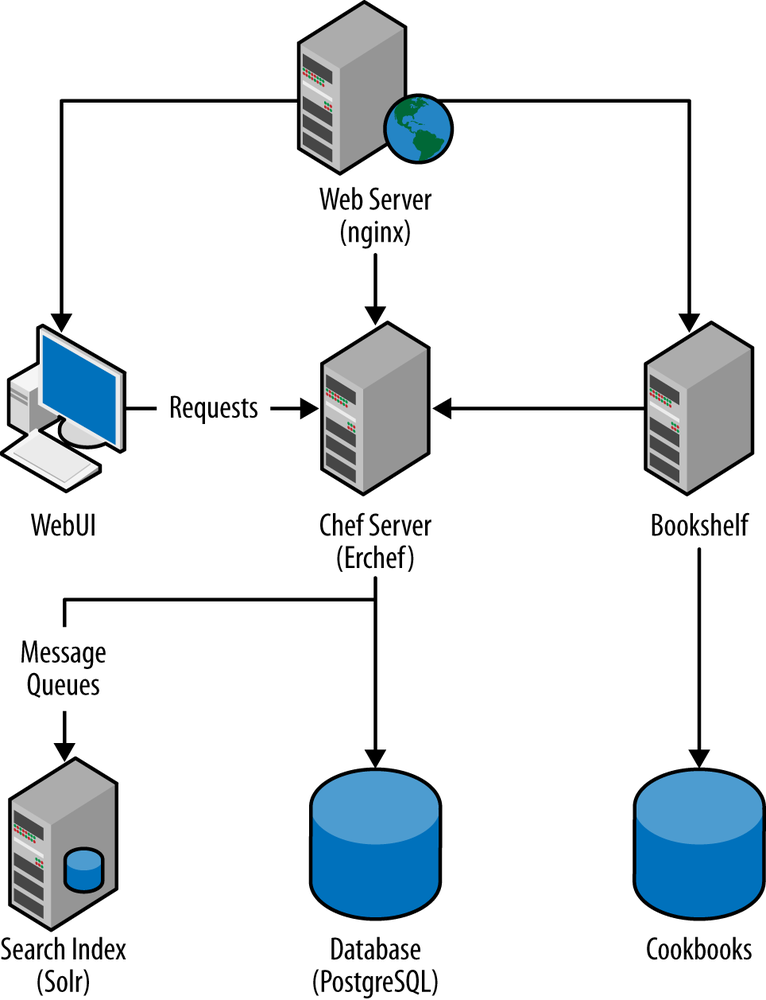

**网络胭务器** 

`nginx`网络服务器是个简单的反向代理服务器．`Chef`服务器用它作为前端的界面，它同时为`chef`服务器提供负载平衡。所有到`Chef`服务器的`API`请求都通过`nginx`服务器来路由。 


**WebUI**

 
`WebUI`是面向用户的网页应用程序，为用户提供一个从网页上与`Chef`服务器交互的界面。它是个`Ruby on Rails`应用程序

**`Chef`务器(`Erchef`)** 

`Erehef`是`Chef`服务器负责处理`API`请求的组件。 `Chef`服务器用户`Erlang`编程语言写，支持高井发和高可靠性。`Erehef`是`Chef`服务器的核心`API`

**`Bookshelf`**

`Bookshelf`是所有`Chef`菜谱和菜谱内容(比如文件、模板， 定义元数据和配方单）的中央存储。`Bookshelf`是一个平坦的文们数据库, 井特意存储于`Chef`服务器的索引之外 

**搜索索引** 

搜索索引是个`Apache Solr`服务器， 它负责内部和外部许多`API`请求的索引和搜索。搜索索引服务和外界交互的组件叫`chef-solr` 它提供`Restful`的`API` 

**消息队列** 

此队列系统处理所有被发送到搜索索引的消息。这些队列由开源的`RabbitMQ`队列系统管理。`chef-expander`从消息对列中获取消息， 然后发送至搜索索引。 

**数据库**
 
`Chef`使用`PostgreSQL`来存储数据。在`Chef 11`之前, 主要数据库为`CouchDB`但后来 由于`CouchDB`的伸缩性问题`PostgreSQL`代替

How to Install Enterprise Chef Server Manually

 
## 手动安装`chef-Server`

Go to [http://www.getchef.com/contact/on-premises](http://www.getchef.com/contact/on-premises) and provide your contact information to receive download details and installation instructions for Enterprise Chef Server.

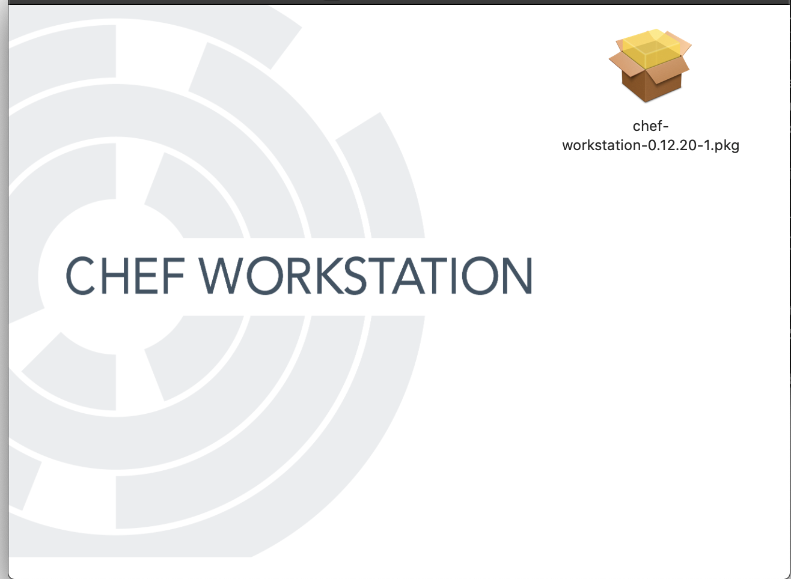

## 使用菜谱来自动化安装企业`Chef`服务器 

假设你有足够的系统资源在本地安装企业`Chef`服务器以及配置一个测试试节点，创建一个`enterprise-chef`(chef-workstation)菜谱来安装企业`Chef`服务器。

为了和托管企业Chef保持一致，创建`chef-repo/cookbooks`目录并在目录中创建`enterprise`菜谱。顶级的`chef-repo`目录可以存放管理企业`Chef`所需要的除菜谱以外的其他文件。因为你会使用若干个菜谱，所以这里建议将`enterprise`菜谱存放在`chef-repo/cookbooks`子目录内。 创建`chef-repo/cookbooks`目录并将它作为当前工作目录。 


**Linux/Mac OS X:**

```
$ mkdir -p chef-repo/cookbooks
$ cd chef-repo/cookbooks
```

然后通过`chef generate cookbook`或`knife cookbook` 菜谱（取决于你使用`Chef`开发包还是Chef客户端）。 

**Chef Development Kit:**

```
$ chef generate cookbook enterprise-chef
$ cd enterprise-chef
```

**Chef Client:**

```
$ knife cookbook create enterprise-chef --cookbook-path .
$ cd enterprise-chef
$ kitchen init --create-gemfile
$ bundle install
```

**`enterprise-chef/kitchen.yml`**

```
---
driver:
  name: vagrant
  provider: vmware_desktop

provisioner:
  name: chef_solo

platforms:
  - name: centos65
    driver:
      box: learningchef/centos65
      box_url: learningchef/centos65
      network:
      - ["private_network", {ip: "192.168.33.34"}]
      customize:
        memory: 1536

suites:
  - name: default
    run_list:
      - recipe[enterprise-chef::default]
    attributes:
```

Chef Development Kit:

```
$ chef generate attribute default
```

Chef Client:

```
$ touch attributes/default.rb
```


**`attributes/default.rb`**

old:

```
default['enterprise-chef']['url'] = \
'https://s3.amazonaws.com/opscode-private-chef/el/6/x86_64/'\
'private-chef-11.1.8-1.el6.x86_64.rpm'
```

new chef-server-core:

```
default['enterprise-chef']['url'] = 'https://packages.chef.io/files/stable/chef-server/13.1.13/el/6/chef-server-core-13.1.13-1.el6.x86_64.rpm'
```

new chef Management Console:

[https://downloads.chef.io/manage](https://downloads.chef.io/manage)

```
default['enterprise-chef']['url'] = 'https://packages.chef.io/files/stable/chef-manage/2.5.16/el/6/chef-manage-2.5.16-1.el6.x86_64.rpm'
```

**finall version**

```
default['enterprise-chef']['url'] = 'https://packages.chef.io/files/stable/chef-manage/2.5.16/el/6/chef-manage-2.5.16-1.el6.x86_64.rpm
```

**`/enterprise-chef/recipes/default.rb`**


```
#
# Cookbook:: enterprise-chef
# Recipe:: default
#
# Copyright:: 2019, The Authors, All Rights Reserved.

package_url = node['enterprise-chef']['url']
package_name = ::File.basename(package_url)
package_local_path = "#{Chef::Config[:file_cache_path]}/#{package_name}"

# omnibus_package is remote (i.e., a URL) let's download it
remote_file package_local_path do
  source package_url
end

package package_local_path

# reconfigure the installation
# execute 'private-chef-ctl reconfigure'
execute 'chef-server-ctl reconfigure --chef-license=accept'
# "--chef-license=accept"
# STDOUT: Chef Infra Server cannot execute without accepting the license
```


如果不想在菜谱中总是使用`node['enterprise-chef']['url'］`这样长的变量，可以将其 存储在一个短的本地变量中，比如：

```
package_url = node['enterprise-chef']['url']
``` 

记住，在`Chef`配方单中，你可以使用Ruby编程语言提供的任何功能。**例如，可以使用`::File.basename(）` 方法来从下载`URL`中提取安装包的名字。**  

在这个例子中，安装包的名字是URL中最后一个斜杠后的组件：`'private-chef-11.1.8-1.el6.x86_64.rpm` 如果想进一步了解`Ruby`的`::File`类，可以访问`Ruby`核心`API`文档

```
package_name = ::File.basename(package_url)
```

不幸的是，我们熟悉的`package`资源并不接受通过指定远程`URL`来安装程序包，所以这里要介绍一个新的资源:`remote_file`资源。

**`remote_file`资源提供从远程下载文件的功能我们在此要通过`remote_file`资源从远程`URL` 下载安装包，并用`package`资源安装本地的安装包。**

我们需要先将安装包下载到一个临时位置。与其使用固定的临时下载位置 (如`"/tmp"`)，不如用`Chef`提供的一个你可以使用的变量：`Chef::Config[:file_cache_path]`。通过这个变量，`Chef`绝对定最佳的临时存储位置。将所要的临时存储位置作为参数传递给`remote_file`，并将远程`URL`作为`source`属性传递 

在执行`chef-server-ctl reconfigure`前，我们需要介绍另一个新的资源：`execute`资 源。有时，无法找到一个现有的资源满足自己需求时，你可以使用`execute`资源来执行任意命令。你只需要将想执行的命令字符串传递至`execute`资源。 


```
$ kitchen list
Instance          Driver   Provisioner  Verifier  Transport  Last Action    Last Error
default-centos65  Vagrant  ChefSolo     Busser    Ssh        <Not Created>  <None>

$ kitchen converge default-centos65

$ kitchen list
Instance          Driver   Provisioner  Verifier  Transport  Last Action  Last Error
default-centos65  Vagrant  ChefZero     Busser    Ssh        Converged    <None>

$  kitchen login default-centos65
Last login: Sun Dec  1 09:07:26 2019 from 172.16.72.2
Welcome to your Packer-built virtual machine.

$ rpm -q chef-server-core
chef-server-core-13.1.13-1.el6.x86_64

[vagrant@default-centos65 ~]$ exit
logout
Connection to 127.0.0.1 closed.
```


## 幂等性简介(Idempotence)

虽然我们写的配方单作为第一个版本一可以达成我们的目的，但它并不幂等。

幂等的`Chef`代码意味着你可以重复运行无数次而结果完全一样，并不会因为运行多次而产生不同的效果。几乎所有默一认的`Chef`资源都保证幂等性，唯一的例外是`execute`资源。 

`execute`资源一般并不幂等，因为大多数命令行工具假设操作它的人了解系统的现状。 比如，假设`/learningchef/files1.txt`文件存在，以下`mv`命令在第一次运行时有效，但在第二次运行时会失败： 


```
$ mv /learningchef/file1.txt /file1.txt
```

测试`Chef`配方单是否幂等的一个好方法是运行`kitchen converge`两次。一次运行没有产生任何动作时，运行的结果应该显示`0`个资源被更新。 


**Does our recipe pass the idempotency test? Sadly, no. Here’s a sampling of the output from an initial kitchen converge:**
 
```
$ kitchen converge default-centos65
...
 Installing Cookbook Gems:
       Compiling Cookbooks...
       Converging 3 resources
       Recipe: enterprise-chef::default
         * remote_file[/tmp/kitchen/cache/chef-server-core-13.1.13-1.el6.x86_64.rpm] action create (up to date)
         * yum_package[/tmp/kitchen/cache/chef-server-core-13.1.13-1.el6.x86_64.rpm] action install (up to date)
         * execute[chef-server-ctl reconfigure --chef-license=accept] action run
           - execute chef-server-ctl reconfigure --chef-license=accept
       
       Running handlers:
       Running handlers complete
       Chef Infra Client finished, 1/3 resources updated in 04 minutes 51 seconds
       Downloading files from <default-centos65>
       Finished converging <default-centos65> (5m4.35s).
```


以下是第二次运行的输出`Chef`认为它仍然需要吏新资源`3`个资源中的`2`个在第二次运行时被更新。如果配方**幂等**，**我们应该看到`0`个资源被更新`Chef`应该检查系统状态确定没有需要更新的资源**； 

```
$ kitchen converge
...
 Converging 3 resources
       Recipe: enterprise-chef::default
         * remote_file[/tmp/kitchen/cache/chef-server-core-13.1.13-1.el6.x86_64.rpm] action create (up to date)
         * yum_package[/tmp/kitchen/cache/chef-server-core-13.1.13-1.el6.x86_64.rpm] action install (up to date)
         * execute[chef-server-ctl reconfigure --chef-license=accept] action run
           - execute chef-server-ctl reconfigure --chef-license=accept
       
       Running handlers:
       Running handlers complete
       Chef Infra Client finished, 1/3 resources updated in 53 seconds
       Downloading files from <default-centos65>
       Finished converging <default-centos65> (1m7.63s).
-----> Kitchen is finished. (1m8.27s)

```

**像前面提及的一样, 大多数默认`Chef`资源是具备幂等性。注意`remote_file`。资源是幂等的。从输出可以看到它汇报了（up to date)。 `package`资源通常也是幂等的**.

在本例中．我们故意创造了一些清境使其在`RedHat`系列系统中出现一些幂等性问题，后面将展示如何解决。 

在第二次通过`kitchen converge`执行`Chef`运行，我们发现一些`package`和`execute`资源的幂等性问题。 

1. 重新安装`rpm`安装包，可有可无。 
2. 再次执行`chef-server一ctl reconfigure`命令。 

让我们解决这些代码中的幂等性问题，最后版本的完全幂等的`Chef`代码

#### 第一个重复安装的问题是`Chef`开发者使用从一个远程下载到本地的`rpm`安装包时常见的问题。

**与其只是将一个远程下载的`rpm`传递给`package`资源，还不如通过`provider`属性告诉 `package`资源使用`Chef::Provider::Package::Rpm`提供者。同时需要制定安装包名字字符串和通过`source`属性指定本地的安装包地址**： 


```
package package_name do
  source package_local_path
  provider Chef::Provider::Package::Rpm
end
```

**可以使用`rpm_package`对`package`资源指定 `Chef::Provider::Package::Rpm`提供者提供者**。

以下代码等同于以上

```
rpm_package package_name do
  source package_local_path
end
```

#### 解决第二个`execute`资源该复执行命令的问题相对复杂一些。可以使用`Chef`内建的资源完成任务时就不要使用`execute`资源，因为你需要负责控制幂等性。
 
**解决这个问题的一个方法是使用`not_if`来保护`execute`资源。这样在`not_if`中指定的测试会先执行，如果测试成功，证明系统已经在理想状态下，则不需要做任何事情**。

在本例中，我们可以使用这种方法测试`chef-server`安装包是否已经安装。如下所示，我们在`execute`资源中添加`not_if`语句。`not_if`会测试其中的命令的退出代码是否0, 如果是`execute`资源就不做任何事情 

```
execute "chef-server-ctl reconfigure" do
  not_if "rpm -q chef-server"
end
```

虽然可以这样解决幂等性问题，但并不是特别理想。你需要找到合适的方法来判定`Chef`服务器是否已经成功安装，而我们例子中的方法并不是那么可靠。另外一种解决这有问题的方法是只有在前面所做的`package`资源安装执行的时候才使用`execute`资源执行若令否则不执行`execute`资源。可以通过`notifies`语句来通知执行其他资源。 


**要想使用`notifies`，我们需要对为此，`execute`资源语句做一些改变**。

**首先，需要使其在独立处理时不做任何事情，我们可以添加`action :nothing`属胜**。

然后，我们需要将其运行命令移到`command`属性中，从而在其他资源中通过更短的名字来通知此资源。默认情况下，被传人`execute`资源的`name`属性被作为`command`属胜使用。

当我们想用一行代码来运行一个命令时，这样做很好，但想在其他资源中通知这个资源时则不是最理想的方法，因为你需要在其他资源中指定整个命令。现在我对`execute`资源做出以下改变： 


```
# reconfigure the installation
execute 'reconfigure-chef-server' do
  command 'chef-server-ctl reconfigure'
  action :nothing
end
```

然后在`package`资源中添加`notifies`属性，如下所示。

* `notifies`属性接受三个参数**动作、要通知的资源的名字和执行动作的时间**。

**如以下代码所，我们想通知`execute[reconfigure-chef-server] `资源执行`:run`动作，并立即执行。**

```
#
# Cookbook:: enterprise-chef
# Recipe:: default
#
# Copyright:: 2019, The Authors, All Rights Reserved.

package_url = node['enterprise-chef']['url']
package_name = ::File.basename(package_url)
package_local_path = "#{Chef::Config[:file_cache_path]}/#{package_name}"

# omnibus_package is remote (i.e., a URL) let's download it
# 从一个远程位置（比如网站）传输一个文件 remote_file
remote_file package_local_path do
  source package_url
end

# 用操作系统提供的程序安装管理器安装一个程序包
package package_name do
  source package_local_path
  provider Chef::Provider::Package::Rpm
  notifies :run, 'execute[reconfigure-chef-server]', :immediately
# notifies :before, :delayed, :immediate, :immediately
end

# reconfigure the installation
# execute actions: ":nothing" and ":run"
execute 'reconfigure-chef-server' do
  command 'private-chef-ctl reconfigure'
  action :nothing
end
```

**使用这个版本的代码再次运行`kitchen converge`.井在输出中注意它汇报的是`0`个资源被更新**：

```
$ kitchen converge
 Compiling Cookbooks...
       Converging 3 resources
       Recipe: enterprise-chef::default
         * remote_file[/tmp/kitchen/cache/chef-server-core-13.1.13-1.el6.x86_64.rpm] action create (up to date)
         * yum_package[chef-server-core-13.1.13-1.el6.x86_64.rpm] action install (up to date)
         * execute[reconfigure-chef-server] action nothing (skipped due to action :nothing)
       
       Running handlers:
       Running handlers complete
       Chef Infra Client finished, 0/3 resources updated in 04 seconds
       Downloading files from <default-centos65>
       Finished converging <default-centos65> (0m18.04s).
```

这是我们期待的结果，`Chef`没有执行任何资源对系统作出任何改变： 


在日常工作中，在部署到生产环境之前，始终要检查配方单是否幂等。在本例中，如果我们将第一个版本的配方单部署到生产环境，一般来讲在生产环境中的节点上`Chef-client`会定期运行（比如每15分钟），所有在运行清单中拥有此配方单的节点将每15分钟重新安装一次`Chef`服务器！ 


## 配置企业Chef服务器 

如果成功安装`Chef`服务器，就可以在浏览器中使用你在`kitehen.yml`中设定的`private network ip`地址访问服务器管理网页。

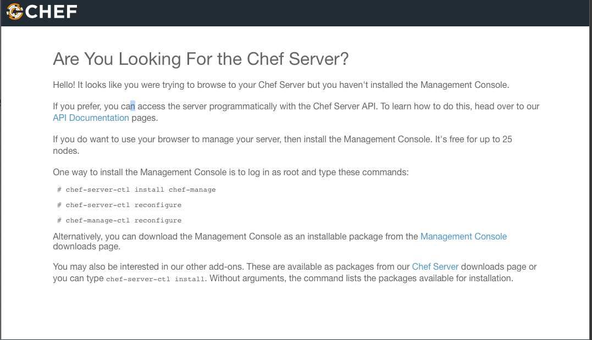

[Chef Manage](https://downloads.chef.io/manage)

### 新的菜谱`chef-server`和`chef-manage`

**`/enterprise-chef/attributes/default.rb`**

```
default['chefserver']['url'] = 'https://packages.chef.io/files/stable/chef-server/13.1.13/el/6/chef-server-core-13.1.13-1.el6.x86_64.rpm'
default['chefmanage']['url'] = 'https://packages.chef.io/files/stable/chef-manage/2.5.16/el/6/chef-manage-2.5.16-1.el6.x86_64.rpm'
```

**`/enterprise-chef/recipes/manage.rb`**

```
## Install chef manage

package_url = node['chefmanage']['url']
package_name = ::File.basename(package_url)
package_local_path = "#{Chef::Config[:file_cache_path]}/#{package_name}"

# omnibus_package is remote (i.e., a URL) let's download it
# 从一个远程位置（比如网站）传输一个文件 remote_file
remote_file package_local_path do
  source package_url
end

# 用操作系统提供的程序安装管理器安装一个程序包
package package_name do
  source package_local_path
  provider Chef::Provider::Package::Rpm
  notifies :run, 'execute[reconfigure-chef-manage]', :immediately
# notifies :before, :delayed, :immediate, :immediately
end

# reconfigure the installation
# execute actions: ":nothing" and ":run"
execute 'reconfigure-chef-manage' do
  command 'chef-server-ctl install chef-manage'
  command 'chef-manage-ctl reconfigure --accept-license'
  # action :nothing
  action :run
end
```

**`/enterprise-chef/recipes/default.rb`**

```
## Install chef server and then install  chef manage

package_url = node['chefserver']['url']
package_name = ::File.basename(package_url)
package_local_path = "#{Chef::Config[:file_cache_path]}/#{package_name}"

# omnibus_package is remote (i.e., a URL) let's download it
# 从一个远程位置（比如网站）传输一个文件 remote_file
remote_file package_local_path do
  source package_url
end

# 用操作系统提供的程序安装管理器安装一个程序包
package package_name do
  source package_local_path
  provider Chef::Provider::Package::Rpm
  notifies :run, 'execute[reconfigure-chef-server]', :immediately
# notifies :before, :delayed, :immediate, :immediately
end

# reconfigure the installation
# execute actions: ":nothing" and ":run"
execute 'reconfigure-chef-server' do
  # command 'chef-server-ctl install chef-manage'
  command 'chef-server-ctl reconfigure --chef-license=accept'
  # command 'chef-manage-ctl reconfigure'
  # action :run
  action :nothing
end

include_recipe 'enterprise-chef::manage'

include_recipe 'enterprise-chef::adduser'
include_recipe 'enterprise-chef::addorganization'
```


在我们的例子中，使用了`192.168.33.34`作为地址, 访问这个地址，在忽略关于`SSL`证书的警告之后，点击`Sign up`（注册）链接，如图提示你注册一个用户账户。填人相关信息，然后单击`Submit`（提交）按钮。

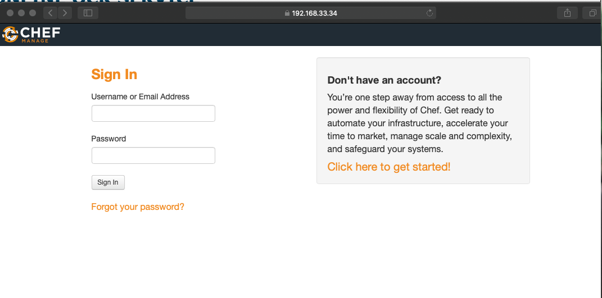

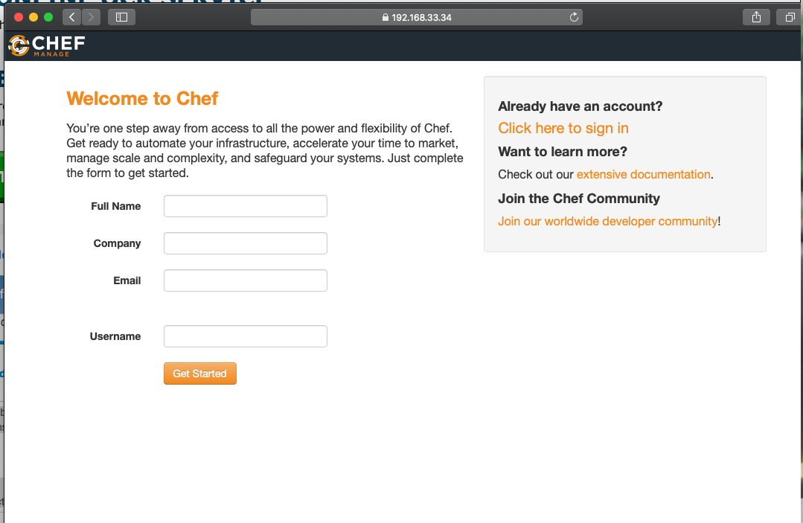

我们在用户账户中使用的值，当然，你使用的值会完全不一样 点击`Submit`按钮企业`Chef`的网页`UI`会告诉你下一步将创建一个组织。单击`Create（创建）`链接创建一个组织.

如图所示 组织代表公司或组织。`Chef`使用你指定的组织名称作为与`Chef`服务器验证组织身份的ID.图展示的是我们的设定中填写的组织信息。

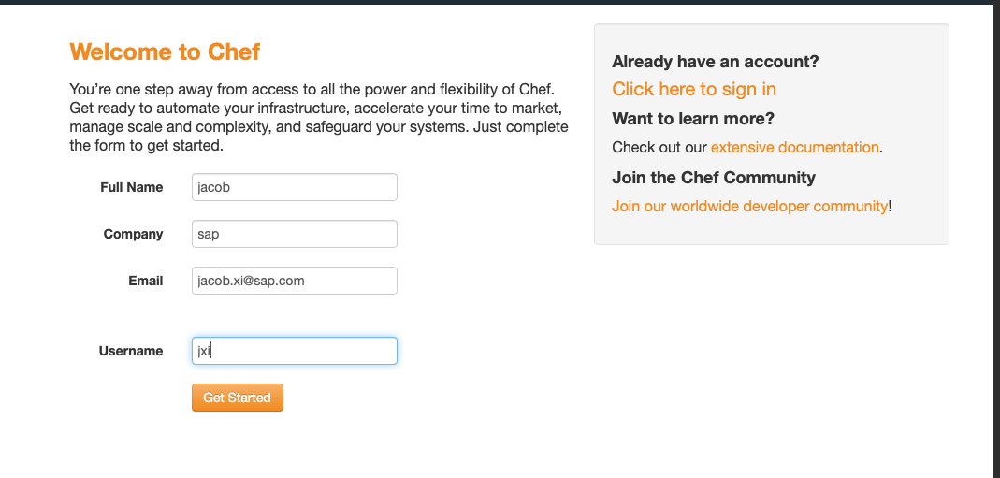

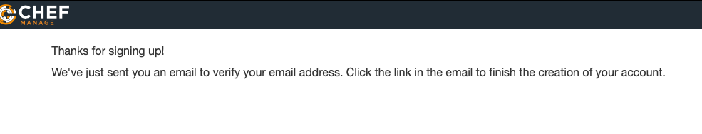

```
chef generate recipe adduser
```

**`/enterprise-chef/recipes/adduser.rb`**

```
execute 'Add-chef-server-newuser' do
    # command 'chef-server-ctl user-delete admin'
    command 'chef-server-ctl user-create admin John Smith john_smith@example.com password --filename=/tmp/admin.pem'
    action :run
    # action: nothing
end
```

* username: admin
* password: password


**`/enterprise-chef/recipes/addorganization.rb`**


```
#
# Cookbook:: enterprise-chef
# Recipe:: adduser
#
# Copyright:: 2019, The Authors, All Rights Reserved.

execute 'Add-chef-server-organization' do
    # command 'chef-server-ctl org-delete ja'
    command 'chef-server-ctl org-create  ja "Ja-Chef, Inc" --association_user admin --filename=/tmp/ja-validator.pem'
    # action :run
    action :run
end

# Create organization
# ja Ja-Chef, Inc
# --association_user admin

* username: ja
* password: Ja-Chef
```


单击`Create Organization`（创建组织）按钮后，提示你保存两个文件：**一个验证密钥和一 个`knife`配置文件**，


**创建组织**

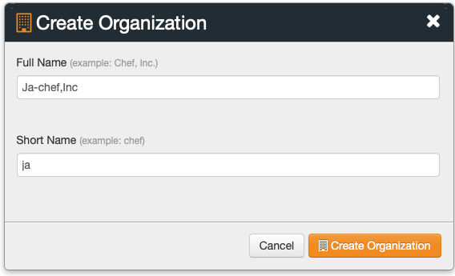

**选择组织**

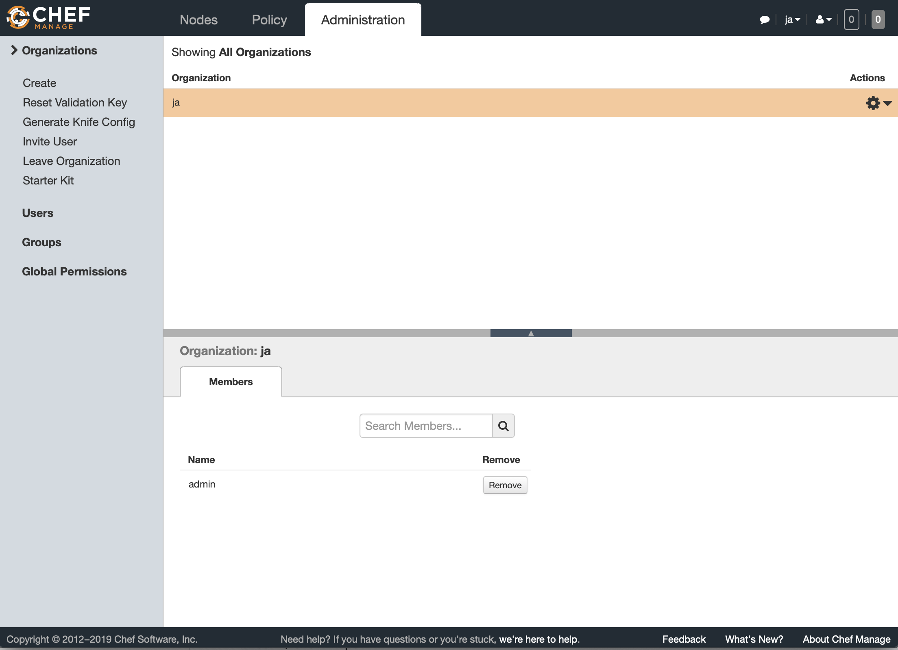

**下载秘钥(chef-repo)**

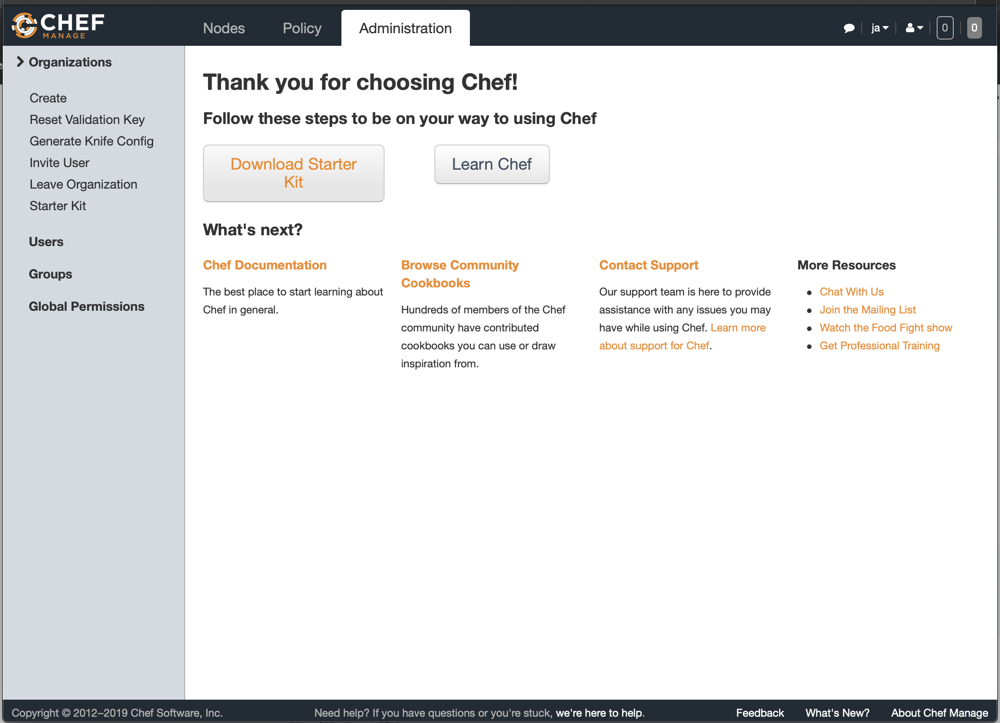

`kitchen login` to download `/tmp/ja-validator.pem`

```
$ kitchen login
Last login: Mon Dec  2 05:53:46 2019 from 172.16.72.2
Welcome to your Packer-built virtual machine.
[vagrant@default-centos65 ~]$ cd /tmp/
[vagrant@default-centos65 tmp]$ ls -la
total 72
drwxrwxrwt.  8 root          root           4096 Dec  2 05:47 .
dr-xr-xr-x. 22 root          root           4096 Dec  1 10:24 ..
drwxrwxrwt   2 root          root           4096 Dec  1 10:24 .ICE-unix
srwxrwxrwx   1 opscode-pgsql opscode-pgsql     0 Dec  2 05:31 .s.PGSQL.5432
-rw-------   1 opscode-pgsql opscode-pgsql    63 Dec  2 05:31 .s.PGSQL.5432.lock
-rw-r--r--   1 root          root           1678 Dec  2 05:47 admin.pem
drwxr-xr-x   3 opscode       opscode        4096 Dec  1 11:29 bundler
drwxr-xr-x   2 opscode       opscode        4096 Dec  1 11:31 hsperfdata_opscode
-rw-r--r--   1 root          root          23248 Dec  1 10:25 install.sh
-rw-r--r--   1 root          root           1678 Dec  2 05:47 ja-validator.pem
drwxrwxr-x   7 vagrant       vagrant        4096 Dec  1 10:30 kitchen
-rw-r--r--   1 root          root            368 Dec  1 10:25 stderr
drwx------   2 root          root           4096 Dec  1 10:25 vmware-root
drwx------   2 root          root           4096 Dec  1 10:25 vmware-root_1102-273056232
```


这三个文件都下载好后, 回到`chef-repo`目录将其作为当前目录， 然后创建一个`cehf-repo/.chef`子目录。 完成后, 你的`chef-repo`目录的结构如下所示


```
$ tree -a chef-repo/
chef-repo/
├── .chef
│   ├── admin.pem
│   ├── ja-validator.pem
│   └── knife.rb
├── .gitignore
├── README.md
├── cookbooks
│   ├── chefignore
│   └── starter
│       ├── attributes
│       │   └── default.rb
│       ├── files
│       │   └── default
│       │       └── sample.txt
│       ├── metadata.rb
│       ├── recipes
│       │   └── default.rb
│       └── templates
│           └── default
│               └── sample.erb
└── roles
    └── starter.rb

10 directories, 12 files

```

* `<usernamee>.pem`文件是用来向`Chef`服务器验证你用户身份的密钥。要把它视作密码井且 不要修改文件内容。 
* `<organization>.pem`文件是用来向`Chef`服务器验证组织身份的密钥。也要把创见为密码，但要共享给组织内所有的`Chef`开发者。任何需要访问`Chef`的组织内邹人员都需要这个文件。不要更改文件内容。 


### `RSA`钥匙对儿 

`Chef`的`pem`文件包含注册过程中生成的`RSA`私钥。`Chef`为你的组织生成一个`RSA`钥匙对儿公钥存储在企业`Chef`在服务器上并在程序向`Chef`服务器发送诗求时用来验证组织的身份 


不像`.pem`文件，`knife`文件可以更改或自定义。`knife.rb`文件是一个`Ruby`文件，执行命令时读取这个文件 


```
$ knife client list
ERROR: SSL Validation failure connecting to host: default-centos65.vagrantup.com - SSL_connect returned=1 errno=0 state=error: certificate verify failed (self signed certificate)
ERROR: Could not establish a secure connection to the server.
Use `knife ssl check` to troubleshoot your SSL configuration.
If your server uses a self-signed certificate, you can use
`knife ssl fetch` to make knife trust the server's certificates.

Original Exception: OpenSSL::SSL::SSLError: SSL Error connecting to https://default-centos
```

```
current_dir = File.dirname(__FILE__)
log_level                :info
log_location             STDOUT
node_name                "admin"
client_key               "#{current_dir}/admin.pem"
chef_server_url          "https://default-centos65.vagrantup.com/organizations/ja"
cookbook_path            ["#{current_dir}/../cookbooks"]
ssl_verify_mode          :verify_none 
```

我们例子中的`chef_server_url`使用了假的`DNS`主机名`default-centos65.vagrantup.com`因为这是`vagrant`设定的主机名。如果你试图访问`"https://default-centos65.vagrantup.com/organizations/ja"`,会发现它是无效的

`Chef`服务器需要机器拥有能够正确解析的完整域名（FQDN)。在生产环境中应该在安装`chef`服务器之前在域名(`DNS`)服务器中设定`Chef`的主机名。在我们的实验中为方便起见让我们把`default-centos65.vagrantup.com`加到机器的本地`host`数据库 

运行以下命令向`host`数据添加内容。

**Linux/Mac OS X:**

```
$ sudo sh -c "echo '192.168.33.34 default-centos65.vagrantup.com' >> /etc/hosts" 
```


现在, 如果你在浏览器中访问`https://default-centos65.vagrantup.com`, 主机会认为它是一个有效的地址 

可以在`knife.rb`中添加其他设置，比如`EC2`的用户信息、代理信息、加密数据包设定等你和你组织内其他成员的`knife.rb`会有所不同，很多内容是针对用户和所用的开发机器的。除非将密码或访问密钥存储在`knife.rb`配置文件中，否则不需将其视为密码． 

## 测试连接 

在`Chef`目录下运行以下命令。打开命令行程序并将`chef-repo`做为当前工作目录 

```
$ cd ~/chef-repo
``` 
现在， 你可以使用`knife` (`Chef`服务器的命令行工具）来测试你和`Chef`服务器的连接和 身份验证。

在写作本书时，`Chef`尚未提供一个专门用来”测试连接“的命令。然而，通过询问`Chef`服务器来列举客户端，我们可以验证以下几点 

* 网络可以连接到服务器。 
* 验证文件都在正确的位置。 
* `Chef`读卖取验证文件。 
* 开发工作站可以收到来自`Chef`服务器的反馈。 


在命令行程序中运行`knife client list`命令，你会见到以下输出： 

```
$ knife client list
ja-validator
```
如果你遇到错误，可以检查以下项目。

1. 确认你可以从网页浏览器访问命令  
2. 确认你在`chef-repo`目录内运行命令。 
3. 确认`.chef`目录包含两个`.pem`文件以及一个`knife.rb`文件。 
4. 确认你的身份验证文件拥有正确的文件权限（只有用户可读）。 

如果确认以上都设定正确但仍然无法连接到`Chef`服务器，

验证开发机器可以连接到`Chef`服务器之后，让我们创建另一个菜谱，使测试节点可注册并交由Chef服务器管理。 


## 准备一个新节点(chef-client) 

`Chef`用"Bootstraping" 这个术语来指代将一个远程系统谁务好由`chef`来管理的过程。

这个过程包括在节点上安装`Chef`客户端井将其与`Chef`服务器注册。在此， 我们`bootstrap`翻译为“准备”， 但由于在真实环掩和此准备过程通常是节点启动后的第一项任务， 所以`bootstrap`节点, 也经常可以理解为启动新的节点 

### 在沙盒环境中创建节点 

跟我们, 类似让我们使用`Test Kitchen`来定义一个项目在沙盒环境中创想一个节点
 
在与先前创建的`chef server`目录平行的位界创建个`node`目录,这其实部署菜谱， 只是一个
是`Test Kitchen`项目， 但将其位于`chef-Server`的平行位置有助于我们来回切换． 

创建` ~/chef-repo/cookbooks/node`目录, 并将其作为当前工作目录 

```
$ cd ~/chef-repo/cookbooks
$ mkdir node
$ cd node
```

```
$ knife client list
ja-validator
```

# `Chef`服务器同时管理多个节点


`Chef`服务器是你基础架构配置数据的中央存储。它存储并索引菜谱、环境、模板、元数 据、文件和分布策略。`Chef`服务器包含所有其管理的机器的信息、。 


**`Chef`服务器同时包含一个页面服务器， 菜谱存储， 网页界面， 消息队列以及后端数据库**


**网络胭务器** 

`nginx`网络服务器是个简单的反向代理服务器．`Chef`服务器用它作为前端的界面，它同时为`chef`服务器提供负载平衡。所有到`Chef`服务器的`API`请求都通过`nginx`服务器来路由。 


**WebUI**

 
`WebUI`是面向用户的网页应用程序，为用户提供一个从网页上与`Chef`服务器交互的界面。它是个`Ruby on Rails`应用程序

**`Chef`务器(`Erchef`)** 

`Erehef`是`Chef`服务器负责处理`API`请求的组件。 `Chef`服务器用户`Erlang`编程语言写，支持高井发和高可靠性。`Erehef`是`Chef`服务器的核心`API`

**`Bookshelf`**

`Bookshelf`是所有`Chef`菜谱和菜谱内容(比如文件、模板， 定义元数据和配方单）的中央存储。`Bookshelf`是一个平坦的文们数据库, 井特意存储于`Chef`服务器的索引之外 

**搜索索引** 

搜索索引是个`Apache Solr`服务器， 它负责内部和外部许多`API`请求的索引和搜索。搜索索引服务和外界交互的组件叫`chef-solr` 它提供`Restful`的`API` 

**消息队列** 

此队列系统处理所有被发送到搜索索引的消息。这些队列由开源的`RabbitMQ`队列系统管理。`chef-expander`从消息对列中获取消息， 然后发送至搜索索引。 

**数据库**
 
`Chef`使用`PostgreSQL`来存储数据。在`Chef 11`之前, 主要数据库为`CouchDB`但后来 由于`CouchDB`的伸缩性问题`PostgreSQL`代替

How to Install Enterprise Chef Server Manually

 
## 手动安装`chef-workstation`(chef-workstation)

Go to [https://downloads.chef.io/chef-workstation/#mac_os_x](https://downloads.chef.io/chef-workstation/#mac_os_x) and provide your contact information to receive download details and installation instructions for Enterprise Chef Server.


## 使用菜谱来自动化安装企业`Chef`服务器 

假设你有足够的系统资源在本地安装企业`Chef`服务器以及配置一个测试试节点，创建一个`enterprise-chef`(chef-workstation)菜谱来安装企业`Chef`服务器。

为了和托管企业Chef保持一致，创建`chef-repo/cookbooks`目录并在目录中创建`enterprise`菜谱。顶级的`chef-repo`目录可以存放管理企业`Chef`所需要的除菜谱以外的其他文件。因为你会使用若干个菜谱，所以这里建议将`enterprise`菜谱存放在`chef-repo/cookbooks`子目录内。 创建`chef-repo/cookbooks`目录并将它作为当前工作目录。 


**Linux/Mac OS X:**

```
$ mkdir -p chef-repo/cookbooks
$ cd chef-repo/cookbooks
```

然后通过`chef generate cookbook`或`knife cookbook` 菜谱（取决于你使用`Chef`开发包还是Chef客户端）。 

**Chef Development Kit:**

```
$ chef generate cookbook enterprise-chef
$ cd enterprise-chef
```

**Chef Client:**

```
$ knife cookbook create enterprise-chef --cookbook-path .
$ cd enterprise-chef
$ kitchen init --create-gemfile
$ bundle install
```

**`enterprise-chef/kitchen.yml`**

```
---
driver:
  name: vagrant
  provider: vmware_desktop

provisioner:
  name: chef_solo

platforms:
  - name: centos65
    driver:
      box: learningchef/centos65
      box_url: learningchef/centos65
      network:
      - ["private_network", {ip: "192.168.33.34"}]
      customize:
        memory: 1536

suites:
  - name: default
    run_list:
      - recipe[enterprise-chef::default]
    attributes:
```

Chef Development Kit:

```
$ chef generate attribute default
```

Chef Client:

```
$ touch attributes/default.rb
```


**`attributes/default.rb`**

old:

```
default['enterprise-chef']['url'] = \
'https://s3.amazonaws.com/opscode-private-chef/el/6/x86_64/'\
'private-chef-11.1.8-1.el6.x86_64.rpm'
```

new chef-server-core:

```
default['enterprise-chef']['url'] = 'https://packages.chef.io/files/stable/chef-server/13.1.13/el/6/chef-server-core-13.1.13-1.el6.x86_64.rpm'
```

new chef Management Console:

[https://downloads.chef.io/manage](https://downloads.chef.io/manage)

```
default['enterprise-chef']['url'] = 'https://packages.chef.io/files/stable/chef-manage/2.5.16/el/6/chef-manage-2.5.16-1.el6.x86_64.rpm'
```

**finall version**

```
default['enterprise-chef']['url'] = 'https://packages.chef.io/files/stable/chef-manage/2.5.16/el/6/chef-manage-2.5.16-1.el6.x86_64.rpm
```

**`/enterprise-chef/recipes/default.rb`**


```
#
# Cookbook:: enterprise-chef
# Recipe:: default
#
# Copyright:: 2019, The Authors, All Rights Reserved.

package_url = node['enterprise-chef']['url']
package_name = ::File.basename(package_url)
package_local_path = "#{Chef::Config[:file_cache_path]}/#{package_name}"

# omnibus_package is remote (i.e., a URL) let's download it
remote_file package_local_path do
  source package_url
end

package package_local_path

# reconfigure the installation
# execute 'private-chef-ctl reconfigure'
execute 'chef-server-ctl reconfigure --chef-license=accept'
# "--chef-license=accept"
# STDOUT: Chef Infra Server cannot execute without accepting the license
```


如果不想在菜谱中总是使用`node['enterprise-chef']['url'］`这样长的变量，可以将其 存储在一个短的本地变量中，比如：

```
package_url = node['enterprise-chef']['url']
``` 

记住，在`Chef`配方单中，你可以使用Ruby编程语言提供的任何功能。**例如，可以使用`::File.basename(）` 方法来从下载`URL`中提取安装包的名字。**  

在这个例子中，安装包的名字是URL中最后一个斜杠后的组件：`'private-chef-11.1.8-1.el6.x86_64.rpm` 如果想进一步了解`Ruby`的`::File`类，可以访问`Ruby`核心`API`文档

```
package_name = ::File.basename(package_url)
```

不幸的是，我们熟悉的`package`资源并不接受通过指定远程`URL`来安装程序包，所以这里要介绍一个新的资源:`remote_file`资源。

**`remote_file`资源提供从远程下载文件的功能我们在此要通过`remote_file`资源从远程`URL` 下载安装包，并用`package`资源安装本地的安装包。**

我们需要先将安装包下载到一个临时位置。与其使用固定的临时下载位置 (如`"/tmp"`)，不如用`Chef`提供的一个你可以使用的变量：`Chef::Config[:file_cache_path]`。通过这个变量，`Chef`绝对定最佳的临时存储位置。将所要的临时存储位置作为参数传递给`remote_file`，并将远程`URL`作为`source`属性传递 

在执行`chef-server-ctl reconfigure`前，我们需要介绍另一个新的资源：`execute`资 源。有时，无法找到一个现有的资源满足自己需求时，你可以使用`execute`资源来执行任意命令。你只需要将想执行的命令字符串传递至`execute`资源。 


```
$ kitchen list
Instance          Driver   Provisioner  Verifier  Transport  Last Action    Last Error
default-centos65  Vagrant  ChefSolo     Busser    Ssh        <Not Created>  <None>

$ kitchen converge default-centos65

$ kitchen list
Instance          Driver   Provisioner  Verifier  Transport  Last Action  Last Error
default-centos65  Vagrant  ChefZero     Busser    Ssh        Converged    <None>

$  kitchen login default-centos65
Last login: Sun Dec  1 09:07:26 2019 from 172.16.72.2
Welcome to your Packer-built virtual machine.

$ rpm -q chef-server-core
chef-server-core-13.1.13-1.el6.x86_64

[vagrant@default-centos65 ~]$ exit
logout
Connection to 127.0.0.1 closed.
```


## 幂等性简介(Idempotence)

虽然我们写的配方单作为第一个版本一可以达成我们的目的，但它并不幂等。

幂等的`Chef`代码意味着你可以重复运行无数次而结果完全一样，并不会因为运行多次而产生不同的效果。几乎所有默一认的`Chef`资源都保证幂等性，唯一的例外是`execute`资源。 

`execute`资源一般并不幂等，因为大多数命令行工具假设操作它的人了解系统的现状。 比如，假设`/learningchef/files1.txt`文件存在，以下`mv`命令在第一次运行时有效，但在第二次运行时会失败： 


```
$ mv /learningchef/file1.txt /file1.txt
```

测试`Chef`配方单是否幂等的一个好方法是运行`kitchen converge`两次。一次运行没有产生任何动作时，运行的结果应该显示`0`个资源被更新。 


**Does our recipe pass the idempotency test? Sadly, no. Here’s a sampling of the output from an initial kitchen converge:**
 
```
$ kitchen converge default-centos65
...
 Installing Cookbook Gems:
       Compiling Cookbooks...
       Converging 3 resources
       Recipe: enterprise-chef::default
         * remote_file[/tmp/kitchen/cache/chef-server-core-13.1.13-1.el6.x86_64.rpm] action create (up to date)
         * yum_package[/tmp/kitchen/cache/chef-server-core-13.1.13-1.el6.x86_64.rpm] action install (up to date)
         * execute[chef-server-ctl reconfigure --chef-license=accept] action run
           - execute chef-server-ctl reconfigure --chef-license=accept
       
       Running handlers:
       Running handlers complete
       Chef Infra Client finished, 1/3 resources updated in 04 minutes 51 seconds
       Downloading files from <default-centos65>
       Finished converging <default-centos65> (5m4.35s).
```


以下是第二次运行的输出`Chef`认为它仍然需要吏新资源`3`个资源中的`2`个在第二次运行时被更新。如果配方**幂等**，**我们应该看到`0`个资源被更新`Chef`应该检查系统状态确定没有需要更新的资源**； 

```
$ kitchen converge
...
 Converging 3 resources
       Recipe: enterprise-chef::default
         * remote_file[/tmp/kitchen/cache/chef-server-core-13.1.13-1.el6.x86_64.rpm] action create (up to date)
         * yum_package[/tmp/kitchen/cache/chef-server-core-13.1.13-1.el6.x86_64.rpm] action install (up to date)
         * execute[chef-server-ctl reconfigure --chef-license=accept] action run
           - execute chef-server-ctl reconfigure --chef-license=accept
       
       Running handlers:
       Running handlers complete
       Chef Infra Client finished, 1/3 resources updated in 53 seconds
       Downloading files from <default-centos65>
       Finished converging <default-centos65> (1m7.63s).
-----> Kitchen is finished. (1m8.27s)

```

**像前面提及的一样, 大多数默认`Chef`资源是具备幂等性。注意`remote_file`。资源是幂等的。从输出可以看到它汇报了（up to date)。 `package`资源通常也是幂等的**.

在本例中．我们故意创造了一些清境使其在`RedHat`系列系统中出现一些幂等性问题，后面将展示如何解决。 

在第二次通过`kitchen converge`执行`Chef`运行，我们发现一些`package`和`execute`资源的幂等性问题。 

1. 重新安装`rpm`安装包，可有可无。 
2. 再次执行`chef-server一ctl reconfigure`命令。 

让我们解决这些代码中的幂等性问题，最后版本的完全幂等的`Chef`代码

#### 第一个重复安装的问题是`Chef`开发者使用从一个远程下载到本地的`rpm`安装包时常见的问题。

**与其只是将一个远程下载的`rpm`传递给`package`资源，还不如通过`provider`属性告诉 `package`资源使用`Chef::Provider::Package::Rpm`提供者。同时需要制定安装包名字字符串和通过`source`属性指定本地的安装包地址**： 


```
package package_name do
  source package_local_path
  provider Chef::Provider::Package::Rpm
end
```

**可以使用`rpm_package`对`package`资源指定 `Chef::Provider::Package::Rpm`提供者提供者**。

以下代码等同于以上

```
rpm_package package_name do
  source package_local_path
end
```

#### 解决第二个`execute`资源该复执行命令的问题相对复杂一些。可以使用`Chef`内建的资源完成任务时就不要使用`execute`资源，因为你需要负责控制幂等性。
 
**解决这个问题的一个方法是使用`not_if`来保护`execute`资源。这样在`not_if`中指定的测试会先执行，如果测试成功，证明系统已经在理想状态下，则不需要做任何事情**。

在本例中，我们可以使用这种方法测试`chef-server`安装包是否已经安装。如下所示，我们在`execute`资源中添加`not_if`语句。`not_if`会测试其中的命令的退出代码是否0, 如果是`execute`资源就不做任何事情 

```
execute "chef-server-ctl reconfigure" do
  not_if "rpm -q chef-server"
end
```

虽然可以这样解决幂等性问题，但并不是特别理想。你需要找到合适的方法来判定`Chef`服务器是否已经成功安装，而我们例子中的方法并不是那么可靠。另外一种解决这有问题的方法是只有在前面所做的`package`资源安装执行的时候才使用`execute`资源执行若令否则不执行`execute`资源。可以通过`notifies`语句来通知执行其他资源。 


**要想使用`notifies`，我们需要对为此，`execute`资源语句做一些改变**。

**首先，需要使其在独立处理时不做任何事情，我们可以添加`action :nothing`属胜**。

然后，我们需要将其运行命令移到`command`属性中，从而在其他资源中通过更短的名字来通知此资源。默认情况下，被传人`execute`资源的`name`属性被作为`command`属胜使用。

当我们想用一行代码来运行一个命令时，这样做很好，但想在其他资源中通知这个资源时则不是最理想的方法，因为你需要在其他资源中指定整个命令。现在我对`execute`资源做出以下改变： 


```
# reconfigure the installation
execute 'reconfigure-chef-server' do
  command 'chef-server-ctl reconfigure'
  action :nothing
end
```

然后在`package`资源中添加`notifies`属性，如下所示。

* `notifies`属性接受三个参数**动作、要通知的资源的名字和执行动作的时间**。

**如以下代码所，我们想通知`execute[reconfigure-chef-server] `资源执行`:run`动作，并立即执行。**

```
#
# Cookbook:: enterprise-chef
# Recipe:: default
#
# Copyright:: 2019, The Authors, All Rights Reserved.

package_url = node['enterprise-chef']['url']
package_name = ::File.basename(package_url)
package_local_path = "#{Chef::Config[:file_cache_path]}/#{package_name}"

# omnibus_package is remote (i.e., a URL) let's download it
# 从一个远程位置（比如网站）传输一个文件 remote_file
remote_file package_local_path do
  source package_url
end

# 用操作系统提供的程序安装管理器安装一个程序包
package package_name do
  source package_local_path
  provider Chef::Provider::Package::Rpm
  notifies :run, 'execute[reconfigure-chef-server]', :immediately
# notifies :before, :delayed, :immediate, :immediately
end

# reconfigure the installation
# execute actions: ":nothing" and ":run"
execute 'reconfigure-chef-server' do
  command 'private-chef-ctl reconfigure'
  action :nothing
end
```

**使用这个版本的代码再次运行`kitchen converge`.井在输出中注意它汇报的是`0`个资源被更新**：

```
$ kitchen converge
 Compiling Cookbooks...
       Converging 3 resources
       Recipe: enterprise-chef::default
         * remote_file[/tmp/kitchen/cache/chef-server-core-13.1.13-1.el6.x86_64.rpm] action create (up to date)
         * yum_package[chef-server-core-13.1.13-1.el6.x86_64.rpm] action install (up to date)
         * execute[reconfigure-chef-server] action nothing (skipped due to action :nothing)
       
       Running handlers:
       Running handlers complete
       Chef Infra Client finished, 0/3 resources updated in 04 seconds
       Downloading files from <default-centos65>
       Finished converging <default-centos65> (0m18.04s).
```

这是我们期待的结果，`Chef`没有执行任何资源对系统作出任何改变： 


在日常工作中，在部署到生产环境之前，始终要检查配方单是否幂等。在本例中，如果我们将第一个版本的配方单部署到生产环境，一般来讲在生产环境中的节点上`Chef-client`会定期运行（比如每15分钟），所有在运行清单中拥有此配方单的节点将每15分钟重新安装一次`Chef`服务器！ 


## 配置企业Chef服务器 

如果成功安装`Chef`服务器，就可以在浏览器中使用你在`kitehen.yml`中设定的`private network ip`地址访问服务器管理网页。


[Chef Manage](https://downloads.chef.io/manage)

### 新的菜谱`chef-server`和`chef-manage`

**`/enterprise-chef/attributes/default.rb`**

```
default['chefserver']['url'] = 'https://packages.chef.io/files/stable/chef-server/13.1.13/el/6/chef-server-core-13.1.13-1.el6.x86_64.rpm'
default['chefmanage']['url'] = 'https://packages.chef.io/files/stable/chef-manage/2.5.16/el/6/chef-manage-2.5.16-1.el6.x86_64.rpm'
```

**`/enterprise-chef/recipes/manage.rb`**

```
## Install chef manage

package_url = node['chefmanage']['url']
package_name = ::File.basename(package_url)
package_local_path = "#{Chef::Config[:file_cache_path]}/#{package_name}"

# omnibus_package is remote (i.e., a URL) let's download it
# 从一个远程位置（比如网站）传输一个文件 remote_file
remote_file package_local_path do
  source package_url
end

# 用操作系统提供的程序安装管理器安装一个程序包
package package_name do
  source package_local_path
  provider Chef::Provider::Package::Rpm
  notifies :run, 'execute[reconfigure-chef-manage]', :immediately
# notifies :before, :delayed, :immediate, :immediately
end

# reconfigure the installation
# execute actions: ":nothing" and ":run"
execute 'reconfigure-chef-manage' do
  command 'chef-server-ctl install chef-manage'
  command 'chef-manage-ctl reconfigure --accept-license'
  # action :nothing
  action :run
end
```

**`/enterprise-chef/recipes/default.rb`**

```
## Install chef server and then install  chef manage

package_url = node['chefserver']['url']
package_name = ::File.basename(package_url)
package_local_path = "#{Chef::Config[:file_cache_path]}/#{package_name}"

# omnibus_package is remote (i.e., a URL) let's download it
# 从一个远程位置（比如网站）传输一个文件 remote_file
remote_file package_local_path do
  source package_url
end

# 用操作系统提供的程序安装管理器安装一个程序包
package package_name do
  source package_local_path
  provider Chef::Provider::Package::Rpm
  notifies :run, 'execute[reconfigure-chef-server]', :immediately
# notifies :before, :delayed, :immediate, :immediately
end

# reconfigure the installation
# execute actions: ":nothing" and ":run"
execute 'reconfigure-chef-server' do
  # command 'chef-server-ctl install chef-manage'
  command 'chef-server-ctl reconfigure --chef-license=accept'
  # command 'chef-manage-ctl reconfigure'
  # action :run
  action :nothing
end

include_recipe 'enterprise-chef::manage'

include_recipe 'enterprise-chef::adduser'
include_recipe 'enterprise-chef::addorganization'
```


在我们的例子中，使用了`192.168.33.34`作为地址, 访问这个地址，在忽略关于`SSL`证书的警告之后，点击`Sign up`（注册）链接，如图提示你注册一个用户账户。填人相关信息，然后单击`Submit`（提交）按钮。


我们在用户账户中使用的值，当然，你使用的值会完全不一样 点击`Submit`按钮企业`Chef`的网页`UI`会告诉你下一步将创建一个组织。单击`Create（创建）`链接创建一个组织.

如图所示 组织代表公司或组织。`Chef`使用你指定的组织名称作为与`Chef`服务器验证组织身份的ID.图展示的是我们的设定中填写的组织信息。


```
chef generate recipe adduser
```

**`/enterprise-chef/recipes/adduser.rb`**

```
execute 'Add-chef-server-newuser' do
    # command 'chef-server-ctl user-delete admin'
    command 'sudo chef-server-ctl user-create admin John Smith john_smith@example.com password --filename=/etc/chef/admin.pem'
    action :run
    # action: nothing
end
```

* username: admin
* password: password


**`/enterprise-chef/recipes/addorganization.rb`**


```
#
# Cookbook:: enterprise-chef
# Recipe:: adduser
#
# Copyright:: 2019, The Authors, All Rights Reserved.

execute 'Add-chef-server-organization' do
    # command 'chef-server-ctl org-delete ja'
    command 'sudo chef-server-ctl org-create  ja "Ja-Chef, Inc" --association_user admin --filename=/etc/chef/ja-validator.pem'
    # action :run
    action :run
end

# Create organization
# ja Ja-Chef, Inc
# --association_user admin

* username: ja
* password: Ja-Chef
```


单击`Create Organization`（创建组织）按钮后，提示你保存两个文件：**一个验证密钥和一 个`knife`配置文件**，


**创建组织**


**选择组织**


**下载秘钥(chef-repo)**


`kitchen login` to download `/tmp/ja-validator.pem`

```
$ kitchen login
Last login: Mon Dec  2 05:53:46 2019 from 172.16.72.2
Welcome to your Packer-built virtual machine.
[vagrant@default-centos65 ~]$ cd /tmp/
[vagrant@default-centos65 tmp]$ ls -la
total 72
drwxrwxrwt.  8 root          root           4096 Dec  2 05:47 .
dr-xr-xr-x. 22 root          root           4096 Dec  1 10:24 ..
drwxrwxrwt   2 root          root           4096 Dec  1 10:24 .ICE-unix
srwxrwxrwx   1 opscode-pgsql opscode-pgsql     0 Dec  2 05:31 .s.PGSQL.5432
-rw-------   1 opscode-pgsql opscode-pgsql    63 Dec  2 05:31 .s.PGSQL.5432.lock
-rw-r--r--   1 root          root           1678 Dec  2 05:47 admin.pem
drwxr-xr-x   3 opscode       opscode        4096 Dec  1 11:29 bundler
drwxr-xr-x   2 opscode       opscode        4096 Dec  1 11:31 hsperfdata_opscode
-rw-r--r--   1 root          root          23248 Dec  1 10:25 install.sh
-rw-r--r--   1 root          root           1678 Dec  2 05:47 ja-validator.pem
drwxrwxr-x   7 vagrant       vagrant        4096 Dec  1 10:30 kitchen
-rw-r--r--   1 root          root            368 Dec  1 10:25 stderr
drwx------   2 root          root           4096 Dec  1 10:25 vmware-root
drwx------   2 root          root           4096 Dec  1 10:25 vmware-root_1102-273056232
```


这三个文件都下载好后, 回到`chef-repo`目录将其作为当前目录， 然后创建一个`cehf-repo/.chef`子目录。 完成后, 你的`chef-repo`目录的结构如下所示


```
$ tree -a chef-repo/
chef-repo/
├── .chef
│   ├── admin.pem
│   ├── ja-validator.pem
│   └── knife.rb
├── .gitignore
├── README.md
├── cookbooks
│   ├── chefignore
│   └── starter
│       ├── attributes
│       │   └── default.rb
│       ├── files
│       │   └── default
│       │       └── sample.txt
│       ├── metadata.rb
│       ├── recipes
│       │   └── default.rb
│       └── templates
│           └── default
│               └── sample.erb
└── roles
    └── starter.rb

10 directories, 12 files

```

* `<usernamee>.pem`文件是用来向`Chef`服务器验证你用户身份的密钥。要把它视作密码井且 不要修改文件内容。 
* `<organization>.pem`文件是用来向`Chef`服务器验证组织身份的密钥。也要把创见为密码，但要共享给组织内所有的`Chef`开发者。任何需要访问`Chef`的组织内邹人员都需要这个文件。不要更改文件内容。 


### `RSA`钥匙对儿 

`Chef`的`pem`文件包含注册过程中生成的`RSA`私钥。`Chef`为你的组织生成一个`RSA`钥匙对儿公钥存储在企业`Chef`在服务器上并在程序向`Chef`服务器发送诗求时用来验证组织的身份 


不像`.pem`文件，`knife`文件可以更改或自定义。`knife.rb`文件是一个`Ruby`文件，执行命令时读取这个文件 


```
$ knife client list
ERROR: SSL Validation failure connecting to host: default-centos65.vagrantup.com - SSL_connect returned=1 errno=0 state=error: certificate verify failed (self signed certificate)
ERROR: Could not establish a secure connection to the server.
Use `knife ssl check` to troubleshoot your SSL configuration.
If your server uses a self-signed certificate, you can use
`knife ssl fetch` to make knife trust the server's certificates.

Original Exception: OpenSSL::SSL::SSLError: SSL Error connecting to https://default-centos
```

```
current_dir = File.dirname(__FILE__)
log_level                :info
log_location             STDOUT
node_name                "admin"
client_key               "#{current_dir}/admin.pem"
chef_server_url          "https://default-centos65.vagrantup.com/organizations/ja"
cookbook_path            ["#{current_dir}/../cookbooks"]
ssl_verify_mode          :verify_none 
```

我们例子中的`chef_server_url`使用了假的`DNS`主机名`default-centos65.vagrantup.com`因为这是`vagrant`设定的主机名。如果你试图访问`"https://default-centos65.vagrantup.com/organizations/ja"`,会发现它是无效的

`Chef`服务器需要机器拥有能够正确解析的完整域名（FQDN)。在生产环境中应该在安装`chef`服务器之前在域名(`DNS`)服务器中设定`Chef`的主机名。在我们的实验中为方便起见让我们把`default-centos65.vagrantup.com`加到机器的本地`host`数据库 

运行以下命令向`host`数据添加内容。

**Linux/Mac OS X:**

```
$ sudo sh -c "echo '192.168.33.34 default-centos65.vagrantup.com' >> /etc/hosts" 
```


现在, 如果你在浏览器中访问`https://default-centos65.vagrantup.com`, 主机会认为它是一个有效的地址 

可以在`knife.rb`中添加其他设置，比如`EC2`的用户信息、代理信息、加密数据包设定等你和你组织内其他成员的`knife.rb`会有所不同，很多内容是针对用户和所用的开发机器的。除非将密码或访问密钥存储在`knife.rb`配置文件中，否则不需将其视为密码． 

### 测试连接 

在`Chef`目录下运行以下命令。打开命令行程序并将`chef-repo`做为当前工作目录 

```
$ cd ~/chef-repo
``` 
现在， 你可以使用`knife` (`Chef`服务器的命令行工具）来测试你和`Chef`服务器的连接和 身份验证。

在写作本书时，`Chef`尚未提供一个专门用来”测试连接“的命令。然而，通过询问`Chef`服务器来列举客户端，我们可以验证以下几点 

* 网络可以连接到服务器。 
* 验证文件都在正确的位置。 
* `Chef`读卖取验证文件。 
* 开发工作站可以收到来自`Chef`服务器的反馈。 


在命令行程序中运行`knife client list`命令，你会见到以下输出： 

```
$ knife client list
ja-validator
```
如果你遇到错误，可以检查以下项目。

1. 确认你可以从网页浏览器访问命令  
2. 确认你在`chef-repo`目录内运行命令。 
3. 确认`.chef`目录包含两个`.pem`文件以及一个`knife.rb`文件。 
4. 确认你的身份验证文件拥有正确的文件权限（只有用户可读）。 

如果确认以上都设定正确但仍然无法连接到`Chef`服务器，

验证开发机器可以连接到`Chef`服务器之后，让我们创建另一个菜谱，使测试节点可注册并交由Chef服务器管理。 


## 准备一个新节点 

`Chef`用"Bootstraping" 这个术语来指代将一个远程系统谁务好由`chef`来管理的过程。

这个过程包括在节点上安装`Chef`客户端井将其与`Chef`服务器注册。在此， 我们`bootstrap`翻译为“准备”， 但由于在真实环掩和此准备过程通常是节点启动后的第一项任务， 所以`bootstrap`节点, 也经常可以理解为启动新的节点 

### 在沙盒环境中创建节点 

跟我们, 类似让我们使用`Test Kitchen`来定义一个项目在沙盒环境中创想一个节点
 
在与先前创建的`chef server`目录平行的位界创建个`node`目录,这其实部署菜谱， 只是一个
是`Test Kitchen`项目， 但将其位于`chef-Server`的平行位置有助于我们来回切换． 

创建` ~/chef-repo/cookbooks/node`目录, 并将其作为当前工作目录 

```
$ cd ~/chef-repo/cookbooks
$ mkdir node
$ cd node
```

```
$ knife client list
ja-validator
```

这个`node`目录是一个`Test Kitchen`项目而不是菜谱因此，运行以下命令创建一个名为`kitchen.yml`的`Test Kitchen`文件 

```
$ kitchen init --create-gemfile
      create  kitchen.yml
      create  chefignore
      create  test/integration/default
      create  Gemfile
      append  Gemfile
You must run `bundle install' to fetch any new gems.


$  bundle install
Fetching gem metadata from https://rubygems.org/.........
Fetching gem metadata from https://rubygems.org/.
Resolving dependencies...
Using bcrypt_pbkdf 1.0.1
Using builder 3.2.3
Using bundler 2.0.2
..
```

编辑`kitchen.yml`文件以使用为本书准备的`CentOS 6.5`机器模板。 同时像我们在第7章中做过的一样，分配一个私有网络地址。我们的例子将使用`192.168.33.35`, 确保使用的地址和你的Chef服务器地址〔在我们的例子中为`192.168.33.34`)不相冲突 


注意在`suites`下我们把这个实例命名为`node`因为这个沙盒环境将运行我们的侧试节点。我们还有另外一个沙盒环境运行着`Chef`服务器。指定完全不同的名字有助干区分不同的沙盒环境. 


同时我们为`chef-repo`录配置了同步所示，`Vagrant`可以将`Chef`开发机器上的目录与沙盒环境巾的虚拟机巾的目录进行同步。


 
**以下`kitchen.yml`文件中的`synced_folders:`设置确保宿主机器上的`＿chef-repo＿目`录与虚拟机中的`/chef-repo`目录同步**

```
...
      synced_folders:
      - ["../../../chef-repo", "/chef-repo"]
...
``` 

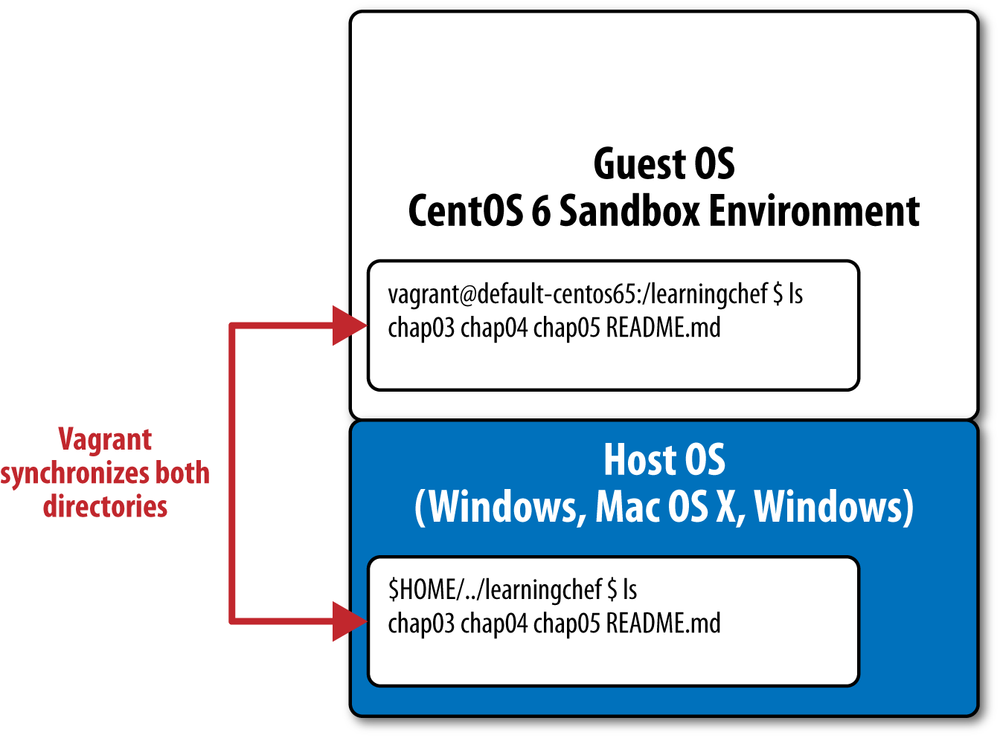


**同步的`/chef-repo`目录将在后面第用于配置服务器的SSL验证**。

**`chef-repo/cookbooks/node/kitchen.yml`**

```
---
driver:
  name: vagrant
  provider: vmware_desktop

provisioner:
  name: shell

platforms:
  - name: centos65
    driver:
      box: learningchef/centos65
      box_url: learningchef/centos65
      network:
      - ["private_network", {ip: "192.168.33.35"}]
      synced_folders:
      - ["../../../chef-repo", "/chef-repo"]

suites:
  - name: node
    attributes:
``` 


```
$ kitchen create
```

## 用Knife启动并准备节点 

我们配置了一个`Chef`服 器（或使用了托管企业Chef)，配置了`knife.rb`以及合适的密钥来从我们的宿主机器（开发机器）和`Chef`服务器通信。我们通过运行`knife client list`并得确的结果验证双方的通信 


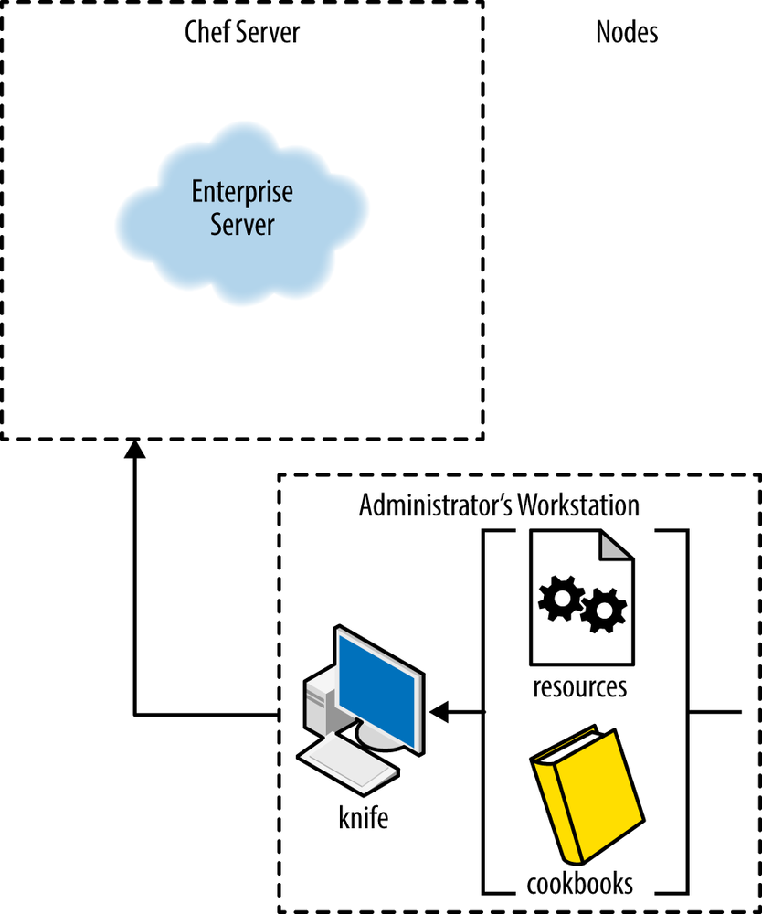

现在让我们像在生产环境中一样使用`knife bootstrap`创建一个节点**（在生产环境中， 我们不会用到`Test Kitchen`!）**


当我们在宿主机器上运行`knife bootstrap`时，它将在节点上安装`Chef`客户端并与Chef服务器注册。 


节点必须在本地的域名（`DNS`)服务器中设有完整域名。在本例中，让我们将其添加到本地`host`数据库中，就像我们为`Chef`服务器做过的一样。 

运行以下命令将节点的完整域名添加到本地host数据库文件中。例子中我们使用的IP地址是`192.168.33.35`，如果你为你的节点指定了不同的`IP`地址，请替换例子中的`IP`地址。 

**Linux/Mac OS X:**

```
$ sudo sh -c "echo '192.168.33.35 node-centos65.vagrantup.com' >> /etc/hosts"
```

```
$ kitchen login node-centos65
Last login: Mon Dec  2 10:31:39 2019 from 172.16.72.2
Welcome to your Packer-built virtual machine.
[vagrant@node-centos65 ~]$ sudo sh -c "echo \
> '192.168.33.34 default-centos65.vagrantup.com' >> /etc/hosts"
[vagrant@node-centos65 ~]$ exit
logout
Connection to 127.0.0.1 closed.
```

**option one： with key**

```
$ knife ssl fetch
WARNING: Certificates from default-centos65.vagrantup.com will be fetched and placed in your trusted_cert
         directory (/Users/.../chef-repo/.chef/trusted_certs).
         
         Knife has no means to verify these are the correct certificates. You should
         verify the authenticity of these certificates after downloading.
Adding certificate for default-centos65_vagrantup_com in /Users/i515190/chef-repo/.chef/trusted_certs/default-centos65_vagrantup_com.crt


[Jacob@i515190:~/chef-repo/cookbooks/node]$ knife bootstrap node-centos65.vagrantup.com --sudo --connection-user vagrant --connection-password vagrant 
Connecting to node-centos65.vagrantup.com
The authenticity of host 'node-centos65.vagrantup.com (192.168.33.35)' can't be established.
fingerprint is SHA256:T+OIBihOOfMUp0PdKFROXsVGSQAHKkDCImI5Udx/x2I.

Are you sure you want to continue connecting
? (Y/N) y
Connecting to node-centos65.vagrantup.com
Performing legacy client registration with the validation key at /Users/i515190/chef-repo/.chef/ja-validator.pem...
                                                                                                            Delete your validation key in order to use your user credentials for client registration instead.
Bootstrapping node-centos65.vagrantup.com
 [node-centos65.vagrantup.com] -----> Existing Chef Infra Client installation detected
 [node-centos65.vagrantup.com] Starting the first Chef Infra Client Client run...
 [node-centos65.vagrantup.com] Starting Chef Infra Client, version 15.5.17
 [node-centos65.vagrantup.com] 
 [node-centos65.vagrantup.com] resolving cookbooks for run list: []
 [node-centos65.vagrantup.com] 
 [node-centos65.vagrantup.com] Synchronizing Cookbooks:
 [node-centos65.vagrantup.com] 
 [node-centos65.vagrantup.com] Installing Cookbook Gems:
 [node-centos65.vagrantup.com] 
 [node-centos65.vagrantup.com] Compiling Cookbooks...
 [node-centos65.vagrantup.com] 
[2019-12-02T11:28:53+00:00] WARN: Node node-centos65.vagrantup.com has an empty run list.
 [node-centos65.vagrantup.com] Converging 0 resources
 [node-centos65.vagrantup.com] 
 [node-centos65.vagrantup.com] 
 [node-centos65.vagrantup.com] 
 [node-centos65.vagrantup.com] Running handlers:
 [node-centos65.vagrantup.com] 
 [node-centos65.vagrantup.com] Running handlers complete

 [node-centos65.vagrantup.com] Chef Infra Client finished, 0/0 resources updated in 03 seconds
 [node-centos65.vagrantup.com]
```

### **option two： without key**

```
$ knife bootstrap node-centos65.vagrantup.com --sudo --connection-user vagrant --connection-password vagrant --node-ssl-verify-mode none --no-host-key-verify
```

* `--[no-]host-key-verify`
Use `--no-host-key-verify` to disable host key verification. Default setting: `--host-key-verify`.
* `--node-ssl-verify-mode MODE`


你司以从输出中看到它成功安装了`Chef`客户端，并且执行了一次Chef运行． 

要验证新的节点已在`Chef`服务器中注册登录到`Chef`服务器的网页界面并单击`Node`标签,现在应该看到`Chef`服务器有一个注册的节点

```
$ knife ssl fetch
WARNING: Certificates from default-centos65.vagrantup.com will be fetched and placed in your trusted_cert
         directory (/Users/.../chef-repo/.chef/trusted_certs).
         
         Knife has no means to verify these are the correct certificates. You should
         verify the authenticity of these certificates after downloading.
Adding certificate for default-centos65_vagrantup_com in /Users/i515190/chef-repo/.chef/trusted_certs/default-centos65_vagrantup_com.crt
```

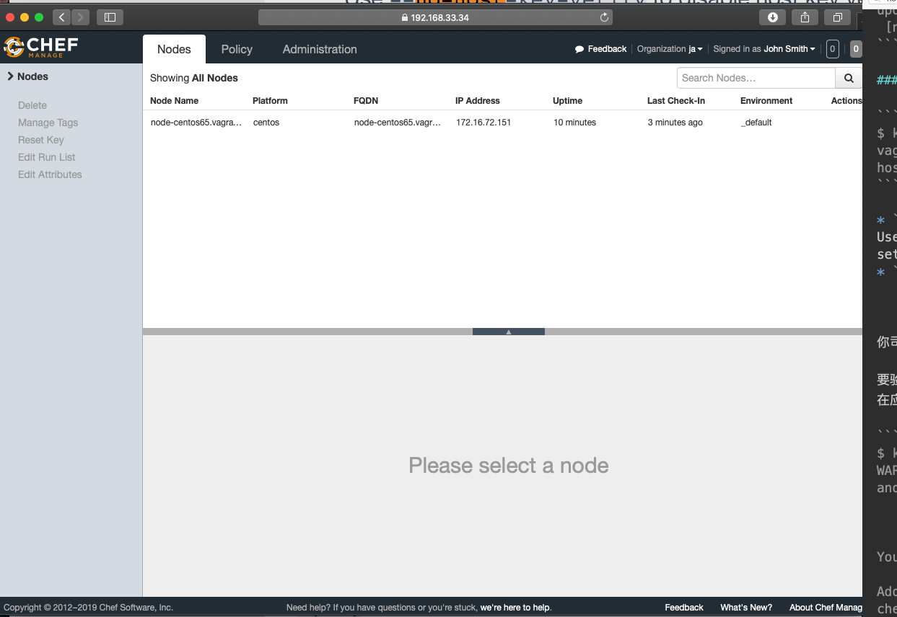

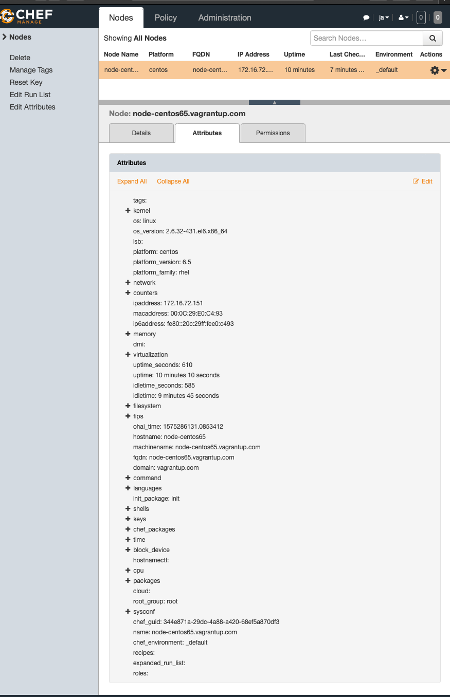

### 可以用`vagrant halt`（Vagrantfile路径内）去停掉这些虚拟机

## 用Chef Solo配置Chef服务器 

你可以使用`Chef Solo`（而无需`Test Kitchen`）来自动化部署Chef服务器。

在未来，大多数`Chef Solo`的功能会被迁移到`Chef Local`或`Chef Zero`,然而`Chef Solo`仍然对自动化配置和部署`Chef`服务器本身非常有用，因为`Chef Local`或`Chef Zero`会令一些配置脚本无法辨识发送请求道哪个`Chef`服务器 (`Chef Local/Zero`还是正在配置的`Chef`服务器），**因为`Chef Zero`自己也会启动一个驻内存的Chef服务器**。 

以下是通过`Chef Solo`来配置`Chef`服务器的步骤概览。 

1. 安装`Chef`客户端（包含`chef-solo`)。 
2. 创建`/var/chef/cache`和`var/chef/cookbooks`目录。
3. 前者是`chef-solo`存储状态信息的默认路径，后者是其存储菜谱的默认路径。 
4. 复制所需菜谱到该机器的以上菜谱路径。 
5. 运行`chef-solo`

```
$ chef-solo -h
Usage: /opt/chefdk/bin/chef-solo (options)
        --chef-license ACCEPTANCE    Accept the license for this product and any contained products ('accept', 'accept-no-persist', or 'accept-silent')
    -S, --server CHEFSERVERURL       The Chef Infra Server URL.
        --chef-zero-host HOST        Host to start Chef Infra Zero on.
        --chef-zero-port PORT        Port (or port range) to start Chef Infra Zero on. Port ranges like 1000,1010 or 8889-9999 will try all given ports until one works.
    -f, --[no-]fork                  Fork Chef Infra Client process.
    -k, --client_key KEY_FILE        Set the client key file location.
        --[no-]color                 Use colored output, defaults to enabled.
    -c, --config CONFIG              The configuration file to use.
        --config-option OPTION=VALUE Override a single configuration option.
    -d, --daemonize                  Daemonize the process.
        --delete-entire-chef-repo    DANGEROUS: does what it says, only useful with --recipe-url.
        --disable-config             Refuse to load a config file and use defaults. This is for development and not a stable API.
    -R, --enable-reporting           (chef-client only) reporting data 
...
```
```
# create required directories
$ sudo mkdir -p /var/chef/cache /var/chef/cookbooks
# copy your cookbook code to create a Chef Server - Chef Software
# provides a cookbook for open source Chef Server
$ sudo mkdir /var/chef/cookbooks/chef-server

$ wget -qO- https://github.com/opscode-cookbooks/chef-server/archive/master.tar.gz | sudo tar xvzC /var/chef/cookbooks/chef-server --strip-components=1
x .delivery/
x .delivery/project.toml
x .github/
x .github/CODEOWNERS
x .github/ISSUE_TEMPLATE.md
x .github/PULL_REQUEST_TEMPLATE.md
x .gitignore
x .travis.yml
x Berksfile
x CHANGELOG.md
x CONTRIBUTING.md
x Gemfile
x LICENSE
x README.md
x TESTING.md
x attributes/
x attributes/default.rb
x chefignore
x kitchen.dokken.yml
x kitchen.yml
x libraries/
x libraries/helpers.rb
x metadata.rb
x recipes/
x recipes/addons.rb
x recipes/default.rb
x spec/
x spec/addons_spec.rb
x spec/default_spec.rb
x spec/spec_helper.rb
x test/
x test/fixtures/
x test/fixtures/cookbooks/
x test/fixtures/cookbooks/test/
x test/fixtures/cookbooks/test/metadata.rb
x test/fixtures/cookbooks/test/recipes/
x test/fixtures/cookbooks/test/recipes/add-ons-no-fqdn.rb
x test/fixtures/cookbooks/test/recipes/default.rb
x test/fixtures/cookbooks/test/recipes/no-fqdn.rb
x test/fixtures/cookbooks/test/recipes/post-install.rb
x test/integration/
x test/integration/add-ons-no-fqdn/
x test/integration/add-ons-no-fqdn/default_spec.rb
x test/integration/default/
x test/integration/default/default_spec.rb
x test/integration/no-fqdn/
x test/integration/no-fqdn/default_spec.rb

# Run chef-solo to bootstrap Chef Server
$ cd /var/chef/cookbooks/
$ $ tree chef-server/
chef-server/
├── Berksfile
├── CHANGELOG.md
├── CONTRIBUTING.md
├── Gemfile
├── LICENSE
├── README.md
├── TESTING.md
├── attributes
│   └── default.rb
├── chefignore
├── kitchen.dokken.yml
├── kitchen.yml
├── libraries
│   └── helpers.rb
├── metadata.rb
├── recipes
│   ├── addons.rb
│   └── default.rb
├── spec
│   ├── addons_spec.rb
│   ├── default_spec.rb
│   └── spec_helper.rb
└── test
    ├── fixtures
    │   └── cookbooks
    │       └── test
    │           ├── metadata.rb
    │           └── recipes
    │               ├── add-ons-no-fqdn.rb
    │               ├── default.rb
    │               ├── no-fqdn.rb
    │               └── post-install.rb
    └── integration
        ├── add-ons-no-fqdn
        │   └── default_spec.rb
        ├── default
        │   └── default_spec.rb
        └── no-fqdn
            └── default_spec.rb

13 directories, 26 files


# Run chef-solo to bootstrap Chef Server
$ sudo chef-solo -o 'recipe[chef-server::default]'
```


几乎所有的Chef资源都保证幂等性，唯一的例外是`execute`资源。我们展示了如何通泛连续执行两次`Chef`来测试`Chef`代码的幂等性，在第二次运行时，幂等的Chef代码是显示没有资源更新。


