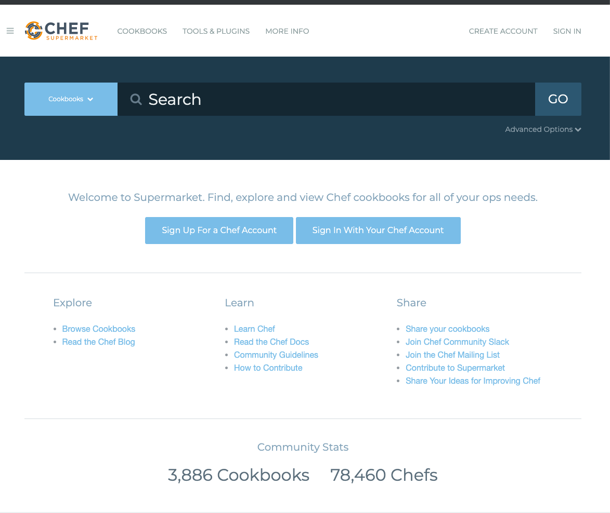
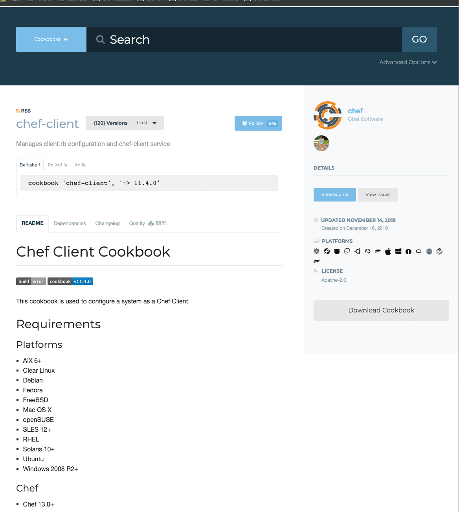
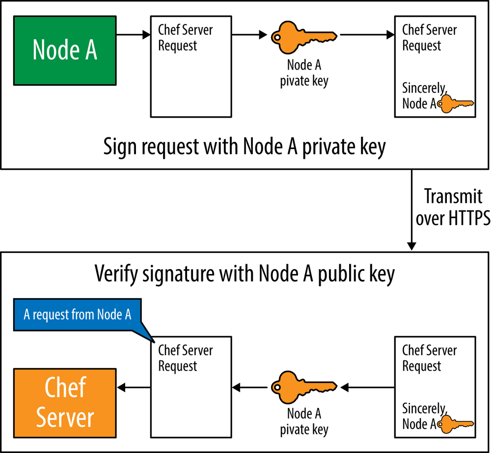
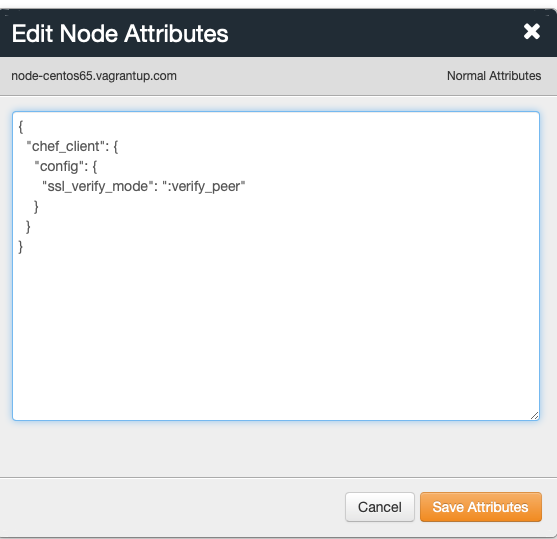
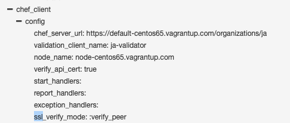
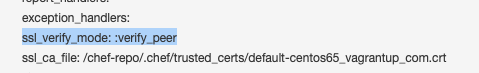

# 社区以及Chef-Client菜谱 

* 使用社区菜谱 
* `Chef-Client`菜谱 
* `Knife Cookbook Site`插件 
* 使用`Knife Cookbook Site`搜索社区菜谱 
* 通过`Knife Cookbook Site`管理`Chef`服务器中的社区菜谱
* `Chef-Client`配方单 
* 配置`Knife`使用生产环境`SSL`设置 
* 配置`Chef-client`使用生产环境的`SSL`设置 

## 使用社区菜谱 

`Chef`社区中拥有相当多免费的共享`Chef`菜谱，可以用来安装和配置很多广泛应用的服务和应用程序。比如说，社区中有设定`Apache`、`Nginx`,`微软IIS`的网页服务菜谱，`MySQL` `PostgreSQL`,`微软SQL Server`及`Oracle`的数据库菜谱；支持部署`Java`,`Ruby`,`Python`,`node.js`等应用部署的菜谱等。 

### [Chef Supermarket](https://supermarket.chef.io/)

`Chef`超级市场允许你通过名字或描述搜索菜谱。 




## `Chef-Client`菜谱 

`chef-client`菜谱是一个应用广泛的社区菜谱。试试在`Chef`超级市场中搜索`chef-client`  [https://supermarket.chef.io/cookbooks/chef-client](https://supermarket.chef.io/cookbooks/chef-client)




`chef-client` 菜谱 广泛应用因为它使以下两件事情变得易如反堂： 

* 将`chef-client`配置成个服务或`cron`任务 
* 删除`validation.pem`文件 


因为可伸缩性是`Chef`服务器的设计目标之一，所以很多工作都由客户端节点完成，在节点上计划和运行`chef-client`程序。`Chef`服务器本身是一个傻瓜式的存储服务 


比如在前面做过的。 用`knife`准备一个节点并在其上安装`chef-client`时，这个准备过程不会配置`chef-client`在节点上定期运行。

但你绝对希望`chef-client`在节点上定期: **运行（比如每15或30分钟）以得到相应的数据或菜谱的更新。`chef-client`菜谱使配置`chef-client`定期作为服务或`cron`任务运行变得简单**

同时，在每个节点上第一次`Chef`运行后删除`validation.pem`文件也很重要。在企业`Chef` 中，这个文件默认为`＜organization-validator>.pem`。

在开源`Chef`服务器中，这个文件认为`validation.pem`。

**要解释删除`validation.pem`文件为什么很重要，我们需要先快速介一下Chef服务器如何验证节点的请求**。 

* `Chef`服务器要求`chef-client`发送的每一个请求都需要通过一对客户端钥匙来验证。每个节点拥有它自己的钥匙对。你已经见过类似的钥匙对，因为用户账户也需要有它自己的钥匙对。
* 你在注册用户时下载`<username.pem>`文件，并配置`knife`来使用这个钥匙来验证放给`Chef`服务器的请求。
* **你下载的`<username.pem>`文件就是用户的钥匙对中的私钥，而公钥存储在`Chef`服务器上，用来验证你是有效的`Chef`服务器用户**。 
* 同样，运行`chef-client`的每个节点一样拥有一个私钥（`.pem`附文件）。作为例子，我们暂且将`client.pem`。图概览服务器如何通过这个私钥验证来自节点的请求。
* 在这个例子中，**节点`A`有一个私钥（位于节点上的`client.pem`文件）。当`client.pem`创建时， `Chef`服务器上同时生成并存储与其对应的公钥**。
* 节点`A`使用它的私钥为所有发送至`Chef`服务器的请求签名。当`Chef`服务器收到请求，它用节点`A`的公钥验证请求的签名来自节点`A`, 以保证这是一个来自节点`A`的合法请求。 
* 那么现在出现一个问题，当你第一次运行`chef-client`上，节点上还并没有私钥（例子中的`clicnt.pem`文件），同时相应的公钥也尚未在`Chef`服务器中生成。
* **要解决这个问题，在发送第一个请求时节点使用一个在公司范围内有效的钥匙，并请求服务器将此节点注册为一个客户. 而这个钥匙则是`validation.pem`文件。**`validation.pem`文件是在整个组织内有效的私钥用来为节点第一次`chef-client`运行向`Chef`服务器发送的清求签名。 


 
* `Chef`及务器验证`validation.pem`的签名（就像它验证`client.pem`的签名一样）。在`knife`初次准备（`bootstrap`）节点时，`validation.pem`创建在节点上的`/etc/chef/validation.pem`位置．
* 虽然`/etc/chef/validation.pem`的权限局限于`root`,最好基于安全原因考虑，等节点拥有自己的客户端钥匙后就将其删除。任何能访问到`Chef`服务器并得到`/etc/chef/validation.pem`文件的人都可以在`Chef`服务器中注册新的节点。
* 一旦节点拥有自己的客户端钥匙，不再需要`/etc/chef/validation.pem`只有在节点`Chef`服务器发送第一个请求的时候需要`/etc/chef/validation.pem`它的第一个请求会创建代表这个节点的客户端钥匙对并在未来使用它的私钥部分与`Chef`服务器进行交流因此在第一个请求成功过后就应该将`/etc/chef/validation.pem`从节点上删除 

```
$ kitchen login
Last login: Mon Dec  2 11:13:07 2019 from 172.16.72.2
Welcome to your Packer-built virtual machine.
[vagrant@default-centos65 ~]$ ls /etc/chef
accepted_licenses  admin.pem  ja-validator.pem
```


## `Knife Cookbook Site`插件 

虽然`Chef`级市场的下载菜谱链接很实用, 但仍然需要在下载后手动上传到服务器才能在生产环境中使用。虽然超级市场网站对发现新的菜谱很有用但有时候你会发现自己想使用命令行工具来做在日常工作中社区菜谱的管理，因为这样更有效率。所有近期版本的`Chef`客户端以及`Chef`研发包都包含`knife`工具的`cookbook site`插件，用来和`Chef`超级市场交互 

**如果你想尝试运行这些命令，确保你的工作目录是`chef-repo`目录，假设`chef-repo`目录在用户根目录，运行以下命令进人`chef-repo`. 如果提不在根目录(`$HOME`)下，请自行改变以下例子中的路径进人`chef-repo` 目录**

**Linux/Mac OS X:**


```
$ cd $HOME/chef-repo
```

## 使用`Knife Cookbook Site`搜索社区菜谱 

使用`knife cookbook site search`命令来搜索`Chef`超级市场中的菜谱。需要传递搜索查询的字符串作为参数。`knife cookbook site`将会在`Chef`超级市场中针对菜谱的以下元数据进行搜索： 

* name
* URL
* description
* maintainer

`knife cookbook Site`插件将会对你所提供的搜索查询执行简单的字符串匹配。动手试试搜索`chef-client`

```
$ knife cookbook site search chef-client
WARNING: No knife configuration file found. See https://docs.chef.io/config_rb_knife.html for details.
WARN: knife cookbook site search has been deprecated in favor of knife supermarket search. In Chef Infra Client 16 (April 2020) this will result in an error!
...
chef:
  cookbook:             https://supermarket.chef.io/api/v1/cookbooks/chef
  cookbook_description: Installs and configures Chef for chef-client and chef-server
  cookbook_maintainer:  chef
  cookbook_name:        chef
chef-client:
  cookbook:             https://supermarket.chef.io/api/v1/cookbooks/chef-client
  cookbook_description: Manages client.rb configuration and chef-client service
  cookbook_maintainer:  chef
  cookbook_name:        chef-client
chef-client-cron:
  cookbook:             https://supermarket.chef.io/api/v1/cookbooks/chef-client-cron
  cookbook_description: Manages aspects of only chef-client
  cookbook_maintainer:  bryanwb
  cookbook_name:        chef-client-cron
chef-client-hardening:
  cookbook:             https://supermarket.chef.io/api/v1/cookbooks/chef-client-hardening
  cookbook_description: Set correct owner/permissions for chef-client sensitive files
  cookbook_maintainer:  sliim
  cookbook_name:        chef-client-hardening
chef-client-runit:
  cookbook:             https://supermarket.chef.io/api/v1/cookbooks/chef-client-runit
  cookbook_description: Sets up chef-client as a runit-supervised service
  cookbook_maintainer:  jtimberman
  cookbook_name:        chef-client-runit
chef-client_syslog:
  cookbook:             https://supermarket.chef.io/api/v1/cookbooks/chef-client_syslog
  cookbook_description: chef-client log to syslog
  cookbook_maintainer:  sawanoboly
  cookbook_name:        chef-client_syslog
 ...
```


```
$ knife cookbook site show chef-client
WARNING: No knife configuration file found. See https://docs.chef.io/config_rb_knife.html for details.
WARN: knife cookbook site show has been deprecated in favor of knife supermarket show. In Chef Infra Client 16 (April 2020) this will result i
n an error!
average_rating:  
category:        Other
created_at:      2010-12-16T23:00:45.000Z
deprecated:      false
description:     Manages client.rb configuration and chef-client service
external_url:    https://github.com/chef-cookbooks/chef-client
issues_url:      https://github.com/chef-cookbooks/chef-client/issues
latest_version:  https://supermarket.chef.io/api/v1/cookbooks/chef-client/versions/11.4.0
maintainer:      chef
metrics:
  collaborators: 1
  downloads:
    total:    61397900
    versions:
      0.99.0: 1201561
...
name:            chef-client
source_url:      https://github.com/chef-cookbooks/chef-client
up_for_adoption: 
updated_at:      2019-11-14T00:16:26.975Z
versions:
  https://supermarket.chef.io/api/v1/cookbooks/chef-client/versions/11.4.0
  https://supermarket.chef.io/api/v1/cookbooks/chef-client/versions/11.3.6
  https://supermarket.chef.io/api/v1/cookbooks/chef-client/versions/11.3.5
  https://supermarket.chef.io/api/v1/cookbooks/chef-client/versions/11.3.4
...
```

## 通过`Knife Cookbook Site`管理`Chef`服务器中的社区菜谱 

虽然搜索显示详细信息等功能很实用但是`knife cookbook site`插件最常用的功能是从 `Chef`超级市场下载菜谱以及上传下我的菜谱到`Chef`服务器。要从`Chef`超级市场下载并上 传到本地的`Chef`服务器你需要执行以下步骤 

1. 用`knife cookbook site download`命令下载菜谱 
2. 用`tar`命令展开压缩包
3. 用`knife cookboob upload`命令上传莱谱到`Chef`服务器 4
4. 对任何菜谱所依赖的其他菜谱重复步骤1-3 

让我们以`chef-client`菜谱为例完成这个过程

```
$ mkdir -r chef-repo/cookbooks
$ knife cookbook site download chef-client 11.4.0
$ tar xvf chef-client*.tar.gz -C chef-repo/cookbooks
```

```
$ knife cookbook upload chef-client —cookbook-path cookbooks
WARNING: No knife configuration file found. See https://docs.chef.io/config_rb_knife.html for details.
WARN: Failed to read the private key /etc/chef/client.pem: #<Errno::ENOENT: No such file or directory @ rb_sysopen - /etc/chef/client.pem>
ERROR: Your private key could not be loaded from /etc/chef/client.pem
Check your configuration file and ensure that your private key is readabl
···
```

### solution: Copy `.chef` to the directory

```
$ cd chef-repo
$ ls -la
total 0
drwxr-xr-x  4 i515190  staff  128 Dec  3 14:09 .
drwxr-xr-x  4 i515190  staff  128 Dec  3 13:48 ..
drwxr-xr-x  6 i515190  staff  192 Dec  3 14:09 .chef
drwxr-xr-x  3 i515190  staff   96 Dec  3 13:49 cookbooks
```

```
$ knife cookbook upload chef-client 
Uploading chef-client  [11.4.0]
ERROR: Cookbook chef-client depends on cookbooks which are not currently
ERROR: being uploaded and cannot be found on the server.
ERROR: The missing cookbook(s) are: 'cron' version '>= 4.2.0', 'logrotate' version '>= 1.9.0'
```


**如果还记得我们在前面介绍的`include_recipe`语句，就知道菜谱可以引用其他菜谱这些引用称为依赖，并在菜谱的`metadata.rb`文件中以`depends`语句注明。如果看`chef`**

[https://github.com/chef-cookbooks/chef-client/blob/master/metadata.rb](https://github.com/chef-cookbooks/chef-client/blob/master/metadata.rb)

```
name              'chef-client'
maintainer        'Chef Software, Inc.'
maintainer_email  'cookbooks@chef.io'
license           'Apache-2.0'
description       'Manages client.rb configuration and chef-client service'
version           '11.4.0'

%w( aix amazon centos fedora freebsd debian oracle mac_os_x redhat suse opensuseleap ubuntu windows zlinux ).each do |os|
  supports os
end

depends 'cron', '>= 4.2.0'
depends 'logrotate', '>= 1.9.0'

source_url 'https://github.com/chef-cookbooks/chef-client'
issues_url 'https://github.com/chef-cookbooks/chef-client/issues'
chef_version '>= 13.0'
```


在`metadata.rb`文件的底部我们可以看到几个`depends`语句，指明`chef-client`菜谱依赖 `cron`和`logrotate`菜谱这符合错误消息中的两个菜谱！

我们需要对这些依赖的菜谱重复 `knife cookbook site>un-tar>knife cookbook upload`的过程。 

```
$ knife cookbook site show cron
WARNING: No knife configuration file found. See https://docs.chef.io/config_rb_knife.html for details.
WARN: knife cookbook site show has been deprecated in favor of knife supermarket show. In Chef Infra Client 16 (April 2020) this will result in an error!
average_rating:  
category:        Other
created_at:      2010-08-19T16:03:13.000Z
deprecated:      false
description:     Installs cron
external_url:    https://github.com/chef-cookbooks/cron
issues_url:      https://github.com/chef-cookbooks/cron/issues
latest_version:  https://supermarket.chef.io/api/v1/cookbooks/cron/versions/6.2.2
maintainer:      chef
metrics:
..
```
```
$ knife cookbook site show logrotate
WARNING: No knife configuration file found. See https://docs.chef.io/config_rb_knife.html for details.
WARN: knife cookbook site show has been deprecated in favor of knife supermarket show. In Chef Infra Client 16 (April 2020) this will result in an error!
average_rating:  
category:        Other
created_at:      2009-10-28T19:14:55.000Z
deprecated:      false
description:     Installs logrotate package and provides a resource for managing logrotate configs
external_url:    https://github.com/chef-cookbooks/logrotate
issues_url:      https://github.com/chef-cookbooks/logrotate/issues
latest_version:  https://supermarket.chef.io/api/v1/cookbooks/logrotate/versions/2.2.2
```

```
$ knife cookbook site download cron 6.2.2
$ knife cookbook site download logrotate 2.2.2
```
```

```

最后， 注意用`knife cookbook upload`命令上传所有菜谱 `cron`,`logrotate`和`chef-client`,在上传`chef-client`之前，应先上传它所依赖的菜谱 

```
tar xvf cron*.tar.gz -C chef-repo/cookbooks/
tar xvf logrotate*.tar.gz -C chef-repo/cookbooks/
```

```
$ cd chef-repo
$ knife cookbook upload cron
Uploading cron         [6.2.2]
Uploaded 1 cookbook.

$ knife cookbook upload logrotate
Uploading logrotate      [2.2.2]
Uploaded 1 cookbook.

$ knife cookbook upload chef-client
Uploading chef-client    [11.4.0]
Uploaded 1 cookbook.
```

## Chef-Client配方单 

现在让我们把在前面提到的两个配方单加入我们节点的运行清单中， 运行然后进行一次`chef` 运行

1. `chef-client::default`配方单配置`chef-client`作为服务运行。
2. `chef-client::delete_validation`删除`/etc/chef/validation.pem`文件。 


我们可以通过`knife node run_list add`命令将`chef-client::delete validation`配方单加到节点的运行清单中。在`knife`命令中，配方单以下格式表示 `"recipe[＜菜谱＞::＜配方单＞]"`, 例如`"recipe[chef-client::delete_validation"`

运行以下`knife node run_list add` 命令来添加`”recipe[chef-client::delete_validation"`到`node-centos65.vagrantup.com`节点的运行清单： 

```
$ knife node list
node-centos65.vagrantup.com
```


```
$ knife node -h


** NODE COMMANDS **
knife node bulk delete REGEX (options)
knife node create NODE (options)
knife node delete [NODE [NODE]] (options)
knife node edit NODE (options)
knife node environment set NODE ENVIRONMENT
knife node from file FILE (options)
knife node list (options)
knife node policy set NODE POLICY_GROUP POLICY_NAME (options)
knife node run_list add [NODE] [ENTRY [ENTRY]] (options)
knife node run_list remove [NODE] [ENTRY [ENTRY]] (options)
knife node run_list set NODE ENTRIES (options)
knife node show NODE (options)
knife node status [<node> <node> ...]
```

```
$ knife node run_list add node-centos65.vagrantup.com \
> "recipe[chef-client::delete_validation]"
node-centos65.vagrantup.com:
  run_list: recipe[chef-client::delete_validation]
```

现在我们再将`chef-client::default`配方单也添加到运行清单中。注意，**在使用一个菜谱中的`default`配方单时，可以将其省略而只使用菜谱名字**。运行以下命令：


```
$ knife node run_list add node-centos65.vagrantup.com "recipe[chef-client]"
node-centos65.vagrantup.com:
  run_list:
    recipe[chef-client::delete_validation]
    recipe[chef-client]
```

现在`chef-client::delete_validation`和`chef-client::default`配方单都在节点的运行清单中，将按你指定的顺序执行。 

```
$ knife node run_list add <node> \
"recipe[<cookbook>::<recipe>],recipe[<cookbook>::<recipe>]"
```

运行以下命令来确保`chef-repo/cookbooks/node`目录是当前工作目录。如果你的`chef-repo`目录不在`＄HOME`下，将以下路径中`＄HOME`目录替换为`chef-repo`目录所在的正确位置。 

Linux/Mac OS X:

```
$ cd $HOME/chef-repo/cookbooks/node
```

```
$ kitchen login
Last login: Mon Dec  2 11:19:08 2019 from 172.16.72.2
Welcome to your Packer-built virtual machine.
[vagrant@node-centos65 ~]$ sudo chef-client
Starting Chef Infra Client, version 15.5.17
resolving cookbooks for run list: ["chef-client::delete_validation", "chef-client"]
Synchronizing Cookbooks:
  - chef-client (11.4.0)
  - cron (6.2.2)
  - logrotate (2.2.2)
...
   - change mode from '' to '0644'
  * service[chef-client] action enable
    - enable service service[chef-client]
  * service[chef-client] action start
    - start service service[chef-client]
  * service[chef-client] action restart
    - restart service service[chef-client]

Running handlers:
Running handlers complete
Chef Infra Client finished, 10/11 resources updated in 09 seconds
```


```
[vagrant@node-centos65 ~]$ ls /etc/chef
accepted_licenses  chef_guid  client.pem  client.rb  first-boot.json  trusted_certs


[vagrant@node-centos65 ~]$ ps awux | grep chef-client
root      4992  0.0 11.2 295228 56336 ?        S    07:10   0:00 /opt/chef/embedded/bin/ruby --disable-gems /usr/bin/chef-client -d -c /etc/chef/client.rb -P /var/run/chef/client.pid -i 1800 -s 300
vagrant   4997  0.0  0.1 103216   816 pts/0    S+   07:12   0:00 grep chef-client
```

在节点上验证`validation.pem`文件已被删除，以及`chef-client`被设定成背景(daemon)服务： 

## 配置Knife使用生产环境SSL设置 

我们提及过当你运行`chef-client`时看到的SSL警告（因为未认证的`HTTPS` 连接）。在结束本章之前，让我们讲讲在生产环境下应该如何配置`SSL` 

在节点上，`SSL`验证在`chef-client`的`/etc/chef/c1ient.rb`配置文件中设定。

可以通过设置`chef-client`菜谱的属性来启用。`chef-client`菜谱中的很多东西都可以通过属性来设定。 


### 菜谱应根据属性来改变行为 
优秀的菜语通常根据属性来改变行为理想清况下不应该需要修改 满足同一个应用范围内不同清况下的需求 

可以在菜谱的`attributes`目录中看到可以修改的属性优秀的菜谱通常理的默认值并在`README.md`文件中包含详细的文档说明这些属性的行为。 

SSL设定有时可以很复杂，**因此我们推荐在配置节点使用SSL验证之前先在开发机器上配置knife使用SSL验证**。我们将安装Chef服务器时生成的自我签名证书。
 
需要确保Chef服务器被配置使用你希望使用的证书来验证`HTTPS`通讯。默认情况下，`Chef`服务器在安装过程中自动生成一个自我签名的证书。如果希望使用这个自我签名的证书一切已经就绪。在这个练习中我们将使用这个自我签名的证书 

Refer to the [Chef documentation](https://docs.chef.io/server_security.html) for more information on how to configure ChefServer with a certificate authority-verified certificate.

> uncomment `# ssl_verify_mode          :verify_none` in `knife.rb` 


`knife ssl check`命令说需要将证书复制到`trusted_certs_dir`目录（在上述命令的输出中你可以看到目录所在位置）。运行`knife ssl fetch`命令自动下载证书并将其放在`trusted_certs_dir`目录 

```
$ knife ssl fetch
WARNING: Certificates from default-centos65.vagrantup.com will be fetched and placed in your trusted_cert
         directory (/Users/.../chef-repo/.chef/trusted_certs).
         
         Knife has no means to verify these are the correct certificates. You should
         verify the authenticity of these certificates after downloading.
Adding certificate for default-centos65_vagrantup_com in /Users/i515190/chef-
```

```
$ knife ssl check 
Connecting to host default-centos65.vagrantup.com:443
Successfully verified certificates from `default-centos65.vagrantup.com'
```

## 配置`Chef-client`使用生产环境的`SSL`设置 

`chef-client`菜谱包含用来自动生成`/etc/chef/client.rb`配置文件的`chef-client::config`配方单。

我们可以使用它来生成包含我们所需的`SSL`设置的配置文件，这样我们可以将在节点上配置`SSL`的工作自动化

登录到节点井查看`/etc/chef/client.rb`文件。 `/client.rb`文件在你运行`knife bootsrap`时在节点上被创建用来配置`chef-client`设置。执行以下命令，并确保完成时退回到开发机器 

```
[~/chef-repo/cookbooks/node]$ kitchen login
Last login: Tue Dec  3 07:09:43 2019 from 172.16.72.2
Welcome to your Packer-built virtual machine.
[vagrant@node-centos65 ~]$ lt virtual machine.
[vagrant@node-centos65 ~]$ cat /etc/chef/client.rb
chef_server_url  "https://default-centos65.vagrantup.com/organizations/ja"
validation_client_name "ja-validator"
chef_license "accept"
log_location   STDOUT
# Using default node name (fqdn)
trusted_certs_dir "/etc/chef/trusted_certs"

[vagrant@node-centos65 ~]$ exit
logout
Connection to 127.0.0.1 closed.
```

要启用SSL验证,我们需要在`/etc/chef/client.rb`中添加以下设置（默认为：`verify_none`) 

```
ssl_verify_mode          :verify_peer 
```

要让`chef-client::config`配方单生成这项设置我们需要设定以下属性 

```
node.default['chef_client']['config']['ssl_verify_mode'] = ':verify_peer'
```

### Edit attributes

```
{
  "chef_client": {
    "config": {
      "ssl_verify_mode": ":verify_peer"
    }
  }
}
```







```
$ knife node list
node-centos65.vagrantup.com

$ knife node show --attribute "chef_client.config.ssl_verify_mode" \
> node-centos65.vagrantup.com
node-centos65.vagrantup.com:
  chef_client.config.ssl_verify_mode: :verify_peer
```


因为我们使用的是自我签名的证书，所以我们还需要再设置一个属性。需要告诉节点上的`SSL`库我们信任自我签名的服务器证书。在生产环境下，应该写一个配方单将证书添加到节点上的证书存储位置中。 证书的存储目录`SSL_CERT_DIR` 

如果在节点上使用`OpenSSL`，需要将证书复制到可信的并运行`c_rehash`来注册自我签名的证书。 

在我们的测试环境中，我们通过在第9章中设定的本机与节点的同步目录将证书文件同 步到节点上。我们设定的同步目录使开发机器上的`chef-repo/.chef/trusted_certs`目录在节点上也可访问。这个目录在你先前运行`knife ssl fetch`时在开发机器上已经设定好。 


现在回到`Chef`服务器的网页界面（或使用`knife node edit`命令），并在我们的侧试节点 中添加`ssl_ca_file`属性，如下所示： 




我们可以通过`knife node show --attribute` 命令检查` chef_client.config.ssl_verify_mode` 和 `chef_client.config.ssl_ca_file`属性被正确设定，

```
$ knife node show --attribute "chef_client.config.ssl_verify_mode" \
> node-centos65.vagrantup.com
node-centos65.vagrantup.com:
  chef_client.config.ssl_verify_mode: :verify_peer
```

```
$ knife node show --attribute "chef_client.config.ssl_ca_file" \
> node-centos65.vagrantup.com
node-centos65.vagrantup.com:
  chef_client.config.ssl_ca_file: /chef-repo/.chef/trusted_certs/default-centos65_vagrantup_com.crt
```

```
$ cd ~/chef-repo/cookbooks/node
$ $ kitchen login
Last login: Tue Dec  3 07:55:04 2019 from 172.16.72.2
Welcome to your Packer-built virtual machine.
[vagrant@node-centos65 ~]$ ls /chef-repo/.chef/trusted_certs
default-centos65_vagrantup_com.crt
[vagrant@node-centos65 ~]$ exit
logout
Connection to 127.0.0.1 closed.
```

在确定所有设置都正确后，将`chef-client::config`配方一单添加到运行清单中： 

```
$ knife node run_list add node-centos65.vagrantup.com \
> "recipe[chef-client::config]"
node-centos65.vagrantup.com:
  run_list:
    recipe[chef-client::delete_validation]
    recipe[chef-client]
    recipe[chef-client::config]
```

然后登录到节点并执行一次`Chef`运行。因为你添加了`chef-client::config` 清单`Chef`会确保`/etc/chef/client.rb`匹配你在节点上没定的属性。你会再一次得到SSL警告, 因为`chef-client`尚应用你的`SSL`验证设置： 


```
$ sudo chef-client
Starting Chef Infra Client, version 15.5.17
resolving cookbooks for run list: ["chef-client::delete_validation", "chef-client", "chef-client::config"]
Synchronizing Cookbooks:
  - chef-client (11.4.0)
  - cron (6.2.2)
  - logrotate (2.2.2)
Installing Cookbook Gems:
Compiling Cookbooks...
Converging 14 resources
Recipe: chef-client::delete_validation
  * file[/etc/chef/validation.pem] action delete (up to date)
Recipe: chef-client::init_service
  * directory[/var/run/chef] action create (up to date)
  * directory[/var/cache/chef] action create (up to date)
  * directory[/var/lib/chef] action create (up to date)
  * directory[/var/log/chef] action create (up to date)
  * directory[/etc/chef] action create (up to date)
  * template[/etc/init.d/chef-client] action create (up to date)
  * template[/etc/sysconfig/chef-client] action create (up to date)
  * service[chef-client] action enable (up to date)
  * service[chef-client] action start (up to date)
Recipe: chef-client::config
  * logrotate_app[chef-client] action enable
    * directory[/etc/logrotate.d] action create (up to date)
    * template[/etc/logrotate.d/chef-client] action create (up to date)
     (up to date)
  * file[/var/log/chef/client.log] action create (up to date)
  * template[/etc/chef/client.rb] action create (up to date)
  * directory[/etc/chef/client.d] action create (up to date)
  * ruby_block[reload_client_config] action nothing (skipped due to action :nothing)

Running handlers:
Running handlers complete
Chef Infra Client finished, 0/17 resources updated in 03 seconds
```


