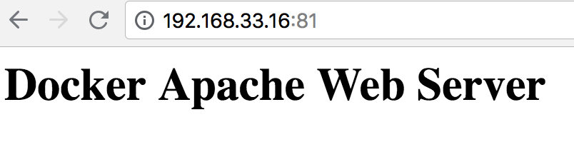
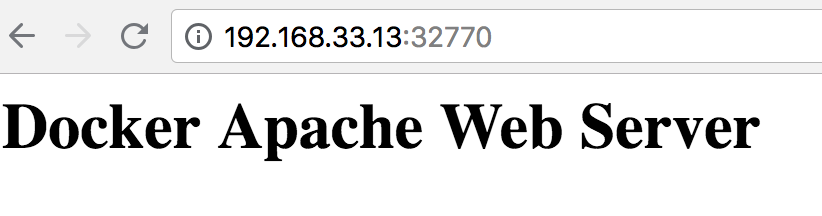
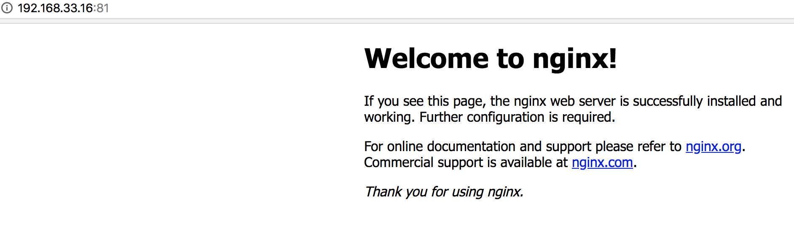
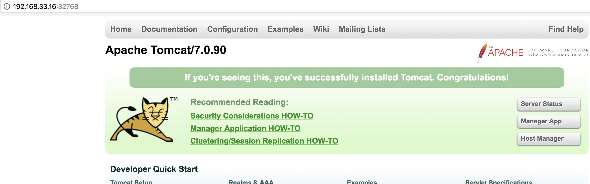
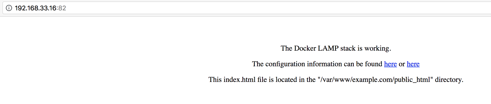
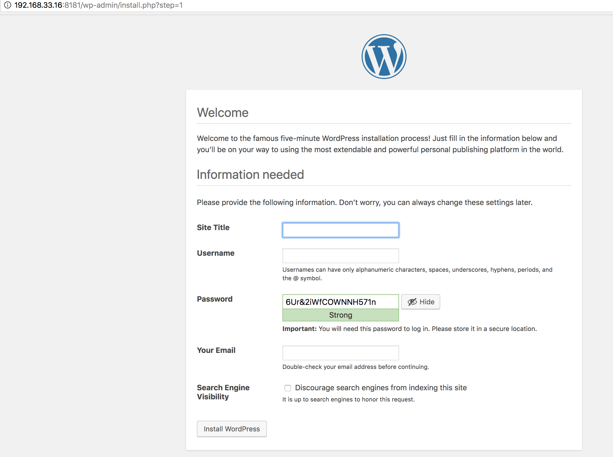
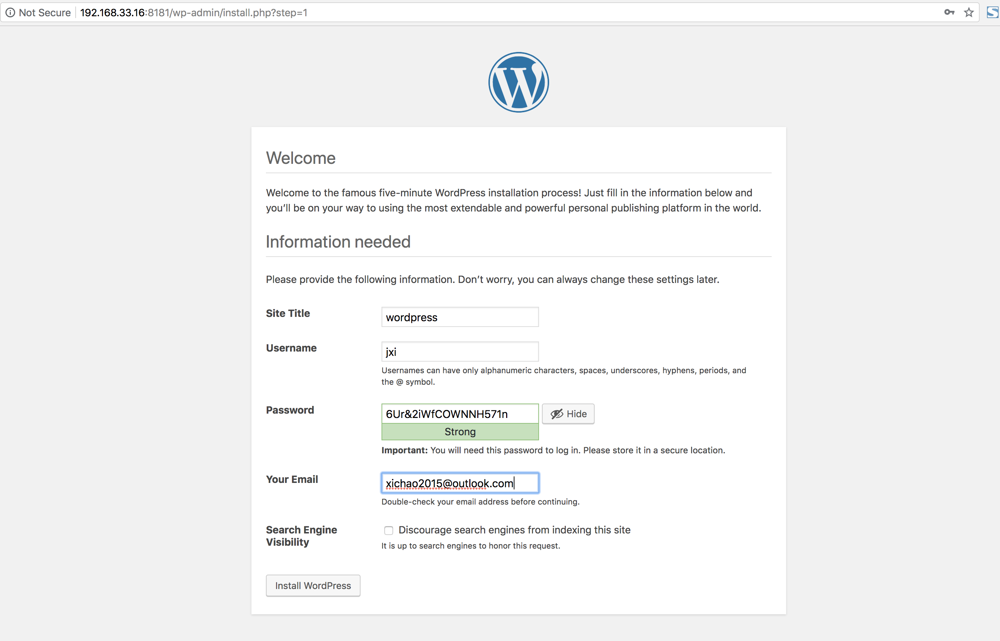
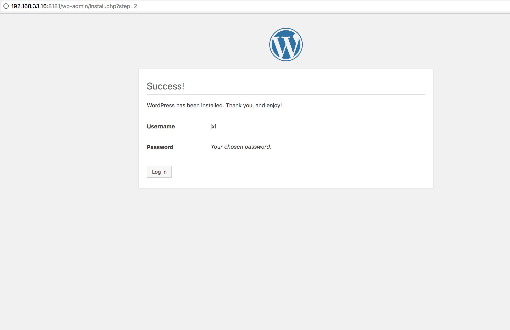
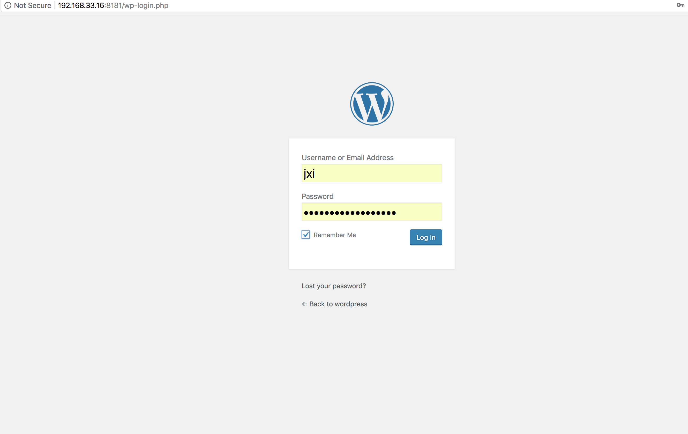
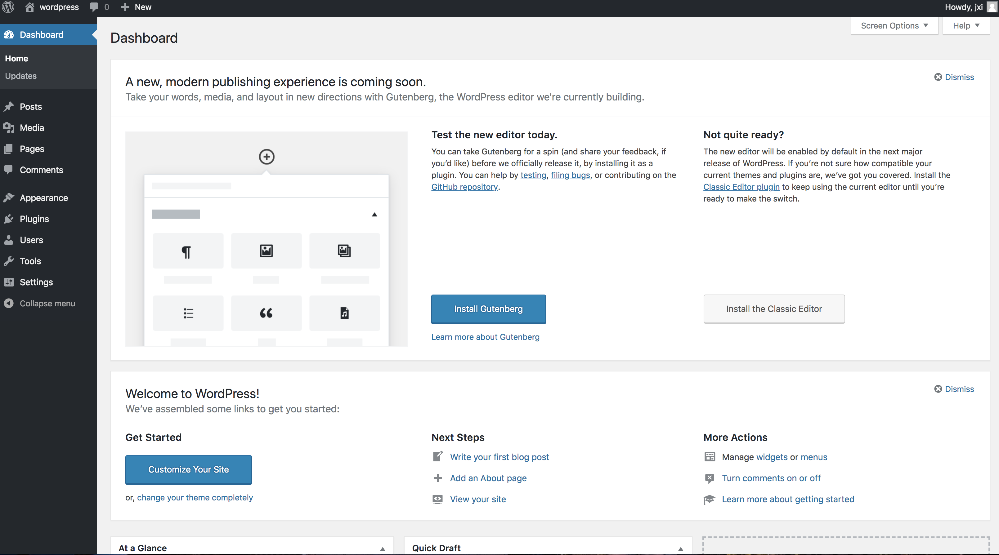

# 使用Docker运行常见的Web服务与管理


## Apache


Apache是一个高稳定的、商业级别的开源Web服务器；由于其良好的跨平台和安全性，被广泛应用在多种平台和操作系统上。

### 1、使用官方镜像

官方提供名为httpd的Apache镜像，可以作为基础的Web服务镜像

编写Dockerfile文件；

```
$ mkdir Apache && cd Apache
$ mkdir public-html
$ vi Dockerfile

FROM httpd:2.4
COPY ./public-html/ /usr/local/apache2/htdocs/
```

创建项目目录public-html，并在目录中创建index.html文件：

```
$ cd public-html/
$ vi index.html

<!DOCTYPE>
<html>
  <body>
     <h1>Docker Apache Web Server</h1>
  </body>
</html>
```

构建自定义镜像：

```
$ cd Apache
$ docker build -t apache2-image .

Sending build context to Docker daemon 3.584 kB
Step 1/2 : FROM httpd:2.4
 ---> 11426a19f1a2
Step 2/2 : COPY ./public-html/ /usr/local/apache2/htdocs/
 ---> 47b3702ac331
Removing intermediate container f30aea092ad6
Successfully built 47b3702ac331

$ docker images
REPOSITORY               TAG                 IMAGE ID            CREATED             SIZE
apache2-image            latest              47b3702ac331        9 minutes ago       178 MB
...

```

可以看到已构建成功，然后使用docker run指令运行镜像：

```
IP:HostPort:ContainerPort | IP: :ContainerPort | HostPort:ContainerPort
```

```
$ docker run -it --rm --name apache2-container -p 81:80 apache2-image

AH00558: httpd: Could not reliably determine the server's fully qualified domain name, using 172.17.0.4. Set the 'ServerName' directive globally to suppress this message
AH00558: httpd: Could not reliably determine the server's fully qualified domain name, using 172.17.0.4. Set the 'ServerName' directive globally to suppress this message
[Mon Aug 20 02:53:29.833112 2018] [mpm_event:notice] [pid 1:tid 140341217499008] AH00489: Apache/2.4.34 (Unix) configured -- resuming normal operations
[Mon Aug 20 02:53:29.833305 2018] [core:notice] [pid 1:tid 140341217499008] AH00094: Command line: 'httpd -D FOREGROUND'
192.168.33.1 - - [20/Aug/2018:02:53:34 +0000] "GET / HTTP/1.1" 200 86
```

使用浏览器通过本地81端口访问：




返回容器查看，每访问一次，就会有一次记录显示：

```
$ docker run -it --rm --name apache2-container -p 81:80 apache2-image
AH00558: httpd: Could not reliably determine the server's fully qualified domain name, using 172.17.0.4. Set the 'ServerName' directive globally to suppress this message
AH00558: httpd: Could not reliably determine the server's fully qualified domain name, using 172.17.0.4. Set the 'ServerName' directive globally to suppress this message
[Mon Aug 20 02:53:29.833112 2018] [mpm_event:notice] [pid 1:tid 140341217499008] AH00489: Apache/2.4.34 (Unix) configured -- resuming normal operations
[Mon Aug 20 02:53:29.833305 2018] [core:notice] [pid 1:tid 140341217499008] AH00094: Command line: 'httpd -D FOREGROUND'
192.168.33.1 - - [20/Aug/2018:02:53:34 +0000] "GET / HTTP/1.1" 200 86
192.168.33.1 - - [20/Aug/2018:02:55:10 +0000] "GET / HTTP/1.1" 304 -
192.168.33.1 - - [20/Aug/2018:02:55:14 +0000] "GET / HTTP/1.1" 304 -
```

此外，还可以不创建自定义镜像，直接通过映射目录方式运行Apache容器：

```
$ docker run -it --rm --name my-apache-app -p 81:80 -v "$PWD":/user/local/apache2/htdocs/ httpd:2.4

AH00558: httpd: Could not reliably determine the server's fully qualified domain name, using 172.17.0.4. Set the 'ServerName' directive globally to suppress this message
AH00558: httpd: Could not reliably determine the server's fully qualified domain name, using 172.17.0.4. Set the 'ServerName' directive globally to suppress this message
[Mon Aug 20 03:24:40.245594 2018] [mpm_event:notice] [pid 1:tid 139725722175360] AH00489: Apache/2.4.34 (Unix) configured -- resuming normal operations
[Mon Aug 20 03:24:40.246609 2018] [core:notice] [pid 1:tid 139725722175360] AH00094: Command line: 'httpd -D FOREGROUND'
192.168.33.1 - - [20/Aug/2018:03:24:50 +0000] "GET / HTTP/1.1" 200 45
```

` -v: -v --volume=[host-src:] : container-dest[:] ` 


### 2、使用自定义镜像

创建一个`apache_ubuntu`工作目录，在其中创建`Dockerfile`文件、`run.sh`文件和`sample`目录：

```
$ mkdir apache_ubuntu && cd apache_ubuntu
$ touch Dockerfile run.sh
$ touch sample

$ ls -l
Dockerfile  run.sh  sample
```

编写Dockerfile文件：

```
FROM sshd:dockerfile
#设置继承子用户创建的sshd镜像
MAINTAINER docker_user (jxi@example.com)
#创建者额基本信息

#设置环境变量
ENV DEBIAN_FRONTEND noninteractive
#安装
RUN apt-get update

RUN apt-get -yq install apache2 &&\
    rm -rf /var/lib/apt/list/* 
RUN echo "Asia/Shnaghai" > /etc/timezone && \
		dpkg-reconfigure -f noninteractive tzdata
#注意这里要更改系统的时区设置	，因为在web应用中经常用到时区这个系统变量

#添加用户的脚本，并设置权限，并会覆盖直接放在这个位置的脚本
ADD run.sh /run.sh
RUN chmod 755 /*.sh

#添加一个实例的web站点，删除并默认安装早apache文件夹下面的文件，并将用户添加的实例用软连接连到/var/www/html目录下面
RUN mkdir -p /var/lock/apache2 && mkdir -p /app && rm -rf /var/www/html/ && ln -s /app /var/www/html 
COPY sample/ /app

#设置apache相关的一些变量，在容器启动的时候可以使用-e参数代替
ENV APACHE_RUN_USER www-data
ENV APACHE_RUN_GROUP www-data
ENV APACHE_LOG_DIR /var/log/apache2
ENV APACHE_PID_FILE /var/run/apache2.pid
ENV APACHE_RUN_DIR /var/run/apache2
ENV APACHE_LOCK_DIR /var/lock/apache2
ENV APACHE_SERVERADMIN admin@localhost
ENV APACHE_SERVERNAME localhost
ENV APACHE_SERVERALIAS docker.localhost
ENV APACHE_DOCUMENTROOT /var/www

EXPOSE 80
WORKDIR /app
CMD ["/run.sh"]
```
在sample目录下创建index.html文件：

```
$ cd sample
$ touch index.html

<!DOCTYPE>
<html>
  <body>
     <h1>Docker Apache Web Server</h1>
  </body>
</html>
```

编写`run.sh`启动`apache`服务脚本：

```
$ vi run.sh

#!/bin/bash
exec apache2 -D FOREGROUND
```

然后使用`docker bulid`创建apache:ubuntu镜像，注意最后的”.“：

```
$ docker build -t apache:ubuntu .
Sending build context to Docker daemon 6.144 kB
Step 1/22 : FROM sshd:dockerfile
Trying to pull repository docker.io/library/sshd ...
repository docker.io/sshd not found: does not exist or no pull access
```

**Need sshd:dockerfile repository**

[9docker_ssh.md](9docker_ssh.md)

```
$ sudo docker images
REPOSITORY                    TAG                   IMAGE ID            CREATED                  SIZE
docker.io/centos              latest                5182e96772bf        Less than a second ago   200 MB
sshd                          dockerfile            121982f18b9f        About a minute ago 
```

```
$ sudo docker build -t apache:ubuntu .

Sending build context to Docker daemon 5.632 kB
Step 1/23 : FROM sshd:dockerfile
 ---> 121982f18b9f
Step 2/23 : MAINTAINER docker_user (jxi@example.com)
 ---> Using cache
 ---> 560204c085a2
Step 3/23 : ENV DEBIAN_FRONTEND noninteractive
 ---> Using cache
 ---> cefb0f09e9b6
Step 4/23 : RUN apt-get update
 ---> Using cache
 ---> 843d7961c055
Step 5/23 : RUN apt-get -yq install apache2 &&    rm -rf /var/lib/apt/list/*
 ---> Using cache
 ---> 58f3dc81c3a8
Step 6/23 : RUN echo "Asia/Shnaghai" > /etc/timezone &&                 dpkg-reconfigure -f noninteractive tzdata
 ---> Using cache
 ---> e63b98010bce
Step 7/23 : ADD run.sh /run.sh
 ---> Using cache
 ---> fa769a61d43e
Step 8/23 : RUN chmod 755 /*.sh
 ---> Running in ed73164926d0

 ---> a713f5db7135
Removing intermediate container ed73164926d0
Step 9/23 : RUN mkdir -p /var/lock/apache2 && mkdir -p /app && rm -rf /var/www/html/ && ln -s /app /var/www/html
 ---> Running in ca51d410111f

 ---> 73de3fd15b46
Removing intermediate container ca51d410111f
Step 10/23 : COPY sample/ /app
 ---> 5dea8e79561e
Removing intermediate container 860e0a487ab2
Step 11/23 : ENV APACHE_RUN_USER www-data
 ---> Running in 84c4e15ccc37
 ---> e4335fd937c3
Removing intermediate container 84c4e15ccc37
Step 12/23 : ENV APACHE_RUN_GROUP www-data
 ---> Running in e6bd77b87010
 ---> f271ec080f05
Removing intermediate container e6bd77b87010
Step 13/23 : ENV APACHE_LOG_DIR /var/log/apache2
 ---> Running in cc03f645ca69
 ---> d65990b44fb6
Removing intermediate container cc03f645ca69
Step 14/23 : ENV APACHE_PID_FILE /var/run/apache2.pid
 ---> Running in 5278a0bda589
 ---> b5ea0f05ebb3
Removing intermediate container 5278a0bda589
Step 15/23 : ENV APACHE_RUN_DIR /var/run/apache2
 ---> Running in 33e0cbbc9b0e
 ---> c8bbd40d01f3
Removing intermediate container 33e0cbbc9b0e
Step 16/23 : ENV APACHE_LOCK_DIR /var/lock/apache2
 ---> Running in b423cb0fcf1f
 ---> 6221631eedac
Removing intermediate container b423cb0fcf1f
Step 17/23 : ENV APACHE_SERVERADMIN admin@localhost
 ---> Running in b6ed48dce7a2
 ---> d2032fb48339
Removing intermediate container b6ed48dce7a2
Step 18/23 : ENV APACHE_SERVERNAME localhost
 ---> Running in 9cba61073d86
 ---> a238394e1238
Removing intermediate container 9cba61073d86
Step 19/23 : ENV APACHE_SERVERALIAS docker.localhost
 ---> Running in ea5539d678a6
 ---> ac0577f7d7ad
Removing intermediate container ea5539d678a6
Step 20/23 : ENV APACHE_DOCUMENTROOT /var/www
 ---> Running in 07b9e7938f3e
 ---> 53958fda7b7b
Removing intermediate container 07b9e7938f3e
Step 21/23 : EXPOSE 81
 ---> Running in cf6f0ca20bc8
 ---> b626b3b3fe17
Removing intermediate container cf6f0ca20bc8
Step 22/23 : WORKDIR /app
 ---> eb3b54b7a5b4
Removing intermediate container fd2807cd8ec7
Step 23/23 : CMD /run.sh
 ---> Running in a20d99de516c
 ---> ae59919be469
Removing intermediate container a20d99de516c
Successfully built ae59919be469
```

创建成功：

```
$ sudo docker images
REPOSITORY                    TAG                   IMAGE ID            CREATED             SIZE
apache                        ubuntu                ae59919be469        6 minutes ago       289 MB
docker.io/centos              latest                5182e96772bf        13 days ago         200 MB
sshd                          dockerfile            121982f18b9f        2 weeks ago         251 MB
```

接下来使用docker run命令测试，使用-P参数映射需要开放的端口（22和81端口）：

```
$ sudo docker run -d -P apache:ubuntu
d2acac0ab8162b203cd995eb2fcda36a83f7bbc300461c451db31074cf73a37b

[vagrant@node1 apache_ubuntu]$ sudo docker ps -a
CONTAINER ID        IMAGE                COMMAND                  CREATED             STATUS                        PORTS                                          NAMES
869799df96ab        apache:ubuntu        "/run.sh"                16 seconds ago      Up 15 seconds                 0.0.0.0:32771->22/tcp, 0.0.0.0:32770->80/tcp   mystifying_keller

```

使用浏览器访问刚创建的samlpe站点：




以上使用docker ps -a发现容器映射端口为22和80；实际上，使用SSH是无法远程登录的；这是因为在run.sh脚本中并未启动SSH服务；说明：使用Dockerfile创建镜像是，会继承父镜像的开放端口，但不会继承启动命令。因此需要在run.sh脚本中添加启动sshd的服务的命令：

```
vi run.sh
```

```
#!/bin/bash
/usr/sbin/sshd &
exec apache2 -D FOREGROUND
```
再次创建镜像：默认就会同时启动SSH和Apache服务。


## NGINX


Nginx是一款功能强大的开源反向代理，支持HTTP、HTTPS、SMTP、POP3、IMAP等协议。也可以作为负载均衡器、HTTP缓存和Web服务器。Nginx一开始就专注于高并发和高性能的应用场景。 

1、使用官方镜像

```
$ docker run -d -p 81:80 --name webserver nginx
Unable to find image 'nginx:latest' locally
Trying to pull repository docker.io/library/nginx ...
latest: Pulling from docker.io/library/nginx
Digest: sha256:d85914d547a6c92faa39ce7058bd7529baacab7e0cd4255442b04577c4d1f424
Status: Downloaded newer image for docker.io/nginx:latest
052d9cbaf99b6558b5dbfd12d4c6e61875321158c42b8164da5e918d2c92f153
```

然后是使用docker ps指令查看当前运行的容器：

```
$ docker ps -a

CONTAINER ID        IMAGE       COMMAND                  CREATED              STATUS                   PORTS                NAMES
052d9cbaf99b        nginx       "nginx -g 'daemon ..."   About a minute ago   Up About a minute        0.0.0.0:81->80/tcp   webserver

```

可以看到Nginx容器一在0.0.0.0：81启动，并映射了80端口，可以用浏览器访问此地址：可以看到Nginx输出的页面




2、自定义Web页面：
同样的，创建index.html文件，并将index.html文件挂载至容器中，即可以看到显示的自定义和页面：

```
$ mkdir -p /web/Nginx/
$ cd /web/Nginx/
$ vi index.html

<!DOCTYPE>
<html>
  <body>
     <h1>Docker Nginx Web Server</h1>
  </body>
</html>
```

```
$ docker run --name nginx-container -p 81:80 -v index.html:/user/share/nginx/html:ro -d nginx
d2a10130876001548756a289578e4f4e49cdda6ff53b4138128caf2865fcf429
```

```
$ docker ps -a
CONTAINER ID        IMAGE       COMMAND                  CREATED             STATUS              PORTS                NAMES
d2a101308760        nginx       "nginx -g 'daemon ..."   7 seconds ago       Up 6 seconds       0.0.0.0:81->80/tcp   nginx-container
```

也可以使用Dockerfile来构建新镜像；Dockerfile内容如下：

```
$ ls
Dockerfile  index.html

$ vi Dockerfile

From nginx
COPY ./index.html /user/share/nginx/html
```

开始构建nginx镜像：

```
$ docker build -t my-nginx .
Sending build context to Docker daemon 3.072 kB
Step 1/2 : FROM nginx
 ---> c82521676580
Step 2/2 : COPY ./index.html /user/share/nginx/html
 ---> 6680bfdb1445
Removing intermediate container 6d12dd44c62b
Successfully built 6680bfdb1445
```

```
$ docker images -a
REPOSITORY               TAG                 IMAGE ID            CREATED              SIZE
my-nginx                 latest              6680bfdb1445        About a minute ago   109 MB
```

构建成功后执行docker run指令启动一个容器：

```
$ docker run -d -p 81:80 --name nginx-container my-nginx
2fa9a5439cd7e92fe7f4dd6720a58a39d68117c836842f22421e255affde8c37

$ docker ps -a
CONTAINER ID        IMAGE          COMMAND                  CREATED             STATUS                      PORTS                NAMES
2fa9a5439cd7        my-nginx       "nginx -g 'daemon ..."   6 seconds ago       Up 4 seconds                0.0.0.0:81->80/tcp   nginx-container
```

## TOMCAT


Tomcat本身内含了一个HTTP服务器，也可以当做一个单独的Web服务器来使用。
首先，在Docker Hub上搜索已有的Tomcat相关镜像的个数：

```
docker search tomcat | wc -l
26
```

已经有26个相关镜像。
创建tomcat镜像并启动容器：直接运行官方镜像

```
$ docker run -dP  --name tomcat tomcat:7.0
45e6152a51e4a32668c2c6f69a4d19bd891cbc7f3a30527390b98a9c53ac29ec
```
**`-P random port`**

```
$ docker ps -a
CONTAINER ID        IMAGE          COMMAND                  CREATED             STATUS                      PORTS                     NAMES
45e6152a51e4        tomcat:7.0     "catalina.sh run"        7 seconds ago       Up 6 seconds                0.0.0.0:32768->8080/tcp   tomcat
```
**open `http://192.168.33.16:32768/`**



## LAMP

 LAMP（Linux-Apache-Mysql-PHP）是目前流行的web工具，其中包括：Linux操作系统，Apache网络服务器，Mysql数据库，perl、PHP或者Python变成语言。可以使用自定义Dockerfile或者Compose方式运行LAMP，同时社区也提供了十分成熟的linode/lamp和tutum/lamp镜像。
 
使用linode/lamp镜像

首先，执行docker run指令，直接运行镜像，并进入容器内部bash shell:

```
$ docker run -p 82:80 -t -i linode/lamp /bin/bash
Unable to find image 'linode/lamp:latest' locally
Trying to pull repository docker.io/linode/lamp ...
latest: Pulling from docker.io/linode/lamp
a3ed95caeb02: Pull complete
76a4cab4eb20: Pull complete
d2ff49536f4d: Pull complete
f94adccdbb9c: Pull complete
808b5278afbb: Pull complete
ab367f87d978: Pull complete
Digest: sha256:4b7af614899c795aa30cb60b62c28b978201c2dca3fb1352a60fec206edb92de
Status: Downloaded newer image for docker.io/linode/lamp:latest
```

在容器内部shell启动apache以及mysql服务：

```
root@f8886c590d58:/# service apache2 start
 * Starting web server apache2                                                                                                        *
 
root@f8886c590d58:/# service mysql start
 * Starting MySQL database server mysqld                                   [ok]                                                                            * Checking for tables which need an upgrade, are corrupt or were
not closed cleanly.
```
此时镜像中apache、mysql服务已经启动，可使用docker ps查看运行中的容器：

```
$ docker ps -a
CONTAINER ID        IMAGE                COMMAND                  CREATED             STATUS                      PORTS                     NAMES
f8886c590d58        linode/lamp          "/bin/bash"              7 minutes ago       Exited (0) 2 seconds ago
```
可以通过浏览器访问本地82端口即可查看到默认页面：




## CMS

 内容管理系统（Content Management System,CMS）指的是提供内容编辑服务的平台程序；可以让不懂编程的用户方便又轻松地发布、更改和管理各类数字内容（主要以文本和图像为主）。
 
### 1、WordPress
 

 
wordpress是风靡全球的开源内容管理系统，是博客、企业官网、产品首页等内容相关平台的主流实现方案之一，主要基于PHP和Mysql，架构设计简单明了，支持主题，插件和各种功能模块。
使用官方镜像

通过Docker Hub下载官方wordpress和mysql镜像：

```
$ docker pull wordpress

Using default tag: latest
Trying to pull repository docker.io/library/wordpress ...
latest: Pulling from docker.io/library/wordpress
be8881be8156: Already exists
69a25f7e4930: Pull complete
65632e89c5f4: Pull complete
cd75fa32da8f: Pull complete
15bc7736db11: Pull complete
b2c40cef4807: Pull complete
f3507e55e5eb: Pull complete
e6006cdfa16b: Pull complete
a3ed406e3c88: Pull complete
745f1366071d: Pull complete
bdfcada64ad8: Pull complete
86f2b695cc77: Pull complete
5f634a03970a: Pull complete
a329a7ebde19: Pull complete
fb3d2649f534: Pull complete
8fa928654124: Pull complete
a925e4a45888: Pull complete
b5e827c13dc3: Pull complete
61b17faecc30: Pull complete
c85ae8a39ff7: Pull complete
Digest: sha256:d92a0d4e9aae885789af8538bb8afe8624c23cb5d763dcc1d3a2e4ac57531d21
Status: Downloaded newer image for docker.io/wordpress:latest
```
```
$ docker pull mysql 

$ docker pull mysql
Using default tag: latest
Trying to pull repository docker.io/library/mysql ...
latest: Pulling from docker.io/library/mysql
be8881be8156: Already exists
c3995dabd1d7: Pull complete
9931fdda3586: Pull complete
bb1b6b6eff6a: Pull complete
a65f125fa718: Pull complete
2d9f8dd09be2: Pull complete
37b912cb2afe: Pull complete
54242fcd8eaa: Pull complete
0a9d4d211511: Pull complete
270ae5bd02c2: Pull complete
9b55b8e72e70: Pull complete
68083f7985cd: Pull complete
Digest: sha256:d39a8ab7679df309e7eff6ddba434ad5747cc2a2acee2d7c60d8221c9acedcad
Status: Downloaded newer image for docker.io/mysql:latest
```

```
$ docker images

docker.io/wordpress      latest              e2c4085bbc2b        5 days ago          408 MB
docker.io/mysql          latest              29e0ae3b69b9        5 days ago          484 MB
```

**配置Mysql：**

从Docker中安装MySQL，还需要额外的配置来启动MySQL;；name参数指定要启动的实例名称，`MYSQL_ROOT_PASSWORD`指定`ROOT`密码

```
$ docker run --name some-mysql -e MYSQL_ROOT_PASSWORD=123 -d mysql
0a92e3006d19717b8d142d55264099609be691f1d7b6a3173741773552c81b16
```

**配置Wordpress:**

安装好数据库之后，就可以启动WordPress了；name参数指定要启动的WordPress实例名称，link参数指定要使用的Docker MySQL实例名称，p参数将Docker内部的80端口映射到本地的8181端口上

```
$ docker run --name some-wordpress --link some-mysql:mysql -p 8181:80 -d wordpress
907f81f687f4ff6669841eb37a096d316d5e27e58caa3170289cf7a86eb7a731
```

```
--link参数的格式为--link name:alias
```

使用docker ps查看容器启动：

```
$ docker ps
CONTAINER ID        IMAGE            COMMAND                  CREATED              STATUS              PORTS                     NAMES
907f81f687f4        wordpress       "docker-entrypoint..."   About a minute ago   Up About a minute   0.0.0.0:8181->80/tcp      some-wordpress

0a92e3006d19        mysql           "docker-entrypoint..."   5 minutes ago        Up 5 minutes        3306/tcp, 33060/tcp       some-mysql
```
然后打开浏览器，输入localhost:8181（端口号是命令中设置的），就可以看到WordPress了。按照提示输入用户名等信息，然后安装WordPress即可：












### 2、Ghost
Ghost是一个广受欢迎的开源博客平台，使用JavaScript编写，以MIT协议发布。使用Docker Hub提供的官方Ghost镜像，直接docker run指令运行

```
$ docker run --name ghost-container -d ghost
'Unable to find image 'ghost:latest' locally
Trying to pull repository docker.io/library/ghost ...
latest: Pulling from docker.io/library/ghost
5bba3ecb4cd6: Pull complete
196b8e3c919d: Pull complete
7d083412657b: Pull complete
af5e417b9aea: Pull complete
1c641385df80: Pull complete
6b2d3d3d979a: Pull complete
f4df0af9d9e8: Pull complete
428a80471b89: Pull complete
3215198baf7f: Pull complete
8192bca16600: Pull complete
Digest: sha256:a531efda56ac6e299ce8fc15a183458acba046f95d4e8ab52cf9f1265be031cd
Status: Downloaded newer image for docker.io/ghost:latest
70fe080539e07b1d2a15b495596f83146cd74dba9ddac954f79d9212838b2430

$ docker ps -a
CONTAINER ID        IMAGE     COMMAND                  CREATED              STATUS                         PORTS                     NAMES
70fe080539e0        ghost     "docker-entrypoint..."   About a minute ago   Up About a minute             2368/tcp                  ghost-container
```

已经启动容器，内含Ghost实例并监听默认的2368服务端口；然后对服务端口进行映射：

```
$ docker run --name ghost-container-l -p 8282:2368 -d ghost
072a847c49adda2b394a62e31efe193b6d14d2adcf1cf7045e5dbf2b100ae45c 
```

并使用浏览器指定端口(8282)访问：


## 持续开发与管理

持续集成特点包括：从检出代码、编译安装、运行测试、结果记录、测试统计等都是自动完成，减少人工干预。

持续交付：则是经典的敏捷软件开发方法的自然延伸，它强调产品在修改后到部署上线的流程要敏捷化、自动化。

### Jenkins

jenkins是一个得到广泛应用的持续集成和持续交付的工具，旨在提供一个开放易用的持续集成平台，可以实时监控集成中存在的错误，提供详细的日志文件和提醒功能，并用图表的形式形象地展示项目架构的趋势和稳定性；特点包括安装配置简单、支持详细的测试报表、分布式构建等。

使用docker run指令一键部署Jenkins服务：

The whole process: **run jenkins on docker** [`4docker_jenkins_en.md`](4docker_jenkins_en.md)

目前运行的容器中，数据会存储在工作目录`/var/jenkins_home`中，这包括Jenkins中所有的数据，包括插件和配置信息等。如果需要数据持久化，可以使用数据卷机制


```
docker run -p 8080:8080 -p 50000:50000 -v /your/home:/var/jenkins_home jenkins
```

以上指令会将Jenkins数据存储于宿主机的/your/home目录下（需要确保/your/home目录对于容器的Jenkins用户是可访问的）也可以使用数据卷：

```
docker run -p 8080:8080 -p 50000:50000 -v /var/jenkins_home jenkins
```

### Gitlab

是一款非常强大的开源源码管理系统。支持基于Git的源码管理、代码评审、issue跟踪、活动管理、wiki页面，持续集成和测试等功能。

使用docker run指令运行：

[https://docs.gitlab.com/omnibus/docker/](https://docs.gitlab.com/omnibus/docker/)


```
sudo docker run --detach \
    --hostname gitlab.example.com \
    --publish 443:443 --publish 80:80 --publish 22:22 \
    --name gitlab \
    --restart always \
    --volume /srv/gitlab/config:/etc/gitlab \
    --volume /srv/gitlab/logs:/var/log/gitlab \
    --volume /srv/gitlab/data:/var/opt/gitlab \
    gitlab/gitlab-ce:latest
```

```
944e005cfdf80a29dcfff0f3254e854f23a8cf0c8084010b099e5372b261955c
```

```
$ docker ps -a
CONTAINER ID        IMAGE                       COMMAND                  CREATED             STATUS                             PORTS                                 NAMES
944e005cfdf8        gitlab/gitlab-ce:latest     "/assets/wrapper"        45 seconds ago      Up 42 seconds (health: starting)   22/tcp, 443/tcp, 0.0.0.0:83->80/tcp   gitlab
```

成功运行镜像，打开浏览器访问即可。