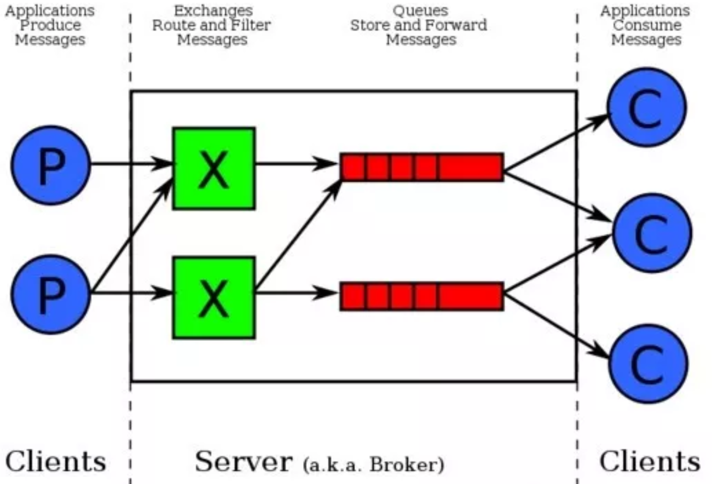
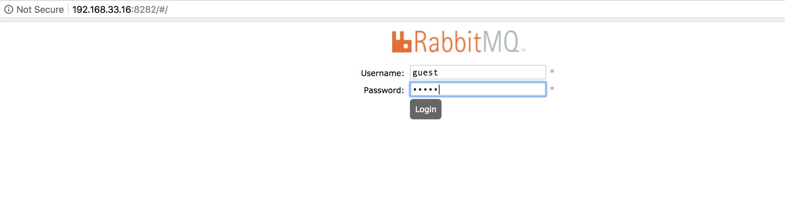
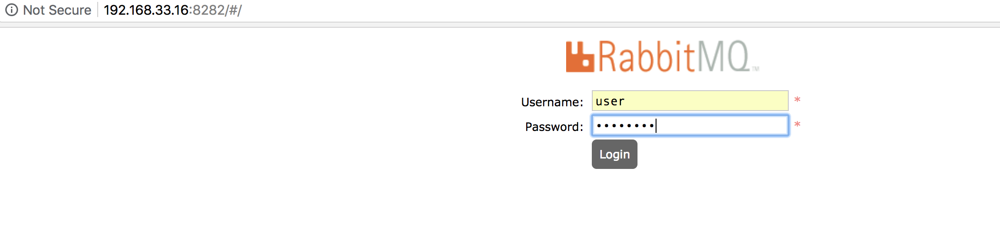
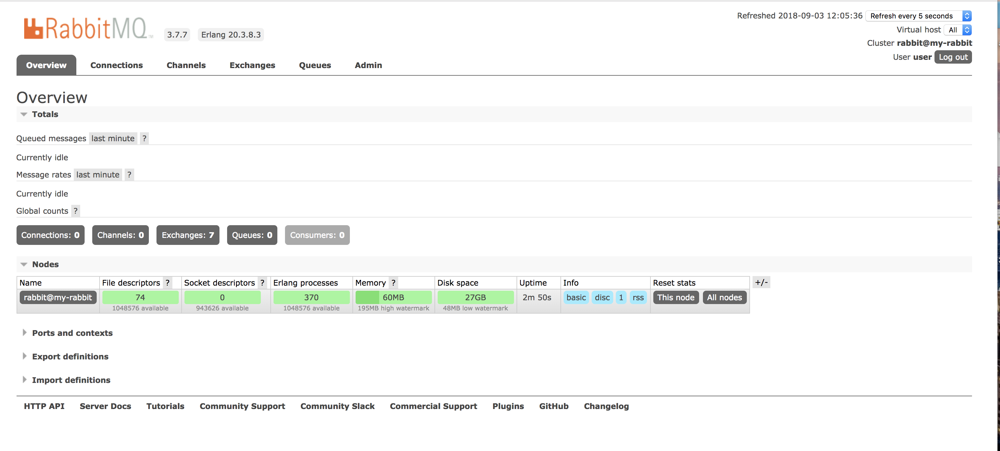
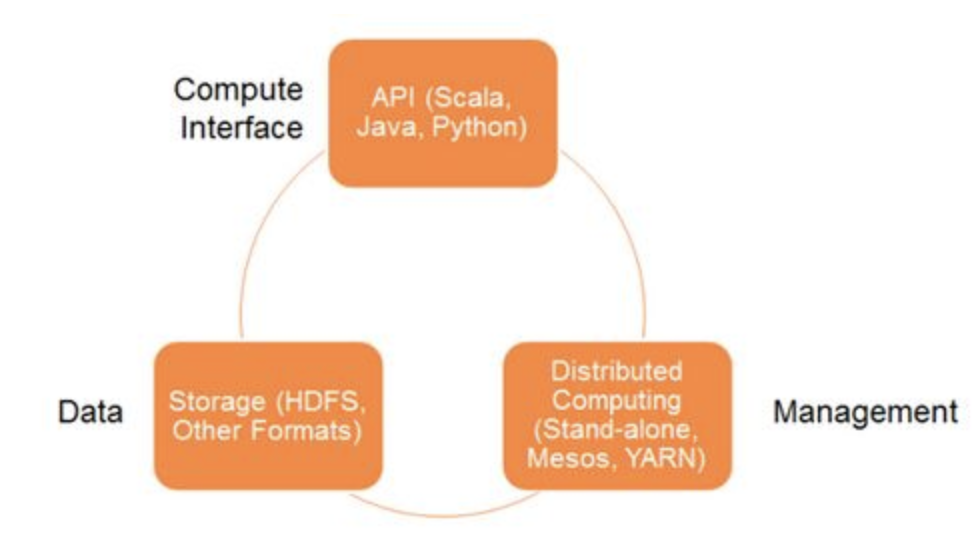
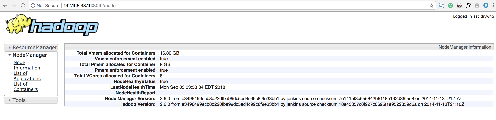
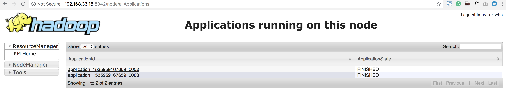
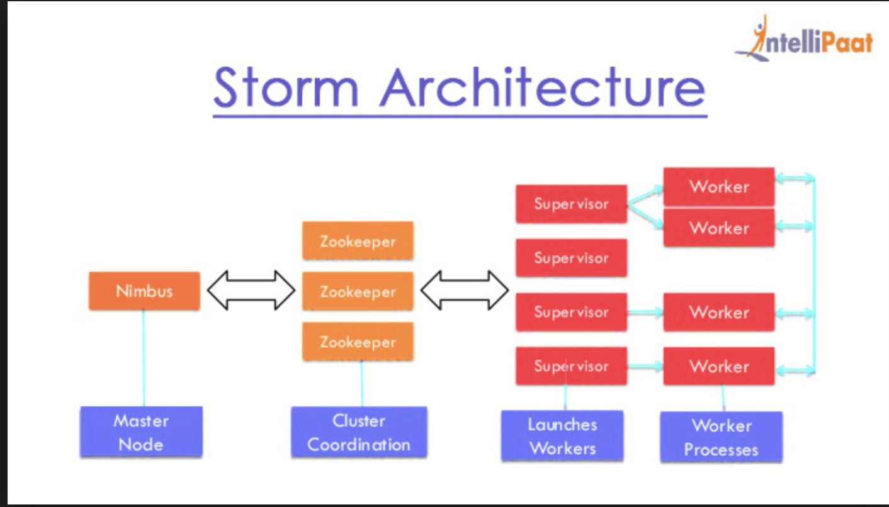
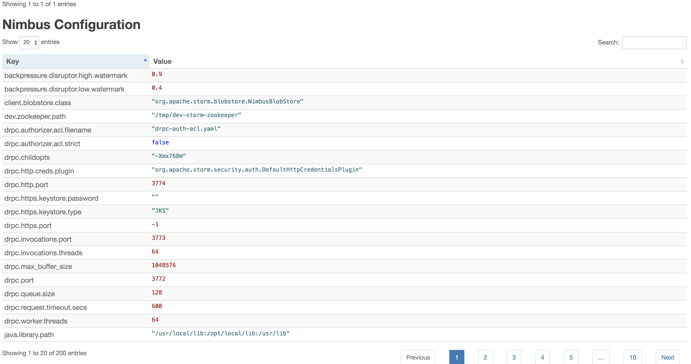
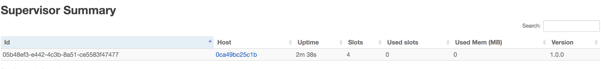

# 分布式处理与大数据平台(Distributed processing & Big data)

## RabbitMQ 

`RabbitMQ`是一个支持`Advanced Message Queuing Protocol (AMQP)`的开源消息队列实现，由Erlang编写，因以高性能、高可用以及可伸缩性出名。支持多种客户端：`JAVA`、`Python`、`PHP`、`.NET`、`Ruby`、`JavaScript`等。主要用于在分布式系统中存储和转发消息，方便组件之间的解藕，消息的发送者无需知道消息使用者的存在，反之亦然。

AMQP架构中有两个主要组件：`Exchange`和`Queue`，两者都在服务端，又称`Broker`，由`RabbitMQ`实现的；客户端通常由`Producer`和`Consumer`两种类型。



在使用`RabbitMQ`过程中需要注意的是，它将数据存储在Node中，默认情况为hostname，因此在使用`docker run`指令运行容器的时候，应该通过`-h/--hostname`参数指定每一个`rabbitmq daemon`运行的主机名，这样就可以轻松地管理和维护数据：

```
$ docker run -d --hostname my-rabbit --name some-rabbit rabbitmq:3
Unable to find image 'rabbitmq:3' locally
Trying to pull repository docker.io/library/rabbitmq ...
3: Pulling from docker.io/library/rabbitmq
be8881be8156: Already exists
ab96a756674d: Pull complete
1afa3c8b1ac8: Pull complete
8d6ac301ca22: Pull complete
665d14f5b3ec: Pull complete
c8c7fea479bc: Pull complete
1f57b98898fc: Pull complete
c57de6ff1fda: Pull complete
eb20b6079db3: Pull complete
bfcd2c7011de: Pull complete
71a3874699ee: Pull complete
5b914bcc4a84: Pull complete
Digest: sha256:14a4f6c871e3218c383ac38be6e3af6af547fff46bf38c8fe113aca6f1b49697
Status: Downloaded newer image for docker.io/rabbitmq:3
665946e3961a6058ee154c76e98cc23c4b7d59098032b209986a1d6084f42369
```

```
$ docker images
REPOSITORY              TAG         IMAGE ID            CREATED             SIZE
docker.io/rabbitmq      3           5fbca98fc816        3 weeks ago         125 MB
```

```
$ docker ps -a 
CONTAINER ID      IMAGE          COMMAND                 CREATED              STATUS                 PORTS                                  NAMES  
665946e3961a     rabbitmq:3     "docker-entrypoint..."   About a minute ago   Up About a minute      4369/tcp, 5671-5672/tcp, 25672/tcp     some-rabbit
```

可以使用`rabbitmqctl`工具进行远程管理，或跨容器管理的时候，会需要设置持久化的cookie，如果需要了解关于`Erlang Cookie`的信息，可以参考`RabbitMQ`官网的集群指南。

使用`RABBITMQ_ERLANG_COOKIE`参数进行设置：

```
$ docker run -d --hostname my-rabbit --name some-rabbit -e RABBITMQ_ERLANG_COOKIE='secret cookie here' rabbitmq:3
c3832e219c6df31e3f496b6bb26f9d5a910274e584e4a63eaa4cdcb08709906c
```

```
$ docker ps -a
CONTAINER ID        IMAGE            COMMAND                  CREATED             STATUS                  PORTS                                  NAMES
c3832e219c6d        rabbitmq:3       "docker-entrypoint..."   31 seconds ago      Up 30 seconds           4369/tcp, 5671-5672/tcp, 25672/tcp     some-rabbit
```

使用cookie连接至一个独立的实例：

```
$ docker run -it --rm --link some-rabbit:my-rabbit -e RABBITMQ_ERLANG_COOKIE='secret cookie here' rabbitmq:3 bash
root@71fbff34f08e:/# rabbitmqctl -n rabbit@my-rabbit list_users
Listing users ...
guest	[administrator]
root@71fbff34f08e:/#
```
默认情况下，`rabbitmq`会安装并启动一些管控插件，如**rabbitmq:3-management**；通常可以通过默认用户名密码以及标准管控端口`15672`访问这些插件：

```
$ docker run -d --hostname my-rabbit --name some-rabbit rabbitmq:3-management
Unable to find image 'rabbitmq:3-management' locally
Trying to pull repository docker.io/library/rabbitmq ...
3-management: Pulling from docker.io/library/rabbitmq
be8881be8156: Already exists
ab96a756674d: Already exists
1afa3c8b1ac8: Already exists
8d6ac301ca22: Already exists
665d14f5b3ec: Already exists
c8c7fea479bc: Already exists
1f57b98898fc: Already exists
c57de6ff1fda: Already exists
eb20b6079db3: Already exists
bfcd2c7011de: Already exists
71a3874699ee: Already exists
5b914bcc4a84: Already exists
f63e1b988a2d: Pull complete
e39cb8f0eaed: Pull complete
Digest: sha256:0b36ea1a8df9e53228aaeee277680de2cc97c7d675bc2d5dbe1cc9e3836a9d9f
Status: Downloaded newer image for docker.io/rabbitmq:3-management
ab1fec7fef51bd211770612072880f473adeef294938a41d32d0d94c2bcbc94c
```


```
$ docker ps -a
CONTAINER ID      IMAGE                     COMMAND                  CREATED              STATUS                PORTS                                                        NAMES
ab1fec7fef51      rabbitmq:3-management     "docker-entrypoint..."   About a minute ago   Up About a minute     4369/tcp, 5671-5672/tcp, 15671-15672/tcp, 25672/tcp          some-rabbit
```

可以通过浏览器访问`http://container-ip:15672`，如果需要从宿主机外访问，则使用8282端口

```
docker run -d --hostname my-rabbit --name some-rabbit -p 8282:15672 rabbitmq:3-management
48cd9bd89b90680c9cc6c4e85e91a24b751fb0cd29952f2d6ae23959083a7414
```

```
$ docker ps -a
CONTAINER ID    IMAGE                     COMMAND                  CREATED             STATUS            PORTS                                                                    NAMES
48cd9bd89b90    rabbitmq:3-management     "docker-entrypoint..."   7 seconds ago       Up 5 seconds      4369/tcp, 5671-5672/tcp, 15671/tcp, 25672/tcp, 0.0.0.0:8282->15672/tcp   some-rabbit
```



**guest:guest**

如果需要修改默认用户名与密码(`guest：guest`)，则可以使用`RABBITMQ_DEFAULT_USER`和`RABBITMQ_DEFAULT_PASS`环境变量并指定端口：

```
docker run -d --hostname my-rabbit --name some-rabbit -p 8282:15672 -e RABBITMQ_DEFAULT_USER=user -e RABBITMQ_DEFAULT_PASS=password rabbitmq:3-management
b33bd0b1d5680e0ced2344aab5f08c47cfc8f8791e6000797238044a7de2383b
```

```
$ docker ps -a
CONTAINER ID     IMAGE                    COMMAND                  CREATED             STATUS          PORTS                                                                    NAMES
b33bd0b1d568     rabbitmq:3-management   "docker-entrypoint..."   20 seconds ago      Up 18 seconds    4369/tcp, 5671-5672/tcp, 15671/tcp, 25672/tcp, 0.0.0.0:8282->15672/tcp   some-rabbit
```





## Celery

`Celery`是一个简单、灵活、高可用、高性能的开源(BSD许可)分布式任务处理系统，专注于实时处理的任务队列管理，同时也支持人物调度；基于Python实现，包括Django、Pyramid、Flask、Torado等Web框架都无缝集成，可以单机运行，也可以在多台机器上运行，甚至可以跨越数据中心运行。

使用官方celery镜像，并连接本地`some-rabbit`容器：

```
$ docker run --link some-rabbit:rabbit --name some-celery -d celery:latest
Unable to find image 'celery:latest' locally
Trying to pull repository docker.io/library/celery ...
latest: Pulling from docker.io/library/celery
ef0380f84d05: Pull complete
ada810c79ed7: Pull complete
4608a1c4fe47: Pull complete
58086cbb21fb: Pull complete
a7bccb4a3faa: Pull complete
9de06a08ec25: Pull complete
ad6feb8c6a6b: Pull complete
7568ca85d492: Pull complete
2d6f458f7411: Pull complete
Digest: sha256:5c236059192a0389a2be21fc42d8db59411d953b7af5457faf501d4eec32dc31
Status: Downloaded newer image for docker.io/celery:latest
01bdf8e71549817297f820a616dcca1c6010510acc721558eb2e588327424d61
```

```
$ docker ps -a
CONTAINER ID      IMAGE                   COMMAND                  CREATED             STATUS               PORTS                                                                    NAMES
01bdf8e71549      celery:latest           "celery worker"          46 minutes ago      Up 46 minutes                                                                                         some-celery
b33bd0b1d568      rabbitmq:3-management   "docker-entrypoint..."   About an hour ago   Up About an hour     4369/tcp, 5671-5672/tcp, 15671/tcp, 25672/tcp, 0.0.0.0:8282->15672/tcp   some-rabbit
```

检查集群状态：

```
$ docker run --link some-rabbit:rabbit --rm celery celery status

ConnectionResetError: [Errno 104] Connection reset by peer
```

# Hadoop


当今大数据处理领域的经典分布式平台，`Apache Hadoop`主要基于`Java`语言实现，由三个核心子系统组成：`HDFS`、`YARN`、`MapReduce`，其中:

* HDFS是一套分布式文件系统；
* YARN是资源管理系统，
* MapReduce是运行在YARN上的应用，负责分布式处理管理，
* 从系统角度看，HDFS相当于Linux的ext3/ext4文件系统，
* Yarm相当于Linux的进程调度和内存分配模块。

## 1、使用官方镜像：

通过docker run指令运行镜像，同时打开bash命令行：

```
$ docker run -it sequenceiq/hadoop-docker:2.7.0 /etc/bootstrap.sh -bash
Unable to find image 'sequenceiq/hadoop-docker:2.7.0' locally
Trying to pull repository docker.io/sequenceiq/hadoop-docker ...
2.7.0: Pulling from docker.io/sequenceiq/hadoop-docker
b253335dcf03: Pull complete
a3ed95caeb02: Pull complete
69623ef05416: Pull complete
63aebddf4bce: Pull complete
...

09f787a7573b: Pull complete
4e86267d5247: Pull complete
3876cba35aed: Pull complete
23df48ffdb39: Pull complete
646aedbc2bb6: Pull complete
60a65f8179cf: Pull complete
046b321f8081: Pull complete
Digest: sha256:a40761746eca036fee6aafdf9fdbd6878ac3dd9a7cd83c0f3f5d8a0e6350c76a
Status: Downloaded newer image for docker.io/sequenceiq/hadoop-docker:2.7.0
/
Starting sshd:                                             [  OK  ]
Starting namenodes on [42fd33b3f06e]
42fd33b3f06e: starting namenode, logging to /usr/local/hadoop/logs/hadoop-root-namenode-42fd33b3f06e.out
localhost: starting datanode, logging to /usr/local/hadoop/logs/hadoop-root-datanode-42fd33b3f06e.out
Starting secondary namenodes [0.0.0.0]
0.0.0.0: starting secondarynamenode, logging to /usr/local/hadoop/logs/hadoop-root-secondarynamenode-42fd33b3f06e.out
starting yarn daemons
starting resourcemanager, logging to /usr/local/hadoop/logs/yarn--resourcemanager-42fd33b3f06e.out
localhost: starting nodemanager, logging to /usr/local/hadoop/logs/yarn-root-nodemanager-42fd33b3f06e.out
bash-4.1#
```

可以查看各种配置信息和执行操作，例如查看namenode日志等信息：

```
bash-4.1# cat /usr/local/hadoop/logs/hadoop-root-namenode-42fd33b3f06e.out
ulimit -a for user root
core file size          (blocks, -c) unlimited
data seg size           (kbytes, -d) unlimited
scheduling priority             (-e) 0
file size               (blocks, -f) unlimited
pending signals                 (-i) 1881
max locked memory       (kbytes, -l) 64
max memory size         (kbytes, -m) unlimited
open files                      (-n) 1048576
pipe size            (512 bytes, -p) 8
POSIX message queues     (bytes, -q) 819200
real-time priority              (-r) 0
stack size              (kbytes, -s) 8192
cpu time               (seconds, -t) unlimited
max user processes              (-u) 1048576
virtual memory          (kbytes, -v) unlimited
file locks                      (-x) unlimited
```
### 2、安装验证

需要验证Hadoop环境是否安装成功；打开容器的bash命令行环境，进入Hadoop目录：

```
bash-4.1# cd /usr/local/hadoop
bash-4.1# pwd
/usr/local/hadoop
bash-4.1# dir
LICENSE.txt  NOTICE.txt  README.txt  bin  etc  include	input  lib  libexec  logs  sbin  share
bash-4.1# ls
LICENSE.txt  NOTICE.txt  README.txt  bin  etc  include	input  lib  libexec  logs  sbin  share
```

然后通过运行Hadoop内置的实例程序来进行测试：

```
bash-4.1# bin/hadoop jar share/hadoop/mapreduce/hadoop-mapreduce-examples-2.7.0.jar
An example program must be given as the first argument.
Valid program names are:
  aggregatewordcount: An Aggregate based map/reduce program that counts the words in the input files.
  aggregatewordhist: An Aggregate based map/reduce program that computes the histogram of the words in the input files.
  bbp: A map/reduce program that uses Bailey-Borwein-Plouffe to compute exact digits of Pi.
  dbcount: An example job that count the pageview counts from a database.
  distbbp: A map/reduce program that uses a BBP-type formula to compute exact bits of Pi.
  grep: A map/reduce program that counts the matches of a regex in the input.
  join: A job that effects a join over sorted, equally partitioned datasets
  multifilewc: A job that counts words from several files.
  pentomino: A map/reduce tile laying program to find solutions to pentomino problems.
  pi: A map/reduce program that estimates Pi using a quasi-Monte Carlo method.
  randomtextwriter: A map/reduce program that writes 10GB of random textual data per node.
  randomwriter: A map/reduce program that writes 10GB of random data per node.
  secondarysort: An example defining a secondary sort to the reduce.
  sort: A map/reduce program that sorts the data written by the random writer.
  sudoku: A sudoku solver.
  teragen: Generate data for the terasort
  terasort: Run the terasort
  teravalidate: Checking results of terasort
  wordcount: A map/reduce program that counts the words in the input files.
  wordmean: A map/reduce program that counts the average length of the words in the input files.
  wordmedian: A map/reduce program that counts the median length of the words in the input files.
  wordstandarddeviation: A map/reduce program that counts the standard deviation of the length of the words in the input files.
```

## Spark

`Apache Spark`是一个围绕速度、易用性和复杂分析构建的大数据处理框架，基于`Scala`开发。与Hadoop和Storm等其他大数据和MapReduce技术相比，Spark支持更灵活的函数定义，可以将应用处理速度提升到两个数量级，并且提供了众多方便的实用工具，包括SQL查询、流处理、机器学习和图处理等。



Spark体系架构包括三个主要组件：**数据存储、API、管理框架**

### 使用官方镜像

可以使用`sequenceiq/spark`镜像，版本`Hadoop 2.6.0`，`Apache Spark v1.6.0(Centos)`。同时此镜像包含Dockerfile，可以基于它构建自定义的Apache Spark镜像。

使用docker pull直接获取镜像：

```
$ docker pull sequenceiq/spark:1.6.0
Trying to pull repository docker.io/sequenceiq/spark ...
1.6.0: Pulling from docker.io/sequenceiq/spark
b253335dcf03: Already exists
a3ed95caeb02: Pull complete
ec7df1b14a43: Pull complete
3452351686f4: Pull complete
...
9d406b080497: Pull complete
Digest: sha256:64fbdd1a9ffb6076362359c3895d089afc65a533c0ef021ad4ae6da3f8b2a413
Status: Downloaded newer image for docker.io/sequenceiq/spark:1.6.0
```


```
$ docker images
REPOSITORY                           TAG          IMAGE ID       CREATED             SIZE
docker.io/sequenceiq/spark           1.6.0         40a687b3cdcc        2 years ago   2.88 GB
docker.io/sequenceiq/hadoop-docker   2.7.0         789fa0a3b911        3 years ago   1.76 GB
```

启动容器，需要映射`YARN UI`需要的端口

```
$ docker run -it -p 8088:8088 -p 8042:8042 -h sandbox sequenceiq/spark:1.6.0 bash
/
Starting sshd:                                             [  OK  ]
Starting namenodes on [sandbox]
sandbox: starting namenode, logging to /usr/local/hadoop/logs/hadoop-root-namenode-sandbox.out
localhost: starting datanode, logging to /usr/local/hadoop/logs/hadoop-root-datanode-sandbox.out
Starting secondary namenodes [0.0.0.0]
0.0.0.0: starting secondarynamenode, logging to /usr/local/hadoop/logs/hadoop-root-secondarynamenode-sandbox.out
starting yarn daemons
starting resourcemanager, logging to /usr/local/hadoop/logs/yarn--resourcemanager-sandbox.out
localhost: starting nodemanager, logging to /usr/local/hadoop/logs/yarn-root-nodemanager-sandbox.out
bash-4.1#
```

启动后，可以使用bash命令行查看`namenode`日志等信息：

```
bash-4.1# cat /usr/local/hadoop/logs/hadoop-root-namenode-sandbox.out
ulimit -a for user root
core file size          (blocks, -c) unlimited
data seg size           (kbytes, -d) unlimited
scheduling priority             (-e) 0
file size               (blocks, -f) unlimited
pending signals                 (-i) 1881
max locked memory       (kbytes, -l) 64
max memory size         (kbytes, -m) unlimited
open files                      (-n) 1048576
pipe size            (512 bytes, -p) 8
POSIX message queues     (bytes, -q) 819200
real-time priority              (-r) 0
stack size              (kbytes, -s) 8192
cpu time               (seconds, -t) unlimited
max user processes              (-u) 1048576
virtual memory          (kbytes, -v) unlimited
file locks                      (-x) unlimited
```
### 验证

`YARN`部署`Spark`系统时，有两种部署方式可选：**`YARN客户端模式`**和**`YARN集群模式`**。

### 1、YARN客户端模式

在`YARN`客户端模式中，`SparkContext`(或称为驱动程序，`driver program`)运行在客户端进程中，应用的`master`仅处理来自YARN的资源管理请求：

```
$ docker run -it -d -p 8088:8088 -p 8042:8042 -h sandbox sequenceiq/spark:1.6.0 bash
ddb58f90b7518c53beabbb4e1ce136267ca92b7666f3050ec2d6fdc9c76c2c0e

$ docker ps -a
CONTAINER ID        IMAGE                     COMMAND                  CREATED             STATUS                        PORTS                                                                                                                                               NAMES
ddb58f90b751        sequenceiq/spark:1.6.0    "/etc/bootstrap.sh..."   10 seconds ago      Up 6 seconds                  22/tcp, 8030-8033/tcp, 0.0.0.0:8042->8042/tcp, 8040/tcp, 49707/tcp, 50010/tcp, 50020/tcp, 50070/tcp, 50075/tcp, 50090/tcp, 0.0.0.0:8088->8088/tcp   compassionate_brahmagupta
```    

```
$ docker exec -it ddb58f90b751 /bin/bash
bash-4.1# spark-shell --master yarn-client --driver-memory 1g --executor-memory 1g --executor-cores 1
Java HotSpot(TM) 64-Bit Server VM warning: INFO: os::commit_memory(0x00000000b0000000, 357892096, 0) failed; error='Cannot allocate memory' (errno=12)
#
# There is insufficient memory for the Java Runtime Environment to continue.
# Native memory allocation (malloc) failed to allocate 357892096 bytes for committing reserved memory.
# An error report file with more information is saved as:
# //hs_err_pid1003.log
```

```
bash-4.1# spark-shell --master yarn-client --driver-memory 100m --executor-memory 100m --executor-cores 1
18/09/03 03:20:28 WARN util.NativeCodeLoader: Unable to load native-hadoop library for your platform... using builtin-java classes where applicable
18/09/03 03:20:28 INFO spark.SecurityManager: Changing view acls to: root
18/09/03 03:20:28 INFO spark.SecurityManager: Changing modify acls to: root
18/09/03 03:20:28 INFO spark.SecurityManager: SecurityManager: authentication disabled; ui acls disabled; users with view permissions: Set(root); users with modify permissions: Set(root)
18/09/03 03:20:29 INFO spark.HttpServer: Starting HTTP Server
18/09/03 03:20:29 INFO server.Server: jetty-8.y.z-SNAPSHOT
18/09/03 03:20:29 INFO server.AbstractConnector: Started SocketConnector@0.0.0.0:33089
18/09/03 03:20:29 INFO util.Utils: Successfully started service 'HTTP class server' on port 33089.
Welcome to
      ____              __
     / __/__  ___ _____/ /__
    _\ \/ _ \/ _ `/ __/  '_/
   /___/ .__/\_,_/_/ /_/\_\   version 1.6.0
      /_/

Using Scala version 2.10.5 (Java HotSpot(TM) 64-Bit Server VM, Java 1.7.0_51)
Type in expressions to have them evaluated.
Type :help for more information.
18/09/03 03:20:37 INFO spark.SparkContext: Running Spark version 1.6.0
18/09/03 03:20:37 INFO spark.SecurityManager: Changing view acls to: root
18/09/03 03:20:37 INFO spark.SecurityManager: Changing modify acls to: root
18/09/03 03:20:37 INFO spark.SecurityManager: SecurityManager: authentication disabled; ui acls disabled; users with view permissions: Set(root); users with modify permissions: Set(root)
18/09/03 03:20:37 INFO util.Utils: Successfully started service 'sparkDriver' on port 44538.
18/09/03 03:20:38 INFO slf4j.Slf4jLogger: Slf4jLogger started
18/09/03 03:20:39 INFO Remoting: Starting remoting
...
scala>
```

执行以下指令，返回1000则符合预期：

```
sc.parallelize(1 to 1000).count()
```

### 2、YARN集群模式

在`YARN`集群模式中，`Spark driver`驱动程序运行于应用`master`的进程中，即由`YARN`从集群层面进行管理；下面以Pi值计算为例子，展现两种模式的区别：

**Pi计算(YARN集群模式)：**

```
bash-4.1# cat /etc/sysconfig/network-scripts/ifcfg-lo
DEVICE=lo
IPADDR=127.0.0.1
NETMASK=255.0.0.0
NETWORK=127.0.0.0
# If you're having problems with gated making 127.0.0.0/8 a martian,
# you can change this to something else (255.255.255.255, for example)
BROADCAST=127.255.255.255
ONBOOT=yes
NAME=loopback
```

```
bash-4.1# spark-submit \
>   --class org.apache.spark.examples.SparkPi \
>   --files $SPARK_HOME/conf/metrics.properties \
>   --master yarn-cluster \
>   --driver-memory 100m \
>   --executor-memory 100m \
>   --total-executor-cores 1 \
>   $SPARK_HOME/lib/spark-examples-1.6.0-hadoop2.6.0.jar

18/09/03 03:37:51 WARN util.NativeCodeLoader: Unable to load native-hadoop library for your platform... using builtin-java classes where applicable
18/09/03 03:37:52 INFO client.RMProxy: Connecting to ResourceManager at /0.0.0.0:8032
18/09/03 03:37:53 INFO yarn.Client: Requesting a new application from cluster with 1 NodeManagers
18/09/03 03:37:53 INFO yarn.Client: Verifying our application has not requested more than the maximum memory capability of the cluster (8192 MB per container)
18/09/03 03:37:53 INFO yarn.Client: Will allocate AM container, with 484 MB memory including 384 MB overhead
18/09/03 03:37:53 INFO yarn.Client: Setting up container launch context for our AM
18/09/03 03:37:53 INFO yarn.Client: Setting up the launch environment for our AM container
18/09/03 03:37:53 INFO yarn.Client: Preparing resources for our AM container
18/09/03 03:37:54 INFO yarn.Client: Source and destination file systems are the same. Not copying hdfs:/spark/spark-assembly-1.6.0-hadoop2.6.0.jar
18/09/03 03:37:54 INFO yarn.Client: Uploading resource file:/usr/local/spark/lib/spark-examples-1.6.0-hadoop2.6.0.jar -> hdfs://sandbox:9000/user/root/.sparkStaging/application_1535959167659_0002/spark-examples-1.6.0-hadoop2.6.0.jar
18/09/03 03:37:57 INFO yarn.Client: Uploading resource file:/usr/local/spark/conf/metrics.properties -> hdfs://sandbox:9000/user/root/.sparkStaging/application_1535959167659_0002/metrics.properties
18/09/03 03:37:57 INFO yarn.Client: Uploading resource file:/tmp/spark-4d3e24a9-539b-45b8-93c6-7b7c6a455eae/__spark_conf__8503254672152414982.zip -> hdfs://sandbox:9000/user/root/.sparkStaging/application_1535959167659_0002/__spark_conf__8503254672152414982.zip
18/09/03 03:37:57 INFO spark.SecurityManager: Changing view acls to: root
18/09/03 03:37:57 INFO spark.SecurityManager: Changing modify acls to: root
18/09/03 03:37:57 INFO spark.SecurityManager: SecurityManager: authentication disabled; ui acls disabled; users with view permissions: Set(root); users with modify permissions: Set(root)
18/09/03 03:37:58 INFO yarn.Client: Submitting application 2 to ResourceManager
18/09/03 03:37:58 INFO impl.YarnClientImpl: Submitted application application_1535959167659_0002
18/09/03 03:37:59 INFO yarn.Client: Application report for application_1535959167659_0002 (state: ACCEPTED)
18/09/03 03:37:59 INFO yarn.Client:
	 client token: N/A
	 diagnostics: N/A
	 ApplicationMaster host: N/A
	 ApplicationMaster RPC port: -1
	 queue: default
	 start time: 1535960278499
	 final status: UNDEFINED
	 tracking URL: http://sandbox:8088/proxy/application_1535959167659_0002/
	 user: root
18/09/03 03:38:00 INFO yarn.Client: Application report for application_1535959167659_0002 (state: ACCEPTED)
18/09/03 03:38:01 INFO yarn.Client: Application report for application_1535959167659_0002 (state: ACCEPTED)
18/09/03 03:38:02 INFO yarn.Client: Application report for application_1535959167659_0002 (state: ACCEPTED)
18/09/03 03:38:03 INFO yarn.Client: Application report for application_1535959167659_0002 (state: ACCEPTED)
18/09/03 03:38:04 INFO yarn.Client: Application report for application_1535959167659_0002 (state: ACCEPTED)
18/09/03 03:38:05 INFO yarn.Client: Application report for application_1535959167659_0002 (state: ACCEPTED)
18/09/03 03:38:06 INFO yarn.Client: Application report for application_1535959167659_0002 (state: ACCEPTED)
Container exited with a non-zero exit code 15
Failing this attempt. Failing the application.
	 ApplicationMaster host: N/A
	 ApplicationMaster RPC port: -1
	 queue: default
	 start time: 1535960278499
	 final status: FAILED
	 tracking URL: http://sandbox:8088/cluster/app/application_1535959167659_0002
	 user: root
Exception in thread "main" org.apache.spark.SparkException: Application application_1535959167659_0002 finished with failed status
	at org.apache.spark.deploy.yarn.Client.run(Client.scala:1029)
	at org.apache.spark.deploy.yarn.Client$.main(Client.scala:1076)
	at org.apache.spark.deploy.yarn.Client.main(Client.scala)
	at sun.reflect.NativeMethodAccessorImpl.invoke0(Native Method)
	at sun.reflect.NativeMethodAccessorImpl.invoke(NativeMethodAccessorImpl.java:57)
	at sun.reflect.DelegatingMethodAccessorImpl.invoke(DelegatingMethodAccessorImpl.java:43)
	at java.lang.reflect.Method.invoke(Method.java:606)
	at org.apache.spark.deploy.SparkSubmit$.org$apache$spark$deploy$SparkSubmit$$runMain(SparkSubmit.scala:731)
	at org.apache.spark.deploy.SparkSubmit$.doRunMain$1(SparkSubmit.scala:181)
	at org.apache.spark.deploy.SparkSubmit$.submit(SparkSubmit.scala:206)
	at org.apache.spark.deploy.SparkSubmit$.main(SparkSubmit.scala:121)
	at org.apache.spark.deploy.SparkSubmit.main(SparkSubmit.scala)
18/09/03 03:38:46 INFO util.ShutdownHookManager: Shutdown hook called
18/09/03 03:38:46 INFO util.ShutdownHookManager: Deleting directory /tmp/spark-4d3e24a9-539b-45b8-93c6-7b7c6a455eae
```

**Pi计算(YARN客户端模式)：**

```
bash-4.1# spark-submit \
>   --class org.apache.spark.examples.SparkPi \
>   --master yarn-client \
>   --driver-memory 512m \
>   --executor-memory 512m \
>   --total-executor-cores 1 \
>   $SPARK_HOME/lib/spark-examples-1.6.0-hadoop2.6.0.jar

18/09/03 03:48:19 INFO spark.SparkContext: Running Spark version 1.6.0
18/09/03 03:48:19 WARN util.NativeCodeLoader: Unable to load native-hadoop library for your platform... using builtin-java classes where applicable
18/09/03 03:48:19 INFO spark.SecurityManager: Changing view acls to: root
18/09/03 03:48:19 INFO spark.SecurityManager: Changing modify acls to: root
18/09/03 03:48:19 INFO spark.SecurityManager: SecurityManager: authentication disabled; ui acls disabled; users with view permissions: Set(root); users with modify permissions: Set(root)
18/09/03 03:48:20 INFO util.Utils: Successfully started service 'sparkDriver' on port 40113.
18/09/03 03:48:21 INFO slf4j.Slf4jLogger: Slf4jLogger started
18/09/03 03:48:21 INFO Remoting: Starting remoting
18/09/03 03:48:21 INFO Remoting: Remoting started; listening on addresses :[akka.tcp://sparkDriverActorSystem@172.17.0.2:34502]
18/09/03 03:48:21 INFO util.Utils: Successfully started service 'sparkDriverActorSystem' on port 34502.
18/09/03 03:48:21 INFO spark.SparkEnv: Registering MapOutputTracker
18/09/03 03:48:21 INFO spark.SparkEnv: Registering BlockManagerMaster
18/09/03 03:48:21 INFO storage.DiskBlockManager: Created local directory at /tmp/blockmgr-a9cd8956-f77d-41b9-a3a9-39d058017212
18/09/03 03:48:21 INFO storage.MemoryStore: MemoryStore started with capacity 146.2 MB
18/09/03 03:48:22 INFO spark.SparkEnv: Registering OutputCommitCoordinator
18/09/03 03:48:23 INFO server.Server: jetty-8.y.z-SNAPSHOT
18/09/03 03:48:23 INFO server.AbstractConnector: Started SelectChannelConnector@0.0.0.0:4040
18/09/03 03:48:23 INFO util.Utils: Successfully started service 'SparkUI' on port 4040.
18/09/03 03:48:23 INFO ui.SparkUI: Started SparkUI at http://172.17.0.2:4040
18/09/03 03:48:23 INFO spark.HttpFileServer: HTTP File server directory is /tmp/spark-ffbfe02e-1a76-43f5-a2bc-cee3a769d679/httpd-62a4e60b-8f69-417a-acaf-4792de612267
18/09/03 03:48:23 INFO spark.HttpServer: Starting HTTP Server
18/09/03 03:48:23 INFO server.Server: jetty-8.y.z-SNAPSHOT
18/09/03 03:48:23 INFO server.AbstractConnector: Started SocketConnector@0.0.0.0:40451
18/09/03 03:48:23 INFO util.Utils: Successfully started service 'HTTP file server' on port 40451.
18/09/03 03:48:24 INFO spark.SparkContext: Added JAR file:/usr/local/spark/lib/spark-examples-1.6.0-hadoop2.6.0.jar at http://172.17.0.2:40451/jars/spark-examples-1.6.0-hadoop2.6.0.jar with timestamp 1535960904731
18/09/03 03:48:25 INFO client.RMProxy: Connecting to ResourceManager at /0.0.0.0:8032
18/09/03 03:48:25 INFO yarn.Client: Requesting a new application from cluster with 1 NodeManagers
18/09/03 03:48:25 INFO yarn.Client: Verifying our application has not requested more than the maximum memory capability of the cluster (8192 MB per container)
18/09/03 03:48:25 INFO yarn.Client: Will allocate AM container, with 896 MB memory including 384 MB overhead
18/09/03 03:48:25 INFO yarn.Client: Setting up container launch context for our AM
18/09/03 03:48:25 INFO yarn.Client: Setting up the launch environment for our AM container
18/09/03 03:48:25 INFO yarn.Client: Preparing resources for our AM container
18/09/03 03:48:27 INFO yarn.Client: Source and destination file systems are the same. Not copying hdfs:/spark/spark-assembly-1.6.0-hadoop2.6.0.jar
18/09/03 03:48:28 INFO yarn.Client: Uploading resource file:/tmp/spark-ffbfe02e-1a76-43f5-a2bc-cee3a769d679/__spark_conf__1791101727340995905.zip -> hdfs://sandbox:9000/user/root/.sparkStaging/application_1535959167659_0003/__spark_conf__1791101727340995905.zip
18/09/03 03:48:29 INFO spark.SecurityManager: Changing view acls to: root
18/09/03 03:48:29 INFO spark.SecurityManager: Changing modify acls to: root
18/09/03 03:48:29 INFO spark.SecurityManager: SecurityManager: authentication disabled; ui acls disabled; users with view permissions: Set(root); users with modify permissions: Set(root)
18/09/03 03:48:29 INFO yarn.Client: Submitting application 3 to ResourceManager
18/09/03 03:48:29 INFO impl.YarnClientImpl: Submitted application application_1535959167659_0003
18/09/03 03:48:30 INFO yarn.Client: Application report for application_1535959167659_0003 (state: ACCEPTED)
18/09/03 03:48:30 INFO yarn.Client:
	 client token: N/A
	 diagnostics: N/A
	 ApplicationMaster host: N/A
	 ApplicationMaster RPC port: -1
	 queue: default
	 start time: 1535960909559
	 final status: UNDEFINED
	 tracking URL: http://sandbox:8088/proxy/application_1535959167659_0003/
	 user: root
18/09/03 03:48:31 INFO yarn.Client: Application report for application_1535959167659_0003 (state: ACCEPTED)
18/09/03 03:48:32 INFO yarn.Client: Application report for application_1535959167659_0003 (state: ACCEPTED)
18/09/03 03:48:33 INFO yarn.Client: Application report for application_1535959167659_0003 (state: ACCEPTED)
18/09/03 03:48:34 INFO yarn.Client: Application report for application_1535959167659_0003 (state: ACCEPTED)
18/09/03 03:48:35 INFO yarn.Client: Application report for application_1535959167659_0003 (state: ACCEPTED)
18/09/03 03:48:36 INFO yarn.Client: Application report for application_1535959167659_0003 (state: ACCEPTED)
18/09/03 03:48:38 INFO yarn.Client: Application report for application_1535959167659_0003 (state: ACCEPTED)
18/09/03 03:48:39 INFO yarn.Client: Application report for application_1535959167659_0003 (state: ACCEPTED)
18/09/03 03:48:40 INFO yarn.Client: Application report for application_1535959167659_0003 (state: ACCEPTED)
18/09/03 03:48:41 INFO yarn.Client: Application report for application_1535959167659_0003 (state: ACCEPTED)
18/09/03 03:48:42 INFO yarn.Client: Application report for application_1535959167659_0003 (state: ACCEPTED)
18/09/03 03:48:43 INFO yarn.Client: Application report for application_1535959167659_0003 (state: ACCEPTED)
18/09/03 03:48:43 INFO cluster.YarnSchedulerBackend$YarnSchedulerEndpoint: ApplicationMaster registered as NettyRpcEndpointRef(null)
18/09/03 03:48:43 INFO cluster.YarnClientSchedulerBackend: Add WebUI Filter. org.apache.hadoop.yarn.server.webproxy.amfilter.AmIpFilter, Map(PROXY_HOSTS -> sandbox, PROXY_URI_BASES -> http://sandbox:8088/proxy/application_1535959167659_0003), /proxy/application_1535959167659_0003
18/09/03 03:48:43 INFO ui.JettyUtils: Adding filter: org.apache.hadoop.yarn.server.webproxy.amfilter.AmIpFilter
18/09/03 03:48:44 INFO yarn.Client: Application report for application_1535959167659_0003 (state: ACCEPTED)
18/09/03 03:48:45 INFO yarn.Client: Application report for application_1535959167659_0003 (state: RUNNING)
18/09/03 03:48:45 INFO yarn.Client:
	 client token: N/A
	 diagnostics: N/A
	 ApplicationMaster host: 172.17.0.2
	 ApplicationMaster RPC port: 0
	 queue: default
	 start time: 1535960909559
	 final status: UNDEFINED
	 tracking URL: http://sandbox:8088/proxy/application_1535959167659_0003/
	 user: root
18/09/03 03:48:45 INFO cluster.YarnClientSchedulerBackend: Application application_1535959167659_0003 has started running.
18/09/03 03:48:45 INFO util.Utils: Successfully started service 'org.apache.spark.network.netty.NettyBlockTransferService' on port 35731.
18/09/03 03:48:45 INFO netty.NettyBlockTransferService: Server created on 35731
18/09/03 03:48:45 INFO storage.BlockManagerMaster: Trying to register BlockManager
18/09/03 03:48:45 INFO storage.BlockManagerMasterEndpoint: Registering block manager 172.17.0.2:35731 with 146.2 MB RAM, BlockManagerId(driver, 172.17.0.2, 35731)
18/09/03 03:48:45 INFO storage.BlockManagerMaster: Registered BlockManager
18/09/03 03:48:55 INFO cluster.YarnClientSchedulerBackend: SchedulerBackend is ready for scheduling beginning after waiting maxRegisteredResourcesWaitingTime: 30000(ms)
Killed
```                                 

### 3、容器访问Spark

如果需要从容器外访问Spark环境，则需要设置`YARN_CONF_DIR`环境变量。`yarn-remote-client`文件夹内设置远程访问的配置信息

```
export YARN_CONF_DIR="'pwd'/yarn-remote-client"
```
只能使用根用户访问Docker的HDFS环境；从容器集群外部，使用非根用户访问`Spark`环境时，则需要配置`HADOOP_USER_NAME`环境变量：


```
export HADOOP_USER_NAME=root
```

宿主机浏览器访问：






## Storm

`Apache Storm`是一个 **实时流计算框架**，遵循`Eclipse Public License 1.0`，`Storm`基于Clojure等语言实现。Storm集群与Hadoop集群在工作方式上十分相似，**唯一区别在于Hadoop上运行的是MapReduce任务，在Storm上运行的则是topolgy**。**MapReduce任务完成处理即会结束，而topology则永远在等待消息并处理**(直到被停止)。

**使用Compose搭建Storm集群**

利用`Docker Compse`模板，用户可以在本地单机`Docker`环境快速地搭建一个`Apache Storm`集群，进行应用开发测试。




其中包含如下容器

* Zookeeper: Apache Zookeeper三节点部署 
* Nimbus: Storm Nimbus
* Ui: Storm UI
* Supervisor: Storm Supervisor(一个或多个)
* Topology: Topology部署工具

### 本地开发测试

首先从Github下载需要的代码

```
$ git clone https://github.com/denverdino/docker-storm
Cloning into 'docker-storm'...
remote: Counting objects: 32, done.
remote: Total 32 (delta 0), reused 0 (delta 0), pack-reused 32
Unpacking objects: 100% (32/32), done.
```
代码库中的docker-compose.yml文件描述了典型的Storm应用架构

```
$ cd local/
$ ls
docker-compose.yml

$ cat docker-compose.yml
version: '2'
services:
  zookeeper1:
    image: registry.aliyuncs.com/denverdino/zookeeper:3.4.8
    container_name: zk1.cloud
    environment:
      - SERVER_ID=1
      - ADDITIONAL_ZOOKEEPER_1=server.1=0.0.0.0:2888:3888
      - ADDITIONAL_ZOOKEEPER_2=server.2=zk2.cloud:2888:3888
      - ADDITIONAL_ZOOKEEPER_3=server.3=zk3.cloud:2888:3888
  zookeeper2:
    image: registry.aliyuncs.com/denverdino/zookeeper:3.4.8
    container_name: zk2.cloud
    environment:
      - SERVER_ID=2
      - ADDITIONAL_ZOOKEEPER_1=server.1=zk1.cloud:2888:3888
      - ADDITIONAL_ZOOKEEPER_2=server.2=0.0.0.0:2888:3888
      - ADDITIONAL_ZOOKEEPER_3=server.3=zk3.cloud:2888:3888
  zookeeper3:
    image: registry.aliyuncs.com/denverdino/zookeeper:3.4.8
    container_name: zk3.cloud
    environment:
      - SERVER_ID=3
      - ADDITIONAL_ZOOKEEPER_1=server.1=zk1.cloud:2888:3888
      - ADDITIONAL_ZOOKEEPER_2=server.2=zk2.cloud:2888:3888
      - ADDITIONAL_ZOOKEEPER_3=server.3=0.0.0.0:2888:3888
  ui:
    image: registry.aliyuncs.com/denverdino/baqend-storm:1.0.0
    command: ui -c nimbus.host=nimbus
    environment:
      - STORM_ZOOKEEPER_SERVERS=zk1.cloud,zk2.cloud,zk3.cloud
    restart: always
    container_name: ui
    ports:
      - 8080:8080
    depends_on:
      - nimbus
  nimbus:
    image: registry.aliyuncs.com/denverdino/baqend-storm:1.0.0
    command: nimbus -c nimbus.host=nimbus
    restart: always
    environment:
      - STORM_ZOOKEEPER_SERVERS=zk1.cloud,zk2.cloud,zk3.cloud
    container_name: nimbus
    ports:
      - 6627:6627
  supervisor:
    image: registry.aliyuncs.com/denverdino/baqend-storm:1.0.0
    command: supervisor -c nimbus.host=nimbus -c supervisor.slots.ports=[6700,6701,6702,6703]
    restart: always
    environment:
      - affinity:role!=supervisor
      - STORM_ZOOKEEPER_SERVERS=zk1.cloud,zk2.cloud,zk3.cloud
    depends_on:
      - nimbus
  topology:
    build: ../storm-starter
    command: -c nimbus.host=nimbus jar /topology.jar org.apache.storm.starter.RollingTopWords production-topology remote
    depends_on:
      - nimbus
networks:
  default:
    external:
      name: test-storm
```

可以直接运行下列命令构建测试镜像：

```
$ docker-compose build
docker: 'compose' is not a docker command.
See 'docker --help'
```

Install [dockerc-compose](https://docs.docker.com/compose/install/#install-compose)

```
$ cd local/
$ docker-compose build
zookeeper1 uses an image, skipping
zookeeper2 uses an image, skipping
zookeeper3 uses an image, skipping
nimbus uses an image, skipping
ui uses an image, skipping
supervisor uses an image, skipping
Building topology
Step 1/2 : FROM baqend/storm:1.0.0
Trying to pull repository docker.io/baqend/storm ...
1.0.0: Pulling from docker.io/baqend/storm
6d28225f8d96: Pull complete
166102ec41af: Pull complete
d09bfba2bd6a: Pull complete
c80dad39a6c0: Pull complete
a3ed95caeb02: Pull complete
e2f771294928: Pull complete
f6277e87929b: Pull complete
3d707aad0469: Pull complete
b2697415a623: Pull complete
432bbc678474: Pull complete
Digest: sha256:a03c8edfd591e51659bda12af8c79a0350f6d44e3d50631f2224a7a75b313d4a
Status: Downloaded newer image for docker.io/baqend/storm:1.0.0
 ---> f73c4c5a9871
Step 2/2 : ADD storm-starter-1.0.0.jar /topology.jar
 ---> 1a05f5f39534
Removing intermediate container 3240f76d3263
Successfully built 1a05f5f39534
```

现在可以使用命令一键部署一个Storm应用：

```
$ cd aliyun/
$ ls
docker-compose.yml

$ docker-compose up -d
Creating network "aliyun_default" with the default driver
Pulling zookeeper1 (registry.aliyuncs.com/denverdino/zookeeper:3.4.8)...
Trying to pull repository registry.aliyuncs.com/denverdino/zookeeper ...
3.4.8: Pulling from registry.aliyuncs.com/denverdino/zookeeper
e110a4a17941: Pull complete
5726fbb708f0: Pull complete
745c1cd94ebe: Pull complete
2b6e8c34c93c: Pull complete
5ca2105a542b: Pull complete
Digest: sha256:c5326ecedb5f45ab244037f561fdd702d1e7bbdc4e1119e4e27159da6d40cbb8
Status: Downloaded newer image for registry.aliyuncs.com/denverdino/zookeeper:3.4.8
Pulling nimbus (registry.aliyuncs.com/denverdino/baqend-storm:1.0.0)...
Trying to pull repository registry.aliyuncs.com/denverdino/baqend-storm ...
1.0.0: Pulling from registry.aliyuncs.com/denverdino/baqend-storm
Digest: sha256:b11db62785d9582dd9f1b00546a9bc5bd6272c78986bcbbafdde0cc8f5d16e2e
Status: Downloaded newer image for registry.aliyuncs.com/denverdino/baqend-storm:1.0.0
Pulling topology (registry.aliyuncs.com/denverdino/storm-starter:1.0.0)...
Trying to pull repository registry.aliyuncs.com/denverdino/storm-starter ...
1.0.0: Pulling from registry.aliyuncs.com/denverdino/storm-starter
6d28225f8d96: Already exists
166102ec41af: Already exists
d09bfba2bd6a: Already exists
c80dad39a6c0: Already exists
a3ed95caeb02: Already exists
e2f771294928: Already exists
f6277e87929b: Already exists
3d707aad0469: Already exists
b2697415a623: Already exists
432bbc678474: Already exists
dc4cfb1cf385: Pull complete
Digest: sha256:2c46caeeb4b15f5ea3c0446fcf38102eec5a8c6d84d7a073695504e1146723c4
Status: Downloaded newer image for registry.aliyuncs.com/denverdino/storm-starter:1.0.0
Creating zk1.cloud ... done
Creating nimbus    ... done
Creating zk3.cloud ... done
Creating zk2.cloud ... done
Creating aliyun_supervisor_1 ... done
Creating aliyun_topology_1   ... done
Creating ui                  ... done

```

更改UI的对外port, 改为`8282`

```
ui:
    image: registry.aliyuncs.com/denverdino/baqend-storm:1.0.0
    command: ui -c nimbus.host=nimbus
    environment:
      - STORM_ZOOKEEPER_SERVERS=zk1.cloud,zk2.cloud,zk3.cloud
    restart: always
    container_name: ui
    labels:
      aliyun.routing.port_8080: storm-ui
    ports:
      - 8282:8080
    depends_on:
      - nimbus
```

```
$ docker ps -a
CONTAINER ID        IMAGE                                                  COMMAND                  CREATED              STATUS                         PORTS                                                                      NAMES
181e6e555e05        registry.aliyuncs.com/denverdino/storm-starter:1.0.0   "/usr/share/storm/..."   About a minute ago   Up About a minute              3772-3773/tcp, 6627/tcp, 6700-6703/tcp, 8000/tcp                           aliyun_topology_1
0ca49bc25c1b        registry.aliyuncs.com/denverdino/baqend-storm:1.0.0    "/usr/share/storm/..."   About a minute ago   Up About a minute              3772-3773/tcp, 6627/tcp, 6700-6703/tcp, 8000/tcp                           aliyun_supervisor_1
4073f70392b9        registry.aliyuncs.com/denverdino/baqend-storm:1.0.0    "/usr/share/storm/..."   About a minute ago   Up About a minute              3772-3773/tcp, 6627/tcp, 6700-6703/tcp, 8000/tcp, 0.0.0.0:8282->8080/tcp   ui
b4b5a6d8941d        registry.aliyuncs.com/denverdino/zookeeper:3.4.8       "/opt/zookeeper.sh"      About a minute ago   Up About a minute              2181/tcp, 2888/tcp, 3888/tcp                                               zk3.cloud
5f658667186d        registry.aliyuncs.com/denverdino/baqend-storm:1.0.0    "/usr/share/storm/..."   About a minute ago   Up About a minute              3772-3773/tcp, 6700-6703/tcp, 8000/tcp, 0.0.0.0:6627->6627/tcp             nimbus
c686305f3ce7        registry.aliyuncs.com/denverdino/zookeeper:3.4.8       "/opt/zookeeper.sh"      About a minute ago   Up About a minute              2181/tcp, 2888/tcp, 3888/tcp                                               zk1.cloud
528609eabfc6        registry.aliyuncs.com/denverdino/zookeeper:3.4.8       "/opt/zookeeper.sh"      About a minute ago   Up About a minute              2181/tcp, 2888/tcp, 3888/tcp

```






利用如下命令，伸缩supervisor的数量，比如伸缩到3个实例：

```
$ docker-compose scale supervisor=3
WARNING: The scale command is deprecated. Use the up command with the --scale flag instead.
Starting aliyun_supervisor_1 ... done
Creating aliyun_supervisor_2 ... done
Creating aliyun_supervisor_3 ... done
```

web界面中并没有运行中的`topology`；因为Docker Compose目前只能保证容器的启动顺序，但是无法确保所依赖容器中的应用已经完全启动并可以被正常访问。需要运行命令再次启动topolgoy服务应用来提交更新的拓扑：

```
docker-compose start topology
```
**刷新Storm UI:**

## Elasticsearch

`Elasticsearch`是一个基于Lucene的开源搜索服务器，主要基于java实现，提供了一个分布式，多租户的全文搜索引擎，内含`RESTful web`接口。很容易扩展到上百台服务器，支持处理PB级结构化或非结构化数据。配合`Logstash`、`Kibana`等组件，可以快速构建一套对日志信息的分析平台。


**使用官方镜像，运行Elasticsearch容器:**

```
$ docker run -d elasticsearch
Unable to find image 'elasticsearch:latest' locally
Trying to pull repository docker.io/library/elasticsearch ...
latest: Pulling from docker.io/library/elasticsearch
55cbf04beb70: Pull complete
1607093a898c: Pull complete
9a8ea045c926: Pull complete
1290813abd9d: Pull complete
8a6b982ad6d7: Pull complete
abb029e68402: Pull complete
d068d0a738e5: Pull complete
42ee47bb0c52: Pull complete
42c6b5a6562a: Pull complete
ba1b2c21f9b5: Pull complete
f4903f1452ba: Pull complete
d120b9c3fb6f: Pull complete
c07e37725c28: Pull complete
144304b4c7e2: Pull complete
f68b2d4f6ccd: Pull complete
Digest: sha256:1869c1392f7f5b9c3905814627d06b11a3ddc478325071de657fe2deed061091
Status: Downloaded newer image for docker.io/elasticsearch:latest
ef741711d718806deeb5c9b8104d3c3d3ac787b11e842e4d1a6d50105ec74e7a
```

### 如果需要数据持久化，可以使用数据卷指令，挂载值`/usr/share/elasticsearch/data`：

```
docker run -d -v "$PWD/esdata":/usr/share/elasticsearch/data elasticsearch

OpenJDK 64-Bit Server VM warning: INFO: os::commit_memory(0x0000000085330000, 2060255232, 0) failed; error='Cannot allocate memory' (errno=12)
#
# There is insufficient memory for the Java Runtime Environment to continue.
# Native memory allocation (mmap) failed to map 2060255232 bytes for committing reserved memory.
# An error report file with more information is saved as:
# /tmp/hs_err_pid1.log

$ docker run -d -v "$PWD/esdata":/usr/share/elasticsearch/data -e ES_JAVA_OPTS="-Xms512m -Xmx512m"  elasticsearch
$ docker ps -a
CONTAINER ID        IMAGE                     COMMAND                  CREATED             STATUS                          PORTS                     NAMES
e9985a72bf80        elasticsearch             "/docker-entrypoin..."   11 seconds ago      Up 9 seconds                    9200/tcp, 9300/tcp        dreamy_blackwell
```

此镜像会暴露9200 9300两个默认的HTTP端口，可以通过此端口进行服务访问。9200端口时对外提供服务服务的API使用的端口；9300端口时内部通信端口，这些通信包括心跳，机群内部信息同步。


