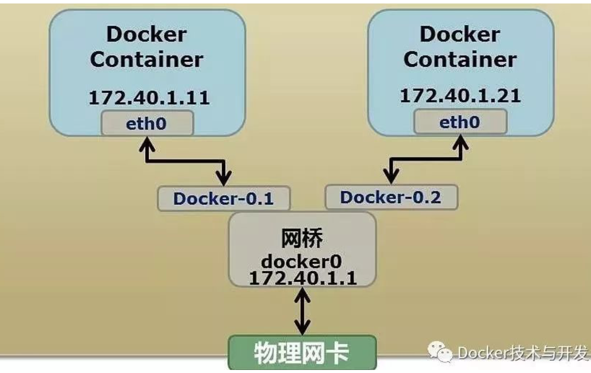
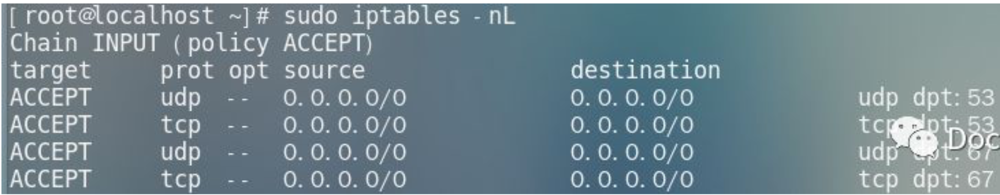
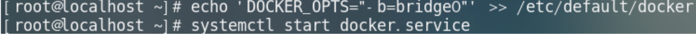

# `Docker`高级网络功能

## 网络启动与参数配置

`Docker` 启动是会在主机上自动创建一个 `docker0` **虚拟网桥**，实际上是一个 `Linux` 网桥，可以理解为一个软件交换机，它会挂载其上的接口之间进行转发；同时，`Docker` 随即分配一个本地未占用的私有网段中的一个地址给`docker0` 接口。



```
$ ip addr | grep docker0
4: docker0: <NO-CARRIER,BROADCAST,MULTICAST,UP> mtu 1500 qdisc noqueue state DOWN group default
    inet 172.17.0.1/16 scope global docker0
```

当创建一个`Docker`容器的时候，同时会创建一对`veth pair`接口(当数据包发送到一个接口时，另外一个接口也可以收到相同的数据包)；

### 这对接口一段在容器内，即`etho0`；

一端在本地并被挂在到`docker0`网桥，名称以`veth`开头(例如`vethAQI2QT`)；通过这种方式，`主机`可以跟`容器通信`，容器之间也可以相互通信，如此一来，`Docke`r就创建了在主机和所有容器之间一个虚拟共享网络。

## 配置容器DNS和主机名

`Docker`支持自定义容器的主机名和`DNS`配置

### 1、相关配置文件

容器中主机名和DNS配置信息都是通过三个系统配置文件来维护的:`/etc/resolv.com`、`/etc/hostname`和`/etc/hosts`。
启动一个容器，在容器中使用`mount`命令可以看到这三个文件挂载信息：

```
$ docker run -it ubuntu
Unable to find image 'ubuntu:latest' locally
Trying to pull repository docker.io/library/ubuntu ...
latest: Pulling from docker.io/library/ubuntu
473ede7ed136: Pull complete
c46b5fa4d940: Pull complete
93ae3df89c92: Pull complete
6b1eed27cade: Pull complete
Digest: sha256:29934af957c53004d7fb6340139880d23fb1952505a15d69a03af0d1418878cb
Status: Downloaded newer image for docker.io/ubuntu:latest

root@0c242fd60a3a:/# mount
overlay on / type overlay (rw,relatime,lowerdir=/var/lib/docker/overlay2/l/6SC3XXRNOBM5DYTTFIV3SESMD4:/var/lib/docker/overlay2/l/MVPKJ2YOCTMTYCQRVIAFU5XMOV:/var/lib/docker/overlay2/l/QHGBJBKCXJCCTOMOAV4DNDVMWQ:/var/lib/docker/overlay2/l/E2FOLTPHHM5CTBAOV6UVGTZMHF:/var/lib/docker/overlay2/l/2OFJ3437BDSCNQMLLYZDXPSGFH,upperdir=/var/lib/docker/overlay2/b11e3576b0b0636563785bca6558a393bdcb7b33cb41a99419cf38b32097c1ad/diff,workdir=/var/lib/docker/overlay2/b11e3576b0b0636563785bca6558a393bdcb7b33cb41a99419cf38b32097c1ad/work)
proc on /proc type proc (rw,nosuid,nodev,noexec,relatime)
tmpfs on /dev type tmpfs (rw,nosuid,mode=755)
devpts on /dev/pts type devpts (rw,nosuid,noexec,relatime,gid=5,mode=620,ptmxmode=666)
sysfs on /sys type sysfs (ro,nosuid,nodev,noexec,relatime)
tmpfs on /sys/fs/cgroup type tmpfs (ro,nosuid,nodev,noexec,relatime,mode=755)
cgroup on /sys/fs/cgroup/systemd type cgroup (ro,nosuid,nodev,noexec,relatime,xattr,release_agent=/usr/lib/systemd/systemd-cgroups-agent,name=systemd)
cgroup on /sys/fs/cgroup/pids type cgroup (ro,nosuid,nodev,noexec,relatime,pids)
cgroup on /sys/fs/cgroup/memory type cgroup (ro,nosuid,nodev,noexec,relatime,memory)
cgroup on /sys/fs/cgroup/hugetlb type cgroup (ro,nosuid,nodev,noexec,relatime,hugetlb)
cgroup on /sys/fs/cgroup/cpuacct,cpu type cgroup (ro,nosuid,nodev,noexec,relatime,cpuacct,cpu)
cgroup on /sys/fs/cgroup/cpuset type cgroup (ro,nosuid,nodev,noexec,relatime,cpuset)
cgroup on /sys/fs/cgroup/freezer type cgroup (ro,nosuid,nodev,noexec,relatime,freezer)
cgroup on /sys/fs/cgroup/net_prio,net_cls type cgroup (ro,nosuid,nodev,noexec,relatime,net_prio,net_cls)
cgroup on /sys/fs/cgroup/perf_event type cgroup (ro,nosuid,nodev,noexec,relatime,perf_event)
cgroup on /sys/fs/cgroup/devices type cgroup (ro,nosuid,nodev,noexec,relatime,devices)
cgroup on /sys/fs/cgroup/blkio type cgroup (ro,nosuid,nodev,noexec,relatime,blkio)
mqueue on /dev/mqueue type mqueue (rw,nosuid,nodev,noexec,relatime)
/dev/mapper/VolGroup00-LogVol00 on /etc/resolv.conf type xfs (rw,relatime,attr2,inode64,noquota)
/dev/mapper/VolGroup00-LogVol00 on /etc/hostname type xfs (rw,relatime,attr2,inode64,noquota)
/dev/mapper/VolGroup00-LogVol00 on /etc/hosts type xfs (rw,relatime,attr2,inode64,noquota)
shm on /dev/shm type tmpfs (rw,nosuid,nodev,noexec,relatime,size=65536k)
/dev/mapper/VolGroup00-LogVol00 on /run/secrets type xfs (rw,relatime,attr2,inode64,noquota)
devpts on /dev/console type devpts (rw,nosuid,noexec,relatime,gid=5,mode=620,ptmxmode=000)
proc on /proc/asound type proc (ro,nosuid,nodev,noexec,relatime)
proc on /proc/bus type proc (ro,nosuid,nodev,noexec,relatime)
proc on /proc/fs type proc (ro,nosuid,nodev,noexec,relatime)
proc on /proc/irq type proc (ro,nosuid,nodev,noexec,relatime)
proc on /proc/sys type proc (ro,nosuid,nodev,noexec,relatime)
proc on /proc/sysrq-trigger type proc (ro,nosuid,nodev,noexec,relatime)
tmpfs on /proc/kcore type tmpfs (rw,nosuid,mode=755)
tmpfs on /proc/timer_list type tmpfs (rw,nosuid,mode=755)
tmpfs on /proc/timer_stats type tmpfs (rw,nosuid,mode=755)
tmpfs on /proc/sched_debug type tmpfs (rw,nosuid,mode=755)
tmpfs on /proc/scsi type tmpfs (ro,relatime)
tmpfs on /sys/firmware type tmpfs (ro,relatime)
```

其中，`/etc/resolv.conf`文件在创建容器时候，默认会与宿主机`/etc/resolv.conf`文件内容保持一致：

```
root@0c242fd60a3a:/# cat /etc/resolv.conf
# Generated by NetworkManager
search bbbb.net
nameserver 10.0.2.3
```
`/etc/hosts`文件中默认只记录了容器自身的一些地址和名称：

```
root@0c242fd60a3a:/# cat /etc/hosts
127.0.0.1	localhost
::1	localhost ip6-localhost ip6-loopback
fe00::0	ip6-localnet
ff00::0	ip6-mcastprefix
ff02::1	ip6-allnodes
ff02::2	ip6-allrouters
172.17.0.2	0c242fd60a3a
```

## 2、容器内修改配置文件

`Docker1.2.0` 开始支持在运行中的容器里直接编辑 `/etc/hosts`，`/etc/hostname`和`/etc/resolv.conf`文件；但是修改是临时的，只在运行的容器中保留，容器终止或重启后并不会被保存下来，也不会被`docker commit`提交。

## 3、通过参数指定

如果需要自定义容器的配置，可以在创建或启动容器时利用下面的参数制定：

* 指定主机名`-h HOSTNAME`或者`--hostname=HOSTNAME`；设定容器的主机名，会写入到容器内的`/etc/hostname`和`/etc/hosts`文件。

* 记录其他容器主机名`--link=CONTAINER_NAME:ALIAS`，选项会在创建容器的时候添加一个所连接容器的主机名到容器内`/etc/hosts`文件中。

* 指定`DNS`服务器`--dns=IP_ADDRESS`，添加`DNS`服务器到容器的`/etc/resolv.conf`中，容器会用指定的服务器来解析所有不再`/etc/hosts`中的主机名。

* 指定`DNS`搜索域`--dns-search=DOMAIN`，设定容器的搜索域，当设定搜索域为`.example.com`时，在搜索一个名为`host`的主机时，`DNS`不仅搜索`host`，还会搜索`host.example.com`。

### 容器访问控制

容器的访问控制主要通过`Linux`上的`iptables`防火墙软件来进行管理和实现，`iptables`是`Linux`系统流行的防火墙软件

#### 1、容器访问外部网络

前面的描述中，容器默认指定了网关为`docker0`网桥上的`docker0`内部接口，`docker0`内部接口同时也是宿主机的一个本地接口，容器默认情况下可以访问到宿主机本地，要想通过宿主机访问到外部网络，需要宿主机进行转发。

在宿主机`Linux`系统中，检查转发是否打开

```
$ sudo sysctl net.ipv4.ip_forward
net.ipv4.ip_forward = 1
```
如果为`0`，说明没有开启转发，需要手动打开，一般都是默认开启的

```
$ sudo sysctl -w net.ipv4.ip_forward=1
net.ipv4.ip_forward = 1
```

#### 2、容器之间的访问

容器之间相互访问，需要两方面的支持：

* 网络拓扑是否已经连通；默认情况下，所有容器都会里连接到`docker0`网桥上。
* 本地系统的防火墙软件`iptables`是否允许访问通过；这取决于防火墙的默认规则是允许还是禁止的。

#### 分两种情况介绍容器之间的访问

**(1)访问所有端口**

当启动`Docker`服务时候，默认会添加一条“允许”转发策略到`iptables`的`FORWARD`链上；通过配置`--icc=true | false`(默认值为true)参数可以控制默认的策略。

为了安全考虑，可以在`Docker`配置文件中配置`DOCKER_OPTS=--icc=false`来默认禁止容器之间的相互访问。

同时，如果启动`Docker`服务时手动指定`--iptables=false`参数则不会修改宿主机系统上的`iptables`规则。

**(2)访问指定端口**

在通过`-icc=false`禁止容器见相互访问后，仍可以通过`--link=CONTAINER_NAME：ALIAS`选项来允许访问指定容器的开放端口。

例：在启动`Docker`服务时，可以同时使用`icc=false --iptables=true`参数来配置容器间禁止访问，并允许`Docker`自动修改系统中的`iptables`规则。

此时，系统中 `iptables` 规则可能类似如下规则，禁止所有转发流量：

```
$ sudo iptables -nL
Chain INPUT (policy ACCEPT)
target     prot opt source               destination

Chain FORWARD (policy ACCEPT)
target     prot opt source               destination
DOCKER-ISOLATION  all  --  0.0.0.0/0            0.0.0.0/0
DOCKER     all  --  0.0.0.0/0            0.0.0.0/0
ACCEPT     all  --  0.0.0.0/0            0.0.0.0/0            ctstate RELATED,ESTABLISHED
ACCEPT     all  --  0.0.0.0/0            0.0.0.0/0
ACCEPT     all  --  0.0.0.0/0            0.0.0.0/0
DOCKER     all  --  0.0.0.0/0            0.0.0.0/0
ACCEPT     all  --  0.0.0.0/0            0.0.0.0/0            ctstate RELATED,ESTABLISHED
ACCEPT     all  --  0.0.0.0/0            0.0.0.0/0
ACCEPT     all  --  0.0.0.0/0            0.0.0.0/0
DOCKER     all  --  0.0.0.0/0            0.0.0.0/0
ACCEPT     all  --  0.0.0.0/0            0.0.0.0/0            ctstate RELATED,ESTABLISHED
ACCEPT     all  --  0.0.0.0/0            0.0.0.0/0
DROP       all  --  0.0.0.0/0            0.0.0.0/0
```

之后，启动容器(`docker run`)时使用`--link=CONTAINER_NAME:ALIAS`选项；`Docker`会在`iptables`中为两个互联容器分别添加一条`ACCEPT`规则，允许相互访问开放的端口(取决于`Dockerfile`中的`EXPOSE`行)。

此时，`iptables`的规则可能时类似如下规则：



## 映射容器端口到宿主主机的实现

默认情况下，容器可以主动访问到外部网络的连接，**但是外部网络无法访问到容器**。

### 1、容器访问外部实现

假设容器内部的网络地址为`172.17.0.2`，本地网络地址地址为`10.0.2.2`；容器要能访问外部网络，源地址不能为`172.17.0.2`，需要进行源地址映射(`Source NAT，SNAT`)，修改为本地系统的IP地址`10.0.2.2`。

映射是通过`iptables`的源地址伪装操作实现的。

查看主机`nat`表上`POSTROUTING`链的规则；该链负责网包要离开主机前，改写其源地址。

```
 sudo  iptables -t nat -nvL POSTROUTING
Chain POSTROUTING (policy ACCEPT 0 packets, 0 bytes)
 pkts bytes target     prot opt in     out     source               destination
11212  654K MASQUERADE  all  --  *      !docker0  172.17.0.0/16        0.0.0.0/0
94726 6064K KUBE-POSTROUTING  all  --  *      *       0.0.0.0/0            0.0.0.0/0            /* kubernetes postrouting rules */
    0     0 MASQUERADE  tcp  --  *      *       172.17.0.13          172.17.0.13          tcp dpt:443
    0     0 MASQUERADE  tcp  --  *      *       172.17.0.13          172.17.0.13          tcp dpt:80
```
上述规则将所有源地址在`172.17.0.0/16` 网段，且不是从`docker0` 接口发出的流量(即从容器中出来的流量)，动态伪装为从系统网卡发出，`MASQUERADE` 行动跟系统 `SNAT` 行动相比，好处时它能从网卡动态获取地址。

### 2、外部访问容器实现

容器允许外部访问，可以在`docker run`时后通过`-p`或`-P`参数来启用。

其实也是在本地的`iptable`的`nat`表中添加相应的规则，将访问外部`IP`地址的网包进行目标地址`DNAT`，将目标地址修改为容器的`IP`地址。

有两点需要注意：

* 规则映射`0.0.0.0`，意味着将接受主机来自所有网络接口上的流量；用户可以通过`-p IP:host_port:container_port`或`-P IP：：port`来指定绑定的外部网络接口，以制定更严格的访问规则
* 如果希望映射永久绑定到某个固定的IP地址，可以在`Docker`配置文件`/etc/default/docker`中指定`DOCKER_OPTS="--ip=IP_ADDRESS"`，之后重启`Docker`服务即可生效。

## 配置docker0网桥

Docker服务默认会创建一个名称为`docker0`的`Linux`网桥(其上有一个`docker0`内部接口)，它在内核层连通了其他的物理或虚拟网卡，这就将所有容器和本地主机都放到同一个物理网络；用户使用`Docker`创建多个自定义网络时可能会出现多个容器网桥。

Docker默认指定了`docker0`接口的IP地址和子网掩码，让主机和容器之间可以通过网桥相互通信，它还给出了`MTU`(接口允许接收的最大传输单元)，通常是`1500`字节，或宿主主机网络路由上支持的默认值；这些值都可以在服务启动的时候进行配置：

* `--bip=CIDR` — IP地址加掩码格式，例如`192.168.1.5/24`；
* `--mtu=BYTES`— 覆盖默认的`Docker mtu`配置。

也可以在配置文件中配置`DOCKER_OPTS`，然后重启服务；由于目前`Docker`网桥时`Linux`网桥，用户可以使用`brctl show`来查看网桥和端口连接信息：

```
$ sudo yum install bridge-utils
$ $ sudo brctl show
bridge name	        bridge id		     STP enable       interfaces
br-f33a582fe2d0		 8000.024230d857a4	  no
docker0		        8000.0242707a8d75	  no
docker_gwbridge		 8000.0242d5d820e3	  no
```
每次创建一个新容器的时候，`Docker`从可用的地址段中选择一个空闲的IP地址分配给容器的`eth0`端口，并且使用本地主机上`docker0`接口的`IP`作为容器的默认网关。

## 自定义网桥

除了默认的`docker0`网桥，用户也可以指定网桥来连接各个容器。
在启动`Docker`服务的时候，使用`-b BRIDGE`或`--bridge=BRIEGE`来指定使用的网桥。如果服务已经运行，那需要先停止服务，并删除旧的网桥：

```
$ sudo systemctl stop docker
$ sudo ip set dev docker0 down
$ sudo brctl delbr docker0
```

然后创建一个网桥`bridge0`：

```
$ sudo brctl addbr bridge0
$ ip addr add 192.168.1.10/24 dev bridge0
$ sudo ip link set dev bridge0 up
```
查看确认网桥创建并启动：

```
$ sudo ip addr show bridge0

```

配置`docker`服务，默认桥接到创建的网桥上



启动`Docker`服务，新建一个容器，可以看到它已经桥接到了`bridge0`上。
可以使用`brctl show`命令查看桥接的信息；在容器中可以使用`ip addr`和`ip route`命令来查看IP地址配置信息。

### 创建一个点到点连接

#### 默认情况下，`Docker`会将所有容器连接到由`docker0`提供的虚拟子网中；用户有时候需要两个容器之间可以直连通信，而不用通过主机网桥进行桥接。

解决办法很简单：创建一个对`peer`接口，分别放到两个容器中，配置成点到点链路类型即可：

**首先启动两个容器：**

```
$ docker run -d -it ubuntu:latest
c9b86c9997947603024ec5ce9ea3d14527d9b0f54a29f34e8931e7a027b40ad4

$ docker run -d -it centos:latest
f0e38e89e20a6ca5e1ecbd8b6051f949e35c545607eb99a387c3f7b6b668017c

$ docker ps -a
CONTAINER ID        IMAGE                     COMMAND                  CREATED             STATUS                          PORTS                     NAMES
3ea94e0074a6        centos:latest             "/bin/bash"              6 seconds ago       Up 5 seconds                                              quirky_shannon
d7b97b9011f1        ubuntu:latest             "/bin/bash"              15 seconds ago      Up 13 seconds                                             jovial_visvesvaraya
```

找到进程号，然后创建网络命令空间的跟踪文件：

```
$ docker inspect -f '{{.State.Pid }}' 3ea94e0074a6 
7974
$ docker inspect -f '{{.State.Pid }}' d7b97b9011f1 
7928
$ sudo mkdir -p /var/run/netns
$ sudo ln -s /proc/7974/ns/net /var/run/netns/7974
$ sudo ln -s /proc/7928/ns/net /var/run/netns/7928

$ cd /var/run/netns
$ ls -la
total 0
drwxr-xr-x  2 root root  80 Oct 31 09:12 .
drwxr-xr-x 29 root root 980 Oct 31 09:11 ..
lrwxrwxrwx  1 root root  17 Oct 31 09:12 7928 -> /proc/7928/ns/net
lrwxrwxrwx  1 root root  17 Oct 31 09:12 7974 -> /proc/7974/ns/net
```

创建一对`peer`接口：

```
$ sudo ip link add A type veth peer name B

```

添加IP地址和路由信息

```
$ sudo ip link set A netns 7974
$ sudo ip netns exec 7974 ip addr add 10.1.1.1/32 dev A
$ sudo ip netns exec 7974 ip link set A up
$ sudo ip netns exec 7974 ip route add 10.1.1.2/32 dev A

$ sudo ip link set B netns 7928
$ sudo ip netns exec 7928 ip addr add 10.1.1.2/32 dev B
$ sudo ip netns exec 7928 ip link set B up
$ sudo ip netns exec 7928 ip route add 10.1.1.1/32 dev B
```

现在这两个容器就可以相互ping通，并成功建立连接；点到点链路不需要子网和子网掩码；也可以不指定--net=none来创建点到点链路；这样容器还可以通过原先的网络进行通信。
利用类似的方法，可以创建一个只跟主机通信的容器，但是一般情况下，更推荐使用--icc=false来关闭容器之间的通信。

```
$  sudo docker exec -it 3ea94e0074a6 /bin/bash

$ ping 10.1.1.2
PING 10.1.1.2 (10.1.1.2) 56(84) bytes of data.
64 bytes from 10.1.1.2: icmp_seq=1 ttl=64 time=0.075 ms
64 bytes from 10.1.1.2: icmp_seq=2 ttl=64 time=0.044 ms
64 bytes from 10.1.1.2: icmp_seq=3 ttl=64 time=0.045 ms
64 bytes from 10.1.1.2: icmp_seq=4 ttl=64 time=0.073 ms
^C
--- 10.1.1.2 ping statistics ---
4 packets transmitted, 4 received, 0% packet loss, time 2999ms
rtt min/avg/max/mdev = 0.044/0.059/0.075/0.015 ms

```

```
# ping 10.1.1.1
bash: ping: command not found

# apt-get install iputils-ping
Reading package lists... Done
Building dependency tree
Reading state information... Done
E: Unable to locate package iputils-ping

# apt-get update
# apt-get install iputils-ping

# ping 10.1.1.1
PING 10.1.1.1 (10.1.1.1) 56(84) bytes of data.
64 bytes from 10.1.1.1: icmp_seq=1 ttl=64 time=0.056 ms
64 bytes from 10.1.1.1: icmp_seq=2 ttl=64 time=0.055 ms
^C
--- 10.1.1.1 ping statistics ---
2 packets transmitted, 2 received, 0% packet loss, time 1000ms
rtt min/avg/max/mdev = 0.055/0.055/0.056/0.007 ms
```