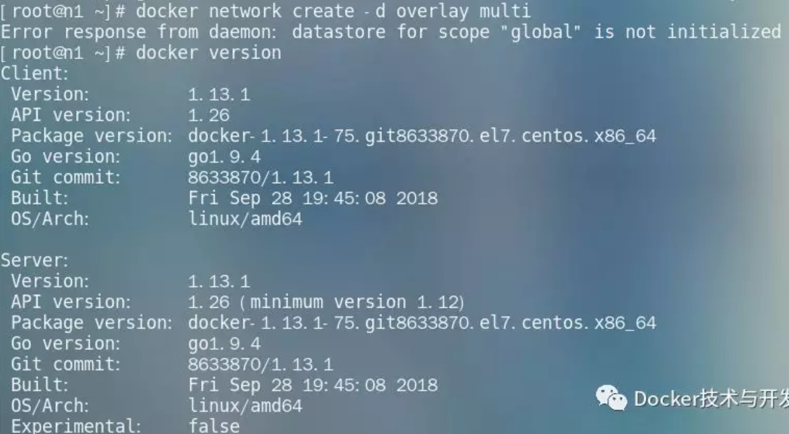
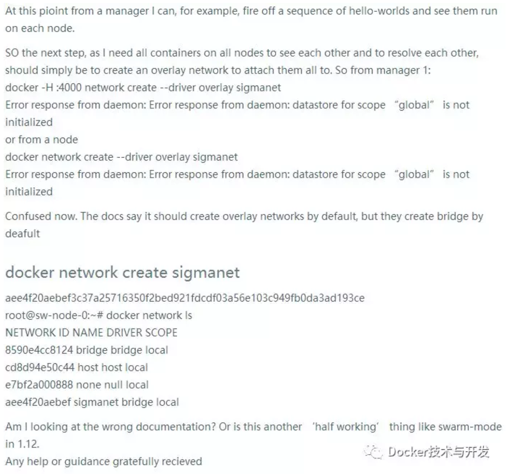
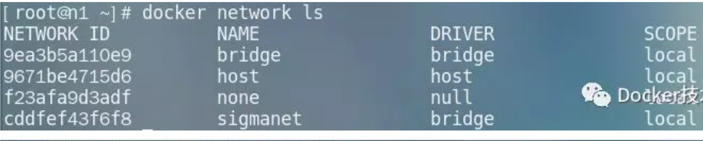
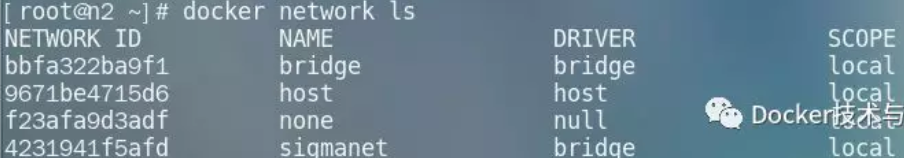
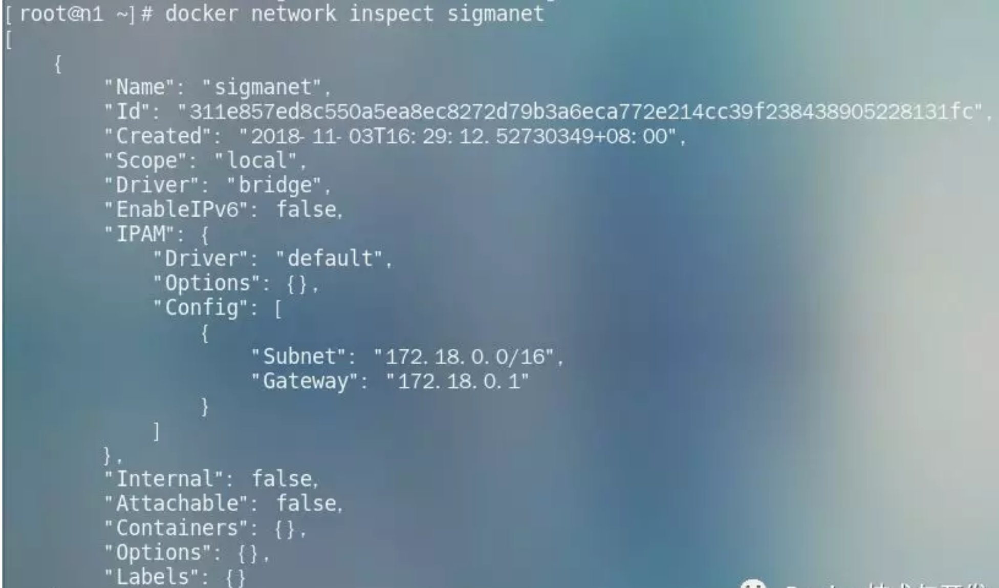
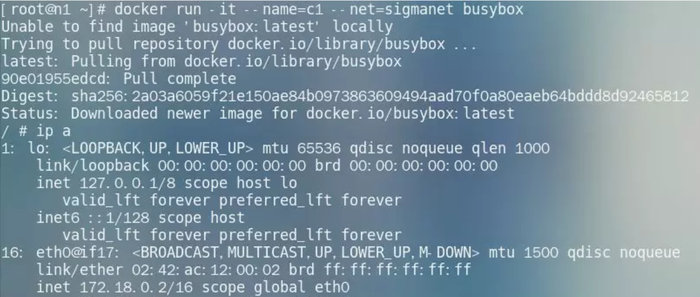
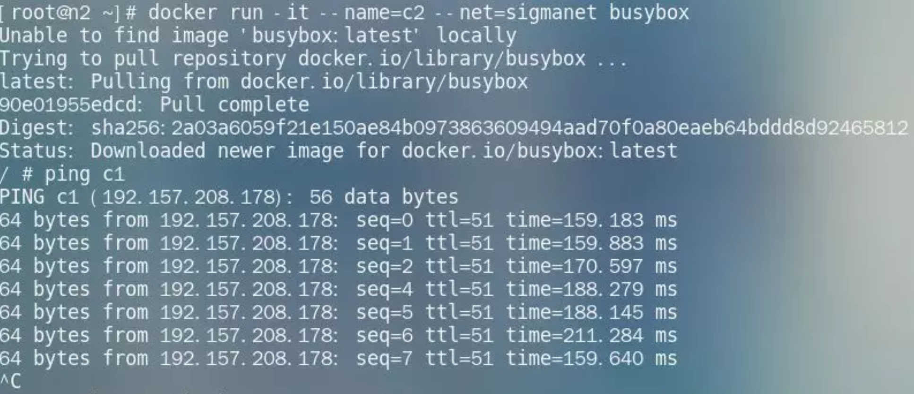

# libnetwork 插件化网络功能


## 容器网络模型

`libnetwork` 中容器网络模型(`Container Networking Model,CNM`)可以让上层使用网络的大量应用容器最大程度上不去关心底层发现。


### 三种基本元素：

* Sandbox(沙盒)：**代表一个容器**；
* Endpoint(接入点)：**代表网络上可以挂载容器的接口，会分配IP地址；** 
* Network 可以**连通多个接入点的一个子网**。


**只要插件能提供网路和接入点，只需要把容器给接上或者拔下，剩下的都是插件驱动自己去实现；这样就接藕和容器和网络功能，十分灵活。**

### CNM的典型生命周期是

1. 驱动注册自己到**网络控制器**，**网络控制器使用驱动类型**，**来创建网络**，然后在创建的网络上创建接口，最后把容器连接到接口上即可；

2. 销毁过程则正好相反，先把容器从接口上卸载，然后删除接入口和网络即可。


### CNM支持的驱动类型有四种：Null、Bridge、Overlay、Remote

* Null：不提供网络服务服务，容器启动后无网络连接；
* Bridge：**Docker传统上默认使用Linux网桥和iptables实现的单机网络；** 
* Overlay：用vxlan隧道实现的跨主机容器网络；
* Remote：扩展类型；预留给其他外部实现的方案。


### Docker网络相关命令

**在`libnetwork`支持下，Docker网络相关命令都作为network的子命令出现。**

* ls：列出所有网络；
* create：创建一个网络； 
* rm：删除一个网络；
* connect：把容器介入到网络； 
* disconnect：把容器从网络卸载下来；
* inspect：查看网络的详细信息。

#### 列出网络：

格式：`docker network ls [OPTIONS]`

* -f：指定输出过滤器；
* --no-true：不截断输出内容。

```
$ docker network ls
NETWORK ID          NAME                DRIVER              SCOPE
f33a582fe2d0        aliyun_default      bridge              local
c8552bed3acb        bridge              bridge              local
cafabc39309b        docker_gwbridge     bridge              local
dba48827beec        docs_loki           bridge              local
0f545972c564        host                host                local
ac6d0d0c4f9b        none                null                local
```
分别为三种：`null`、`host` 和 `bridge`。

#### 创建网络：

格式：`docker network create [OPTIONS] NETWORK`

* --aux-address value：辅助的IP地址；
* -d，--driver string：网络驱动类型；
* --gateway value：网关地址；
* --internal：禁止外部对创建网络的访问；
* --ip-range value：分配IP地址范围；
* --ipam-driver string：IP地址管理的插件类型；
* --ipam-opt value：IP地址管理插件的选项；
* --ipv6：支持IPv6地址；
* --label value：为网络添加元标签信息；
* -o，--opt value：网路驱动支持的选项；
* --subnet value：网络地址段。

#### 删除网络：

格式：`docker network rm NETWORK [NETWORK...]`

#### 接入容器：

格式：`docker network connect [OPTIONS] NETWORK CONTAINER`

* --alias value：为容器添加一个别名；
* --ip string：指定IP地址；
* --ipv6 string：指定IPv6地址；
* --link value：添加链接到另外一个容器；
* --link-local-ip value：为容器添加一个链接地址。

#### 卸载容器:

格式：`docker network disconnect [OPTIONS] NETWORK CONTAINER`

* -f、--force：强制把容器从网络上移除。

#### 查看网络信息：

格式: `docker network disconnect [OPTIONS] NETWORK [NETWORK...]`

* -f、--format string：给定一个golang模板字符串，对输出结果进行格式化。


## 构建跨主机容器网络


以 [Consul](https://www.consul.io/) 为例，启动一个 `progrium/consul`容器，并映射服务到本地的 `8500` 端口：

```
[root@n1 ~]$ docker run -d \
> -p "8500:8500" \
> -h "consul" \
> progrium/consul -server -bootstrap
Unable to find image 'progrium/consul:latest' locally
Trying to pull repository docker.io/progrium/consul ...
latest: Pulling from docker.io/progrium/consul
c862d82a67a2: Pull complete
0e7f3c08384e: Pull complete
0e221e32327a: Pull complete
09a952464e47: Pull complete
60a1b927414d: Pull complete
4c9f46b5ccce: Pull complete
417d86672aa4: Pull complete
b0d47ad24447: Pull complete
fd5300bd53f0: Pull complete
a3ed95caeb02: Pull complete
d023b445076e: Pull complete
ba8851f89e33: Pull complete
5d1cefca2a28: Pull complete
Digest: sha256:8cc8023462905929df9a79ff67ee435a36848ce7a10f18d6d0faba9306b97274
Status: Downloaded newer image for docker.io/progrium/consul:latest
13c652fd9afe25734803fcc1273a9c0ec2f6213b089a652aac45eb4fe3f3f56f

$ docker ps
CONTAINER ID        IMAGE                     COMMAND                  CREATED             STATUS                          PORTS                                                                            NAMES
13c652fd9afe        progrium/consul           "/bin/start -serve..."   48 seconds ago      Up 47 seconds                   53/tcp, 53/udp, 8300-8302/tcp, 8400/tcp, 8301-8302/udp, 0.0.0.0:8500->8500/tcp   confident_brown
```

所在主机作为数据库节点。

### 配置Docker主机

启动两台 `Docker` 主机`n1`和`n2`，分别安装好最新的`Docker-engine(1.7.0+)`。**确保这两台主机之间可以通过IP地址互相访问，另外，都能访问到数据库节点的8500端口**。

配置主机的`Docker`服务启动选项：


重启Docker服务：

```
[root@n1 ~]$ sudo systemctl restart docker
```


```
[root@n2 ~]$ sudo systemctl restart docker
```

### 创建网络

分别在`n1`和`n2`上查看现有的Docker网络，包括三个默认网络：分别为`bridge`、`host`和`none`类型。


在任意节点创建网络`multi`，例如在`n1`上执行如下命令即可完成对跨主机网络的创建：

添加时报错



可以看到这里的docker版本和引擎是1.31的，没有更新，解决办法：

```
https://forums.docker.com/t/docker-1-12-with-swarm-1-2-5-consul-issue/21017
```



创建成功后，可以同时在`n1`和`n2`上查看到新的网络`multi`的信息：





此时，可以通过 `docker network inspect` 命令查看网络的具体信息：



### 测试网络

在`n1`上启动一个容器`c1`，通过`--net`选项指定连接到`sigmanet`网络上，查看网络信息，其中一个接口`eth0`已经连接到了`multi`网络上：



在`n2`上启动一个容器`c2`，同样连接到`sigmanet`网络上；通过`ping c1`进行测试，可以访问到另外一台主机`n1`上的容器`c1`：



跨主机网络互通完成。


