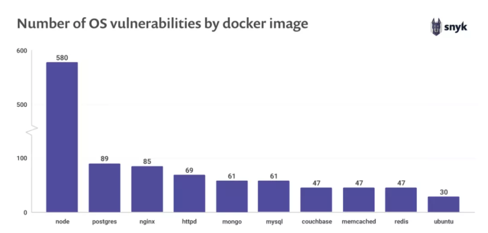
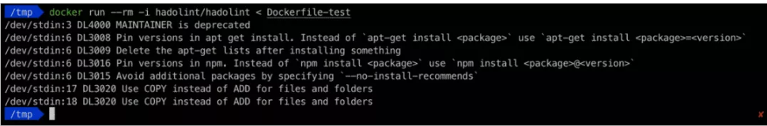

# 10项你不得不知道的Docker镜像安全最佳实践

`《Docker 镜像安全最佳实践速查表》`列举了10个诀窍和指南，确保更安全和更高质量的 Docker 镜像处理。此外，还可以检视有关 Docker安全的新报告`《Docker 安全要趁早》`。

## 1. 选用最小化基础镜像


人们编写项目的 `Dockerfile` 时，经常使用一个通用的 `Docker` 容器镜像作为基础，例如 `From Node` 。`Node` 镜像实际上是以一个完整安装的 `Debian Stretch` 发行版为基础，这意味着构建得到的项目容器镜像将包含一个完整的操作系统。

**如果该项目不需要任何通用的系统库或者系统工具应用，最好不要使用完整的操作系统作为基础镜像。**



从上图`（摘自《开源安全报告-2019》）`可知，**`Docker Hub` 上最流行的 `10` 个镜像都包含已知的安全漏洞。选用最小化基础镜像，即只包含项目确实需要的系统工具和库的镜像，就能最小化系统的攻击面，确保所用操作系统是安全的。**


了解更多 Docker 镜像安全的知识，请参阅：

[https://snyk.io/features/container-vulnerability-management/](https://snyk.io/features/container-vulnerability-management/)

## 2. 设定最小权限的 USER

如果 `Dockerfile` 中没有指定 `USER` ，`Docker` 默认将会以超级用户 `root` 的身份运行容器，容器所属的命名空间（namespace）因此映射为 `root` 所有，**这意味着容器有可能获取 `Docker` 宿主机的超级管理权限。** 

不仅如此，以 `root` 用户身份运行容器，还扩大了攻击面，如果容器应用中存在安全漏洞，很容易造成权限提升。

在实践中，一般不需要容器拥有 `root` 权限。为了尽量降低安全威胁，创建专门的用户和用户组，在 `Dockerfile` 中使用 `USER` 指定用户，确保以最小权限的用户身份运行容器应用。

如果基础镜像中不包含专门的用户，那么就在 `Dockerfile` 中直接创建。下面就是一个这样的例子，它用到的基础镜像是 `Ubuntu` ：

```
FROM ubuntu 
RUN mkdir /app 
RUN groupadd -r lirantal && useradd -r s /bin/ -g lirantal lirantal 
WORKDIR /app 
COPY . /app 
RUN chown -R lirantal:lirantal /app 
USER lirantal 
CMD node index.js 
```

在上例中：


* 创建一个系统用户（ `-r` 选项），没有密码、没有主目录且没有 `shell`;
* 将该用户添加到前面（使用 `groupadd` ）创建的用户组；
* 最后一段参数设定了用户名以及所属的用户组。

如果你使用的是 `Node.js` 和 `alpine` 镜像，已经包含了一个用户 `node`，直接使用即可：

```
FROM node:10-alpine 
RUN mkdir /app 
COPY . /app 
RUN chown -R node:node /app 
USER node 
CMD ["node", "index.js"] 
```

## 3. 签名和校验镜像，防范中间人攻击

`Docker` 镜像的认证颇具挑战性。在生产环境使用这些镜像运行我们的代码，意味着我们对这些镜像的极大信任。因此，必须保证我们拉取的容器镜像确实是发布者发布的镜像，没有被任何人篡改。发生镜像篡改，有可能是因为 `Docker` 客户端和镜像中心之间的中间人攻击，或者是发布者的身份被人盗用并在镜像中心发布了恶意镜像。


### 校验 Docker 镜像

`Docker` 默认直接拉取容器镜像，不会校验镜像的来源和发布者。这意味着你有可能使用来源和发布者不明的任何镜像。无论采用何种策略，最佳实践都是先校验容器镜像，通过验证后再拉取镜像。为了体验镜像校验功能，执行下列暂时开启 `Docker Content Trust` 的命令：

```
export DOCKER_CONTENT_TRUST=1
```

现在，尝试拉取一个没有签名的容器镜像——请求会被拒绝，不会拉取镜像。

### 签名 Docker 镜像


优先使用 `Docker` 认证的镜像，即这些镜像来自经过 `Docker Hub` 检查和选择的可信提供者。不要使用无法检验来源和发布者的容器镜像。


`Docker` 支持镜像签名，提供了额外一层的保护。**使用 `Docker Notary` 签名镜像。`Notary` 会检验镜像的签名，如果签名不合法，它会阻止运行该镜像。**


如果开启了 `Docker Content Trust` ，构建 `Docker` 镜像的同时也会对镜像签名。

**如果是第一次签名，`Docker` 会为当前用户生成一个私钥，保存在 `~/docker/trust` 。后续所有的镜像都会使用这个私钥签名。**

[https://docs.docker.com/engine/security/trust/content_trust/](https://docs.docker.com/engine/security/trust/content_trust/)

## 4. 找出、修正和监控开源漏洞


**指定容器的基础镜像，同时也引入了该镜像包含的操作系统及系统库有可能存在的所有安全风险。**


最好选用能够正常运行应用代码的最小化镜像，这有助于减少攻击面，因为限制了可能的安全漏洞数量。不过，这么做并没有对镜像进行安全审计，也不能防范将来发现的新漏洞。


**因此，防范安全软件漏洞的一种方法是使用像 `Snyk` 这样的工具，持续扫描和监控 `Docker` 镜像各层可能存在的漏洞。**


使用下列命令扫描容器镜像，检查是否存在已知漏洞：


```
# fetch the image to be tested so it exists locally 
$ docker pull node:10 
# scan the image with snyk 
$ snyk test --docker node:10 file—path/to/Dockerfile 
```

`Snyk` 能够监控指定的容器镜像，一旦有新发现的安全漏洞，通知用户并给出修补建议：

```
$ snyk monitor --docker node:10 
```

根据 `Snyk` 用户执行的镜像扫描，我们发现大约 `40%` 的 `Docker` 镜像包含已知漏洞，实际上弥补这些漏洞的新版本基础镜像已经有了。`Synx` 提供了绝无仅有的修正建议功能，用户可以根据建议采取行动，升级 `Docker` 镜像。

## 5. 不要在容器镜像中包含机密信息

有时候，构建包含应用的容器镜像时，需要用到一些机密信息，例如从私有仓库拉取代码所需的 `SSH 私钥`，或者**安全私有软件包所需的令牌**。 如果 `Dockerfile` 中包含复制机密信息的命令，构建镜像时，这行命令对应的中间容器会被缓存，导致机密数据也被缓存，有可能造成机密信息泄漏。因此，像令牌和密钥这样的机密信息必须保存在 `Dockerfile` 之外。

### 使用多阶段构建

```
FROM: ubuntu as intermediate 

WORKDIR /app 
COPY secret/key /tmp/ 
RUN scp -i /tmp/key build@acme/files . 

FROM ubuntu 
WORKDIR /app 
COPY --from intermediate /app .
```

### 使用 Docker 的 secret 管理功能

使用 `Docker` 的 `secret` 管理功能（`alpha` 阶段），加载敏感信息文件且不会缓存这些信息：

```
# syntax = dockar/dockerfile11.0-experimental 
FROM alpine
 
# shows secret from default secret location 
RUN --mount.type=secret,id=nysecret cat /runisecrets/mysecret 

# shows secret from custom secret location 
RUN --mount=type=secret,id=mysecret,dst=/foobar cat /foobar 
```

[https://docs.docker.com/engine/security/trust/content_trust/](https://docs.docker.com/engine/security/trust/content_trust/)

### 避免无意中复制机密信息

往镜像中复制文件时，也要当心，避免无意中添加了机密信息。例如，下面的命令将整个构建上下文文件夹复制到 Docker 镜像，有可能把敏感文件也复制进去了：


```
COPY . .
```

如果文件夹中有敏感文件，要么先移除这些文件，要么将这些文件包含在 `.dockerignore` 中，复制时会忽略这些文件：

```
private.key
appsettings.json
```

## 6. 设定镜像的标签，保证镜像的不可更改性

每个 `Docker` 镜像可以有多个标签（`tag`），代表该镜像的不同变体。

最常见的标签是 `latest` ，表示这是该镜像的最新版本。镜像标签是可更改的，也就是说镜像的作者可以多次发布相同标签的镜像。


因此，即使你的 `Dockerfile` 明确指定了使用的基础镜像及其标签，这次镜像构建和下次镜像构建仍然可能用到了不同的基础镜像。解决这个问题，有多种办法：


* 优先选用最详细的镜像标签。例如，镜像有 `:8`、`:8.0.1` 和 `:8.0.1-alpine` 等标签，选择最后这个，因为它提供了最详细的信息。不要使用像 `latest` 这样过于泛泛的标签。

* 记住，镜像的发布者有可能删除镜像的某个标签。如果设定了所用镜像的标签，一旦这个标签被删除，镜像构建会因为找不到基础镜像而失败。为了避免这个问题，可以提前把该镜像复制到私有镜像中心或者公有镜像中心的私人账户下面。这么做，保证了镜像的不可更改性，同时也带来了维护私有镜像中心的负担。

* 使用比签名更具体的 `SHA256` 引用指明要使用的镜像，这能保证每次拉取都是相同内容的镜像。这么做也有风险，如果镜像改变了，以前的 `SHA256` 引用（散列值）也不存在了。

## 7. 使用 COPY ，不要使用 ADD

可以用来从宿主机复制文件到容器镜像中的 `Docker` 命令有两个：`COPY` 和 `ADD `，这两个命令本质上很相似，但具体功能并不相同：

* `COPY` - **将本地文件或者目录（递归）复制到容器镜像中的目标目录，复制来源和目标都必须明确指定。** 给定明晰的源和目标文件或目录，递归地复制本地文件。要使用`COPY`命令，您必须声明位置。

* `ADD` - **以递归方式复制本地文件，在目标目录不存在时隐式创建目标目录**。`ADD` 也可以将远程 URL 指定的文件下载到目标目录。

`ADD`和`COPY`之间的差异虽然很小但是很重要。为了避免可能导致的安全问题，这些差异必须谨记：


* 使用 `ADD` 从远程 `URL` 下载文件，存在中间人攻击的风险，文件内容有可能因此被篡改。必须确保远程 `URL` 必须是安全的 `TLS` 链接，校验远程 `URL` 的来源和身份。
* 如果复制的是本地压缩文件， `ADD` 自动将它解压缩到目标目录，这有可能触发 `zip` 炸弹或者 `zip` 任意文件覆盖漏洞。
* 相比较而言，使用 `COPY` 复制文件或目录，会创建一个缓存的中间镜像层，优化镜像构建的速度


## 8. 使用 LABEL 指定镜像元数据


镜像元数据有助于用户更好地理解和使用该镜像。最常见的元数据是 `maintainer` ，它说明了镜像维护者的电邮地址和名字。使用 `LABEL` 命令添加镜像的元数据：

```
LABEL maintainer="me@acme.com" 
```

除了镜像的维护者信息，添加其他你认为重要的元数据，包括提交对象的散列值、相关构建的链接、质量状态（通过所有测试了吗？）、源代码链接、`SECURITY.TXT` 文件的位置等。

`SECURITY.TXT` (RFC5785) 文件说明了镜像维护者的安全披露政策。最好在镜像元数据中加上 `SECURITY.TXT `的链接，例如：

```
LABEL securitytxt.="https://www.example.com/.well-known/security.txt" 
```

注意：这个规范好像已经废止了，[请直接访问 OCI 镜像规范](https://github.com/opencontainers/image-spec)


## 9. 使用多阶段构建小而安全的镜像


使用 Dockerfile 构建应用容器镜像时，会生成很多只是构建时需要的镜像层，包括编译时所需的开发工具和库，运行单元测试所需的依赖、临时文件、机密信息等等。


如果保留这些镜像层，不仅会增加镜像的大小，影响镜像下载速度，而且会因为安装更多软件包而面临更大的攻击危险。这对用到的镜像也是成立的——需要使用一个专门构建应用的镜像，但不会用它来运行应用代码。


Go 语言就是一个很好的例子。构建一个 Go 应用需要用到 Go 编译器。编译得到的 Go 应用能够在任何操作系统上直接运行，没有任何依赖，包括 scratch 镜像。

Docker 因此提供了多阶段构建的功能，允许在构建过程中使用多个临时镜像，只保留最后一个镜像。这样，用户得到两个镜像：

* 第一个镜像 —— 非常大的镜像，包含了构建应用和运行测试所需的所有依赖；
* 第二个镜像 —— 非常小的镜像，只包含运行应用所需的极少数依赖。


## 10. 使用静态分析工具

使用静态分析工具，能够避免常见的错误，建立工程师自动遵循的最佳实践指南。

例如，`hadolint` 分析` Dockerfile` 并列出不符合最佳实践规则的地方。





在集成开发环境`（IDE）`中使用 `hadolint` 更好。例如，安装 `VS Code` 的 `hadolint` 扩展后，编写 Dockerfile 时，边写边检查，既快又好。


