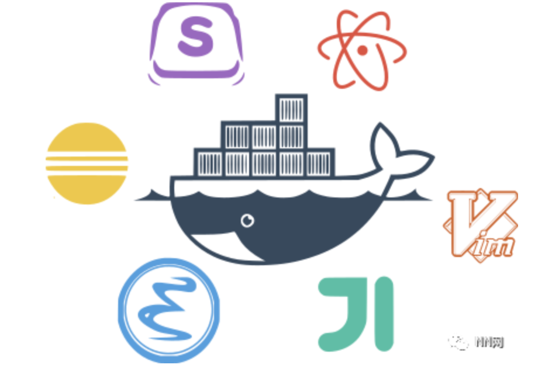
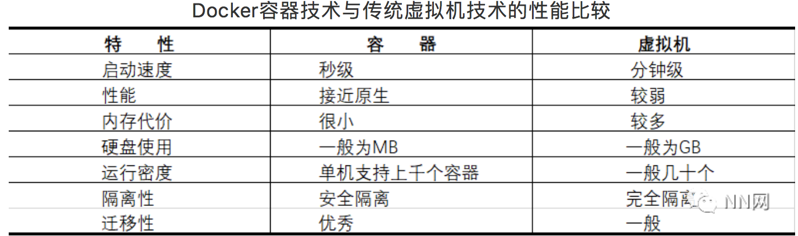
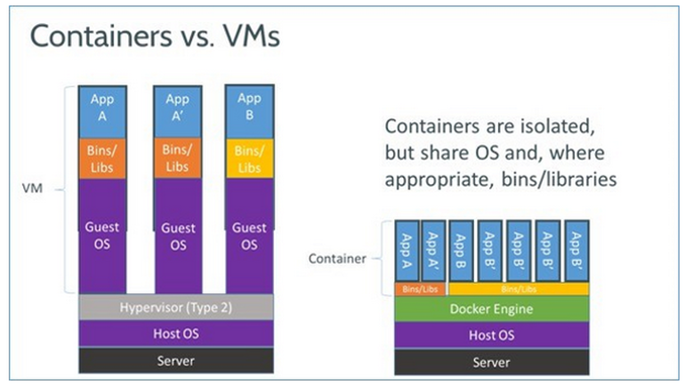

# Docker的基本概念与优势
## 什么是Docker？

Docker是基于Go语言实现的开源容器项目，诞生于2013年年初，发起者是dotCloud公司。
Docker的构想是要实现**“Build，Ship and Run Any App，Anywhere”**，即通过对应的封装（Packaging）、分发（Distribution）、部署（Deployment）、运行（Runtime）生命周期进行管理，达到应用组件**“一次封装，到处运行”**的目的。

应用组件既可以是一个Web应用、一个编译环境，也可以是一套数据库平台服务，甚至是一个操作系统或集群。Docker提供了高效、敏捷和轻量级的容器方案，并支持部署到本地环境和多种主流云平台，也是首次为应用的开发、运行和部署提供了“一站式”的使用解决方案。

另外，容器自身对系统资源的额外需求也十分有限，远远低于传统虚拟机。很多时候，甚至直接把容器当做应用本身也没有任何问题。

## 为什么要使用Docker？
### 1、Docker容器虚拟化的好处
在云时代，开发者创建的应用必须要能很方便地在网络上传播，也就是说应用必须脱离底层物理硬件的限制；同时必须是“任何时间、任何地点”可获取的。因此，开发者需要一种新型的创建分布式应用程序的方式，快速分发和部署，这正是Docker所能够提供的最大优势。

Docker提供了一种更为聪明的方式，通过容器来打包应用，解耦应用和运行平台。意味着迁移的时候，只需要在新的服务器上启动需要的容器就可以了，无论新旧服务器是否同一类型的平台。这无疑将节约大量的宝贵时间，并降低部署过程中出现问题的风险

### 2、Docker在开发和运维中的优势
**更快速的交付和部署**

使用Docker，开发人员可以使用镜像来快速构建一套标准的开发环境；开发完成后，测试和运维人员可以直接使用完全相同环境来部署代码。只要开发测试过的代码，就可以确保在生产环境中无风缝运行。Docker可以快速常见和删除容器，实现快速迭代，大量节约开发、测试、部署的时间。并且，整个过程全程可见，使团队更容易理解应用的创建和工作过程。

**更高效的资源利用**

Docker容器的运行不需要额外的虚拟化管理程序支持，它是内核级的虚拟化，可以实现更高的性能，同时对资源的额外需求很低。跟传统虚拟机方式相比，要提高一到两个数量级。

**更轻松的迁移和扩展**

Docker容器几乎可以在任意的平台上运行，包括物理机、虚拟机、公有云、私有云、个人电脑、服务器等，同时支持主流的操作系统发行版本。这种兼容性让用户可以在不同平台之间轻松地迁移应用。

**更简单的更新管理**

使用Dockerfile只需要小小的配置修改，就可以替代以往大量的更新工作。并且所有修改都以增量的方式被分发和更新，从而实现自动化并且高效的容器管理。

### 3、Docker与虚拟机比较

 作为一种轻量级的虚拟化方式，Docker在运行应用上与传统的虚拟机方式相比具有显著优势：
 
* Docker容器很快，启动和停止可以在秒级实现，而传统的虚拟机方式需要数分钟。
* Docker容器对系统资源需求很少，一台主机上可以同时运行数千个Docker容器。
* Docker通过类似Git设计理念的操作来方便用户获取、分发和更新应用镜像，存储复用，增量更新。
* Docker通过Dockerfile支持灵活的自动化创建和部署机制，提高工作效率，使流程标准化。

## Docker与虚拟化

  虚拟化（Virtualization）技术是一种通用的概念，在不同领域有不同的理解。在计算领域，一般指的是计算虚拟化（Computing Virtualization），或通常说的服务器虚拟化。维基百科上的定义：“虚拟化是一种资源管理技术，是将计算机的各种实体资源，如服务器、网络、内存及存储等，予以抽象、转换后呈现出来，打破实体结构间的不可切割的障碍，是用户可以比原本的组态更好的方式来应用这些资源。”
  
  虚拟化技术可分为基于硬件虚拟化和基于软件虚拟化。其中，真正意义上的基于硬件的虚拟化技术不多见，少数如网卡中的单根多IO虚拟化等技术。
  
  基于软件的虚拟化从对象所在的层次，又可以分为应用虚拟化和平台虚拟化。其中，前者一般指的是一些模拟设备或者诸如Wine这样的软件。后者可细分为一下子类：
  
* 完全虚拟化。虚拟机模拟完整的底层硬件环境和特权指令的执行过程，客户操作系统无需进行修改。例如IBM p和z 系列的虚拟化、VMware Workstation、VirtualBox、QEMU等。
* 硬件辅助虚拟化。利用硬件（主要是CPU）辅助支持处理敏感指令来实现完全虚拟化的功能，客户操作系统无需修改，例如VMware Workstation、Xen、KVM。
* 部分虚拟化。只针对部分硬件资源进行虚拟化，客户操作系统需要进行修改。现在有些虚拟化技术的早期版本仅支持部分虚拟化。
* 准虚拟化（paravirtualization）。部分硬件接口以软件的形式提供给客户机操作系统，客户操作系统需要进行修改，例如早期的Xen。
* 操作系统虚拟化。内核通过创建多个虚拟的操作系统实例（内核和库）来隔离不同的进程。

可见，Docker以及其他容器技术，都属于操作系统虚拟化这个范畴，操作系统虚拟化最大的特点就是不需要额外的supervisor支持

**传统方式是在硬件层面实现虚拟化，需要有额外的虚拟机管理应用和虚拟机操作系统层。**

**Docker容器是在操作系统层面上实现虚拟化，直接复用本地主机的操作系统，因此更加轻量级。**

