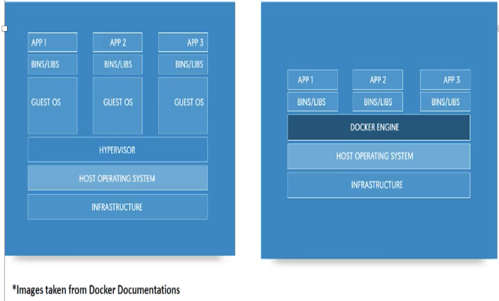

# Docker Introduction
## What is Docker?
Docker is an open platform for developers and system engineers to **build, ship and run distributed application,** whether on Bare Metal System (Physical), VMs, or the Cloud. Docker is not a Linux container technology like Xen/KVM etc.

**Docker provides an additional of layer of abstraction and automation of operating system** virtualization on Windows and Linux.

## Advantages of using Docker

### **Portability**
In docker system, an application and its re-req's/dependencies can be **bundled into a single container/image**, which will be independent of host kernel, can be easily ported to difference system.

### **Quick Application Deployment**
As application and its dependencies can be bundled into single images, it makes easy to quickly deploy the apps

### **Sharing**
You can share your Docker image with others using remote repositories

### **Lightweight**
Docker images have very small, they need very low compute capacity and storage.

### **Easy Maintenance**
Maintenance is very quick and easy

### **Cost saving**
Open source Technology and don't need heavy compute

## Docker Container VS. Virtual Machines

* Docker container can be created/destroyed very quickly as compare to the virtual machines
* Docker container are light weight compare to the virtual machines. Being lightweight more containers run at time on a host
* Docker container make use of resources very efficiently. In case of virtual machines capacity is need to be reserved (compute + storage), whereas this is not needed in case of Docker containers
* Virtual Machines can be migrated across server they are running, but Docker need to stopped before migration as there is not hypervisor layer,



## Docker Terminologies

### **images**
images are templates for docker container

### **container**
Created from Docker images and run the actual application

### **Docker Daemon**
The background service running on the host that manages building, running the container


## Docker installation

### Pre-requisites

```
RHEL or CentOS 7 64 Bit/ Kernel 3.10.x kernel is minimum required
```
**Print all system information**

```
$ uname -a
Linux node1 3.10.0-693.5.2.el7.x86_64 #1 SMP Fri Oct 20 20:32:50 UTC 2017 x86_64 x86_64 x86_64 GNU/Linux
```

**Check the version of centos**

```
$ cat /etc/centos-release
CentOS Linux release 7.4.1708 (Core)
```
**check policy security of Linux**

```
$ sestatus
SELinux status:                 enabled
SELinuxfs mount:                /sys/fs/selinux
SELinux root directory:         /etc/selinux
Loaded policy name:             targeted
Current mode:                   enforcing
Mode from config file:          enforcing
Policy MLS status:              enabled
Policy deny_unknown status:     allowed
Max kernel policy version:      28
```
**Disable  policy security of Linux**

```
$ sudo vi /etc/sysconfig/selinux
set as disabled
```
```
$ reboot
```

### Uninstall old Docker versions

```
sudo yum remove docker \
                  docker-client \
                  docker-client-latest \
                  docker-common \
                  docker-latest \
                  docker-latest-logrotate \
                  docker-logrotate \
                  docker-selinux \
                  docker-engine-selinux \
                  docker-engine \
                  docker-ce
``` 

### Install EPEL repository

```
sudo yum install -y epel-release
```

### Install docker software

```
sudo yum install -y docker
```

### Enable the start Docker service

```
sudo systemctl enable docker
sudo systemctl start docker
```
### Check the docker version

```
sudo docker version
```
```
 Version:         1.13.1
 API version:     1.26
 Package version: docker-1.13.1-68.gitdded712.el7.centos.x86_64
 Go version:      go1.9.4
 Git commit:      dded712/1.13.1
 Built:           Tue Jul 17 18:34:48 2018
 OS/Arch:         linux/amd64

Server:
 Version:         1.13.1
 API version:     1.26 (minimum version 1.12)
 Package version: docker-1.13.1-68.gitdded712.el7.centos.x86_64
 Go version:      go1.9.4
 Git commit:      dded712/1.13.1
 Built:           Tue Jul 17 18:34:48 2018
 OS/Arch:         linux/amd64
 Experimental:    false
```
### Check detailed docker information

```
sudo docker info
```
```
Containers: 0
 Running: 0
 Paused: 0
 Stopped: 0
Images: 0
Server Version: 1.13.1
Storage Driver: overlay2
 Backing Filesystem: xfs
 Supports d_type: true
 Native Overlay Diff: true
Logging Driver: journald
Cgroup Driver: systemd
Plugins:
 Volume: local
 Network: bridge host macvlan null overlay
Swarm: inactive
Runtimes: docker-runc runc
Default Runtime: docker-runc
Init Binary: /usr/libexec/docker/docker-init-current
containerd version:  (expected: aa8187dbd3b7ad67d8e5e3a15115d3eef43a7ed1)
runc version: 5eda6f6fd0c2884c2c8e78a6e7119e8d0ecedb77 (expected: 9df8b306d01f59d3a8029be411de015b7304dd8f)
init version: fec3683b971d9c3ef73f284f176672c44b448662 (expected: 949e6facb77383876aeff8a6944dde66b3089574)
Security Options:
 seccomp
  WARNING: You're not using the default seccomp profile
  Profile: /etc/docker/seccomp.json
Kernel Version: 3.10.0-693.5.2.el7.x86_64
Operating System: CentOS Linux 7 (Core)
OSType: linux
Architecture: x86_64
Number of Docker Hooks: 3
CPUs: 1
Total Memory: 488.4 MiB
Name: node1
ID: VEPW:PD4Y:A5HN:6M35:UT64:VPN7:IKKO:INIY:A2FK:P6CD:NAJ5:AH6M
Docker Root Dir: /var/lib/docker
Debug Mode (client): false
Debug Mode (server): false
Registry: https://index.docker.io/v1/
WARNING: bridge-nf-call-ip6tables is disabled
Experimental: false
Insecure Registries:
 127.0.0.0/8
Live Restore Enabled: false
Registries: docker.io (secure)
```
### Search Docker image 

```
sudo docker search centos
```
```
INDEX       NAME                                         DESCRIPTION                                     STARS     OFFICIAL   AUTOMATED
docker.io   docker.io/centos                             The official build of CentOS.                   4529      [OK]
docker.io   docker.io/ansible/centos7-ansible            Ansible on Centos7                              114                  [OK]
docker.io   docker.io/jdeathe/centos-ssh                 CentOS-6 6.9 x86_64 / CentOS-7 7.4.1708 x8...   98                   [OK]
docker.io   docker.io/consol/centos-xfce-vnc             Centos container with "headless" VNC sessi...   58                   [OK]
docker.io   docker.io/imagine10255/centos6-lnmp-php56    centos6-lnmp-php56                              44                   [OK]
docker.io   docker.io/tutum/centos                       Simple CentOS docker image with SSH access      43
docker.io   docker.io/centos/mysql-57-centos7            MySQL 5.7 SQL database server                   35
docker.io   docker.io/gluster/gluster-centos             Official GlusterFS Image [ CentOS-7 +  Glu...   31                   [OK]
docker.io   docker.io/openshift/base-centos7             A Centos7 derived base image for Source-To...   29
docker.io   docker.io/centos/python-35-centos7           Platform for building and running Python 3...   27
docker.io   docker.io/centos/postgresql-96-centos7       PostgreSQL is an advanced Object-Relationa...   24
docker.io   docker.io/kinogmt/centos-ssh                 CentOS with SSH                                 21                   [OK]
docker.io   docker.io/openshift/jenkins-2-centos7        A Centos7 based Jenkins v2.x image for use...   14
docker.io   docker.io/centos/php-56-centos7              Platform for building and running PHP 5.6 ...   13
docker.io   docker.io/openshift/mysql-55-centos7         DEPRECATED: A Centos7 based MySQL v5.5 ima...   6
docker.io   docker.io/pivotaldata/centos-gpdb-dev        CentOS image for GPDB development. Tag nam...   6
docker.io   docker.io/openshift/jenkins-1-centos7        DEPRECATED: A Centos7 based Jenkins v1.x i...   4
docker.io   docker.io/darksheer/centos                   Base Centos Image -- Updated hourly             3                    [OK]
docker.io   docker.io/openshift/wildfly-101-centos7      A Centos7 based WildFly v10.1 image for us...   3
docker.io   docker.io/pivotaldata/centos                 Base centos, freshened up a little with a ...   2
docker.io   docker.io/blacklabelops/centos               CentOS Base Image! Built and Updates Daily!     1                    [OK]
docker.io   docker.io/pivotaldata/centos-mingw           Using the mingw toolchain to cross-compile...   1
docker.io   docker.io/jameseckersall/sonarr-centos       Sonarr on CentOS 7                              0                    [OK]
docker.io   docker.io/pivotaldata/centos-gcc-toolchain   CentOS with a toolchain, but unaffiliated ...   0
docker.io   docker.io/smartentry/centos                  centos with smartentry                          0                    [OK]
```


