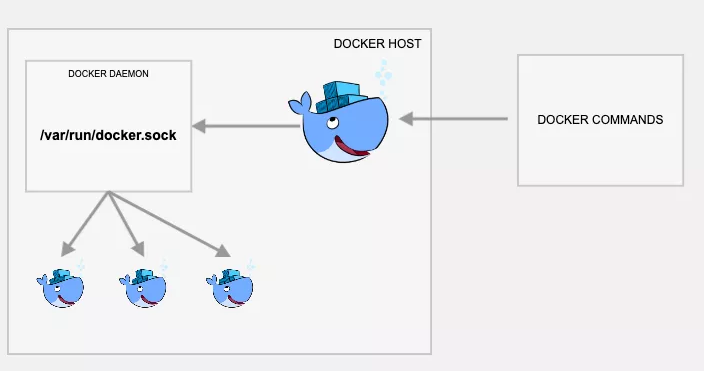
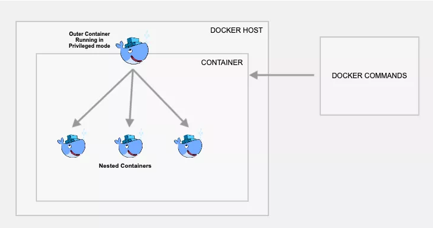
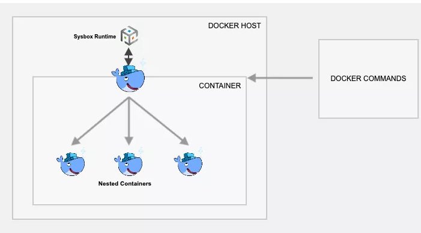

# **如何在Docker容器中运行Docker [3种方法]**

## **1、Docker In Docker的用处**

* **`dockerIndocker`的一个潜在用处是CI管道，在代码成功构建后，您需要在其中构建docker镜像并将其推送到容器镜像仓库。**
* 使用VM构建Docker映像非常简单。但是，当您计划将基于 Jenkins docker的动态代理用于CI/CD管道时，docker In docker是必备功能。
* 沙盒环境。
* 出于实验目的，在您的本地开发工作站上。

## **2、在Docker容器中运行Docker**

在Docker中实现Docker的三种方法

* 通过挂载`docker.sock`（DooD方法）运行docker
* `dind` 方法
* 使用`Nestybox sysbox Docker`运行时


### **2-1 方法1：使用`[/var/run/docker.sock]`的`Docker`中运行`Docker`**



### **2-2 什么是`/var/run/docker.sock？`**

`/var/run/docker.sock`是默认的Unix套接字。**套接字用于在同一主机上的进程之间进行通信。Docker守护程序默认情况下侦听`docker.sock`。**

**如果您在运行Docker守护程序的主机上，则可以使用`/var/run/docker.sock`管理容器。**

例如，如果您运行以下命令，它将返回docker engine的版本。

```
curl --unix-socket /var/run/docker.sock http://localhost/version
```

**现在您已经了解了什么是`docker.sock`，让我们看看如何使用在docker中运行docker。**

例如，


```
docker run -v /var/run/docker.sock:/var/run/docker.sock -ti docker-image
```

```
 curl --unix-socket /var/run/docker.sock http://localhost/version
{"Platform":{"Name":"Docker Engine - Community"},"Components":[{"Name":"Engine","Version":"20.10.7","Details":{"ApiVersion":"1.41","Arch":"amd64","BuildTime":"2021-06-02T11:54:58.000000000+00:00","Experimental":"true","GitCommit":"b0f5bc3","GoVersion":"go1.13.15","KernelVersion":"5.10.25-linuxkit","MinAPIVersion":"1.12","Os":"linux"}},{"Name":"containerd","Version":"1.4.6","Details":{"GitCommit":"d71fcd7d8303cbf684402823e425e9dd2e99285d"}},{"Name":"runc","Version":"1.0.0-rc95","Details":{"GitCommit":"b9ee9c6314599f1b4a7f497e1f1f856fe433d3b7"}},{"Name":"docker-init","Version":"0.19.0","Details":{"GitCommit":"de40ad0"}}],"Version":"20.10.7","ApiVersion":"1.41","MinAPIVersion":"1.12","GitCommit":"b0f5bc3","GoVersion":"go1.13.15","Os":"linux","Arch":"amd64","KernelVersion":"5.10.25-linuxkit","Experimental":true,"BuildTime":"2021-06-02T11:54:58.000000000+00:00"}
```

> **请注意：**如果您的容器可以访问docker.sock，则意味着它具有对docker守护程序的更多特权。因此，在实际项目中使用时，请了解并使用安全隐患。

现在，从容器中，您应该能够执行docker命令来构建镜像并将其推送到镜像仓库。

在这里，实际的docker操作发生在运行docker容器的VM主机上，而不是在容器内部进行。意思是，即使您正在容器中执行docker命令，也指示Docker客户端通过以下docker.sock方式连接到VM主机docker-engine。

要测试他的设置，请使用来自docker hub 的官方docker映像。它具有docker二进制文件。

请按照以下步骤测试设置。

第1步：以交互方式启动Docker容器，并挂载docker.sock卷。我们将使用官方的docker镜像。

```
docker run -v /var/run/docker.sock:/var/run/docker.sock -ti docker
```

步骤2：进入容器后，执行以下docker命令。

```
docker pull ubuntu
```

步骤3：列出Docker映像时，您应该看到ubuntu映像以及在主机VM中其他Docker映像。

```
docker images
```

步骤4：现在在测试目录中创建一个Dockerfile。

```
mkdir test && cd test
vi Dockerfile
```

复制以下Dockerfile内容以从容器内部测试映像构建。

```

FROM ubuntu:18.04

LABEL maintainer="Bibin Wilson <bibinwilsonn@gmail.com>"

RUN apt-get update && \
    apt-get -qy full-upgrade && \
    apt-get install -qy curl && \
    apt-get install -qy curl && \
    curl -sSL https://get.docker.com/ | sh
```
编译Dockerfile

```
docker build -t test-image .
```

### **2-3 方法2：Docker In Docker**



**此方法实际上在容器内部创建一个子容器。**仅当您确实要在容器中包含容器和图像时才使用此方法。否则，我建议您使用第一种方法。为此，您只需要使用带有dind标签的官方docker镜像即可。该dind映像使用Docker所需的实用程序进行制作以在Docker容器中运行。


请按照以下步骤测试安装程序。

**步骤1：建立`dind-test`以`docker:dind`图片命名的容器**

```
docker run --privileged -d --name dind-test docker:dind
```

步骤2：使用exec登录到容器。

```
docker exec -it dind-test /bin/sh
```

现在，从以前的方法执行步骤2到4，并验证docker命令行说明和映像构建。


### **2-4 方法3：使用Sysbox运行时的Docker中的Docker**



方法1和2在安全方面有一些缺点，因为在特权模式下运行容器。**Nestybox尝试通过使用sysbox Docker运行时来解决该问题**。

如果使用Nestybox sysbox运行时创建容器，则它可以在能够运行systemd，docker，kubernetes的容器内创建虚拟环境，而无需特权访问基础主机系统。解释sysbox需要足够的理解力，因此我不在本文的讨论范围之内。请参考此页面以全面了解sysbox。

**步骤1：安装sysbox运行时环境。请参阅此页面以获取有关安装sysbox运行时的最新官方说明。**

第2步：一旦拥有sysbox运行时可用，您要做的就是使用sysbox运行时标志启动docker容器，如下所示。在这里，我们使用的是官方`docker dind`映像。

```
docker run --runtime=sysbox-runc --name sysbox-dind -d docker:dind
```

步骤3：现在将exec会话带到sysbox-dind容器。

```
docker exec -it sysbox-dind /bin/sh
```

现在，您可以尝试使用Dockerfile构建映像，如先前方法所示。

## **3、关键注意事项**

* 仅在必要时在Docker中使用Docker。在将任何工作流程迁移到`Docker-in-Docker`方法之前，请进行足够的测试。
* 在特权模式下使用容器时，请确保您已获得企业安全团队有关计划执行的必要批准。
* 在带有kubernetes容器的Docker中使用Docker时，存在一些挑战。请参阅此博客以了解更多信息。
* 如果您打算使用Nestybox（Sysbox），请确保已通过企业架构师/安全团队的测试和批准。

## **4、常见问题**

在Docker中运行Docker安全吗？

**使用`docker.sock`和`dind`方法在docker中运行docker的安全性较差，因为它具有对docker守护程序的完全特权**

如何在Jenkins中的docker中运行docker？

**您可以使用Jenkins动态docker代理设置并将docker.sock安装到代理容器，以从代理容器内执行docker命令。**
