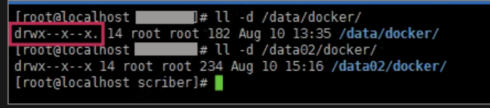
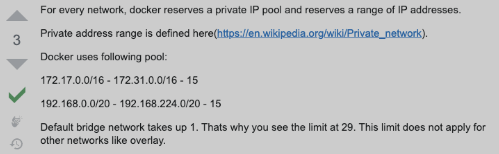

# **24 个常见的 Docker 疑难杂症处理技巧**

https://mp.weixin.qq.com/s/S6AaZ4jjgyN-ZSPSYr4qFQ

## **1 Docker 迁移存储目录**

> 默认情况系统会将 Docker 容器存放在 /var/lib/docker 目录下


*  今天通过监控系统，发现公司其中一台服务器的磁盘快慢，随即上去看了下，发现 `/var/lib/docker` 这个目录特别大。由上述原因，我们都知道，在 `/var/lib/docker` 中存储的都是相关于容器的存储，所以也不能随便的将其删除掉。
*  那就准备迁移 docker 的存储目录吧，或者对 /var 设备进行扩容来达到相同的目的。更多关于 dockerd 的详细参数.
*  但是需要注意的一点就是，尽量不要用软链， 因为一些 docker 容器编排系统不支持这样做，比如我们所熟知的 k8s 就在内。

```
# 发现容器启动不了了
ERROR：cannot  create temporary directory!

# 查看系统存储情况
$ du -h --max-depth=1
```

### **[解决方法 1] 添加软链接**

```
# 1.停止docker服务
$ sudo systemctl stop docker

# 2.开始迁移目录
$ sudo mv /var/lib/docker /data/

# 3.添加软链接
$ sudo ln -s /data/docker /var/lib/docker

# 4.启动docker服务
$ sudo systemctl start docker
```

### **[解决方法 2] 改动 docker 配置文件**

```
# [方式一] 改动docker启动配置文件
$ sudo vim /lib/systemd/system/docker.service
ExecStart=/usr/bin/dockerd --graph=/data/docker/
```

```
# [方式一] 改动docker启动配置文件
$ sudo vim /lib/systemd/system/docker.service
ExecStart=/usr/bin/dockerd --graph=/data/docker/
```

* [操作注意事项] 在迁移 `docker` 目录的时候注意使用的命令，要么使用 `mv` 命令直接移动，要么使用 `cp` 命令复制文件，但是需要注意同时复制文件权限和对应属性，不然在使用的时候可能会存在权限问题。如果容器中，也是使用 `root` 用户，则不会存在该问题，但是也是需要按照正确的操作来迁移目录。

```
# 使用mv命令
$ sudo mv /var/lib/docker /data/docker

# 使用cp命令
$ sudo cp -arv /data/docker /data2/docker
```



## **2 Docker 设备空间不足**

> Increase Docker container size from default 10GB on rhel7.

* [问题起因一] 容器在导入或者启动的时候，如果提示磁盘空间不足的，那么多半是真的因为物理磁盘空间真的有问题导致的。如下所示，我们可以看到 `/ `分区确实满了。

```
# 查看物理磁盘空间
$ df -Th
Filesystem    Size    Used    Avail    Use%    Mounted on
/dev/vda1      40G     40G       0G    100%    /
tmpfs         7.8G       0     7.8G      0%    /dev/shm
/dev/vdb1     493G    289G     179G     62%    /mnt
```

* 如果发现真的是物理磁盘空间满了的话，就需要查看到底是什么占据了如此大的空间，导致因为容器没有空间无法启动。其中，docker 自带的命令就是一个很好的能够帮助我们发现问题的工具。

```
# 查看基本信息
# 硬件驱动使用的是devicemapper，空间池为docker-252
# 磁盘可用容量仅剩16.78MB，可用供我们使用
$ docker info
Containers: 1
Images: 28
Storage Driver: devicemapper
 Pool Name: docker-252:1-787932-pool
 Pool Blocksize: 65.54 kB
 Backing Filesystem: extfs
 Data file: /dev/loop0
 Metadata file: /dev/loop1
 Data Space Used: 1.225 GB
 Data Space Total: 107.4 GB
 Data Space Available: 16.78 MB
 Metadata Space Used: 2.073 MB
 Metadata Space Total: 2.147 GB
```
 
*  [解决方法] 通过查看信息，我们知道正是因为 docker 可用的磁盘空间不足，所以导致启动的时候没有足够的空间进行加载启动镜像。解决的方法也很简单，第一就是清理无效数据文件释放磁盘空间(**清除日志**)，第二就是修改 docker 数据的存放路径(大分区)。
 

```
# 显示哪些容器目录具有最大的日志文件
$ du -d1 -h /var/lib/docker/containers | sort -h

# 清除您选择的容器日志文件的内容
$ cat /dev/null > /var/lib/docker/containers/container_id/container_log_name
```

* [问题起因二] 显然我遇到的不是上一种情况，而是在启动容器的时候，容器启动之后不久就显示是 unhealthy 的状态，通过如下日志发现，原来是复制配置文件启动的时候，提示磁盘空间不足。
* 后面发现是因为 CentOS7 的系统使用的 docker 容器默认的创建大小就是 10G 而已，然而我们使用的容器却超过了这个限制，导致无法启动时提示空间不足。

```
2019-08-16 11:11:15,816 INFO spawned: 'app-demo' with pid 835
2019-08-16 11:11:16,268 INFO exited: app (exit status 1; not expected)
2019-08-16 11:11:17,270 INFO gave up: app entered FATAL state, too many start retries too quickly
cp: cannot create regular file '/etc/supervisor/conf.d/grpc-app-demo.conf': No space left on device
cp: cannot create regular file '/etc/supervisor/conf.d/grpc-app-demo.conf': No space left on device
cp: cannot create regular file '/etc/supervisor/conf.d/grpc-app-demo.conf': No space left on device
cp: cannot create regular file '/etc/supervisor/conf.d/grpc-app-demo.conf': No space left on device
```

* **[解决方法 1] 改动 docker 启动配置文件**

```
# /etc/docker/daemon.json
{
    "live-restore": true,
    "storage-opt": [ "dm.basesize=20G" ]
}
```

*  **[解决方法 2] 改动 systemctl 的 docker 启动文件**

```
# 1.stop the docker service
$ sudo systemctl stop docker

# 2.rm exised container
$ sudo rm -rf /var/lib/docker

# 2.edit your docker service file
$ sudo vim /usr/lib/systemd/system/docker.service

# 3.find the execution line
ExecStart=/usr/bin/dockerd
and change it to:
ExecStart=/usr/bin/dockerd --storage-opt dm.basesize=20G

# 4.start docker service again
$ sudo systemctl start docker

# 5.reload daemon
$ sudo systemctl daemon-reload
```

* **[问题起因三] 还有一种情况也会让容器无法启动，并提示磁盘空间不足，但是使用命令查看发现并不是因为物理磁盘真的不足导致的。而是，因为对于分区的 inode 节点数满了导致的。**

```
# 报错信息
No space left on device
```

**[解决方法] 因为 `ext3` 文件系统使用 `inode table` 存储 `inode` 信息，而 `xfs` 文件系统使用 `B+ tree` 来进行存储**。

考虑到性能问题，默认情况下这个 `B+ tree` 只会使用前 `1TB` 空间，当这 1TB 空间被写满后，就会导致无法写入 `inode` 信息，报磁盘空间不足的错误。

我们可以在 `mount` 时，指定` inode64` 即可将这个 `B+ tree` 使用的空间扩展到整个文件系统。

```
# 查看系统的inode节点使用情况
$ sudo df -i

# 尝试重新挂载
$ sudo mount -o remount -o noatime,nodiratime,inode64,nobarrier /dev/vda1
```

* [补充知识] 文件储存在硬盘上，硬盘的最小存储单位叫做 **扇区(Sector)**。每个扇区储存 **512** 字节(相当于**0.5KB**)。操作系统读取硬盘的时候，不会一个个扇区地读取，这样效率太低，而是一次性连续读取多个扇区，即一次性读取一个**块(block)**。这种由多个扇区组成的块，是文件存取的最小单位。
* **块的大小，最常见的是4KB，即连续八个 sector 组成一个 block 块**。
* 文件数据都储存在块中，那么很显然，我们还必须找到一个地方储存文件的元信息，**比如文件的创建者、文件的创建日期、文件的大小等等**。
* **这种储存文件元信息的区域就叫做索引节点(inode)。每一个文件都有对应的 inode，里面包含了除了文件名以外的所有文件信息**。
* inode 也会消耗硬盘空间，所以硬盘格式化的时候，操作系统自动将硬盘分成两个区域。一个是数据区，存放文件数据；
* **另一个是 inode 区(inode table)，存放 inode 所包含的信息。每个 inode 节点的大小，一般是 128 字节或 256 字节。inode 节点的总数，在格式化时就给定，一般是每1KB或每2KB就设置一个 inode 节点**。

```
# 每个节点信息的内容
$ stat check_port_live.sh
  File: check_port_live.sh
  Size: 225           Blocks: 8          IO Block: 4096   regular file
Device: 822h/2082d    Inode: 99621663    Links: 1
Access: (0755/-rwxr-xr-x)  Uid: ( 1006/  escape)   Gid: ( 1006/  escape)
Access: 2019-07-29 14:59:59.498076903 +0800
Modify: 2019-07-29 14:59:59.498076903 +0800
Change: 2019-07-29 23:20:27.834866649 +0800
 Birth: -

# 磁盘的inode使用情况
$ df -i
Filesystem                 Inodes   IUsed     IFree IUse% Mounted on
udev                     16478355     801  16477554    1% /dev
tmpfs                    16487639    2521  16485118    1% /run
/dev/sdc2               244162560 4788436 239374124    2% /
tmpfs                    16487639       5  16487634    1% /dev/shm
```

## **3 Docker 缺共享链接库**

> 3 Docker 缺共享链接库

[问题起因] 给系统安装完 compose 之后，查看版本的时候，提示缺少一个名为 libz.so.1 的共享链接库。第一反应就是，是不是系统少安装那个软件包导致的。随即，搜索了一下，将相关的依赖包都给安装了，却还是提示同样的问题

```

# 提示错误信息
$ docker-compose --version
error while loading shared libraries: libz.so.1: failed to map segment from shared object: Operation not permitted
```

* [解决方法] 后来发现，是因为系统中 docker 没有对 `/tmp` 目录的访问权限导致，需要重新将其挂载一次，就可以解决了。

```
# 重新挂载
$ sudo mount /tmp -o remount,exec
```

## **4 Docker 容器文件损坏**

> 对 dockerd 的配置有可能会影响到系统稳定

[问题起因] 容器文件损坏，经常会导致容器无法操作。正常的 docker 命令已经无法操控这台容器了，无法关闭、重启、删除。正巧，前天就需要这个的问题，主要的原因是因为重新对 docker 的默认容器进行了重新的分配限制导致的。

```
# 操作容器遇到类似的错误
b'devicemapper: Error running deviceCreate (CreateSnapDeviceRaw) dm_task_run failed'
```

**[解决方法] 可以通过以下操作将容器删除/重建。**

```

# 1.关闭docker
$ sudo systemctl stop docker

# 2.删除容器文件
$ sudo rm -rf /var/lib/docker/containers

# 3.重新整理容器元数据
$ sudo thin_check /var/lib/docker/devicemapper/devicemapper/metadata
$ sudo thin_check --clear-needs-check-flag /var/lib/docker/devicemapper/devicemapper/metadata

# 4.重启docker
$ sudo systemctl start docker
```

## **5 Docker 容器优雅重启**

**不停止服务器上面运行的容器，重启 dockerd 服务是多么好的一件事**

[问题起因] 默认情况下，当 Docker 守护程序终止时，它会关闭正在运行的容器。从 Docker-ce 1.12 开始，**可以在配置文件中添加 `live-restore ` 参数，**以便在守护程序变得不可用时容器保持运行。需要注意的是 Windows 平台暂时还是不支持该参数的配置。

```
# Keep containers alive during daemon downtime
$ sudo vim /etc/docker/daemon.yaml
{
  "live-restore": true
}

# 在守护进程停机期间保持容器存活
$ sudo dockerd --live-restore

# 只能使用reload重载
# 相当于发送SIGHUP信号量给dockerd守护进程
$ sudo systemctl reload docker

# 但是对应网络的设置需要restart才能生效
$ sudo systemctl restart docker
```

**[解决方法] 可以通过以下操作将容器删除/重建。**

```
# /etc/docker/daemon.yaml
{
    "registry-mirrors": ["https://vec0xydj.mirror.aliyuncs.com"],  # 配置获取官方镜像的仓库地址
    "experimental": true,  # 启用实验功能
    "default-runtime": "nvidia",  # 容器的默认OCI运行时(默认为runc)
    "live-restore": true,  # 重启dockerd服务的时候容易不终止
    "runtimes": {  # 配置容器运行时
        "nvidia": {
            "path": "/usr/bin/nvidia-container-runtime",
            "runtimeArgs": []
        }
    },
    "default-address-pools": [  # 配置容器使用的子网地址池
        {
            "scope": "local",
            "base":"172.17.0.0/12",
            "size":24
        }
    ]
}
```

```
$ vim /etc/docker/daemon.json
{
  "default-address-pools" : [
    {
      "base" : "172.240.0.0/16",
      "size" : 24
    }
  ]
}
```

## **6 Docker 容器无法删除**

> 找不到对应容器进程是最吓人的

**[问题起因]** 今天遇到 docker 容器无法停止/终止/删除，以为这个容器可能又出现了 dockerd 守护进程托管的情况，但是通过 `ps -ef <container id>` 无法查到对应的运行进程。哎，后来开始开始查 `supervisor` 以及 `Dockerfile` 中的进程，都没有。

这种情况的可能原因是容器启动之后，主机因任何原因重新启动并且没有优雅地终止容器。剩下的文件现在阻止你重新生成旧名称的新容器，因为系统认为旧容器仍然存在。

```
# 删除容器
$ sudo docker rm -f f8e8c3..
Error response from daemon: Conflict, cannot remove the default name of the container
```

[解决方法] **找到 `/var/lib/docker/containers/` 下的对应容器的文件夹，将其删除，然后重启一下 dockerd 即可。我们会发现，之前无法删除的容器没有了**。

```
# 删除容器文件
$ sudo rm -rf /var/lib/docker/containers/f8e8c3...65720

# 重启服务
$ sudo systemctl restart docker.service
```

## **7 Docker 容器中文异常**

> 容器存在问题话，记得优先在官网查询

[问题起因] 今天登陆之前部署的 MySQL 数据库查询，发现使用 SQL 语句无法查询中文字段，即使直接输入中文都没有办法显示。

```
# 查看容器支持的字符集
root@b18f56aa1e15:# locale -a
C
C.UTF-8
POSIX
```

[解决方法] Docker 部署的 MySQL 系统使用的是 POSIX 字符集。然而 POSIX 字符集是不支持中文的，而 `C.UTF-8` 是支持中文的只要把系统中的环境 `LANG` 改为 `"C.UTF-8"` 格式即可解决问题。**同理，在 `K8S` 进入 `pod` 不能输入中文也可用此方法解决**。

```
# 临时解决
docker exec -it some-mysql env LANG=C.UTF-8 /bin/bash
```

```
# 永久解决
docker run --name some-mysql \
    -e MYSQL_ROOT_PASSWORD=my-secret-pw \
    -d mysql:tag --character-set-server=utf8mb4 \
    --collation-server=utf8mb4_unicode_ci
```

## **8 Docker 容器网络互通**

> 了解 Docker 的四种网络模型


[问题起因] 在本机部署 Nginx 容器想代理本机启动的 Python 后端服务程序，但是对代码服务如下的配置，结果访问的时候一直提示 502 错误。

```
# 启动Nginx服务
$ docker run -d -p 80:80 $PWD:/etc/nginx nginx
```

```
server {
    ...
    location /api {
        proxy_pass http://localhost:8080
    }
    ...
}
```

[解决方法] 后面发现是因为 `nginx.conf` 配置文件中的 `localhost` 配置的有问题，由于 Nginx 是在容器中运行，所以 `localhost` 为容器中的 `localhost`，而非本机的 `localhost`，所以导致无法访问。

* 可以将 `nginx.conf` 中的 `localhost` 改为宿主机的 `IP` 地址，就可以解决 `502` 的错误。

```
# 查询宿主机IP地址 => 172.17.0.1
$ ip addr show docker0
docker0: <BROADCAST,MULTICAST,UP,LOWER_UP> mtu 1500 qdisc noqueue state UP group default
    link/ether 02:42:d5:4c:f2:1e brd ff:ff:ff:ff:ff:ff
    inet 172.17.0.1/16 scope global docker0
       valid_lft forever preferred_lft forever
    inet6 fe80::42:d5ff:fe4c:f21e/64 scope link
       valid_lft forever preferred_lft forever
```

```
server {
    ...
    location /api {
        proxy_pass http://172.17.0.1:8080
    }
    ...
}
```

当容器使用 host 网络时，容器与宿主共用网络，这样就能在容器中访问宿主机网络，那么容器的 localhost 就是宿主机的 localhost 了。

```
# 服务的启动方式有所改变(没有映射出来端口)
# 因为本身与宿主机共用了网络，宿主机暴露端口等同于容器中暴露端口
$ docker run -d -p 80:80 --network=host $PWD:/etc/nginx nginxx
```

## **9 Docker 容器总线错误**

> 总线错误看到的时候还是挺吓人了

[问题起因] 在 docker 容器中运行程序的时候，提示 bus error 错误。

```
# 总线报错
$ inv app.user_op --name=zhangsan
Bus error (core dumped)
```

[解决方法] 原因是在 `docker` 运行的时候，`shm` 分区设置太小导致 `share memory` 不够。不设置 `--shm-size` 参数时，`docker` 给容器默认分配的 `shm` 大小为 `64M`，导致程序启动时不足。具体原因还是因为安装 pytorch 包导致了，多进程跑任务的时候，docker 容器分配的共享内存太小，导致 torch 要在 tmpfs 上面放模型数据用于子线程的 共享不足，就出现报错了。

```
# 问题原因
root@18...35:/opt/app# df -TH
Filesystem     Type     Size  Used Avail Use% Mounted on
overlay        overlay  2.0T  221G  1.4T   3% /
tmpfs          tmpfs     68M     0   68M   0% /dev
shm            tmpfs     68M   41k   68M   1% /dev/shm

# 启动docker的时候加上--shm-size参数(单位为b,k,m或g)
$ docker run -it --rm --shm-size=200m pytorch/pytorch:latest

# 在docker-compose添加对应配置
$ shm_size: '2gb'
```

[解决方法] 还有一种情况就是容器内的磁盘空间不足，也会导致 bus error 这样的报错，所以如果出现了，清除多余文件和目录或者分配一个大的磁盘空间，就可以解决了。

```
# 磁盘空间不足
$ df -Th
Filesystem     Type     Size  Used Avail Use% Mounted on
overlay        overlay    1T    1T    0G 100% /
shm            tmpfs     64M   24K   64M   1% /dev/shm
```

## **10 Docker NFS 挂载报错**

NFS 挂载之后容器程序使用异常为内核版本太低导致的


[问题起因] 我们将服务部署到 openshift 集群中，启动服务调用资源文件的时候，报错信息如下所示。从报错信息中，得知是在 Python3 程序执行 `read_file()` 读取文件的内容，给文件加锁的时候报错了。

但是奇怪的是，本地调试的时候发现服务都是可以正常运行的，文件加锁也是没问题的。后来发现，在 openshift 集群中使用的是 NFS 挂载的共享磁盘。

```
# 报错信息
Traceback (most recent call last):
    ......
    File "xxx/utils/storage.py", line 34, in xxx.utils.storage.LocalStorage.read_file
OSError: [Errno 9] Bad file descriptor
```

```
# 文件加锁代码
...
    with open(self.mount(path), 'rb') as fileobj:
        fcntl.flock(fileobj, fcntl.LOCK_EX)
        data = fileobj.read()
    return data
...
```

[解决方法] 从下面的信息得知，要在 Linux 中使用 `flock()` 的话，就需要升级内核版本到 2.6.11+ 才行。后来才发现，这实际上是由 RedHat 內核中的一个错误引起的，并在 `kernel-3.10.0-693.18.1.el7` 版本中得到修复。所以对于 NFSv3 和 NFSv4 服务而已，就需要升级 Linux 内核版本才能够解决这个问题。

```
# https://t.codebug.vip/questions-930901.htm
$ In Linux kernels up to 2.6.11, flock() does not lock files over NFS (i.e.,
the scope of locks was limited to the local system). [...] Since Linux 2.6.12,
NFS clients support flock() locks by emulating them as byte-range locks on the entire file.
```

## **11 Docker 使用默认网段**

> 启动的容器网络无法相互通信，很是奇怪！

[问题起因] 我们在使用 Docker 启动服务的时候，发现有时候服务之前可以相互连通，而有时启动的多个服务之前却出现了无法访问的情况。究其原因，发现原来是因为使用的内部私有地址网段不一致导致的。有的服务启动到了 172.17 - 172.31 的网段，有的服务跑到了 `192.169.0 - 192.168.224` 的网段，这样导致服务启动之后出现无法访问的情况(默认情况下，有下面这个两个网段可供其使用)。



```
# 查看docker容器配置
$ cat /etc/docker/daemon.json
{
    "registry-mirrors": ["https://vec0xydj.mirror.aliyuncs.com"],
    "default-address-pools":[{"base":"172.17.0.0/12", "size":24}],
    "experimental": true,
    "default-runtime": "nvidia",
    "live-restore": true,
    "runtimes": {
        "nvidia": {
            "path": "/usr/bin/nvidia-container-runtime",
            "runtimeArgs": []
        }
    }
}
```


