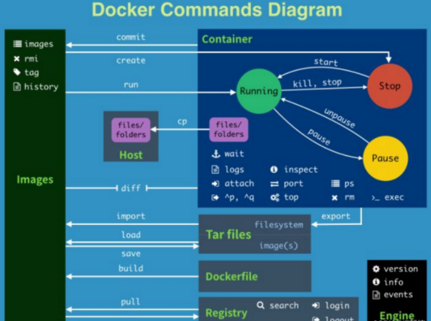
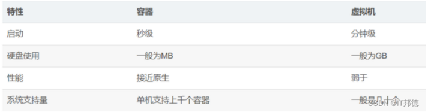
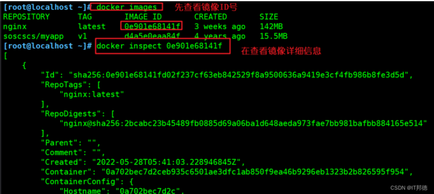
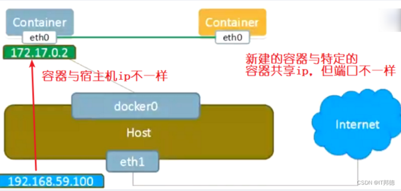
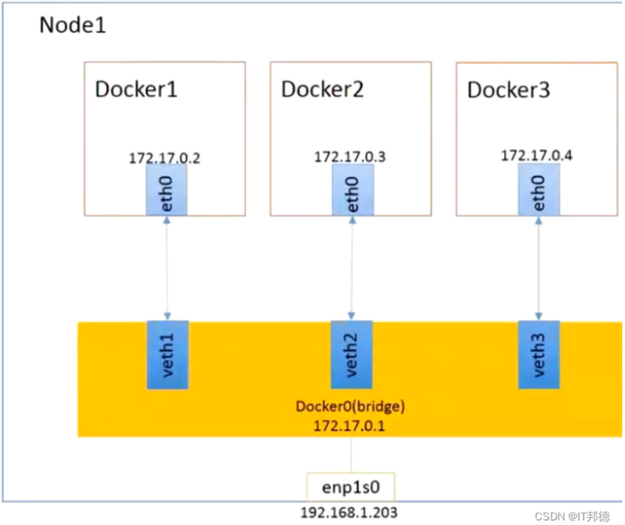
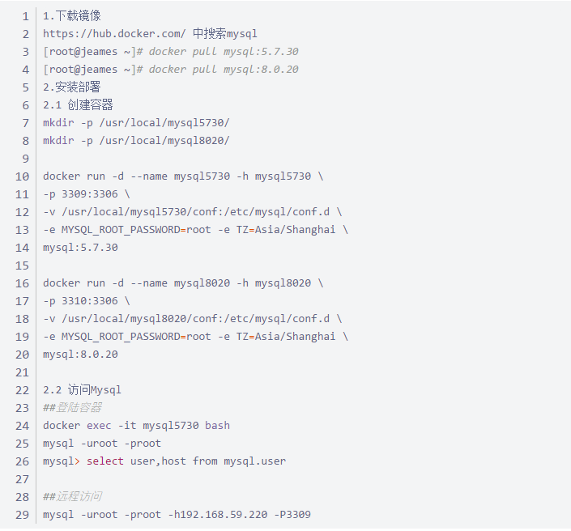

# **Docker面试15问**

* 什么是Docker？
* Docker的应用场景有哪些？
* Docker的优点有哪些？
* Docker与虚拟机的区别是什么？
* Docker的三大核心是什么？
* 如何快速安装Docker？
* 如何修改Docker的存储位置？
* Docker镜像常用管理有哪些？
* 如何创建Docker容器？
* Docker在后台的标准运行过程是什么？
* Docker网络模式有哪些？
* 什么是Docker的数据卷
* 如何搭建Docker私有仓库
* Docker如何迁移备份？
* Docker如何部署MySQL？

### **1.什么是Docker？**

Docker 是一个开源的应用容器引擎，基于go 语言开发并遵循了apache2.0 协议开源

Docker 是在Linux 容器里运行应用的开源工具，是一种轻量级的“虚拟机”

Docker 的容器技术可以在一台主机上轻松为任何应用创建一个轻量级的，可移植的，自给自足的容器

### **2.Docker的应用场景有哪些？**

Web 应用的自动化打包和发布。

自动化测试和持续集成、发布。

在服务型环境中部署和调整数据库或其他的后台应用。

从头编译或者扩展现有的 OpenShift 或 Cloud Foundry 平台来搭建自己的 PaaS 环境。

**在容器技术出现之前，公司往往是通过为每个开发人员提供一台或者多台虚拟机来充当开发测试环境。**

开发测试环境一般负载较低，大量的系统资源都被浪费在虚拟机本身的进程上了。

Docker容器没有任何CPU和内存上的额外开销，很适合用来提供公司内部的开发测试环境。

而且由于docker镜像可以很方便的在公司内部分享，这对开发环境的规范性也有极大的帮助。

如果要把容器作为开发机使用，需要解决的是远程登录容器和容器内进程管理问题。

虽然docker的初衷是为“微服务”架构设计的，但根据我们的实际使用经验，

在docker内运行多个程序，甚至sshd或者upstart也是可行的。

### **3.Docker的优点有哪些？**

容器化越来越受欢迎，Docker的容器有点总结如下：

* 灵活：即使是最复杂的应用也可以集装箱化。
* 轻量级：容器利用并共享主机内核。
* 可互换：可以即时部署更新和升级。
* 便携式：可以在本地构建，部署到云，并在任何地方运行。
* 可扩展：可以增加并白动分发容器副本。
* 可堆叠：可以垂直和即时堆叠服务。




Docker 是一个用于开发，交付和运行应用程序的开放平台。

Docker 使您能够将应用程序与基础架构分开，从而可以快速交付软件。借助 Docker，您可以与管理应用程序相同的方式来管理基础架构。通过利用 Docker 的方法来快速交付，测试和部署代码，您可以大大减少编写代码和在生产环境中运行代码之间的延迟。

### **4.Docker与虚拟机的区别是什么？**

**虚拟机通过添加Hypervisor层（虚拟化中间层），虚拟出网卡、内存、CPU等虚拟硬件，再在其上建立虚拟机，每个虚拟机都有自己的系统内核**。

**而Docker容器则是通过隔离（namesapce）的方式，将文件系统、进程、设备、网络等资源进行隔离，再对权限、CPU资源等进行控制（cgroup），最终让容器之间互不影响，容器无法影响宿主机**。




### **5. Docker的三大核心是什么？**

**镜像**

**Docker的镜像是创建容器的基础，类似虚拟机的快照，可以理解为一个面向Docker容器引擎的只读模板**。

通过镜像启动一个容器，一个镜像是一个可执行的包，其中包括运行应用程序所需要的所有内容包含代码，运行时间，库、环境变量、和配置文件。

Docker镜像也是一个压缩包，只是这个压缩包不只是可执行文件，环境部署脚本，它还包含了完整的操作系统。因为大部分的镜像都是基于某个操作系统来构建，所以很轻松的就可以构建本地和远端一样的环境，这也是Docker镜像的精髓。

**容器**

Docker的容器是从镜像创建的运行实例，它可以被启动、停止和删除。所创建的每一个容器都是相互隔离、互不可见，以保证平台的安全性。可以把容器看做是一个简易版的linux环境（包括root用户权限、镜像空间、用户空间和网络空间等）和运行在其中的应用程序。

**仓库**

仓库注册服务器上往往存放着多个仓库，每个仓库中包含了多个镜像，每个镜像有不同标签（tag）。

仓库分为公开仓库（Public）和私有仓库（Private）两种形式。

最大的公开仓库是 Docker Hub:https://hub.docker.com，存放了数量庞大的镜像供用户下载。

国内的公开仓库包括阿里云 、网易云等。


### **6. 如何快速安装Docker？**

执行以下安装命令去安装依赖包

```
yum install -y yum-utils device-mapper-persistent-data lvm2

sudo yum-config-manager

–add-repo

https://download.docker.com/linux/centos/docker-ce.repo

[root@centos7 ~] yum -y install docker-ce docker-ce-cli containerd.io

[root@centos7 ~]# docker ps --查看docker

[root@centos7 ~]# systemctl enable docker

[root@centos7 ~]# systemctl start docker

[root@centos7 ~]# systemctl status docker

[root@centos7 ~]# docker ps --查看容器

[root@centos7 ~]# docker version --查看版本

[root@centos7 ~]# docker info --查看版本
```

### **7. 如何修改Docker的存储位置？**

默认情况下 Docker的存放位置为：`/var/lib/docker`

可以通过命令查看具体位置：`docker info | grep “Docker Root Dir”`

修改到其它目录

```
首先停掉 Docker 服务：

systemctl stop docker

然后移动整个/var/lib/docker 目录到目的路径

mkdir -p /root/data/docker

mv /var/lib/docker /root/data/docker

ln -s /root/data/docker /var/lib/docker --快捷方式
```

### **8.Docker镜像常用管理有哪些？**

**快速检索镜像**

```
格式：docker search 关键字
```

获取镜像

```
格式：docker   pull   仓库名称[:标签]
```

如果下载镜像时不指定标签，则默认会下载仓库中最新版本的镜像，即选择标签为 latest 标签

**查看镜像信息**


```
镜像下载后默认存放在 /var/lib/docker

REPOSITORY: 镜像所属仓库

TAG: 镜像的标签信息，标记同一个仓库中的不同镜像

IMAGE ID ：镜像的唯一ID号，唯一标识一个镜像

CREATED: 镜像创建时间

SIZE: 镜像大小
```

**获取镜像的详细信息**

```
格式：docker   inspect   镜像ID号
```

镜像ID 号可以不用打全。




**为本地镜像添加新的标签**


```
格式：docker   tag  名称:[ 标签]
```

**删除镜像**

```
格式1：docker   rmi   仓库名称:标签
```

当一个镜像有多个标签时，只是删除其中指定的标签

```
格式2: docker   rmi  镜像ID  [-f]
```
如果该镜像已经被容器使用，正确的做法是先删除依赖该镜像的所有容器，再去删除镜像

**将镜像保存为本地文件**

```
格式：docker   save   -o  存储文件名   存储的镜像

[root@localhost ~]# docker save -o /opt/nginx.tar nginx:latest

#将本地镜像传给另一台主机

[root@localhost ~]# scp /opt/nginx.tar 192.168.1.54:/opt
```

### **9. 如何创建Docker容器？**

```
docker images   --镜像
docker run -d --name centos7.8 -h centos7.8 \
-p 220:22 -p 3387:3389 \
--privileged=true \
centos:7.8.2003 /usr/sbin/init

#我想拥有一个 linux 8.2 的环境
docker run -d --name centos8.2 -h centos8.2 \
-p 230:22 -p 3386:3389 \
--privileged=true \
daocloud.io/library/centos:8.2.2004 init

# 进入容器
docker exec -it centos7.8bash
docker exec -it centos8.2 bash
cat /etc/redhat-release    --查看系统版本
```


### **10.Docker在后台的标准运行过程是什么？**

当利用 docker run 来创建容器时， Docker 在后台的标准运行过程是：

* 检查本地是否存在指定的镜像。当镜像不存在时，会从公有仓库下载；
* 利用镜像创建并启动一个容器；
* 分配一个文件系统给容器，在只读的镜像层外面挂载一层可读写层；
* 从宿主主机配置的网桥接口中桥接一个虚拟机接口到容器中；、
* 分配一个地址池中的 IP 地址给容器；
* 执行用户指定的应用程序，执行完毕后容器被终止运行。

### **11.Docker网络模式有哪些？**

* **host模式**

host 模式 ：使用 `--net=host` 指定

相当于VMware 中的桥接模式，与宿主机在同一个网络中，但是没有独立IP地址

Docker 使用了Linux 的Namespace 技术来进行资源隔离，如PID Namespace隔离进程，Mount Namespace隔离文件系统，Network Namespace 隔离网络等。

一个Network Namespace 提供了一份独立的网络环境，包括网卡，路由，iptable 规则等都与其他Network Namespace 隔离。

一个Docker 容器一般会分配一个独立的Network Namespace

但是如果启动容器的时候使用host 模式，那么这个容器将不会获得一个独立的Network Namespace ，而是和宿主机共用一个Network Namespace 。容器将不会虚拟出自己的网卡，配置自己的IP等，而是使用宿主机的IP和端口.此时容器不再拥有隔离的、独立的网络栈。不拥有所有端口资源

* **container模式**

container模式：使用`–net=contatiner:NAME_or_ID` 指定

这个模式指定新创建的容器和已经存在的一个容器共享一个Network Namespace，而不是和宿主机共享。**新创建的容器不会创建自己的网卡，配置自己的IP，而是和一个指定的容器共享IP，端口范围等。**可以在一定程度上节省网络资源，容器内部依然不会拥有所有端口。

同样，两个容器除了网络方面，其他的如文件系统，进程列表等还是隔离的。

两个容器的进程可以通过lo网卡设备通信



* **none 模式**

**none模式:使用 `--net=none`指定**

使用none 模式，docker 容器有自己的network Namespace ，但是并不为Docker 容器进行任何网络配置。也就是说，这个Docker 容器没有网卡，ip， 路由等信息。

这种网络模式下，容器只有lo 回环网络，没有其他网卡。

这种类型没有办法联网，但是封闭的网络能很好的保证容器的安全性

该容器将完全独立于网络，用户可以根据需要为容器添加网卡。此模式拥有所有端口。（none网络模式配置网络）特殊情况下才会用到，一般不用


* **bridge 模式**

相当于Vmware中的 nat 模式，容器使用独立network Namespace，并连接到docker0虚拟网卡。通过docker0网桥以及iptables nat表配置与宿主机通信，此模式会为每一个容器分配Network Namespace、设置IP等，并将一个主机上的 Docker 容器连接到一个虚拟网桥上。

当Docker进程启动时，会在主机上创建一个名为docker0的虚拟网桥，此主机上启动的Docker容器会连接到这个虚拟网桥上。虚拟网桥的工作方式和物理交换机类似，这样主机上的所有容器就通过交换机连在了一个二层网络中。

从docker0子网中分配一个IP给容器使用，并设置docker0的IP地址为容器的默认网关。在主机上创建一对虚拟网卡veth pair设备。veth设备总是成对出现的，它们组成了一个数据的通道，数据从一个设备进入，就会从另一个设备出来。因此，veth设备常用来连接两个网络设备。

Docker将veth pair 设备的一端放在新创建的容器中，并命名为eth0（容器的网卡），另一端放在主机中， 以veth*这样类似的名字命名，并将这个网络设备加入到docker0网桥中。可以通过 brctl show 命令查看。

容器之间通过veth pair进行访问

**使用 `docker run -p` 时，docker实际是在iptables做了DNAT规则，实现端口转发功能**。

可以使用iptables -t nat -vnL 查看。



### **12.什么是Docker的数据卷**

数据卷是一个供容器使用的特殊目录，位于容器中。可将宿主机的目录挂载到数据卷上，对数据卷的修改操作立刻可见，并且更新数据不会影响镜像，从而实现数据在宿主机与容器之间的迁移。数据卷的使用类似于Linux下对目录进行的mount操作。

如果需要在容器之间共享一些数据，最简单的方法就是使用数据卷容器。数据卷容器是一个普通的容器，专门提供数据卷给其他容器挂载使用。

### **13.如何搭建Docker私有仓库**

```
1.拉取私有仓库镜像
[root@jeames ~]# docker pull registry
Using default tag: latest


2.启动私有仓库容器
docker run -di --name registry -p 5000:5000 registry
docker update --restart=always registry   --开机自启动
docker ps -a  --format "table {{.ID}}\t{{.Names}}\t{{.Status}}"


 访问网址：http://192.168.1.54:5000/v2/_catalog
3.设置信任
[root@jeames ~]# vi /etc/docker/daemon.json
{
"registry-mirrors":["https://docker.mirrors.ustc.edu.cn"],
"insecure-registries":["192.168.1.54:5000"]
}

[root@jeames ~]# systemctl restart docker   --重启docker

4.上传本地镜像
[root@jeames ~]# docker images
[root@jeames ~]# docker tag postgres:11 192.168.1.54:5000/postgres


[root@jeames ~]# docker push 192.168.1.54:5000/postgres

5.重新拉取镜像
[root@jeames ~]# docker rmi 192.168.1.54:5000/postgres
[root@jeames ~]# docker images
[root@jeames ~]# docker pull 192.168.1.54:5000/postgres
```

### **14.Docker如何迁移备份？**


```
1.容器保存为镜像
[root@jeames ~]# docker images
[root@jeames ~]# docker ps -a
docker ps -a --format "table {{.ID}}\t{{.Names}}\t{{.Status}}"
[root@jeames ~]# docker commit redis myredis
##使用新的镜像创建容器
docker run -di --name myredis myredis
2.镜像的备份
[root@jeames ~]# docker save -o myredis.tar myredis
默认放到当前目录
[root@jeames ~]# ll
[root@jeames ~]# pwd
3.恢复过程
##删除容器
docker ps --format "table {{.ID}}\t{{.Names}}\t{{.Status}}"
docker stop myredis
docker rm myredis
##删除镜像
docker images
docker rmi myredis
[root@jeames ~]# docker load -i myredis.tar
```

### **15. Docker如何部署MySQL？**

