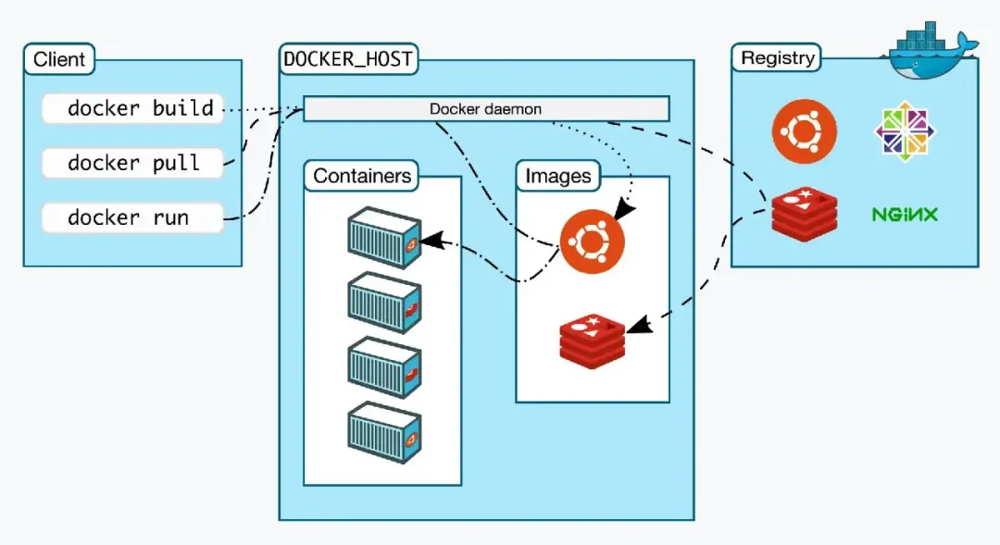
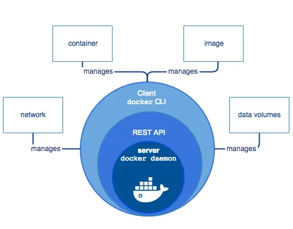

# Docker配置文件daemon.json介绍及优化建议

## 1、daemon.json文件概述

daemon.json是Docker守护进程的配置文件，它允许系统管理员自定义Docker守护程序的行为。此文件通常位于`/etc/docker/`目录下。通过修改`daemon.json`，可以调整Docker守护进程的多种设置，包括网络配置、日志记录、存储驱动等。



## 2、daemon.json文件结构

daemon.json文件是一个JSON格式的文件，包含键值对来设置Docker守护进程的参数。以下是一些常见的配置项：

* `data-root`: Docker数据目录，默认为`/var/lib/docker`。
* `exec-root`: Docker执行状态文件的存储路径，默认为`/var/run/docker`。
* `log-driver`: Docker日志驱动类型，默认为`json-file`。
* `log-level`: Docker日志记录级别，如debug、info、warn、error、fatal。
* **`insecure-registries`: 可以通过HTTP连接的镜像仓库地址。**
* `registry-mirrors`: 镜像仓库加速地址。
* **`storage-driver`: Docker存储驱动类型，推荐overlay2**。
* `live-restore`: 是否启用“实时恢复”功能，允许Docker在更新或重启时不终止运行中的容器。

## 3、daemon.json配置优化建议

**根据需要选择合适的日志驱动，例如json-file、syslog等**。同时，可以通过设置log-level来控制日志的详细程度，例如设置为warn可以减少日志文件的大小

Docker支持多种日志驱动程序，每种驱动程序都设计用于不同的使用场景和需求。以下是一些常用的日志驱动

* json-file：这是默认的日志驱动，它将日志信息以JSON格式写入文件。可以通过log-opts来控制日志文件的大小和数量。
* syslog：将日志发送到syslog守护进程，适用于传统的日志系统集成。
* journald：将日志发送到systemd的journal，适用于systemd管理的系统。
* gelf：将日志发送到Graylog Extended Log Format (GELF)服务器。
* fluentd：将日志发送到Fluentd聚合和处理日志的服务器。
* awslogs：将日志发送到Amazon CloudWatch Logs，适用于AWS环境。

在daemon.json中设置日志驱动的示例：

```
{
  "log-driver": "json-file"
}
```

log-opts用于为选定的日志驱动配置额外的选项。对于json-file驱动，最常见的选项包括：


* max-size：每个日志文件的最大大小。当文件超过这个大小时，Docker将创建新的日志文件。

* max-file：保留的日志文件数量。当达到这个数量时，Docker将开始删除最旧的日志文件。

设置log-opts的示例：

```
{
  "log-driver": "json-file",
  "log-opts": {
    "max-size": "10m",
    "max-file": "3"
  }
}
```

在这个示例中，每个日志文件的最大大小被设置为10MB，并且最多保留3个日志文件。

**日志级别的控制（log-level）**

log-level选项允许你设置Docker守护进程的日志记录级别。可用的级别包括：

* debug：记录最详细的信息，包括调试信息。
* info：记录常规信息，如容器的启动和停止。
* warn：记录可能的问题，但不一定影响操作。
* error：记录错误信息，表明有操作失败。
* fatal：记录严重错误，通常是不可恢复的。

设置log-level的示例：

```
{
  "log-level": "warn"
}
```

优化建议

* 合理配置日志文件大小和数量：避免日志文件无限制增长占用过多磁盘空间。
* 设置合适的日志级别：在生产环境中，通常设置为info或warn级别，以避免记录过多的信息

### 3. 存储驱动

推荐使用overlay2作为存储驱动，因为它在性能和功能上较为优秀。可以通过storage-opts来设置存储驱动的额外选项，例如：

配置示例：

```
{
  "storage-driver": "overlay2",
  "storage-opts": [
    "overlay2.override_kernel_check=true",
    "overlay2.size=100G"
  ]
}
```

**在这个示例中，`overlay2.size`设置为`100G`，限制了`overlay2`存储驱动可以使用的最大空间。**


另外的存储驱动，具体的不展开啦。

Device Mapper、 AUFS、Btrfs、ZFS

### 4. 网络配置

如果需要自定义网络配置，可以在daemon.json中设置bip和fixed-cidr等参数来指定网桥的IP地址和子网。

Docker的网络配置允许你定义和管理容器的网络接口，网络驱动，以及容器如何连接到外部网络。以下是一些关键的网络配置选项和概念。

**a. 网络驱动**

* bridge：默认网络驱动，创建一个虚拟网桥，容器连接到这个网桥上，并通过NAT访问外部网络。
* host：容器共享宿主机的网络命名空间，容器的网络设置与宿主机相同。
* none：不配置网络，容器拥有自己的网络栈，但不进行任何网络配置。
* overlay：用于跨主机通信的网络驱动，常用于Docker Swarm或Kubernetes等集群环境中

**b. 自定义网桥配置**

在daemon.json中，你可以自定义默认网桥的一些属性：

* bridge：设置默认网桥名称。
* bip：设置网桥的IP地址和子网掩码。
* fixed-cidr：设置容器IP地址的范围。

配置示例：

```
{
  "bridge": "docker0",
  "bip": "192.168.1.1/24",
  "fixed-cidr": "192.168.1.0/24"
}
```

docker服务的默认子网为：`172.17.0.0/16` ， 如果虚拟机或者物理机的IP地址在该范围内，需要用bip做规避，以避免IP地址冲突问题

**c. Insecure registries**

如果你需要从HTTP注册表拉取镜像，可以配置Docker以允许不安全的注册表：

```
{
  "insecure-registries": ["http://my-insecure-registry.local:5000"]
}
```

**d. DNS配置**

你可以为Docker守护进程设置自定义的DNS服务器和搜索域：

* dns：指定一个或多个DNS服务器地址。
* dns-search：指定DNS搜索域。

配置示例：

```
{
  "dns": ["8.8.8.8", "8.8.4.4"],
  "dns-search": ["example.com"]
}
```

**e. IP地址管理**

* ip：设置容器端口映射时使用的默认IP地址。
* ip-forward：启用或禁用IP转发。
* ip-masq：启用或禁用IP伪装。

配置示例：

```
{
  "ip": "10.0.0.1",
  "ip-forward": true,
  "ip-masq": true
}
```

**f. IPv6配置**

ipv6：启用IPv6网络支持。

配置示例：

```
{
  "ipv6": true
}
```

**g. 使用daemon.json配置网络**

在daemon.json中配置网络时，你可能需要重启Docker服务以使配置生效：

```
systemctl daemon-reload
systemctl restart docker
```

实践建议

* 选择适合的网络驱动：根据你的应用需求和部署环境选择合适的网络驱动。
* 配置网桥：如果你使用默认的网桥网络，考虑自定义网桥配置以满足特定的网络需求。
* 安全性：避免在生产环境中使用不安全的注册表，确保所有通信都通过HTTPS进行。
* DNS管理：确保容器能够解析外部域名，考虑配置自定义DNS服务器和搜索域。
* 监控网络性能：监控网络流量和性能，确保网络配置不会导致性能瓶颈。

### **5. 安全配置**

如果需要加强安全性，可以设置tls、tlscacert、tlscert、tlskey和tlsverify等参数来启用TLS加密和认证。

### 6. 实时恢复

**概念介绍**

实时恢复（Live Restore）是Docker的一个特性，它允许在Docker守护进程重启或崩溃后，自动重启运行中的容器。这提高了容器化应用的可用性和弹性，因为它们不需要人工干预即可恢复运行。

**配置实时恢复**

实时恢复功能可以通过daemon.json配置文件中的live-restore选项来启用：

```
{
  "live-restore": true
}
```

当设置为true时，Docker会在守护进程启动时尝试重启所有之前运行中的容器。

### 优化建议


1. 始终启用实时恢复：在生产环境中，建议总是启用实时恢复功能，以确保容器在Docker守护进程重启后能够自动恢复。
2. 合理配置容器重启策略：除了使用实时恢复外，还可以在运行容器时使用--restart标志设置重启策略，如always、on-failure、unless-stopped等，以适应不同的需求。
3. 监控容器状态：使用Docker提供的资源或第三方工具监控容器状态，确保它们按预期运行，并在出现问题时及时响应。
4. 日志记录：配置适当的日志记录级别和驱动，以便在容器重启时能够查看相关日志，分析原因。
5. 资源限制：对容器设置资源限制（如内存、CPU），防止容器消耗过多资源导致系统不稳定。
6. 定期维护：定期维护和更新容器，确保它们使用最新的安全补丁和功能。
7. 测试：在生产环境部署实时恢复之前，应在测试环境中进行充分测试，确保它按预期工作，并且不会引入新的问题。
8. 配置文件管理：将daemon.json文件纳入版本控制系统，以便跟踪更改和回滚。
9. 使用Docker Swarm或Kubernetes：对于大规模容器部署，考虑使用Docker Swarm或Kubernetes等容器编排工具，它们提供了更高级的容器管理和恢复功能。
10. 文档和培训：确保团队成员了解实时恢复的工作原理和配置方法，以便在需要时能够快速有效地使用此功能

通过这些优化建议，可以确保Docker容器在面对守护进程重启或崩溃时具有更好的弹性和稳定性。生产环境中推荐配置。

## 4、配置文件修改注意事项

在修改daemon.json文件后，需要执行来使配置生效。

```
systemctl daemon-reload
systemctl restart docker
```

* 确保JSON格式正确，错误的格式会导致Docker守护进程无法启动。
* 根据实际需求和环境来调整配置，避免不必要的资源浪费。

## 5、总结

* 通过合理配置daemon.json文件，可以优化Docker的使用体验，提高效率和安全性。
* 在生产环境中根据具体需求进行细致的配置和测试，确保系统的稳定性和性能。


* 如：data-root这个默认路径改成磁盘空间较大的目录，而非默认的/var/lib/docker

最后，由于Docker的版本更新可能会引入新特性或改变某些配置项的行为，因此还需要参考最新的官方文档来获取最新的信息。

比如：Docker的实时恢复（Live Restore）功能是在1.10版本中引入的

