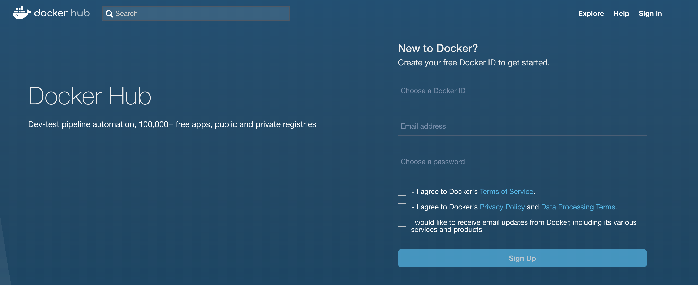
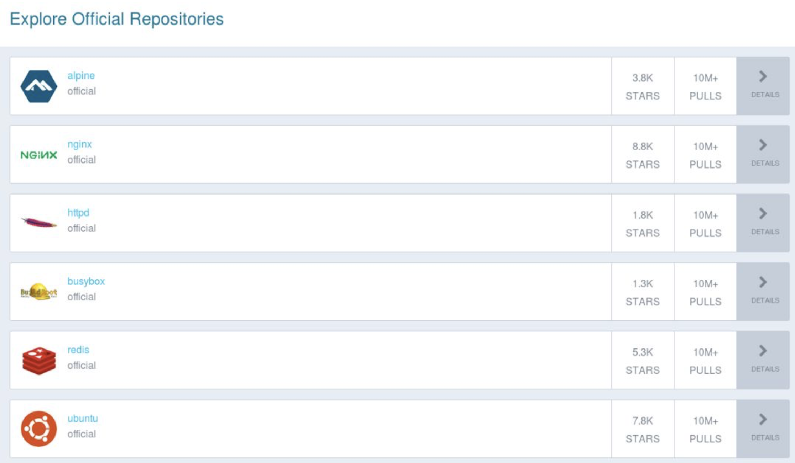
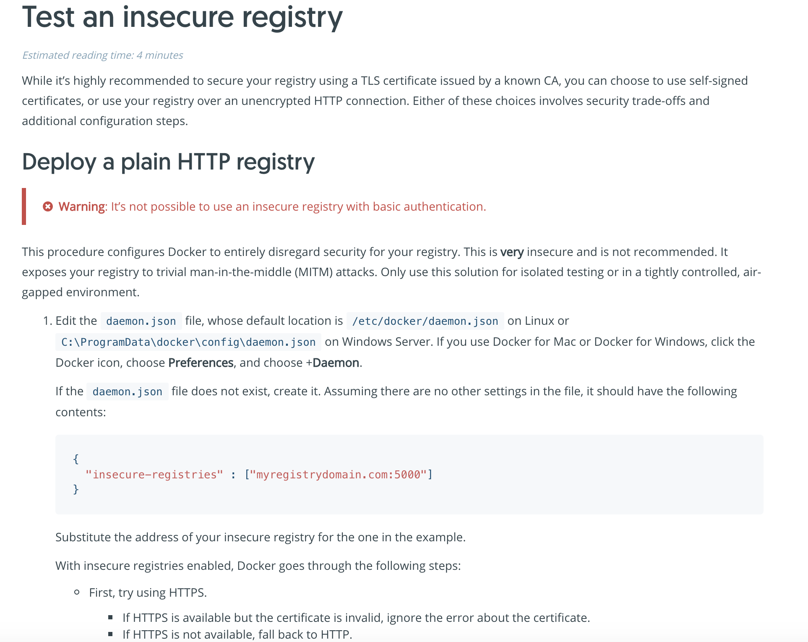

# 访问与搭建Docker仓库
仓库(Repository)是集中存放镜像的地方, **分公共仓库和私有仓库**.一个容易与之混淆的概念时注册服务器(Registry).注册服务器时存放仓库的具体服务器,一个注册服务器可以有多个仓库,而每个仓库下面可以有多个镜像.

## 一、Docker Hub公共镜像市场

目前Docker官方维护了一个公共镜像仓库https://hub.docker.com,其中已经包括超过15000的镜像.大部分镜像需求,都可以通过Docker Hub中直接下再镜像来实现.

### 1、登录
可以通过命令执行docker login来输入用户名、密码和邮箱来完成注册和登录,注册成功后,本地用户目录.dockercfg中将保存用户的认证信息.登录成功后,用户可以上传个人制作的镜像.

或者通过图像界面进行注册登录:





### 2、基本操作
用户无需登录即可通过docker search命令查找官方仓库中的镜像,并利用docker pull命令来将它下载到本地:

```
$ sudo docker search centos
INDEX       NAME                                         DESCRIPTION                                     STARS     OFFICIAL   AUTOMATED
docker.io   docker.io/centos                             The official build of CentOS.                   4529      [OK]
docker.io   docker.io/ansible/centos7-ansible            Ansible on Centos7                              114                  [OK]
docker.io   docker.io/jdeathe/centos-ssh                 CentOS-6 6.9 x86_64 / CentOS-7 7.4.1708 x8...   98                   [OK]
docker.io   docker.io/consol/centos-xfce-vnc             Centos container with "headless" VNC sessi...   58                   [OK]
docker.io   docker.io/imagine10255/centos6-lnmp-php56    centos6-lnmp-php56                              44                   [OK]
docker.io   docker.io/tutum/centos                       Simple CentOS docker image with SSH access      43
docker.io   docker.io/centos/mysql-57-centos7            MySQL 5.7 SQL database server                   35
docker.io   docker.io/gluster/gluster-centos             Official GlusterFS Image [ CentOS-7 +  Glu...   31                   [OK]
docker.io   docker.io/openshift/base-centos7             A Centos7 derived base image for Source-To...   29
docker.io   docker.io/centos/python-35-centos7           Platform for building and running Python 3...   27
docker.io   docker.io/centos/postgresql-96-centos7       PostgreSQL is an advanced Object-Relationa...   24
docker.io   docker.io/kinogmt/centos-ssh                 CentOS with SSH                                 21                   [OK]
docker.io   docker.io/openshift/jenkins-2-centos7        A Centos7 based Jenkins v2.x image for use...   14
docker.io   docker.io/openshift/mysql-55-centos7         DEPRECATED: A Centos7 based MySQL v5.5 ima...   6
docker.io   docker.io/pivotaldata/centos-gpdb-dev        CentOS image for GPDB development. Tag nam...   6
docker.io   docker.io/openshift/jenkins-1-centos7        DEPRECATED: A Centos7 based Jenkins v1.x i...   4
docker.io   docker.io/darksheer/centos                   Base Centos Image -- Updated hourly             3                    [OK]
docker.io   docker.io/openshift/wildfly-101-centos7      A Centos7 based WildFly v10.1 image for us...   3
docker.io   docker.io/pivotaldata/centos                 Base centos, freshened up a little with a ...   2
docker.io   docker.io/blacklabelops/centos               CentOS Base Image! Built and Updates Daily!     1                    [OK]
docker.io   docker.io/openshift/wildfly-81-centos7       A Centos7 based WildFly v8.1 image for use...   1
docker.io   docker.io/pivotaldata/centos-mingw           Using the mingw toolchain to cross-compile...   1
docker.io   docker.io/jameseckersall/sonarr-centos       Sonarr on CentOS 7                              0                    [OK]
docker.io   docker.io/pivotaldata/centos-gcc-toolchain   CentOS with a toolchain, but unaffiliated ...   0
docker.io   docker.io/smartentry/centos                  centos with smartentry                          0                    [OK]

```

根据是否为官方提供,可将这些镜像资源分为两类.一种时类似CentOS这样的基础镜像,称为基础或根镜像.这些镜像是由Docker公司创建、验证、支持、提供.这样的镜像往往用单个单词作为名字.

还有一种类型,`比如ansible/centos7-ansible`镜像,他是有Docker用户ansible创建并维护的,带有用户名称为前缀,表明是某用户下的某仓库.可以通过名称前缀`user_name/`镜像名来指定使用某个用户提供的镜像.

另外,在查找的时候通过`--filter=stars=N`  N参数可以指定仅显示评价为N星以上的镜像.

下载官方CentOS镜像到本地:

```
[vagrant@node1 ~]$ sudo docker pull centos
Using default tag: latest
Trying to pull repository docker.io/library/centos ...
latest: Pulling from docker.io/library/centos
Digest: sha256:b67d21dfe609ddacf404589e04631d90a342921e81c40aeaf3391f6717fa5322
Status: Downloaded newer image for docker.io/centos:latest
[vagrant@node1 ~]$ sudo docker images
REPOSITORY          TAG                   IMAGE ID            CREATED             SIZE
jacob/python-web    testpythonwebserver   274abed832d4        5 hours ago         200 MB
docker.io/centos    centos7               49f7960eb7e4        8 weeks ago         200 MB
docker.io/centos    latest                49f7960eb7e4        8 weeks ago         200 MB
```
### 3、自动创建

对于需要升级镜像内程序来说,十分方便.有时候,用户A创建了镜像,安装某个软件,如果软件发布新版本则需要手动更新镜像.

而自动创建允许用户通过Docker Hub指定一个目标网站(目前支持GitHub或BitBucket)上的项目,一旦项目发生新的提交,则自动执行A创建.

步骤如下:

* 创建并登录Docker Hub,以及目标网站;*在目标网站中连接账户到Docker Hub;
* 在Docker Hub中配置一个"自动创建";
* 选取一个目标网站中的项目(需要含Dockerfile)和分支;
* 指定Dockerfile的位置,并提交创建

之后,可以在Docker Hub的"自动创建"页面中跟踪每次创建的状态.

##  二、搭建本地私有仓库

1、使用registry镜像创建私有仓库

安装Docker之后,可以通过官方提供的registry镜像来简单搭建一套本地私有仓库环境.

下载registry:

```
[vagrant@node1 ~]$ sudo docker pull registry:2.4.1
Trying to pull repository docker.io/library/registry ...
2.4.1: Pulling from docker.io/library/registry
5c90d4a2d1a8: Pull complete
fb8b2153aae6: Pull complete
f719459a7672: Pull complete
fa42982c9892: Pull complete
Digest: sha256:504b44c0ca43f9243ffa6feaf3934dd57895aece36b87bc25713588cdad3dd10
Status: Downloaded newer image for docker.io/registry:2.4.
```

这将自动下载并启动一个registry容器,创建本地的私有仓库服务，v2.4.1的registry是把image文件放到了`/var/lib/registry`下。

启动registry:

```
sudo docker run -d -p 5000:5000 --restart=always --name registry --privileged=true -v /data/:/var/lib/registry registry:2.4.1
27ac2d67622d6c4aa85ca9abfdda6a061f7e31761835364fa5f9ea9b5a682708
```

* --name：指定容器名称
* --privileged=true：CentOS7中的安全模块selinux把权限禁掉了，参数给容器加特权，不加上传镜像会报权限错误

2、管理私有仓库
在 CentOS 7.0系统中查看已有的镜像:

```
[vagrant@node1 ~]$ sudo docker images
REPOSITORY           TAG                   IMAGE ID            CREATED             SIZE
jacob/python-web     testpythonwebserver   274abed832d4        6 hours ago         200 MB
docker.io/centos     centos7               49f7960eb7e4        8 weeks ago         200 MB
docker.io/centos     latest                49f7960eb7e4        8 weeks ago         200 MB
docker.io/registry   2.4.1                 8ff6a4aae657        2 years ago         172 MB
```

然后在本机通过docker push 127.0.0.1:5000/test；首先标记上传镜像为127.0.0.1:5000/xxx(格式为docker tag IMAGE [:TAG] [REGISTRYHOST/] [USERNAME/] NAME [:TAG]):

```
[vagrant@node1 ~]$ sudo docker tag centos 127.0.0.1:5000/test
[vagrant@node1 ~]$ sudo docker images
REPOSITORY            TAG                   IMAGE ID            CREATED             SIZE
jacob/python-web      testpythonwebserver   274abed832d4        6 hours ago         200 MB
127.0.0.1:5000/centos   latest                49f7960eb7e4        8 weeks ago         200 MB
docker.io/centos      centos7               49f7960eb7e4        8 weeks ago         200 MB
docker.io/centos      latest                49f7960eb7e4        8 weeks ago         200 MB
docker.io/registry    2.4.1                 8ff6a4aae657        2 years ago         172 MB
```
但是只能在本地使用127.0.0.1进行推送，不能在其他主机上传镜像，包括本机通过IP地址也不可以推送镜像。

当在其他主机或者在本机通过IP推送镜像时，docker默认会认为地址是HTTPS加密的，而实际上我们启动registry时并没有加密，所以会报错:

```
sudo docker push 127.0.0.1:5000/centos
The push refers to a repository [127.0.0.1:5000/centos]
bcc97fbfc9e1: Pushed
latest: digest: sha256:eed5b251b615d1e70b10bcec578d64e8aa839d2785c2ffd5424e472818c42755 size: 529
```

```
[vagrant@node1 ~]$ sudo docker tag centos 192.168.33.13:5000/test
[vagrant@node1 ~]$ sudo docker images
REPOSITORY                TAG                   IMAGE ID            CREATED             SIZE
jacob/python-web          testpythonwebserver   274abed832d4        7 hours ago         200 MB
127.0.0.1:5000/centos     latest                49f7960eb7e4        8 weeks ago         200 MB
192.168.33.13:5000/test   latest                49f7960eb7e4        8 weeks ago         200 MB
docker.io/centos          centos7               49f7960eb7e4        8 weeks ago         200 MB
docker.io/centos          latest                49f7960eb7e4        8 weeks ago         200 MB
docker.io/registry        2.4.1                 8ff6a4aae657        2 years ago         172 MB
[vagrant@node1 ~]$ sudo docker push 192.168.33.13:5000/test
The push refers to a repository [192.168.33.13:5000/test]
Get https://192.168.33.13:5000/v1/_ping: http: server gave HTTP response to HTTPS client
```
解决方案:
[https://docs.docker.com/registry/insecure/](https://docs.docker.com/registry/insecure/)



修改dockerd启动参数【官方资料】，然后重启docker。再推送镜像时就会认为这个地址是HTTP，不会报错了，但在每一台主机添加这个配置是很麻烦和危险的：

再次push上传就好了

```
[vagrant@node1 ~]$ sudo vi /etc/docker/daemon.json
[vagrant@node1 ~]$ sudo cat /etc/docker/daemon.json
{"insecure-registries" : ["192:158.33.13:5000"]}
[vagrant@node1 ~]$ sudo systemctl restart docker.service
[vagrant@node1 ~]$ sudo docker push 192.168.33.13:5000/test
The push refers to a repository [192.168.33.13:5000/test]
```
第二种操作办法：生成证书


