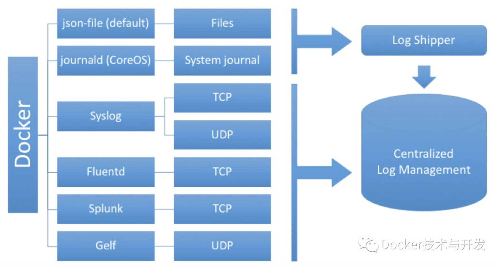

# 远程(SSH)连接Docker容器

之前有操作过**attach、exec**等进入容器的命令，但这些命令无法解决远程管理容器的问题，当需要远程登录到容器进行操作，就需要SSH的支持。



## 一、基于commit命令创建

Docker提供了`docker commit`命令，支持用户提交自己对制定容器的修改，并生成新的镜像。格式：
`docker commit CONTAINER [REPOSITORY [：TAG] ]`

### 1、准备工作
使用ubuntu:14.04镜像创建一个容器：

```
[vagrant@node1 ~]$ sudo docker images
REPOSITORY                    TAG                   IMAGE ID            CREATED                  SIZE
docker.io/centos              latest                5182e96772bf        Less than a second ago   200 MB
docker.io/ubuntu              16.04                 7aa3602ab41e        8 days ago               115 MB
docker.io/ubuntu              latest                735f80812f90        8 days ago               83.5 MB
docker.io/ubuntu              14.04                 971bb384a50a        2 weeks ago              188 MB
```
更新apt缓存

```
[vagrant@node1 ~]$ sudo docker run -it ubuntu:14.04 /bin/bash
root@16bbcfab92a1:/# apt-get update
Get:1 http://security.ubuntu.com trusty-security InRelease [65.9 kB]
Ign http://archive.ubuntu.com trusty InRelease
Get:2 http://archive.ubuntu.com trusty-updates InRelease [65.9 kB]
Get:3 http://security.ubuntu.com trusty-security/universe Sources [92.5 kB]
Get:4 http://archive.ubuntu.com trusty-backports InRelease [65.9 kB]

```

### 2、安装和配置SSH服务：
选择主流的openssh-server作为服务端：

```
root@16bbcfab92a1:/# apt-get install openssh-server -y
Reading package lists... Done
Building dependency tree
Reading state information... Done
The following extra packages will be installed:
  ca-certificates krb5-locales libck-connector0 libedit2 libgssapi-krb5-2
  libidn11 libk5crypto3 libkeyutils1 libkrb5-3 libkrb5support0
  libpython-stdlib libpython2.7-minimal libpython2.7-stdlib libwrap0 libx11-6
  libx11-data libxau6 libxcb1 libxdmcp6 libxext6 libxmuu1 ncurses-term
  openssh-client openssh-sftp-server openssl python python-chardet
  python-minimal python-requests python-six python-urllib3 python2.7
  python2.7-minimal ssh-import-id tcpd wget xauth
```

提示已经是最新版本了。

**如果需要正常启动SSH服务，则目录/var/run/sshd必须存在；手动创建，并启动SSH服务：**

```
root@16bbcfab92a1:/# mkdir -p /var/run/sshd

root@16bbcfab92a1:/# /usr/sbin/sshd -D &
[1] 3015
```

此时查看容器SSH服务默认监听的22端口：

```
root@16bbcfab92a1:/# netstat -tunlp
Active Internet connections (only servers)
Proto Recv-Q Send-Q Local Address           Foreign Address         State       PID/Program name
tcp        0      0 0.0.0.0:22              0.0.0.0:*               LISTEN      3015/sshd
tcp6       0      0 :::22                   :::*                    LISTEN      3015/sshd

root@16bbcfab92a1:/# netstat -lnotp
Active Internet connections (only servers)
Proto Recv-Q Send-Q Local Address           Foreign Address         State       PID/Program name Timer
tcp        0      0 0.0.0.0:22              0.0.0.0:*               LISTEN      3015/sshd        off (0.00/0/0)
tcp6       0      0 :::22                   :::*                    LISTEN      3015/sshd        off (0.00/0/0)
```
可见端口已经处于监听状态。

**修改SSH服务的安全登录配置，取消pam登录限制：**

```
sed -ri 's/session required  pam_loginuid.so/#session required  pam_loginuid.so/g' /etc/pam.d/sshd
```
在root用户目录下创建.ssh目录，并复制需要登录的公钥信息（一般为本地主机用户目录下的.ssh/id_rsa.pub文件，可有sudo ssh-keygen -t rsa命令生成）到`authorized_keys`文件中：

```
root@16bbcfab92a1:/# mkdir .ssh
root@16bbcfab92a1:/# cd .ssh/
root@16bbcfab92a1:/.ssh# ls -l
total 0
root@16bbcfab92a1:/.ssh# vi authorized_keys
root@16bbcfab92a1:/.ssh# cat authorized_keys
ssh-rsa AAAAB3NzaC1yc2EAAAADAQABAAABAQCadmPbRKsiOhll0b77n6VRzbt+Aj/maDF0b8pJn1LxeqxMZ8o3gJ2sV8JyeKZrxiRSo8ax5A6DF6IfMU4ar5vC/DzWp2LPz7MxSw+0l7kh6c/7IOny6kvyLN0+jtVU10TWr99PrOtckQIliDjkfG5OLJ ...

```
创建自动启动SSH服务的可执行文件run.sh，并添加可执行权限

```
root@16bbcfab92a1:~# vi /run.sh
root@16bbcfab92a1:~# chmod +x /run.sh
root@16bbcfab92a1:~# cat /run.sh
#! /bin/bash
/usr/sbin/sshd -D


root@16bbcfab92a1:~# ls -l | grep run.sh
-rwxr-xr-x 1 root root 31 Aug  4 01:00 run.sh
```

最后推出容器：

```
root@16bbcfab92a1:~# exit
exit
```

### 3、保存镜像

将退出的容器用docker commit命令保存为一个新的sshd:ubuntu镜像：

```
sudo docker commit 16bbcfab92a1 sshd:ubuntu
sha256:dbca1feca5192aa70a98317be8837912791a7918fd471bcc37a27e005cbcd4ca
```
使用docker images查看本地生成的新镜像sshd:ubuntu，目前拥有的镜像如下：

```
[vagrant@node1 ~]$ sudo docker images
REPOSITORY                    TAG                   IMAGE ID            CREATED                  SIZE
docker.io/centos              latest                5182e96772bf        Less than a second ago   200 MB
sshd                          ubuntu                804a311b7f72        19 seconds ago           251 MB
```
### 4、使用镜像

启动容器，并添加端口映射**10022 -->22**。其中10022是宿主主机的端口，22是容器的SSH服

监听端口：

```
[vagrant@node1 ~]$ sudo docker run -d -p 10022:22 sshd:ubuntu /run.sh
d3452fc4485b1d41f683022bb3b1377de16ef7ac91f6af1fcd3c1d2141ccdd7d

```
在宿主主机或其他主机上，可以通过SSH访问10022端口来登录容器：

```
sudo docker inspect -f '{{ .NetworkSettings.IPAddress }}' d3452fc4485b
172.17.0.6

[vagrant@node1 ~]$ ssh root@172.17.0.6 -p 22
root@172.17.0.6's password:
```

## 二、使用Dockerfile创建

### 1、首先，创建一个sshd_ubuntu工作目录, 在其中创建Dockerfile和run.sh文件:

```
[vagrant@node1 ~]$ cd sshd_ubuntu
[vagrant@node1 sshd_ubuntu]$ ls
[vagrant@node1 sshd_ubuntu]$ touch Dockerfile run.sh
[vagrant@node1 sshd_ubuntu]$ vi run.sh
[vagrant@node1 sshd_ubuntu]$ cat run.sh
#!/bin/bash
/usr/sbin/sshd -D

```
### 2、编写authorized_keys文件：

在宿主主机上生成SSH密钥对，并创建**authorized_keys**文件：

```
[vagrant@node1 sshd_ubuntu]$ sudo ssh-keygen -t rsa
Generating public/private rsa key pair.
Enter file in which to save the key (/root/.ssh/id_rsa):
Enter passphrase (empty for no passphrase):
Enter same passphrase again:
Your identification has been saved in /root/.ssh/id_rsa.
Your public key has been saved in /root/.ssh/id_rsa.pub.
The key fingerprint is:
SHA256:TUJ8MlXTW1BdgUzSZbmQNGS4rr6mpiLxszaaOUDENYc root@node1
The key's randomart image is:
+---[RSA 2048]----+
|. .o.. ....oXB=*B|
| o Eo  .+ ..oB+.o|
|.       .+. . .o.|
| .       + .  .. |
|.       S o      |
|..         .     |
|. o       .      |
| oo*   . o       |
| +=.=.o.+o.      |
+----[SHA256]-----+

[vagrant@node1 sshd_ubuntu]$ cat ~/.ssh/id_rsa.pub > authorized_keys
```

### 3.编写Dockerfile文件：


```
[vagrant@node1 sshd_ubuntu]$ vi Dockerfile
[vagrant@node1 sshd_ubuntu]$ cat Dockerfile
FROM ubuntu:14.04

MAINTAINER docker_user (user@docker.com)

RUN apt-get update
RUN apt-get install -y openssh-server
RUN mkdir -p /var/run/sshd
RUN mkdir -p /root/.ssh

RUN sed -ri 's/session    required    pam_loginuid.so/#session    required    pam_loginuid.so/g' /etc/pam.d/sshd

#(ADD命令，从Dockerfile所在目录里复制authorized_keys文件添，复制到容器目录下的/root/.ssh/authorized_keys）
ADD authorized_keys /root/.ssh/authorized_keys
ADD run.sh /run.sh
RUN chmod 755 /run.sh

EXPOSE 22

CMD ["/run.sh"]
```

### 4、创建镜像

在sshd_ubuntu目录下，使用docker bulid命令创建镜像；需要注意最后还有一个“.”，表示使用当前目录中的Dockerfile:

```
[vagrant@node1 sshd_ubuntu]$ sudo docker build -t sshd:dockerfile .
Sending build context to Docker daemon 4.608 kB
Step 1/12 : FROM ubuntu:14.04
 ---> 971bb384a50a
Step 2/12 : MAINTAINER docker_user (user@docker.com)
 ---> Running in 6adfca7397b8
 ---> bcae4a0b6b86
Removing intermediate container 6adfca7397b8
Step 3/12 : RUN apt-get update
 ---> Running in f4a780958736
 
...

Removing intermediate container 6ff8d4314518
Step 12/12 : CMD /run.sh
 ---> Running in 789c47e84b3d
 ---> 121982f18b9f
Removing intermediate container 789c47e84b3d
Successfully built 121982f18b9f

```

在本地查看sshd:dockerfile镜像：

```
[vagrant@node1 sshd_ubuntu]$ sudo docker images
REPOSITORY                    TAG                   IMAGE ID            CREATED                  SIZE
docker.io/centos              latest                5182e96772bf        Less than a second ago   200 MB
sshd                          dockerfile            121982f18b9f        About a minute ago       251 MB
```

### 5、测试镜像，运行容器

使用刚创建的镜像sshd:dockerfile运行一个容器；直接启动镜像，映射容器的22端口到本地的10122端口：

```
[vagrant@node1 sshd_ubuntu]$ sudo docker run -d -p 10122:22 sshd:dockerfile
be35a7fa3bc55673513252e0c1d6c0403e980697eadce7605c0165a9ab4c8104

[vagrant@node1 sshd_ubuntu]$ sudo docker ps -l
CONTAINER ID        IMAGE               COMMAND             CREATED             STATUS              PORTS                   NAMES
be35a7fa3bc5        sshd:dockerfile     "/run.sh"           7 seconds ago       Up 6 seconds        0.0.0.0:10122->22/tcp   angry_einstein
```

```
[vagrant@node1 sshd_ubuntu]$ sudo docker inspect -f '{{ .NetworkSettings.IPAddress }}' be35a7fa3bc5
172.17.0.7
```
在宿主主机新打开一个终端，连接到新建的容器：

```
[vagrant@node1 ~]$ ssh root@172.17.0.7 -p 22
The authenticity of host '172.17.0.7 (172.17.0.7)' can't be established.
ECDSA key fingerprint is SHA256:F1ZMGoQFjZ0D76Zhb2xSmUMXHDJTyrydad96NB6rqus.
ECDSA key fingerprint is MD5:fc:37:a4:b1:69:0e:e4:2e:b0:50:49:97:18:39:f8:0e.
Are you sure you want to continue connecting (yes/no)? yes
Warning: Permanently added '172.17.0.7' (ECDSA) to the list of known hosts.
Welcome to Ubuntu 14.04 LTS (GNU/Linux 4.4.0-128-generic x86_64)

 * Documentation:  https://help.ubuntu.com/

The programs included with the Ubuntu system are free software;
the exact distribution terms for each program are described in the
individual files in /usr/share/doc/*/copyright.

Ubuntu comes with ABSOLUTELY NO WARRANTY, to the extent permitted by
applicable law.

root@be35a7fa3bc5:~# ls -la
total 8
drwx------ 1 root root   20 Aug  4 02:33 .
drwxr-xr-x 1 root root   40 Aug  4 02:27 ..
-rw-r--r-- 1 root root 3106 Feb 20  2014 .bashrc
drwx------ 2 root root   34 Aug  4 02:33 .cache
-rw-r--r-- 1 root root  140 Feb 20  2014 .profile
drwxr-xr-x 1 root root   29 Aug  4 02:24 .ssh

root@be35a7fa3bc5:~/.ssh# exit
logout
Connection to 172.17.0.7 closed.
```
可以看到已进入容器；也可以使用其他宿主机远程连接容器进行管理。
