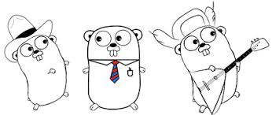

# Golang Learning

## Golang basic

1. [Learning Go Basic](1Go_basic.md)
   * Getting started
   * Install Go on mac
   * Get started Hello World
2. [Essential Go skills](2Go_Skills.md)
   * `go help`
   * `go packages`
3. [Go input and output](3Go_input_output.md)
   * Outputting strings with the fmt package
   * Get input from console
4. [Managing Simple Values](4Simple_value.md)
   * Storing Data in Variables
   * Working with string values
   * Using math operators and the math package
   * Working with dates and times
5. [Managing Complex Types and Collection](5Complex_DataType.md)
   * Referencing values with pointers
   * Storing ordered values in arrays
   * Storing ordered values in slices
   * How memory is allocated and managed
   * Storing unordered values in maps
   * Grouping related values in structs
6. [Managing Program Flow](6Go_Flow.md)
   * Programming conditional logic
   * Evaluating expressions with switch statements
   * Creating loops with for statements
7. [Structuring Go code](7Go_Struc_code.md)
   * Defining and calling functions
   * Returning multiple values from functions
   * Creating packages as function libraries
   * Defining functions as methods of custom types
   * Defining and implementing interfaces
   * Deferring function calls
8. [Go working with file](8Go_file.md)
   * Writing to a text file
   * Reading from a text file
   * Walking a directory tree
9. [Go working with Web File](9Go_Web_file.md)
   * Reading a text file from the web
   * Creating and parsing a JSON string
   * Creating a simple HTTP server

[Golang basic code](Go_code)