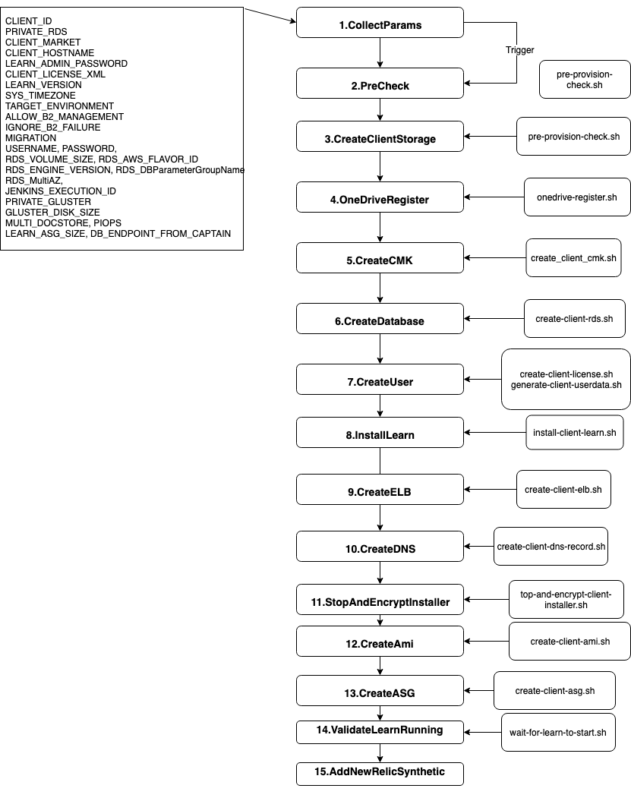
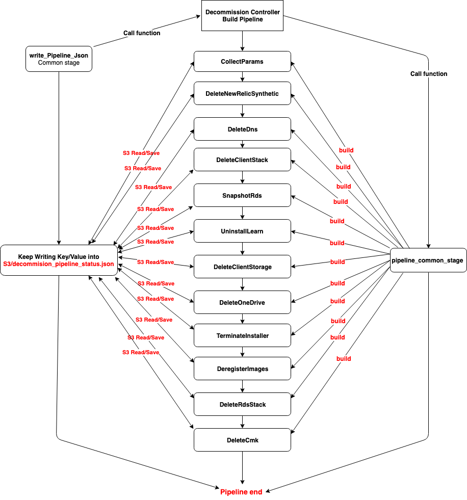

### 1.git rebease and interactive and cherry-picking, force push

[git rebase vs git merge详解](https://github.com/Chao-Xi/JacobTechBlog/blob/master/ops/git_rebase_merge.md)

### 2.CICD and CD provision

**Provision Pipeline**

**Decomission Pipeline**

