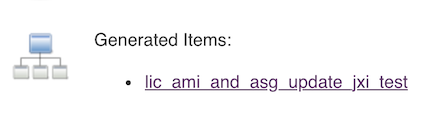

# Manually Created Jenkins Seed Job

## Example attributes needed for Seed Job

####  attr1: Project name	

```
jxi_seed_job_test
```
#### attr2: Description

```
For LSB-3760, check unlock and unlock mechanism on lic_ami_and_asg_update
```	

#### attr3: Git

**Repositories:**

```
ssh://git@stash.bbpd.io/l4c/learn-saas.git
```

**Branches to build:**

```
*/feature/LSB-****
```

**Repository browser:**	

* stash
* url: `https://stash.bbpd.io/projects/L4C/repos/learn-saas`


#### attr4: GitDelete workspace before build starts: true

#### attr5: Build: Process Job DSLs

**Look on Filesystem:**

```
jenkins/jobs_lcjenkins_saas/standalone_jobs/lic_ami_and_asg_update.groovy
```


## After job build

```
First time build. Skipping changelog.
Processing DSL script lic_ami_and_asg_update.groovy
Added items:
    GeneratedJob{name='lic_ami_and_asg_update_jxi_test'}
Finished: SUCCESS
```


## Check generated job




