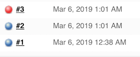
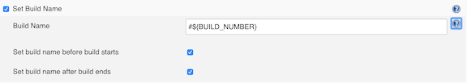
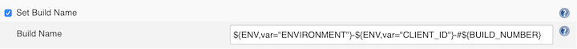
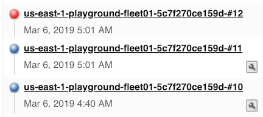

# Build Name Setter Plugin

[wiki page](https://wiki.jenkins.io/display/JENKINS/Build+Name+Setter+Plugin)

This plugin sets the display name of a build to something other than #1, #2, #3, ...so that you can use an identifier that makes more sense in your context. When you install this plugin, your job configuration page gets additional setting that lets you specify a build name for each new build.




## Set Build Name (Build Environment)

### How to use name build



```
Normally, builds are named by their sequential numbers, but you can change that here by setting what name new build gets. This field can contain the following macros:
${FAILED_TESTS}
Displays failing unit test information, if any tests failed.
showStack
Shows stack trace in failing test output. Defaults to true.
showMessage
Shows error message in failing test output. Defaults to true.
maxTests
Display at most this many tests. No limit is set by default.
onlyRegressions
Display only the failing tests that are different from previous builds. Defaults to false.

...
```

### In groovy script

```
wrappers {
// Normally, builds are named by their sequential numbers, but you can change that to something more meaningful to you in the context of this job.
	buildNameSetter {
	template(String value)
	runAtStart(Boolean value)
	runAtEnd(Boolean value)
	 }
}
```

## For Instance




```
${ENV,var="ENVIRONMENT"}-${ENV,var="CLIENT_ID"}-#${BUILD_NUMBER}
```

### In groovy script

```
wrappers {
 	   timestamps()
      buildNameSetter {
        template('${ENV,var="ENVIRONMENT"}-${ENV,var="CLIENT_ID"}-#${BUILD_NUMBER}')
    }
  }
```




