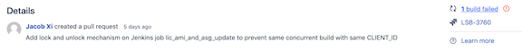
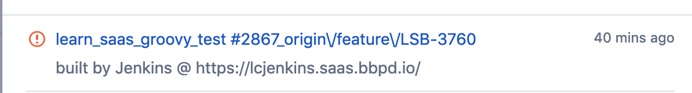
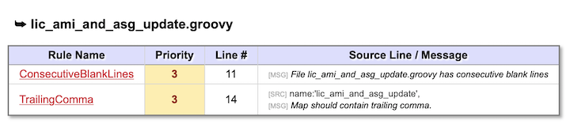
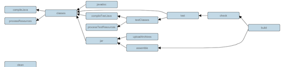
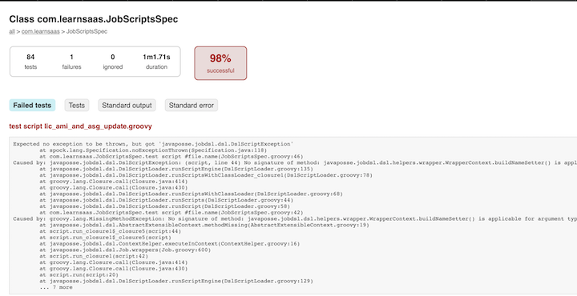

# How to use gradle check to check your code sanity and gramma

## The trigger

After my code passed PR, it still cannot merge into master branch, something goes wrong





### Jenkins code 

```
Console Output

21:35:57 > Task :codenarcJobs FAILED
21:35:57 
21:35:57 FAILURE: Build failed with an exception.
21:35:57 
21:35:57 * What went wrong:
21:35:57 Execution failed for task ':codenarcJobs'.
21:35:57 > CodeNarc rule violations were found. See the report at: file:///mnt/mesos/sandbox/workspace/learn_saas_groovy_test/jenkins/build/reports/codenarc/jobs.html
21:35:57 
21:35:57 * Try:
21:35:57 Run with --stacktrace option to get the stack trace. Run with --info or --debug option to get more log output. Run with --scan to get full insights.
21:35:57 
21:35:57 * Get more help at https://help.gradle.org
21:35:57 
21:35:57 Deprecated Gradle features were used in this build, making it incompatible with Gradle 5.0.
21:35:57 Use '--warning-mode all' to show the individual deprecation warnings.
21:35:57 See https://docs.gradle.org/4.10.3/userguide/command_line_interface.html#sec:command_line_warnings
21:35:57 
21:35:57 BUILD FAILED in 41s
21:35:57 1 actionable task: 1 executed
```
### Run the check in local 

```
$ cd jenkins
$ ./gradlew check

> Task :codenarcJobs
Analysis time=3463ms
No custom message bundle found for [codenarc-messages]. Using default messages.
Report file [.../build/reports/codenarc/jobs.html] created.
[ant:codenarc] CodeNarc completed: (p1=0; p2=0; p3=1) 6458ms

> Task :codenarcJobs FAILED
:codenarcJobs (Thread[Task worker for ':',5,main]) completed. Took 7.63 secs.

FAILURE: Build failed with an exception.

* What went wrong:
Execution failed for task ':codenarcJobs'.
> CodeNarc rule violations were found. See the report at: file:///.../build/reports/codenarc/jobs.html

* Try:
Run with --stacktrace option to get the stack trace. Run with --debug option to get more log output. Run with --scan to get full insights.

* Get more help at https://help.gradle.org

Deprecated Gradle features were used in this build, making it incompatible with Gradle 5.0.
Use '--warning-mode all' to show the individual deprecation warnings.
See https://docs.gradle.org/4.10.3/userguide/command_line_interface.html#sec:command_line_warnings

BUILD FAILED in 8s
1 actionable task: 1 executed
```

Something goes wrong, open `/build/reports/codenarc/jobs.html`



**find the gramma problem and change it**


### Run the check in local again

```
$ ./gradlew check

> Task :test FAILED

FAILURE: Build failed with an exception.

* What went wrong:
Execution failed for task ':test'.
> There were failing tests. See the report at: file:///.../build/reports/tests/test/index.html

* Try:
Run with --stacktrace option to get the stack trace. Run with --info or --debug option to get more log output. Run with --scan to get full insights.

* Get more help at https://help.gradle.org

Deprecated Gradle features were used in this build, making it incompatible with Gradle 5.0.
Use '--warning-mode all' to show the individual deprecation warnings.
See https://docs.gradle.org/4.10.3/userguide/command_line_interface.html#sec:command_line_warnings

BUILD FAILED in 1m 28s
5 actionable tasks: 1 executed, 4 up-to-date
```

**Check passed but test failed**


## Run the test in local again

### What's difference between check and difference

**The Gradle `check` task depends on the `test` task which means test is executed before check is run.**



**gradle test is much faster than gradle check**

**Open `/build/reports/tests/test/index.html`**



```
buildNameSetter {
	template('${ENV,var="ENVIRONMENT"}-${ENV,var="CLIENT_ID"}-#${BUILD_NUMBER}')
}
// Works in Jenkins but cannot pass the Gradle check, need update Gradle
```

**It's actual gradle version problem**


