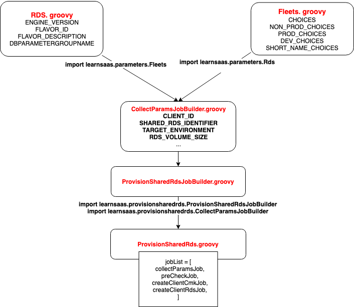

# Provision Shared RDS with FreeStyle and DownStream Jenkins job 

## Provision Db Server


* `PROVISION_SHARED_RDS_COLLECTPARAMS`
* `PROVISION_SHARED_RDS_PRECHECK`
* `PROVISION_SHARED_RDS_CREATE_CLIENT_CMK`
* `PROVISION_SHARED_RDS_CREATE_CLIENT_RDS`



**Rds.groovy**

```
package learnsaas.parameters

/**
 * class Rds to describe parameters related to the Rds
 */
class Rds {
  static final ENGINE_VERSION = [
    '9.4.9',
    '9.4.7',
    '9.4.5',
    '9.4.4',
    '9.3.3',
    '9.4.1',
    '9.3.5',
    '9.3.6',
    '9.3.9',
    '9.6.9',
  ]
  static final FLAVOR_ID =[
    'db.m3.large',
    'db.m3.xlarge',
    'db.m3.2xlarge',
    'db.m4.large',
    'db.m4.xlarge',
    'db.m4.2xlarge',
    'db.m4.4xlarge',
    'db.m4.10xlarge',
    'db.r3.large',
    'db.r3.xlarge',
    'db.r3.2xlarge',
    'db.r3.4xlarge',
    'db.r3.8xlarge',
    'db.r4.large',
    'db.r4.xlarge',
    'db.r4.2xlarge',
    'db.r4.4xlarge',
    'db.r4.8xlarge',
    'db.r4.16xlarge',
  ]
  static final FLAVOR_DESCRIPTION='''
Instance Class   CPUs    Memory (GB)     Network Performance
=============================================================
db.m3.large         2             7.5     Moderate
db.m3.xlarge        4             15      High
db.m3.2xlarge       8             30      High
db.m4.large         2             8       Moderate
db.m4.xlarge        4             16      High
db.m4.2xlarge       8             32      High
db.m4.4xlarge      16             64      High
db.m4.10xlarge     40             160     10 Gbps
db.r3.large         2             15      Moderate
db.r3.xlarge        4             30.5    Moderate
db.r3.2xlarge       8             61      High
db.r3.4xlarge      16             122     High
db.r3.8xlarge      32             244     10 Gbps
db.r4.large         2             15.25    Up to 10 Gbps
db.r4.xlarge        4             30.5    Up to 10 Gbps
db.r4.2xlarge       8             61      Up to 10 Gbps
db.r4.4xlarge      16             122     Up to 10 Gbps
db.r4.8xlarge      32             244     10 Gbps
db.r4.16xlarge     64             488     25 Gbps '''
  static final DBPARAMETERGROUPNAME =[
    'learn-optimized-945new',
    'learn-optimized-94new',
    ...
  ]
}
```

**Fleets.groovy**

```
package learnsaas.parameters

/**
 * class Fleets to describe parameters related to Fleets
 */
class Fleets {
  static final CHOICES = [
    'us-east-1-dev-fleet01',
    'us-east-1-test-fleet01',
    'us-east-1-stage-fleet01',
    'us-east-1-prod-fleet01',
    'us-east-1-test-fleet02',
    'us-east-1-stage-fleet02',
    'us-east-1-prod-fleet02',
    'us-gov-west-1-test-fleet01',
    'us-gov-west-1-stage-fleet01',
    'us-gov-west-1-prod-fleet01',
    'ap-southeast-1-test-fleet01',
    'ap-southeast-1-stage-fleet01',
    'ap-southeast-1-prod-fleet01',
    'ap-southeast-1-test-fleet02',
    'ap-southeast-1-stage-fleet02',
    'ap-southeast-1-prod-fleet02',
    'ap-southeast-2-test-fleet01',
    'ap-southeast-2-stage-fleet01',
    'ap-southeast-2-prod-fleet01',
    'eu-central-1-prod-fleet01',
    'eu-central-1-stage-fleet01',
    'eu-central-1-test-fleet01',
    'us-east-1-playground-fleet01',
    'cn-northwest-1-prod-fleet01',
    'cn-northwest-1-stage-fleet01',
    'cn-northwest-1-test-fleet01',
    'ap-northeast-2-prod-fleet01',
    'ap-northeast-2-stage-fleet01',
    'ap-northeast-2-test-fleet01',
    'ca-central-1-prod-fleet01',
    'ca-central-1-stage-fleet01',
    'ca-central-1-test-fleet01',
  ]

  static final NON_PROD_CHOICES = [
    'us-east-1-dev-fleet01',
    'us-east-1-test-fleet01',
    'us-east-1-stage-fleet01',
    'us-east-1-test-fleet02',
    'us-east-1-stage-fleet02',
    'us-gov-west-1-test-fleet01',
    'us-gov-west-1-stage-fleet01',
    'ap-southeast-1-test-fleet01',
    'ap-southeast-1-stage-fleet01',
    'ap-southeast-1-test-fleet02',
    'ap-southeast-1-stage-fleet02',
    'ap-southeast-2-test-fleet01',
    'ap-southeast-2-stage-fleet01',
    'eu-central-1-stage-fleet01',
    'eu-central-1-test-fleet01',
    'us-east-1-playground-fleet01',
    'cn-northwest-1-stage-fleet01',
    'cn-northwest-1-test-fleet01',
    'ap-northeast-2-stage-fleet01',
    'ap-northeast-2-test-fleet01',
    'ca-central-1-stage-fleet01',
    'ca-central-1-test-fleet01',
  ]

  static final PROD_CHOICES = [
    'us-east-1-prod-fleet01',
    'us-east-1-prod-fleet02',
    'ap-southeast-1-prod-fleet01',
    'ap-southeast-1-prod-fleet02',
    'ap-southeast-2-prod-fleet01',
    'eu-central-1-prod-fleet01',
    'cn-northwest-1-prod-fleet01',
    'ap-northeast-2-prod-fleet01',
    'ca-central-1-prod-fleet01',
  ]

  static final DEV_CHOICES = [
    'us-east-1-dev-fleet01',
    'us-east-1-playground-fleet01',
  ]

  static final SHORT_NAME_CHOICES = [
    'Playground',
    'Testing',
    'Test',
    'Development',
  ]
}
```

**ProvisionSharedRdsJobBuilder.groovy**

```
package learnsaas.provisionsharedrds

import javaposse.jobdsl.dsl.DslFactory
import javaposse.jobdsl.dsl.Job
import learnsaas.common.Mesos
import learnsaas.common.Captain
import learnsaas.common.Stash

/**
 * Private RDS Migration Job Builder
 */
class ProvisionSharedRdsJobBuilder {
  String name
  String description
  String script = null
  String containerLabel = null
  String stashProject = 'l4c'
  String stashRepo = 'jenkins-provision'
  String stashBranch = 'master'
  String errorPhrases = null

  Job build(DslFactory dslFactory) {

    Job job = dslFactory.job(name) {
      it.description this.description
    }

    if (stashProject) {
      Stash.stashRepo(job, stashProject, stashRepo, stashBranch)
    }

    Captain.notifyCaptain(job)

    job.with {
      customWorkspace('workspace/provision_shared_rds/$TARGET_ENVIRONMENT/$CLIENT_ID')
      concurrentBuild(true)
      if (script?.trim()) {
        steps {
          shell(script)
        }
      }
      if (errorPhrases?.trim()) {
        publishers {
          textFinder(errorPhrases, null, true)
        }
      }
      wrappers {
        timestamps()
      }
    }

    if (containerLabel?.trim()) {
      Mesos.runOnMesosSlave(job, containerLabel)
    }

    job
  }
}
```

**ProvisionSharedRds.groovy**

```
// Purpose:
// To create a RDS instance as a Shared RDS

import javaposse.jobdsl.dsl.Job
import learnsaas.common.Downstream
import learnsaas.provisionsharedrds.ProvisionSharedRdsJobBuilder
import learnsaas.provisionsharedrds.CollectParamsJobBuilder

final String  PIPELINE_NAME = 'Provision_Shared_RDS_Pipeline'
final String  PIPELINE_TITLE = 'Provision Shared RDS Pipeline'
final String  PIPELINE_LIST_VIEW = 'Provision_Shared_RDS'
final Integer PIPELINE_NUM_BUILDS_TO_DISPLAY = 50
final Integer PIPELINE_REFRESH_NUM_SECS = 10
final String  SUCCESS = 'SUCCESS'
final String  PREFIX = 'Provision_Shared_Rds'

// Script Strings
//----------------
final String PRECHECK_SCRIPT='''#!/bin/bash
set -e

STACK_NAME=$SHARED_RDS_IDENTIFIER

target_stack_existed=$(aws cloudformation describe-stacks \
      --stack-name "$STACK_NAME" \
      --profile "$AWS_PROFILE" 2>&1 | grep "does not exist" && echo "no" || echo "yes")

if [ "$target_stack_existed" == "yes" ]; then
  echo "The stack $STACK_NAME already exists! Skip it."
  exit 1
fi
'''

final String CREATE_CLIENT_CMK_SCRIPT='''#!/bin/bash
set -e
bash ./lib/create_client_cmk.sh
'''

final String CREATE_CLIENT_RDS_SCRIP='''#!/bin/bash
set -e
bash ./lib/create-client-rds.sh

bash ./lib/add-additional-tags-on-shared-rds.sh \
      "$SHARED_RDS_IDENTIFIER" \
      "$TARGET_ENVIRONMENT"
'''

// Job Definitions
//-----------------
Job collectParamsJob = new CollectParamsJobBuilder(
  name:"${PREFIX}_CollectParams",
  description:'First job in the pipeline',
  containerLabel:'lcjenkins-jenkins-provision',
).build(this)

Job preCheckJob = new ProvisionSharedRdsJobBuilder(
  name:"${PREFIX}_PreCheck",
  description:'',
  script:PRECHECK_SCRIPT,
  containerLabel:'lcjenkins-jenkins-provision',
  stashRepo:'jenkins-provision',
).build(this)

Job createClientCmkJob = new ProvisionSharedRdsJobBuilder(
  name:"${PREFIX}_Create_Client_Cmk",
  description:'',
  script:CREATE_CLIENT_CMK_SCRIPT,
  containerLabel:'lcjenkins-jenkins-provision',
  stashRepo:'jenkins-provision',
).build(this)

Job createClientRdsJob = new ProvisionSharedRdsJobBuilder(
  name:"${PREFIX}_Create_Client_Rds",
  description:'',
  script:CREATE_CLIENT_RDS_SCRIP,
  containerLabel:'lcjenkins-jenkins-provision',
  stashRepo:'jenkins-provision',
).build(this)

buildPipelineView(PIPELINE_NAME) {
  filterBuildQueue()
  filterExecutors()
  startsWithParameters()
  title(PIPELINE_TITLE)
  displayedBuilds(PIPELINE_NUM_BUILDS_TO_DISPLAY)
  selectedJob(collectParamsJob.name)
  showPipelineParameters()
  refreshFrequency(PIPELINE_REFRESH_NUM_SECS)
  showPipelineParametersInHeaders()
}

// This array is only used for creating downstream job chain
jobList = [
  collectParamsJob,
  preCheckJob,
  createClientCmkJob,
  createClientRdsJob,
]

jobList.eachWithIndex { jobItem, index ->
  if ( index < jobList.size() - 1 ) {
    if ( jobItem == collectParamsJob ) {
      Downstream.triggerParameterized(
        jobItem,
        nextJob:jobList[index + 1].name,
        condition:SUCCESS,
        currentBuildParameters:true,
        propertiesFiles:['$WORKSPACE/parameters/$TARGET_ENVIRONMENT.properties'],
      )
    }
    else if ( jobItem == createClientCmkJob ) {
      Downstream.triggerParameterized(
        jobItem,
        nextJob:jobList[index + 1].name,
        condition:SUCCESS,
        currentBuildParameters:true,
        propertiesFiles:['cmk.properties'],
      )
    }
    else {
      Downstream.triggerParameterized(
        jobItem,
        nextJob:jobList[index + 1].name,
        condition:SUCCESS,
        currentBuildParameters:true,
      )
    }
  }
}

/**
 * Pipeline jobs list view
 */
listView(PIPELINE_LIST_VIEW) {
  description(PIPELINE_TITLE)
  filterBuildQueue()
  filterExecutors()
  jobs {
    name(collectParamsJob.name)
    name(preCheckJob.name)
    name(createClientCmkJob.name)
    name(createClientRdsJob.name)
  }
  columns {
    status()
    weather()
    name()
    lastDuration()
  }
}
```