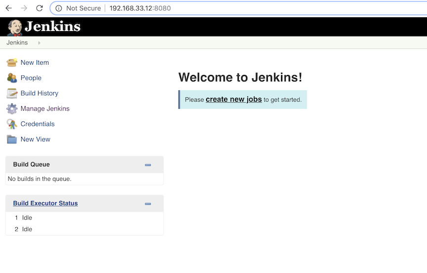
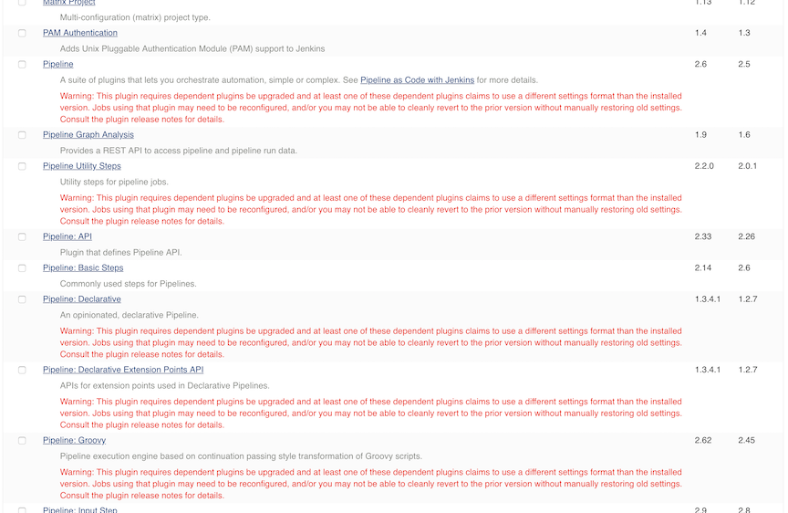

# Quick Start Jenkins on Docker

**Docker official jenkins repo and instruction：** [https://github.com/jenkinsci/docker](https://github.com/jenkinsci/docker)


## Install docker engine on new VM

* [The whole install process](https://github.com/Chao-Xi/JacobTechBlog/blob/master/docker/2docker_install.md)
* ` sudo apt-get install docker-ce=18.06.1-ce~3-0~ubuntu`

## Add `plugin.txt` and `Dockerfile` to and build jenkins image


**create [plugins.txt](plugins.txt)**

### `Dockerfile`

```
FROM jenkins/jenkins:2.150.2
COPY plugins.txt /usr/share/jenkins/ref/plugins.txt
RUN /usr/local/bin/install-plugins.sh < /usr/share/jenkins/ref/plugins.txt
```

**jenkins/jenkins:latest-version**


#### Build the image

```
$ docker build -t jenkins:v20180121 .
$ docker image -a 
$ docker images -a
REPOSITORY          TAG                 IMAGE ID            CREATED             SIZE
jenkins             v20180121           b3514d43ea91        3 hours ago         752MB
<none>              <none>              1b82c4e2a107        3 hours ago         701MB
jenkins/jenkins     2.150.2             c170b2984718        4 days ago          701MB
hello-world         latest              fce289e99eb9        2 weeks ago         1.84kB
```

#### Run the image

```
$ docker run -d -p 8080:8080 -p 50000:50000 --env=JAVA_OPTS=-Djenkins.install.runSetupWizard=false -v /var/lib/jenkins:/var/jenkins_home jenkins:v20180121
```

```
-d  "--detach"  Run container in background and print container ID
-p  port
--add-host  Add a custom host-to-IP mapping (host:ip)
-v  --volume=[host-src:]container-dest[:<options>]
You might need to customize the JVM running Jenkins, typically to pass system properties or 
tweak heap memory settings. Use JAVA_OPTS environment variable for this purpose :
--env=JAVA_OPTS=-Djenkins.install.runSetupWizard=false
```

#### check docker status: Error

```
$ docker ps -a
CONTAINER ID        IMAGE               COMMAND                  CREATED             STATUS                   PORTS               NAMES
9712762075fe        jenkins:v20180121   "/sbin/tini -- /usr/…"   2 hours ago         Exited (1) 2 hours ago                       heuristic_hypatia
```

#### Error logs check:

```
$ docker logs 9712762075fe
touch: cannot touch '/var/jenkins_home/copy_reference_file.log': Permission denied
Can not write to /var/jenkins_home/copy_reference_file.log. Wrong volume permissions?

# docker inspect container-id
```

```
$ cd /var/lib/
$ ls -la
drwxr-xr-x  2 root    root    4096 Jan 21 03:13 jenkins
```

#### Fix error and re-run

```
$ sudo chown 1000 jenkins/
$ docker run -d -p 8080:8080 -p 50000:50000 --env=JAVA_OPTS=-Djenkins.install.runSetupWizard=false -v /var/lib/jenkins:/var/jenkins_home jenkins:v20180121


$ docker ps -a
CONTAINER ID        IMAGE               COMMAND                  CREATED             STATUS                     PORTS                                              NAMES
1eba81ab4b5a        jenkins:v20180121   "/sbin/tini -- /usr/…"   5 seconds ago       Up 4 seconds               0.0.0.0:8080->8080/tcp, 0.0.0.0:50000->50000/tcp   trusting_curran
```

#### check jenkins running state

input `http://192.168.33.12:8080/` on your browser 




## Update plugins

**In `manage jenkins -> manage plugins`, there are a lot of plugins are outdated, we need update this plugin quickly and safely**




### stop and remove old container

```
docker ps -a                      #list current running container
docker stop container_id          #stop the running container 
docker rm -v old_container_id     #remove old and deprecated containerid
```

### remove old images

```
$ docker images -a
$ docker rmi image-id
```

### remove old jenkins files (Optional)

```
$ cd /var/lib/jenkins
$ rm -r *
```
**update [plugins.txt](plugins.txt)**

```
docker build -t jenkins/jenkins:v20180121 .
```
```
docker run -d -p 8080:8080 -p 50000:50000 --env=JAVA_OPTS=-Djenkins.install.runSetupWizard=false -v /var/lib/jenkins:/var/jenkins_home jenkins/jenkins:v20180121

```

### Container exits with non-zero exit code 137

If a container is no longer running, use the following command to find the status of the container:

```
$ docker container ls -a
```
Review the application's memory requirements and ensure that the container it's running in has sufficient memory

**My case: change vm memory from 512m to 1g, now it works fine**

