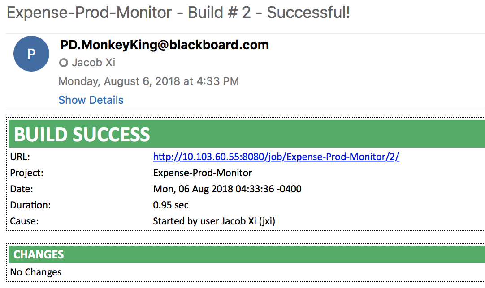
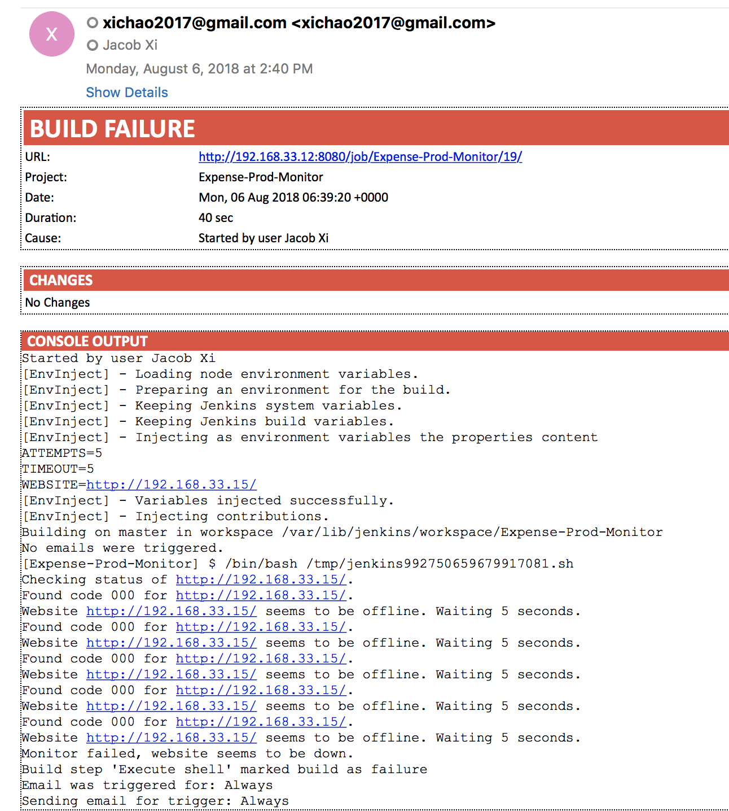

# Website status monitor using Jenkins

Jenkins is a great tool for continuous integration and deployment. In a sense, and greatly simplified, it is a very complex and feature rich task runner.I am wondering whether it could also keep track of applications in an production environment. This give me the idea to build a Jenkins job for monitoring live websites.

This post will show how to create a website monitoring tool in Jenkins using the DSL approach and a shell script.


## Example website need to be checked

###  Internal Expense Approval Tool

**Production internal expense tool**

```
http://10.75.60.24/sysworkflow/en/neoclassic/login/login
```

**Dev internal expense tool**

```
http://10.75.60.44/sysworkflow/en/neoclassic/login/login
```

## Creating a test script

First we’ll need some method of testing a website’s status. This part has nothing to do with Jenkins itself. The most simple way is using a shell script and a cURl request. The following command tries to access a website defined in $url and returns the status code:


```
#!/bin/bash

url='http://website-to-test'
code=`curl -sL --connect-timeout 20 --max-time 30 -w "%{http_code}\\n" "$url" -o /dev/null`
```

For example, create `test1.sh`


```
 #!/bin/bash

url='http://10.75.60.24/sysworkflow/en/neoclassic/login/login'
code=`curl -sL --connect-timeout 20 --max-time 30 -w "%{http_code}\\n" "$url" -o /dev/null`
echo "$code"
```

```
bash test1.sh
200
```


`--connect-timeout` and `--max-time` are added to make sure that we eventually give up. The server can become unresponsive and we also want to detect these kinds of events. After running, `$code` `contains the http status` code or ‘0’ in case of a failure. Given the status code we can react on the result:

```
#!/bin/bash

...

if [ "$code" = "200" ]; then
  echo "Website $url is online."
else
  echo "Website $url seems to be offline."
fi
```

We can further extend on this approach by wrapping the full check within a loop. By testing the website a few times we can hopefully prevent false negatives. Adding a loop in Bash is fairly simple given you know the syntax:

```
#!/bin/bash
url='http://website-to-test'
attempts=5
timeout=5

echo "Checking status of $url."

for (( i=1; i<=$attempts; i++ ))
do
  code=`curl -sL --connect-timeout 20 --max-time 30 -w "%{http_code}\\n" "$url" -o /dev/null`

  echo "Found code $code for $url."

  if [ "$code" = "200" ]; then
    echo "Website $url is online."
    break
  else
    echo "Website $url seems to be offline. Waiting $timeout seconds."
    sleep $timeout
  fi
done
```

Note: Using variables for constants, like the `timeout` and `url`, makes it easier to populate this with data from our Jenkins job.


## Failing a build

I created test script and the next step is the Jenkins integration. For this I need some way of communicating the results back to Jenkins. As I'm using a shell script, the most simple approach is using return codes: I’ll let the script `return 0` when **everything is online (which will complete the build)** or `1 in case of an error`. Using the default settings, **Jenkins will fail a build (and trigger a failure event)** when a shell script returns a non-zero value.

To make this work a simple flag is added to the cURL loop:

```
#!/bin/bash
url='http://website-to-test'
attempts=5
timeout=5
online=false

echo "Checking status of $url."

for (( i=1; i<=$attempts; i++ ))
do
  code=`curl -sL --connect-timeout 20 --max-time 30 -w "%{http_code}\\n" "$url" -o /dev/null`

  echo "Found code $code for $url."

  if [ "$code" = "200" ]; then
    echo "Website $url is online."
    online=true
    break
  else
    echo "Website $url seems to be offline. Waiting $timeout seconds."
    sleep $timeout
  fi
done

if $online; then
  echo "Monitor finished, website is online."
  exit 0
else
  echo "Monitor failed, website seems to be down."
  exit 1
fi
```

For Example my `expense_website_check.sh`

```
#!/bin/bash
url=$WEBSITE
attempts=$ATTEMPTS
timeout=$TIMEOUT
online=false

echo "Checking status of $url."

for (( i=1; i<=$attempts; i++ ))
do
  code=`curl -sL --connect-timeout 20 --max-time 30 -w "%{http_code}\\n" "$url" -o /dev/null`

  echo "Found code $code for $url."

  if [ "$code" = "200" ]; then
    echo "Website $url is online."
    online=true
    break
  else
    echo "Website $url seems to be offline. Waiting $timeout seconds."
    sleep $timeout
  fi
done

if $online; then
  echo "Monitor finished, website is online."
  exit 0
else
  echo "Monitor failed, website seems to be down."
  exit 1
fi
```
My script will now test the website multiple times, if all of these tests fail the monitor will fail the build. This is a conservative check: all cURL requests must fail before we report an error. You can also turn this around and fail the build if a single cURL request fails. This can however increase the number of false positives!

## Creating the Jenkins job using DSL

I create the Jenkins job using a DSL file, for freestyle job `expense-monitor-builder`

```
def recipients = 'jacob.xi@blackboard.com'
def prod_url = 'http://10.75.60.24/sysworkflow/en/neoclassic/login/login'

freeStyleJob('Expense-Prod-Monitor') {

  //Name of the job in Jenkins
  description('This is example for expense system 10.75.60.24 status check')

  triggers {
        cron {
            spec('''TZ=Asia/Shanghai
H 9,3 * * 1-5''')
        }
    }

  label('master')
  compressBuildLog()
  disabled()
  environmentVariables {
      env('WEBSITE', prod_url)
      env('TIMEOUT', 5)
      env('ATTEMPTS', 5)
    }

  steps{
         shell(readFileFromWorkspace('expense_website_check.sh'))
      }

  publishers {
          extendedEmail {
      recipientList(recipients)
      replyToList('$DEFAULT_REPLYTO')
      defaultSubject('$DEFAULT_SUBJECT')
      contentType('text/html')
      defaultContent('${SCRIPT, template="expense_notification_email.template"} ')
      attachBuildLog(false)

      triggers {
        always {
                compressBuildLog(true)
                recipientList(recipients)
        }
      }
    }
   }
}
```

Now let’s run through all the different parts, starting with the trigger. In my case I want to check the website `any minutes (in one hour)` at 9 am and 3 pm on week-day within `Asia/Shanghai` timezone; To do this I define a cron trigger:

```
triggers {
        cron {
            spec('''TZ=Asia/Shanghai
H 9,3 * * 1-5''')
        }
    }
```

Then we define the actual job steps. We already created a shell script to do the actual checking so we call that using the shell function. In this case, the Bash script is in the same repository as my DSL file so I can use the readFileFromWorkspace function to load the content. Our environment variables are defined before we run the shell script. By extracting these variables we can use the same shell script for multiple jobs:

```
environmentVariables {
      env('WEBSITE', prod_url)
      env('TIMEOUT', 5)
      env('ATTEMPTS', 5)
    }

  steps{
       shell(readFileFromWorkspace('expense_website_check.sh'))
}
```

The example below makes use of the [Email-ext plugin](https://wiki.jenkins.io/display/JENKINS/Email-ext+plugin) which adds useful functionality for sending emails (more than used here).

And according to my email strategy, the email will be always be triggered to send

```
  publishers {
          extendedEmail {
      recipientList(recipients)
      replyToList('$DEFAULT_REPLYTO')
      defaultSubject('$DEFAULT_SUBJECT')
      contentType('text/html')
      defaultContent('${SCRIPT, template="expense_notification_email.template"} ')
      attachBuildLog(false)

      triggers {
        always {
                compressBuildLog(true)
                recipientList(recipients)
        }
      }
    }
   }
```

And the template, I'm using `expense_notification_email.template` should be placed in the particular location inside the jenkins works dir `JENKINS_HOME\email-templates` which means
`/var/lib/jenkins/email-templates` and this dir `email-templates` my not exist, create it if it's necessary. 

###  `expense_notification_email.template`

```
<STYLE>
  BODY, TABLE, TD, TH, P {
    font-family: Calibri, Verdana, Helvetica, sans serif;
    font-size: 12px;
    color: black;
  }
  .console {
    font-family: Courier New;
  }
  .filesChanged {
    width: 10%;
    padding-left: 10px;
  }
  .section {
    width: 100%;
    border: thin black dotted;
  }
  .td-title-main {
    color: white;
    font-size: 200%;
    padding-left: 5px;
    font-weight: bold;
  }
  .td-title {
    color: white;
    font-size: 120%;
    font-weight: bold;
    padding-left: 5px;
    text-transform: uppercase;
  }
  .td-title-tests {
    font-weight: bold;
    font-size: 120%;
  }
  .td-header-maven-module {
    font-weight: bold;
    font-size: 120%;
  }
  .td-maven-artifact {
    padding-left: 5px;
  }
  .tr-title {
    background-color: <%= (build.result == null || build.result.toString() == 'SUCCESS') ? '#27AE60' : build.result.toString() == 'FAILURE' ? '#E74C3C' : '#f4e242' %>;
  }
  .test {
    padding-left: 20px;
  }
  .test-fixed {
    color: #27AE60;
  }
  .test-failed {
    color: #E74C3C;
  }
</STYLE>
<BODY>
  <!-- BUILD RESULT -->
  <table class="section">
    <tr class="tr-title">
      <td class="td-title-main" colspan=2>
        BUILD ${build.result ?: 'COMPLETED'}
      </td>
    </tr>
    <tr>
      <td>URL:</td>
      <td><A href="${rooturl}${build.url}">${rooturl}${build.url}</A></td>
    </tr>
    <tr>
      <td>Project:</td>
      <td>${project.name}</td>
    </tr>
    <tr>
      <td>Date:</td>
      <td>${it.timestampString}</td>
    </tr>
    <tr>
      <td>Duration:</td>
      <td>${build.durationString}</td>
    </tr>
    <tr>
      <td>Cause:</td>
      <td><% build.causes.each() { cause -> %> ${cause.shortDescription} <%  } %></td>
    </tr>
  </table>
  <br/>

  <!-- CHANGE SET -->
  <%
  def changeSets = build.changeSets
  if(changeSets != null) {
    def hadChanges = false %>
  <table class="section">
    <tr class="tr-title">
      <td class="td-title" colspan="2">CHANGES</td>
    </tr>
    <% changeSets.each() {
      cs_list -> cs_list.each() {
        cs -> hadChanges = true %>
    <tr>
      <td>
        Revision
        <%= cs.metaClass.hasProperty('commitId') ? cs.commitId : cs.metaClass.hasProperty('revision') ? cs.revision : cs.metaClass.hasProperty('changeNumber') ? cs.changeNumber : "" %>
        by <B><%= cs.author %></B>
      </td>
      <td>${cs.msgAnnotated}</td>
    </tr>
        <% cs.affectedFiles.each() {
          p -> %>
    <tr>
      <td class="filesChanged">${p.editType.name}</td>
      <td>${p.path}</td>
    </tr>
        <% }
      }
    }
    if ( !hadChanges ) { %>
    <tr>
      <td colspan="2">No Changes</td>
    </tr>
    <% } %>
  </table>
  <br/>
  <% } %>

<!-- ARTIFACTS -->
  <%
  def artifacts = build.artifacts
  if ( artifacts != null && artifacts.size() > 0 ) { %>
  <table class="section">
    <tr class="tr-title">
      <td class="td-title">BUILD ARTIFACTS</td>
    </tr>
    <% artifacts.each() {
      f -> %>
      <tr>
        <td>
          <a href="${rooturl}${build.url}artifact/${f}">${f}</a>
      </td>
    </tr>
    <% } %>
  </table>
  <br/>
  <% } %>

<!-- MAVEN ARTIFACTS -->
  <%
  try {
    def mbuilds = build.moduleBuilds
    if ( mbuilds != null ) { %>
  <table class="section">
    <tr class="tr-title">
      <td class="td-title">BUILD ARTIFACTS</td>
    </tr>
      <%
      try {
        mbuilds.each() {
          m -> %>
    <tr>
      <td class="td-header-maven-module">${m.key.displayName}</td>
    </tr>
          <%
          m.value.each() {
            mvnbld -> def artifactz = mvnbld.artifacts
            if ( artifactz != null && artifactz.size() > 0) { %>
    <tr>
      <td class="td-maven-artifact">
              <% artifactz.each() {
                f -> %>
        <a href="${rooturl}${mvnbld.url}artifact/${f}">${f}</a><br/>
              <% } %>
      </td>
    </tr>
            <% }
          }
        }
      } catch(e) {
        // we don't do anything
      } %>
  </table>
  <br/>
    <% }
  } catch(e) {
    // we don't do anything
  } %>

<!-- JUnit TEMPLATE -->

  <%
  def junitResultList = it.JUnitTestResult
  try {
    def cucumberTestResultAction = it.getAction("org.jenkinsci.plugins.cucumber.jsontestsupport.CucumberTestResultAction")
    junitResultList.add( cucumberTestResultAction.getResult() )
  } catch(e) {
    //cucumberTestResultAction not exist in this build
  }
  if ( junitResultList.size() > 0 ) { %>
  <table class="section">
    <tr class="tr-title">
      <td class="td-title" colspan="5">${junitResultList.first().displayName}</td>
    </tr>
    <tr>
        <td class="td-title-tests">Name</td>
        <td class="td-title-tests">Failed</td>
        <td class="td-title-tests">Passed</td>
        <td class="td-title-tests">Skipped</td>
        <td class="td-title-tests">Total</td>
      </tr>
    <% junitResultList.each {
      junitResult -> junitResult.getChildren().each {
        packageResult -> %>
    <tr>
      <td>${packageResult.getName()}</td>
      <td>${packageResult.getFailCount()}</td>
      <td>${packageResult.getPassCount()}</td>
      <td>${packageResult.getSkipCount()}</td>
      <td>${packageResult.getPassCount() + packageResult.getFailCount() + packageResult.getSkipCount()}</td>
    </tr>
    <% packageResult.getPassedTests().findAll({it.getStatus().toString() == "FIXED";}).each{
        test -> %>
            <tr>
              <td class="test test-fixed" colspan="5">
                ${test.getFullName()} ${test.getStatus()}
              </td>
            </tr>
        <% } %>
        <% packageResult.getFailedTests().sort({a,b -> a.getAge() <=> b.getAge()}).each{
          failed_test -> %>
    <tr>
      <td class="test test-failed" colspan="5">
        ${failed_test.getFullName()} (Age: ${failed_test.getAge()})
      </td>
    </tr>
        <% }
      }
    } %>
  </table>
  <br/>
  <% } %>

<!-- CONSOLE OUTPUT -->
  <%
  if ( build.result == hudson.model.Result.FAILURE ) { %>
  <table class="section" cellpadding="0" cellspacing="0">
    <tr class="tr-title">
      <td class="td-title">CONSOLE OUTPUT</td>
    </tr>
    <%  build.getLog(100).each() {
      line -> %>
          <tr>
      <td class="console">${org.apache.commons.lang.StringEscapeUtils.escapeHtml(line)}</td>
    </tr>
    <% } %>
  </table>
  <br/>
  <% } %>
</BODY>
```

If the website works fine, run the job, you gonna receive the email looks like this,



If the website done, run the job, you gonna receive the email looks like this,




## Wrapping up
Actually, my post is pretty simple, if you need more details, please check here

Reference: [https://www.wouterbulten.nl/blog/tech/website-status-monitor-using-jenkins/](https://www.wouterbulten.nl/blog/tech/website-status-monitor-using-jenkins/)

