# 使用 Zabbix 监控 Jenkins

Zabbix 监控 Jenkins。在谷歌上搜索到的文章非常少，能操作的就更少了。所以决定写一篇文章介绍如何使用 Zabbix 监控 Jenkins。

下图为整体架构图：


整体并不复杂，大体步骤如下：

1. 在 `Jenkins` 上安装 `Metrics` 插件，使 `Jenkins` 暴露 `metrics api`。
2. 配置 `Zabbix server` 及 `agent` 以实现监控及告警

为方便读者实验，笔者将自己做实验的代码上传到了 GitHub，链接在文章末尾。使用的是 Docker Compose 技术（方便一次性启动所有的系统）。

接下来，我们详细介绍 Metrics插件及如何实现 `Zabbix` 监控 `Jenkins`。

## 快速安装必要的components 

### 1.Install docker compose

[How To Install and Use Docker Compose on CentOS 7](https://linuxize.com/post/how-to-install-and-use-docker-compose-on-centos-7/)

```
$ ip addr | grep eth1
3: eth1: <BROADCAST,MULTICAST,UP,LOWER_UP> mtu 1500 qdisc pfifo_fast state UP qlen 1000
    inet 192.168.33.13/24 brd 192.168.33.255 scope global eth1
```

### 2.Install all applications

```
$ less docker-compose.yml

version: '3.3'
services:
  jenkins:
    image: jenkins/jenkins:2.89
    ports:
      - "8080:8080"
      - "50000:50000"
    volumes:
      - ~/jenkins-zabbix:/var/jenkins_home
    restart: always

  zabbix-db:
    image: mysql:5.7
    ports:
      - "3307:3306"
    environment:
      MYSQL_ROOT_PASSWORD: rootpassword
      MYSQL_DATABASE: zabbix
      MYSQL_USER: zabbix
      MYSQL_PASSWORD: zabbix
    volumes:
      - ~/zabbix_mysql_data:/var/lib/mysql
  zabbix-agent:
    image: zabbix/zabbix-agent:centos-3.4.15
    depends_on:
      - zabbix-server
    environment:
      ZBX_HOSTNAME: zabbix-agent
      ZBX_SERVER_HOST: zabbix-server
    volumes:
      - ~/zabbix_agent/zabbix_agentd.d/scripts:/usr/lib/zabbix/externalscripts/
      - ~/zabbix_agent/zabbix_agentd.d:/etc/zabbix/zabbix_agentd.d
    restart: always
  zabbix-server:
    image: zabbix/zabbix-server-mysql:centos-3.4.15
    ports:
      - "10051:10051"
    depends_on:
      - zabbix-db
    environment:
      MYSQL_USER: root
      MYSQL_PASSWORD: rootpassword
      DB_SERVER_HOST: zabbix-db
      PHP_TZ: Asia/Shanghai
    restart: always
  zabbix-web:
    image: zabbix/zabbix-web-nginx-mysql:centos-3.4.15
    ports:
      - "8081:80"
    depends_on:
      - zabbix-db
    environment:
      MYSQL_USER: root
      MYSQL_PASSWORD: rootpassword
      DB_SERVER_HOST: zabbix-db
      ZBX_SERVER_HOST: zabbix-server
      PHP_TZ: Asia/Shanghai
    restart: always
  grafana:
    image: grafana/grafana:6.1.0
    # user: "104"
    ports:
      - "3000:3000"
    environment:
      GF_SERVER_ROOT_URL: http://localhost
      GF_SECURITY_ADMIN_PASSWORD: 123456
      GF_INSTALL_PLUGINS: grafana-clock-panel,grafana-simple-json-datasource,alexanderzobnin-zabbix-app
    volumes:
      - ~/zabbix-grafana/data:/var/lib/grafana
      - ~/zabbix-grafana/log:/var/log/grafana
      - ~/zabbix-grafana/plugins:/var/lib/grafana/plugins
      # - ~/zabbix-grafana/config:/etc/grafana
    restart: always
volumes:
    db_data: {}
```

**使用 Docker Compose 做实验。启动方式命令：`docker-compose up -d`。**

### 3.Problem； Two containers doesn't run correctly

#### Jenkins master

```
$ docker ps -a
CONTAINER ID        IMAGE      COMMAND                  CREATED             STATUS
f96d8fdd411b        jenkins/jenkins:2.89                          "/bin/tini -- /usr..."   4 hours ago         Restarting (1) 2 minutes 
```

```
docker logs f96d8fdd411b
Can not write to /var/jenkins_home/copy_reference_file.log. Wrong volume permissions?
```
**Solution:**

```
sudo chown 1000 ~/jenkins-zabbix
sudo chgrp 1000 ~/jenkins-zabbix
```

```
f96d8fdd411b        jenkins/jenkins:2.89                          "/bin/tini -- /usr..."   4 hours ago         Up 4 hours
```


#### grafana

```
$ docker ps -a
CONTAINER ID        IMAGE      COMMAND                  CREATED             STATUS
9ad8758dba09        grafana/grafana:6.1.0                         "/run.sh"                17 minutes ago      Restarting (1) 2 minutes ago                                                      zb-jenkins_grafana_1_4a3dfdd5123f
```
```
docker logs 9ad8758dba09
Error: ✗ Could not create /var/lib/grafana/plugins/grafana-clock-panel. Permission denied. Make sure you have write access to plugindir
```

```
$ ls -l
drwxr-xr-x  13 vagrant vagrant      4096 Apr 18 02:22 jenkins-zabbix
drwxr-xr-x   3 root    root           29 Apr 18 02:07 zabbix_agent
drwxr-xr-x   5 root    root           44 Apr 18 02:07 zabbix-grafana
drwxr-xr-x   6 polkitd ssh_keys     4096 Apr 18 02:07 zabbix_mysql_data
drwxrwxr-x   2 vagrant vagrant        32 Apr 18 01:52 zb-jenkins
```

```
$ cd zabbix-grafana
$ $ ls -la
total 4
drwxr-xr-x   5 vagrant vagrant   44 Apr 18 02:07 .
drwx------. 15 vagrant vagrant 4096 Apr 18 02:07 ..
drwxr-xr-x   3 root    root      21 Apr 18 02:07 data
drwxr-xr-x   2 root    root       6 Apr 18 02:07 log
drwxr-xr-x   2 root    root       6 Apr 18 02:07 plugins
```
**Solution:**

**472 is default uid for grafana**

[https://community.grafana.com/t/new-docker-install-with-persistent-storage-permission-problem/10896](https://community.grafana.com/t/new-docker-install-with-persistent-storage-permission-problem/10896)


```
$ sudo chown -R 472 ~/zabbix-grafana
$ sudo chgrp -R 472 ~/zabbix-grafana
```

```
$ docker ps -a
CONTAINER ID        IMAGE                       COMMAND                  CREATED             STATUS
9ad8758dba09        grafana/grafana:6.1.0        "/run.sh"                4 hours ago         Up 4 hours                  0.0.0.0:3000->3000/tcp                             zb-jenkins_grafana_1_4a3dfdd5123f
```

### 4.各系统访问方法

#### LDAP（可选）
* url: https://192.168.33.13:6443/
* login DN: cn=admin,dc=example,dc=org
* password: admin

#### Zabbix web
* url: http://192.168.33.13:8081
* username: Admin
* password: zabbix


#### Zabbix agent
可以提前将 `jenkins_zabbix.conf` 和 `jenkins.metrics.py` 放到相应的目录中。

```
$ cd zabbix_agent
$ tree .
.
└── zabbix_agentd.d
    └── scripts
        ├── jenkins.metrics.py
        └── jenkins_zabbix.conf

2 directories, 2 files
```

```
$ cat jenkins.metrics.py

# This is basicaly a commandline tool to get metric data
# from Jenkins Metric Plugin (https://wiki.jenkins-ci.org/display/JENKINS/Metrics+Plugin)
# Use it like example below:
#  python jenkins-metrics.py                             # To get all keys and values
# or
#  python jenkins-metrics.py timers.http.requests.p999   # To get only the value

import urllib, json, sys

metrics = {} 
JENKINS_URL = "http://192.168.33.13:8080"             # my jenkins url 
PLUGIN_KEY = "Oy4Pb4n3JXzkn3wEBxxziWcLYgQV5ZD3MVSelEYrtemqmdjGWS02ael6PweZCCM9"    # my jenkins metrics key

def denormalize(data, keyname):
    for d in data.keys():
        if isinstance(data[d], dict):
            denormalize(data[d], u"%s%s." % (keyname, d))
        else:
            metrics[u"%s%s" % (keyname, d)] = data[d]

if __name__ == "__main__":

    response = urllib.urlopen("%s/metrics/%s/metrics" % (JENKINS_URL, PLUGIN_KEY));
    data = json.loads(response.read())

    denormalize(data, u"")

    if len(sys.argv) > 1 :
        print metrics[str(sys.argv[1])]
    else:
        for m in metrics:
            print "%s=%s" % (m, metrics[m])
```

```
$ cat jenkins_zabbix.conf
## Zabbix Agent Configuration File for Jenkins Master
UserParameter=jenkins.metrics[*], python /usr/lib/zabbix/externalscripts/jenkins.metrics.py $1
```


#### Jenkins 
Jenkins 访问地址：http://localhost:8080 。Jenkins 第一次启动需要输入一个 security token，**你可以通过`docker-compose logs -f jenkins`命令**，看到日志。从日志中找到这样的一段：

```
$ docker-compose logs -f jenkins
Attaching to zb-jenkins_jenkins_1_de4f99f774d9
```
```
jenkins_1_de4f99f774d9 | *************************************************************
jenkins_1_de4f99f774d9 | Jenkins initial setup is required. An admin user has been created and a password generated.
jenkins_1_de4f99f774d9 | Please use the following password to proceed to installation:
jenkins_1_de4f99f774d9 | 8ce7bd206471463e851ff0a75b046873
jenkins_1_de4f99f774d9 | This may also be found at: /var/jenkins_home/secrets/initialAdminPassword
jenkins_1_de4f99f774d9 | *************************************************************
```

将 `security token` 拷贝到 `Jenkins` 界面，然后按提示操作就可以了。

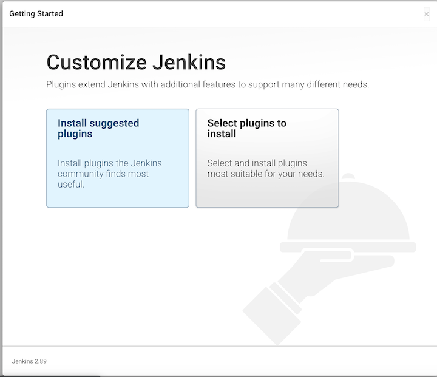

## 使 Jenkins 暴露 metrics api

安装 Metrics 插件，在系统配置中，会多出“Metrics”的配置，如下图：

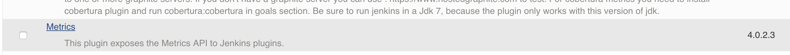

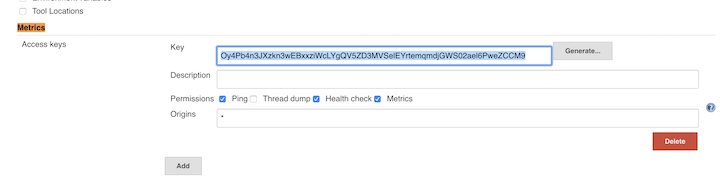


`Oy4Pb4n3JXzkn3wEBxxziWcLYgQV5ZD3MVSelEYrtemqmdjGWS02ael6PweZCCM9`


配置项不复杂。我们需要点击“Generate...”生成一个 Access Key（生成后，记得要保存）。这个 Key 用于身份校验，后面我们会用到。

保存后，我们在浏览器中输入URL：`http://url:8080/metrics/<刚生成的 Access Key>` 验证 Jenkins 是否已经暴露 metrics。如果看到如下图，就说明可以进行下一步了。

```
http://192.168.33.13:8080/metrics/Oy4Pb4n3JXzkn3wEBxxziWcLYgQV5ZD3MVSelEYrtemqmdjGWS02ael6PweZCCM9/
```

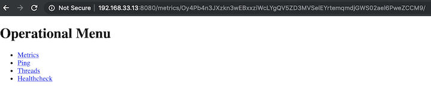

### 1 Metrics 插件介绍

Metrics 插件是基于 dropwizard/metrics 实现。它通过4个接口暴露指标数据：`/metrics`，`/ping`，`/threads`，`/healthcheck`。

### 2 Metrics 插件：/metrics 接口介绍

点击上图中的metric链接（`http://localhost:8080/metrics/<Access Key>/metrics`），它暴露了以下指标数据：

```
$ http://192.168.33.13:8080/metrics/Oy4Pb4n3JXzkn3wEBxxziWcLYgQV5ZD3MVSelEYrtemqmdjGWS02ael6PweZCCM9/metrics?pretty=true
```

```
{
  "version" : "4.0.0",
  "gauges" : {
    "jenkins.executor.count.value" : {
      "value" : 2
    },
    "jenkins.executor.free.value" : {
      "value" : 2
    },
    "jenkins.executor.in-use.value" : {
      "value" : 0
    },
    "jenkins.health-check.count" : {
      "value" : 4
    },
    "jenkins.health-check.inverse-score" : {
      "value" : 0.25
    },
    "jenkins.health-check.score" : {
      "value" : 0.75
    },
    "jenkins.job.averageDepth" : {
      "value" : 0.0
    },
```

从数据结构中可以看出它将指标分成 5 种数据类型：

* **Gauges**：某项指标的瞬时值，例如：当前 `Jenkins executor` 的总个数（`jenkins.executor.count.value`）
* **Counters**：某项指标的总数值，例如：`http` 请求活动连接数（`http.activeRequests`）
* **Meters**：一段时间内，某事件的发生概率，例如：Jenkins成功执行的任务每分钟的执行次数（`jenkins.runs.success.m1_rate`）
* **Histogram**：统计指标的分布情况。例如：`Jenkins executor` 数量的分布（`jenkins.executor.count.history`）
* **Timer**：某项指标的持续时间。例如：Jenkins 任务等待时间（`jenkins.job.waiting.duration`）

由于指标非常之多，我们就不分别介绍了。具体有哪些指标，读者朋友可以从代码仓库中的 `metrics.json` 文件了解。

### 3 Metrics 插件其它接口介绍

* /ping：接口返回 `pong` 代表 Jenkins 存活，如下图：

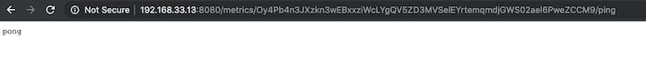

* /threads：返回 Jenkins 的线程信息

* /healthcheck：返回以下指标：

```
{
  "disk-space" : {
    "healthy" : true
  },
  "plugins" : {
    "healthy" : false,
    "message" : "There are 22 failed plugins: pipeline-model-api; pipeline-model-extensions; workflow-cps-global-lib; display-url-api; mailer; branch-api; workflow-multibranch; workflow-basic-steps; docker-workflow; pipeline-stage-tags-metadata; pipeline-model-declarative-agent; pipeline-model-definition; workflow-aggregator; git; github; github-branch-source; pipeline-github-lib; git; ssh-slaves; ldap; email-ext; mailer"
  },
  "temporary-space" : {
    "healthy" : true
  },
  "thread-deadlock" : {
    "healthy" : true
  }
}
```

## 配置 Zabbix server 与 agent 实现监控及告警


**Zabbix server 通过与 Zabbix agent 进行通信实现数据的采集**。而 `Zabbix agent` 又分为被动和主动两种模式。

### 我们使用的是被动模式，也就是`Zabbix server` 向 `agent` 索要数据。

**所以，我们需要在 `Zabbix agent` 所在机器放一个获取 `Jenkins` 指标数据的脚本。再配置 `Zabbix server` 定时从该 `agent` 获取数据，最后配置触发器（trigger）实现告警。**

接下来的关于 Zabbix 的配置，基于我的 jenkins-zabbix 实验环境.

### 1 配置 Zabbix server 如何从 agent 获取指标数据

首先，我们需要告诉 `Zabbix server` 要与哪些 `Zabbix agent` 通信。所以，第一步是创建主机，如下图：

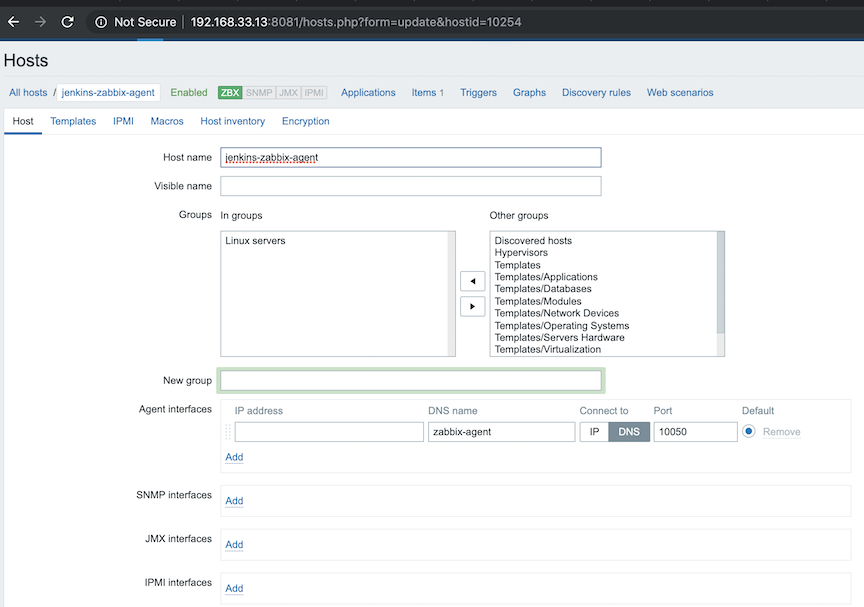

* Host name: jenkins-zabbix-agent
* Visible name: jenkins-zabbix-agent
* Agent interfaces: zabbix-agent   DNS  10050

### 第二步，在主机列表中点击“Iterms”进行该主机的监控项设置：

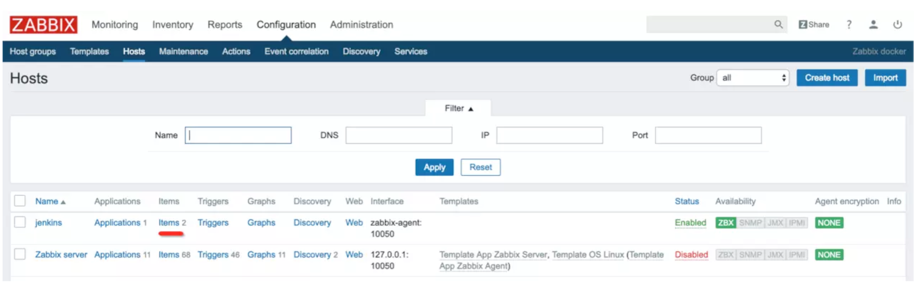

### 第三步，进入创建监控项页面：

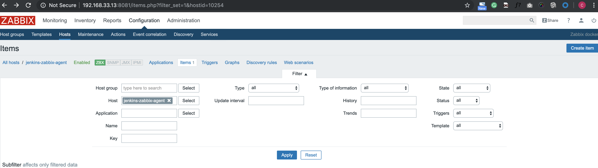

### 第四步，创建监控项：

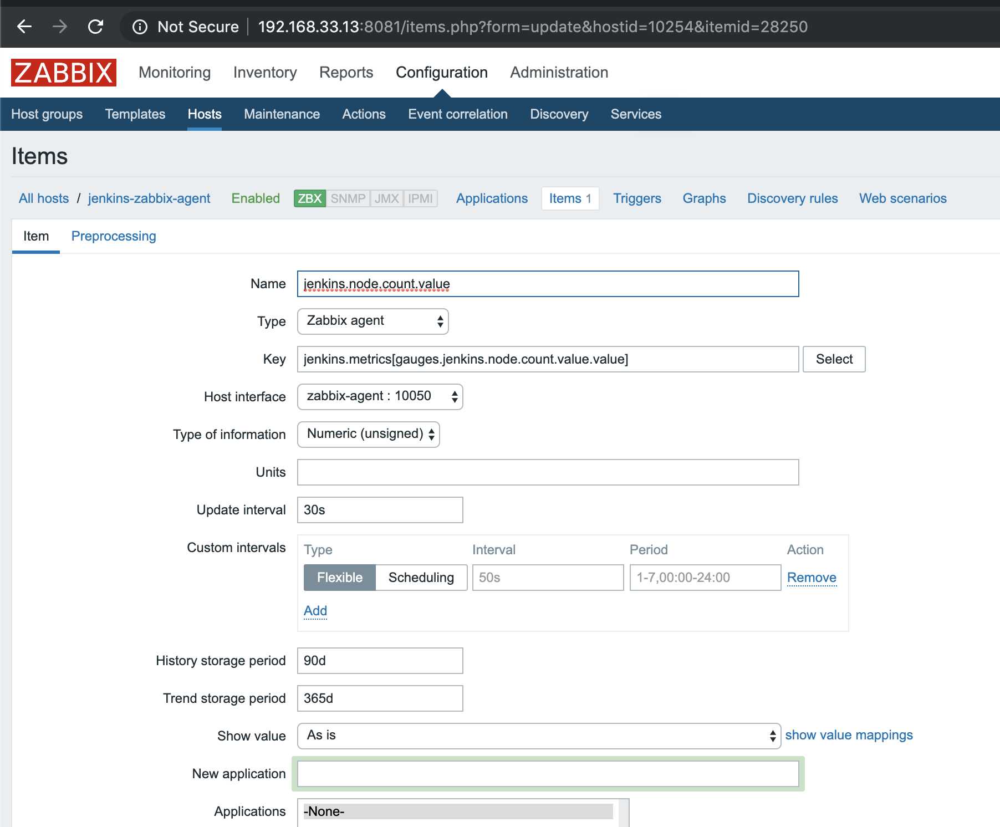

* `jenkins.node.count.value`
* `jenkins.metrics[gauges.jenkins.node.count.value.value]`

这里需要解释其中几个选项为什么要那样填：

* **Type**：是 `Zabbix server` 采集指标的类型，我们选择的是 `Zabbix agent`，如上文所说。
* **Key**：由于我们要监控的指标并不是 Zabbix 预定义的。所以，需要使用用户自定义参数来实现监控 Jenkins 指标。Key 填的值为：`jenkins.metrics[gauges.jenkins.node.count.value.value]`。`jenkins.metrics`是需要执行的真正的 `Key` 名称。而 `[]` 内是传给该 `Key` 对应的命令的参数。对于初学者，`Zabbix` 这部分概念非常不好理解。也许这样会更好理解：在使用用户自定义参数来实现监控的情况下，`Zabbix server` 会将这个 Key 发送给 agent，然后 agent 根据这个 Key 执行指定的 逻辑 以获取指标数据。这个 **逻辑** 通常是一段脚本（shell命令或Python脚本等）。而脚本也是可以传参的，`[]`中的值就是传给脚本的参数。具体更多细节，下文会继续介绍。
* **Type of information**：监控数据的数据类型，由于我们监控的是 `Jenkins node` 节点的个数，所以，使用数字整型。
* **Update interval**：指 `Zabbix server` 多长时间向 `agent` 获取一次数据，为方便实验，我们设置为 `2s`。

到此，Zabbix server 端已经配置完成。

### 2 配置 Zabbix agent 使其有能力从 Jenkins 获取指标数据

当 Zabbix agent 接收到 server 端的请求，如 `jenkins.metrics[gauges.jenkins.node.count.value.value]` 。`Zabbix agent` 会读取自己的配置（agent 启动时会配置），配置内容如下：

```
## Zabbix Agent Configuration File for Jenkins Master
UserParameter=jenkins.metrics[*], python /usr/lib/zabbix/externalscripts/jenkins.metrics.py $1
```

* 根据 Key 名称（`jenkins.metrics`）找到相应的命令，即：`python /usr/lib/zabbix/externalscripts/jenkins.metrics.py $1`。
* 并执行它，同时将参数 `gauges.jenkins.node.count.value.value` 传入到脚本 `jenkins.metrics.py` 中。
* `jenkins.metrics.py` 需要我们在 `Jenkins agent` 启动前放到 `/usr/lib/zabbix/externalscripts/` 目录下。

`jenkins.metrics.py` 的源码在 `jenkins-zabbix` 实验环境中可以找到，篇幅有限，这里就简单介绍一下其中的逻辑。


* `jenkins.metrics.py` 所做的事情，无非就是从 `Jenkins master` 的` metrics api` 获取指标数据。
* 但是由于 `api` 返回的是 `JSON` 结构，并不是 `Zabbix server` 所需要的格式。所以，`jenkins.metrics.py` 还做了一件事情，就是将 `JSON `数据进行扁平化，比如原来的数据为`：{"gauges":{"jenkins.node.count.value": { "value": 1 }}} `扁平化后变成： `gauges.jenkins.node.count.value.value=1`。


如果 jenkins.metrics.py 脚本没有接收参数的执行，它将一次性返回所有的指标如：

```
......
histograms.vm.memory.pools.Metaspace.used.window.15m.stddev=0.0
histograms.vm.file.descriptor.ratio.x100.window.5m.p75=0.0
histograms.vm.memory.pools.PS-Old-Gen.used.window.5m.count=4165
gauges.vm.runnable.count.value=10
timers.jenkins.task.waiting.duration.mean=0.0
histograms.vm.memory.non-heap.committed.history.p99=123797504.0
gauges.vm.memory.pools.PS-Eden-Space.used.value=19010928
gauges.jenkins.node.count.value.value=1
histograms.vm.memory.pools.Code-Cache.used.window.15m.mean=44375961.6
......
```

**但是，如果接收到具体参数，如 `gauges.jenkins.node.count.value.value` ，脚本只返回该参数的值。本例中，它将只返回 `1`。**

`jenkins.metrics.py` 脚本之所以对 `JSON` 数据进行扁平化，是因为 `Zabbix server` 一次只拿一个指标的值

**如果 Key 值设置为：`jenkins.metrics`，`Zabbix server` 不会拿 `jenkins.metrics.py` 返回的所有的指标值自动创建对应的监控项。所以，`Key` 值必须设置为类似于 `jenkins.metrics[gauges.jenkins.node.count.value.value]` 这样的值。**

#### For example inside the docker container


```
$ docker exec -it e2bb3f8f2529 /bin/bash

# python /usr/lib/zabbix/externalscripts/jenkins.metrics.py $1 | grep gauges.jenkins.node.count.value.value
gauges.jenkins.node.count.value.value=1
```

## 3. 配置 Zabbix server 监控指标，并告警

如果 Zabbix server 采集到数据，可通过_`Monitoring -> Latest data -> Graph_菜单`（如下图），看到图形化的报表：

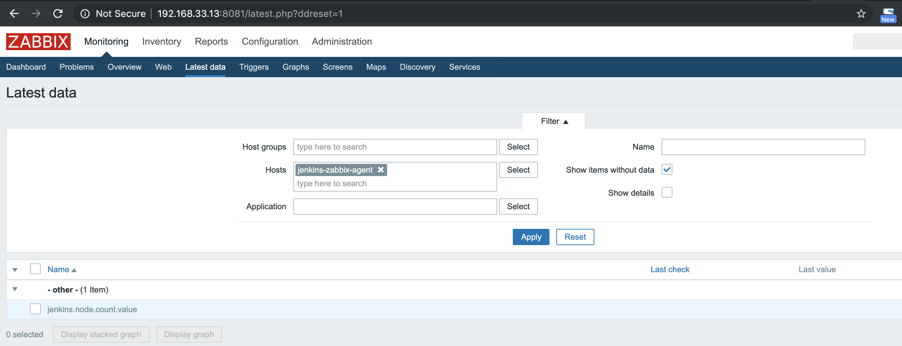

图形化的报表：

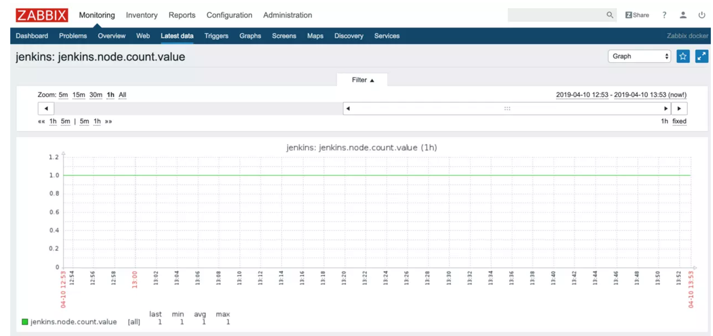

有了指标数据就可以根据它进行告警了。告警在 Zabbix 中称为触发器（trigger）。如下图，我们创建了一个当 `Jenkins node` 小于 `2` 时，就触发告警的触发器：

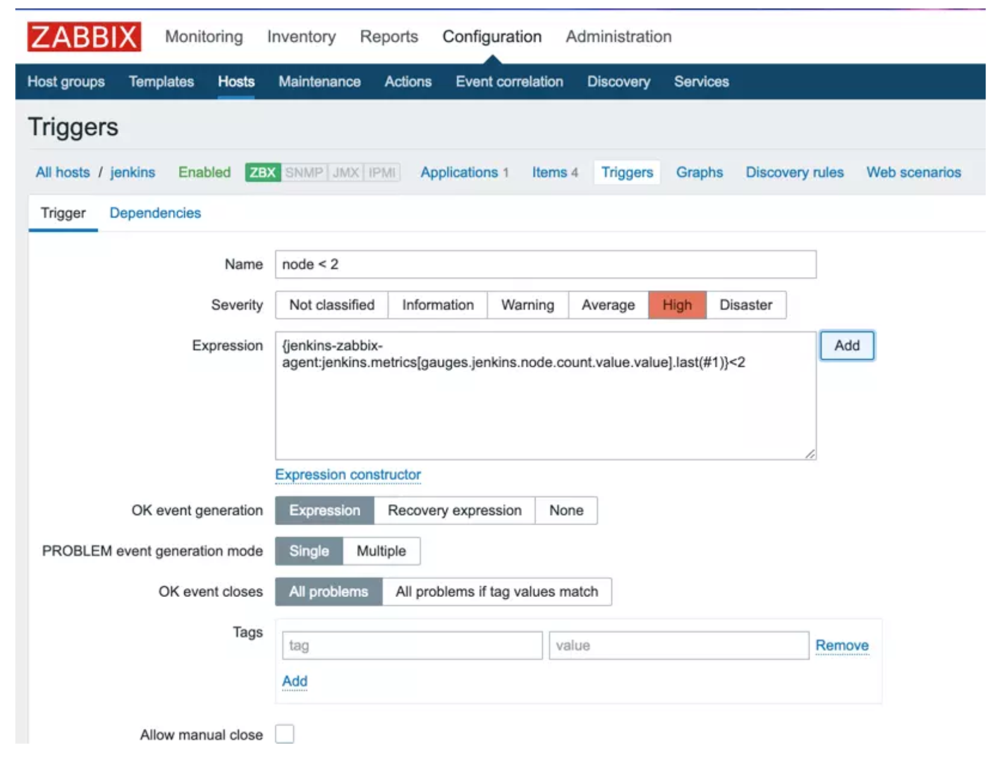

至于最终触发器的后续行为是发邮件，还是发短信，属于细节部分，读者朋友可根据自己的情况进行设置。

## 小结

在理解了 `Zabbix server` 与 `agent` 之间的通信原理的前提下，使用 `Zabbix` 监控 `Jenkins `是不难的。笔者认为难点在于自动化整个过程。上文中，我们创建主机和添加监控项的过程，是手工操作的。虽然 Zabbix 能通过自动发现主机，自动关联模板来自动化上述过程，**但是创建”自动化发现主机“和”自动关联动作“依然是手工操作。这不符合”自动化一切“的”追求“。**

最后，如果读者朋友不是历史包袱原因而选择 Zabbix，笔者在这里推荐 Prometheus，


