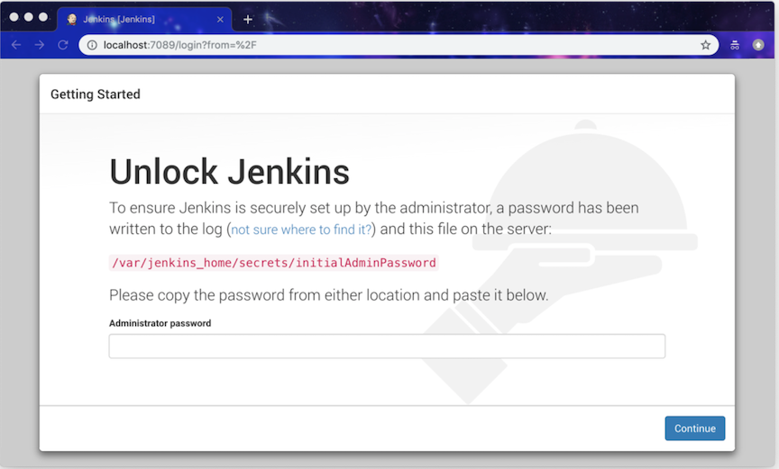
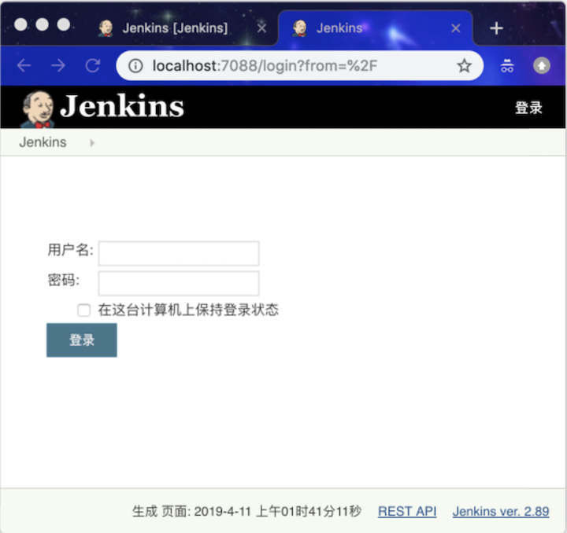
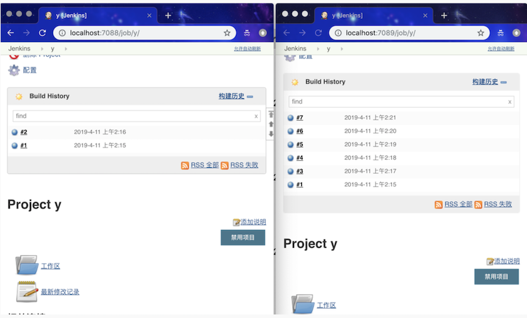
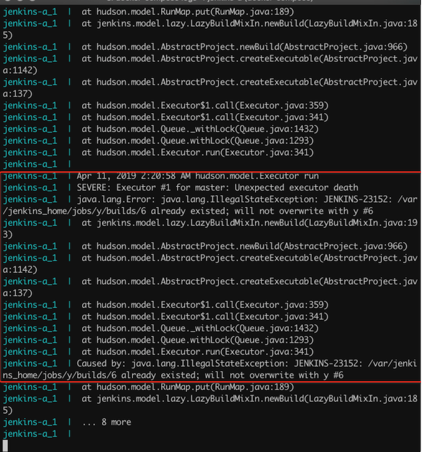

# 关于 Jenkins master 共享 JENKINS_HOME 目录的实验

`Jenkins maste`r 的高可用是个老大难的问题。和很多人一样，**笔者也想过两个 `Jenkins master` 共享同一个 `JENKINS_HOME` 的方案**。了解 Jenkins 原理的人，都会觉得这个方案不可行。但是真的不可行吗？

### JENKINS_HOME 介绍

Jenkins 所有状态数据都存放文件系统的目录中，这个目录被称为 `JENKINS_HOME` 目录。

## 实验环境介绍

笔者通过 `Docker compose` 启动两个独立的 `Jenkins master`，分别为 `jenkins-a` 和 `jenkins-b`。它们共用同一个 `JENKINS_HOME` 目录。

**docker-compose.yml**

```
version: '3.3'
services:
  jenkins-a:
    image: jenkins/jenkins:2.89
    ports:
      - "7088:8080"
      - "50001:50000"
    volumes:
      - ~/jenkins-standby:/var/jenkins_home
    restart: always
  jenkins-b:
    image: jenkins/jenkins:2.89
    ports:
      - "7089:8080"
      - "50002:50000"
    volumes:
      - ~/jenkins-standby:/var/jenkins_home
    restart: always
volumes:
    db_data: {}
```


将代码克隆到本地后，进入仓库，执行 `docker-compose up -d` 即可启动实验环境。启动完成，在浏览器中输入 `http://localhost:7088` 可访问 `jenkins-a`，`jenkins-b` 的地址是 `http://localhost:7089` 。但是你会发现它们启动后的界面显示是不一样的。

jenkins-b 的界面如下图所示：




而 jenkins-a 的界面如下图所示：



这时，将 `jenkins-a` 日志中的解锁密码（Unlock password）输入到 `jenkins-b` 的页面中，会得到报错信息：

```
ERROR: The password entered is incorrect, please check the file for the correct password
```

**这时，再次 `jenkins-b` 日志中的解锁密码`（Unlock password）`输入到表单中即可进入下一步。**

接下来就是按照提示一步步完成了。在 `jenkins-b` 安装步骤的最后一步，我们设置了管理员的用户名密码：`admin/admin`。然后就算完成任务了。

然后我们再在 `jenkins-a` 使用 `dmin/admin` 进行登录，登录是报错的：用户密码不正确。


**接下来，执行 `docker-compose restart jenkins-a` 命令重启 `jenkins-a`。再次使用 `admin/admin` 就可以登录成功了。**

当两个 Jenkins 启动完成后，接下来开始做实验。

### 实验1：创建任务

在 `jenkins-a` 创建任务 `x`，刷新 `jenkins-b` 的页面，`jenkins-b` 上会不会显示出任务 `x `？

**结果：`jenkins-b` 不会出现任务 `x`。重启 `jenkins-b` 后，任务 `x` 出现在任务列表中。**

### 实验2：任务结果可见性

`jenkins-a` 上任务执行，`jenkins-b` 上能否看到任务执行结果？

`jenkins-a` 执行任务 `x`，并且执行成功。刷新 `jenkins-b` 看不到任何执行记录。重启 `jenkins-b` 后，可看到执行记录。

### 实验3：两 master 同时执行同一任务

分别在两个 `Jenkins master `上（几乎）开始同一个任务 `x`。其中一个任务的 `build number` 会更新，但是另一个不会。

其中 `jenkins-a` 任务 `x` 的 `build number` 会升到 `2`，而 `jenkins-b` 保持的是 `1`。这时，单独执行 `jenkins-b` 的任务 x，日志会出现错误：

```
jenkins-b_1  | WARNING: A new build could not be created in job x
jenkins-b_1  | java.lang.IllegalStateException: JENKINS-23152: /var/jenkins_home/jobs/x/builds/2 already existed; will not overwrite with x #2
```

### 实验4：编辑任务

`jenkins-a` 上设置任务 x 定时执行，刷新 `jenkins-b` 页面，任务 x 中并没有定时执行的设置。重启 `jenkins-b` 后，任务 x 更新。

### 实验5：定时任务的结果是什么？

如果 `jenkins-a` 和 `jenkins-b` 两个任务均为定时任务，而且都生效了。它们运行结果是什么的呢？

看到的现象是，两个任务都会按时执行，但是只有一个任务能将运行结果写入到磁盘中。界面如下图：



**另，从日志中，可以确认 jenkins-a 和 jenkins-b 确实按时执行了。如下图日志中，看出 jenkins-a 定时执行 #6 次构建时报错，因为 jenkins-b 已经执行过 #6 次构建了：**



## 小结

可以确认的是，当两个 `Jenkins` 进程共用同一个 `JENKINS_HOME` 目录时，其中一个 `Jenkins` 进程更新了 `JENKINS_HOME` 的内容，另一个是不会实时更新的。

**所以，同时启动两个 `Jenkins master` 共用同一个 `JENKINS_HOME` 的方案是不可行的。我们不能在 `jenkins-a` 挂了后，直接将流量切到 `jenkins-b`。因为 `jenkins-b` 必须重启。**


