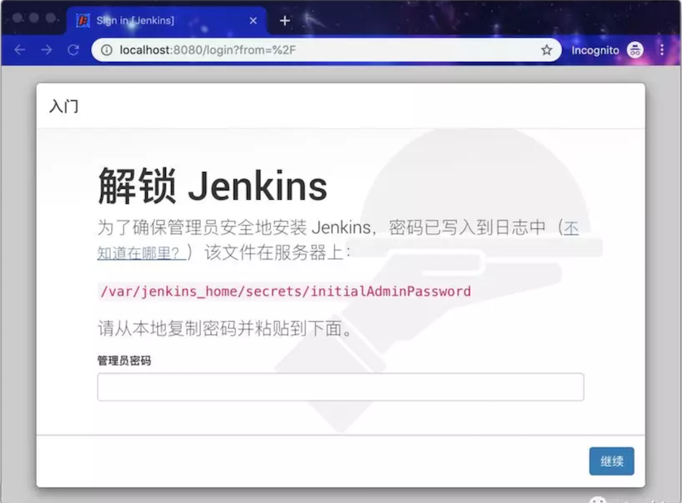
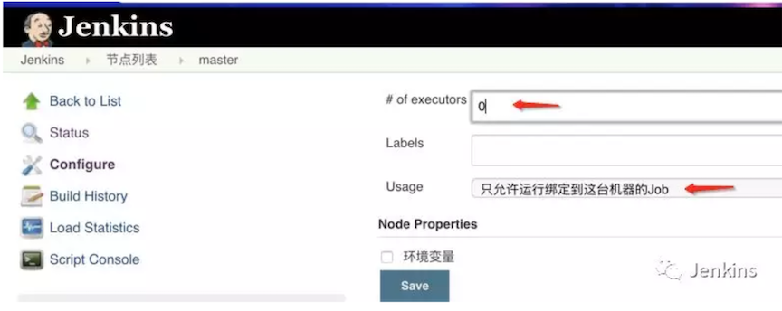
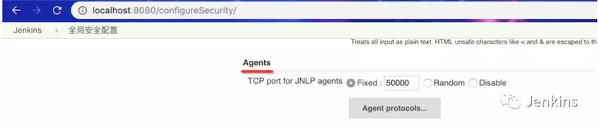
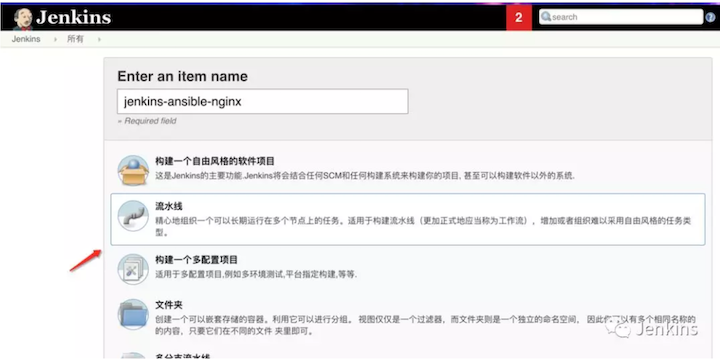
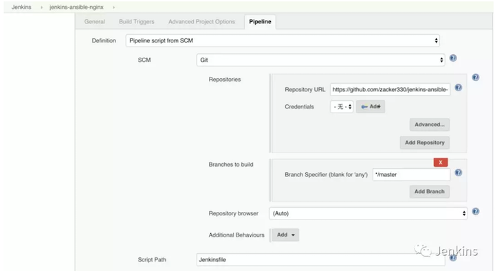
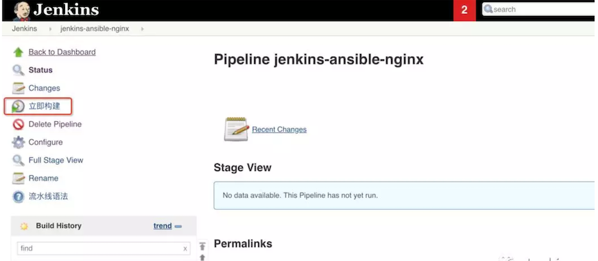
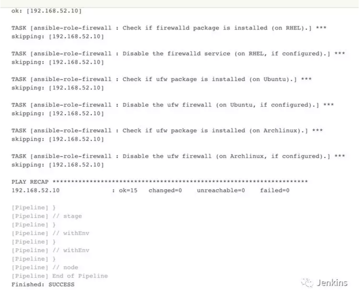
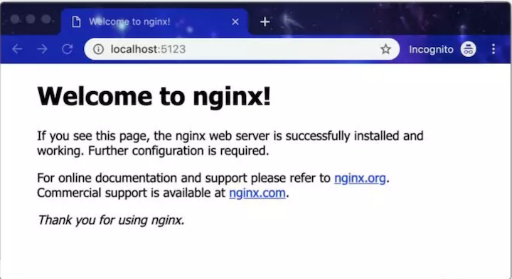

# 使用 Jenkins + Ansible 实现自动化部署 Nginx

本文介绍如何使用 `Jenkins + Ansible` 实现对 `Nginx` 的自动化部署。最终达到的效果有如下几点：

* 只要你将 `Nginx` 的配置推送到 `GitHub` 中，`Jenkins` 就会自动执行部署，然后目标服务器的 `Nginx` 配置自动生效。这个过程是幂等（`idempotent`）的，只要代码不变，执行多少遍，最终效果不变。
* 如果目标机器没有安装 `Nginx`，则会自动安装 `Nginx`。
* 自动设置服务器防火墙规则。

## 1. 实验环境介绍

本次实验使用 `Docker Compose` 搭建 `Jenkins` 及 `Jenkins agent`。使用 `Vagrant` 启动一台虚拟机，用于部署 `Nginx`。使用 `Vagrant` 是可选的，读者可以使用 `VirtualBox` 启动一个虚拟机。使用 `Vagrant` 完全是为了自动化搭建实验环境。

以下是整个实验环境的架构图


* `Vagrant`：虚拟机管理工具，通过它，我们可以使用文本来定义、管理虚拟机。
* `Ansible`：自动化运维工具
* `Docker Compose`：它是一个用于定义和运行多容器 Docker 应用程序的工具。可以使用 YAML 文件来配置应用程序的服务。


## 2. 启动实验环境

### 1.克隆代码并进入文件夹

```
$ git clone https://github.com/zacker330/jenkins-ansible-nginx.git
$ cd jenkins-ansible-nginx-master
$ pwd
/Users/jxi/Devops/jenkins_tutorial/jenkins-ansible-nginx-master
```

### 2.构建 Jenkins agent 的镜像 需要自定义 Jenkins agent 镜像有两个原因：

```
docker build -f JenkinsSlaveAnsibleDockerfile -t jenkins-swarm-ansible .
```

* 本次实验，使用 Swarm 插件实现 `Jenkins master` 与 `agent` 之间的通信，所以 `Jenkins agent` 需要启动 `swarm` 客户端。
* `Jenkins agent` 必须支持 `Ansible`。

### 3.启动 `Jenkins master` 及 `Jenkins agent`

```
docker-compose up -d
```

通过 `http://localhost:8080` 访问 `Jenkins master`，如果出现“解锁密码”页面，如下图，则执行命令 `docker-compose logs jenkins` 查看 `Jenkins master` 启动日志。

将日志中的解锁密码输入到表单中。然后就一步步按提示安装即可。



### 4.安装 Jenkins 插件 本次实验需要安装以下插件：


* **Pipeline 2.6**：`https://plugins.jenkins.io/workflow-aggregator`
* **Swarm 3.15**：`https://plugins.jenkins.io/swarm` **用于 实现 Jenkins master 与 Jenkins agent 自动连接
* **Git 3.9.3**：`https://plugins.jenkins.io/git`

### 5.配置 Jenkins master 不执行任务 进入页面：`http://localhost:8080/computer/(master)/configure`，如下图所示设置：



### 6.确认 Jenkins 安全配置有打开端口，以供 `Jenkins agent` 连接。

**我们设置 `Jenkins master` 开放的端口，端口可以是固定的 `50000` ，也可以设置为随机。设置链接：`http://localhost:8080/configureSecurity/`。**




### 7. 启动目标机器，用于部署 Nginx 在命令行中执行以下命令：

```
$ vagrant up
```

注意，`Vagrantfile` 文件中的 `config.vm.box` 值必须改成你的 `vagrant box` 。

**Vagrantfile**

```
# -*- mode: ruby -*-
# vi: set ft=ruby :
Vagrant.configure("2") do |config|

  machine_box = "CentOS-7.1.1503-x86_64-netboot"

  config.vm.define "nginx" do |machine|
    machine.vm.box = machine_box
    machine.vm.network "private_network", ip: "192.168.52.10"
    machine.vm.network "forwarded_port", guest: 80, host: 5123
    machine.vm.provider "virtualbox" do |node|
        node.name = "nginx"
        node.memory = 1024
        node.cpus = 2
    end
   end


end
```

至此，实验环境已经搭建好了。接下来就可以新建 Jenkins 任务了。

## 3. 在 Jenkins 上创建部署任务

### 1. 新建流水线任务 



### 2.配置流水线 配置 `Jenkins` 任务从远程仓库拉取 `Jenkinsfile`，如下图所示：



除此之外，不需要其它配置了，是不是很简单？

## 4. 手工触发一次自动化构建

点击“立即构建”：



最终执行日志如下：



至此，部署已经完成。以后修改 Nginx 的配置，只需要修改代码，然后推送到远程仓库，就会自动化部署。不需要手工登录到目标机器手工修改了。

最后，我们可以通过访问 `http://localhost:5123`，如果出现如下页面说明部署成功：




## 5. 代码讲解

以上步骤并不能看出自动化部署真正做了什么。那是因为我们所有的逻辑都写在代码中。是的，可以说是 **everything is code**。

接下来我们介绍代码仓库。

```
$ tree -L 2 jenkins-ansible-nginx-master
├── JenkinsSlaveAnsibleDockerfile # Jenkins agent 镜像 Dockerfile
├── Jenkinsfile  # 流水线逻辑
├── README.md
├── Vagrantfile # Vagrant 虚拟机定义文件
├── docker-compose.yml # Jenkins 实现环境
├── env-conf # 所有应用配置
│   └── dev   # dev 环境的配置
├── deploy  # Ansible 部署脚本所在文件夹
│   ├── playbook.yaml
│   └── roles
└── swarm-client.sh # Jenkins swarm 插件的客户端
```


### 5.1流水线逻辑

Jenkinsfile 文件用于描述整条流水线的逻辑。代码如下：

```
pipeline{
  // 任务执行在具有 ansible 标签的 agent 上
  agent { label "ansible"}
  environment{
     // 设置 Ansible 不检查 HOST_KEY
    ANSIBLE_HOST_KEY_CHECKING = false
  }
  triggers {
     pollSCM('H/1 * * * *')
  }
  stages{
    stage("deploy nginx"){
      steps{
        sh "ansible-playbook -i env-conf/dev  deploy/playbook.yaml"
      }
}}}
```

* `environment` 部分：用于定义流水线执行过程中的环境变量。
* `triggers` 部分：用于定义流水线的触发机制。`pollSCM` 定义了每分钟判断一次代码是否有变化，如果有变化则自动执行流水线。
* `agent` 部分：用于定义整条流水线的执行环境。
* `stages` 部分：流水线的所有阶段，都被定义在这部分。

以上只是定义流水线是如何执行的，目前整条流水线只有一个 `deploy nginx` 阶段，并且只执行了一条 `ansible-playbook `命令。但是它并没有告诉我们部署逻辑是怎么样的。


### 5.2 部署逻辑


所有的部署逻辑，包括 Nginx 的安装启动、配置的更新以及加载，都放在 `Ansible` 脚本中。对 `Ansible` 不熟的同学，可以在本文末尾找到介绍 `Ansible` 的文章。

```
---
- hosts: "nginx"
  become: true
  roles:
    # Nginx 的部署
    - ansible-role-nginx
    # 对防火墙的设置
    - ansible-role-firewall
```

* `hosts`：定义了 `playbook` 部署的目标主机分组名为 `nginx`。
* `roles`：包含了两个执行具体部署动作的 `role`，至于 `role` 内部逻辑，不在本文讨论范围，有兴趣的同学阅读源码。

### 5.3 配置管理

谈到部署，就不得不谈配置管理。

回顾前文中流水线中执行的 `shell` 命令：

```
ansible-playbook -i env-conf/dev deploy/playbook.yaml 
```

**我们通过 `-i` 参数指定部署时所使用的环境配置。**

通过这种方式实现环境配置与执行脚本的分离。这样带来以下几个好处：

1. **新增环境时，只需要复制现有的环境，然后将里面的变量的值改成新环境的即可。** 比如，要对测试环境进行部署，只需要将 `-i` 参数值改成：`env-conf/test`。
2. 对配置版本化控制。

本次实验中，各个环境的配置放在 `env-conf` 目录中，目前只有 `dev` 环境，以下是 `env-conf/` 目录结构：

```
% cd env-conf/
% tree
└── dev
    ├── group_vars
    │   └── nginx.yaml
    ├── host_vars
    │   └── 192.168.52.10
    └── hosts
```

* **hosts文件**：Ansible 中通过“分组”来实现对主机的管理。hosts 文件内容如下：

```
$ cat dev/hosts
[nginx]
192.168.52.10
```

```
$ cat dev/group_vars/nginx.yaml
firewall_allowed_tcp_ports:
  - "22"
  - "25"
  - "80"
  - "443"
```

```
$ cat dev/host_vars/192.168.52.10
---
ansible_ssh_user: vagrant
ansible_ssh_pass: vagrant

```

* `host_vars` 目录：用于存放主机级别的配置变量，本例中 `192.168.52.10` 是一个 `YAML` 格式文件。注意文件名是该主机的 `IP`。我们在文件中放主机相关的配置，比如 `Ansible` 连接主机时使用到的用户名和密码。
* `group_vars` 目录：用于存放组级别的配置变量。比如 `nginx.yaml` 对应的就是 `nginx` 这个组的的配置变量。文件名与 `hosts` 中的组名对应。

## 总结

到此，我们完整的自动化部署已经讲解完成。但是还遗留下一些问题：

* 本文只是安装了一个“空”的 Nginx，但是没有介绍 `Nginx` 真正配置。
* 目前主机的连接信息（SSH 密码）是明文写在 `host_vars/192.168.52.10` 文件中的，存在安全风险。
* 没有介绍如何当 `Java` 应用部署时，如何自动更新 Nginx 的配置。