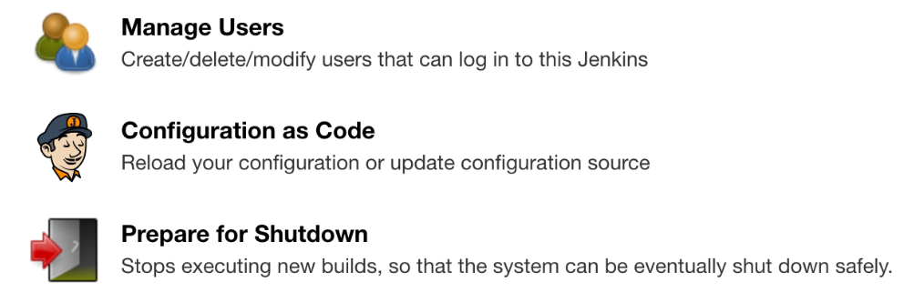
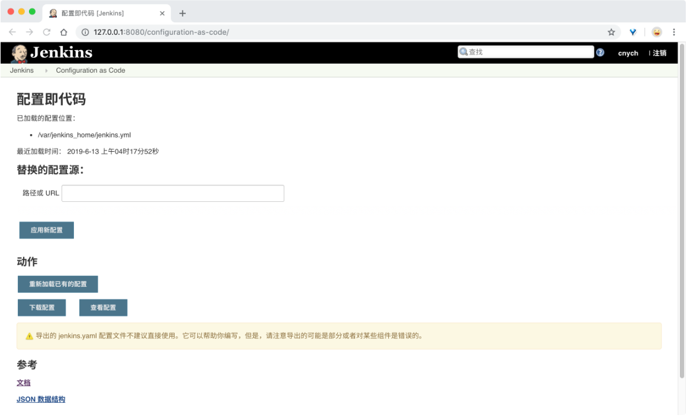
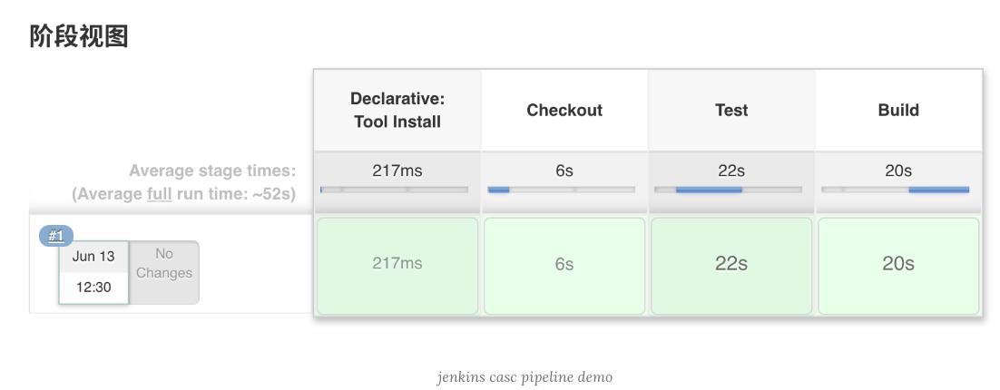

# 使用 Configuration-As-Code 运行 Jenkins

**今天了解到一个名为 `Configuration as Code (JcasC)`  的插件可以来创建`Jenkins`，这个插件允许你用 `YAML` 文件来定义 `Jenkins` 配置。**

一般我们在使用 `Jenkins` 的时候多少知道我们需要哪些插件或者其他配置来配合我们的 CI/CD 工作，使用 `JcasC` 插件，我们就可以将这些信息配置在可读性更高的 `YAML` 文件中。

在本文中，我们会为大家演示如何使用`Configuration as Code`插件来创建 `Jenkins`，然后使用 `Git`、`Maven` 等工具来编写一个声明式的 `Pipeline` 去构建一个 `Java `应用，另外还会展示如何使用`Vault`来管理一些私密数据。

## 使用 Vault

`vault` 是一个**密码/证书**集中式管理工具，通过 `HTTP-API` 对外提供统一的密码访问入口，并且提供权限控制以及详细的日志审计功能。

一个系统可能需要访问多个带密码的后端：例如**数据库**、通过 **API keys** 对外部系统进行调用，面向服务的架构通信等等。

要将众多系统中的用户和权限对应起来已经非常困难，加上提供密钥滚动功能、安全的存储后端还要有详细的审计日志，自定义解决方案几乎不太可能。这也就是 `vault` 存在的意义。

为了方便我们直接本地使用 Docker 镜像来运行：

```
$ docker run -d --name=vault --cap-add=IPC_LOCK -p 8200:8200 vault:1.1.3
455ee5ef4e49ffd70f0ca7dd8d7d8ebde5442552fa04871c1ef7914942a8ddb5
```
```
$ docker ps
CONTAINER ID        IMAGE               COMMAND                  CREATED             STATUS              PORTS                    NAMES
455ee5ef4e49        vault:1.1.3         "docker-entrypoint.s…"   4 seconds ago       Up 3 seconds        0.0.0.0:8200->8200/tcp   vault
```

我们这里使用的是最新版的 `vault`，需要我们使用 `KV（Key-Value Secrets Engine）HTTP API V2 `版本来访问数据，因为新版本的`Configuration as Code`插件使用的就在 `V2` 版本，运行容器后，我们可以从控制台日志中获取到用于对 `Vault` 进行身份验证的令牌：

```
$ docker logs -f vault
==> Vault server configuration:

             Api Address: http://0.0.0.0:8200
                     Cgo: disabled
         Cluster Address: https://0.0.0.0:8201
              Listener 1: tcp (addr: "0.0.0.0:8200", cluster address: "0.0.0.0:8201", max_request_duration: "1m30s", max_request_size: "33554432", tls: "disabled")
               Log Level: info
                   Mlock: supported: true, enabled: false
                 Storage: inmem
                 Version: Vault v1.1.3
             Version Sha: 9bc820f700f83a7c4bcab54c5323735a581b34eb

WARNING! dev mode is enabled! In this mode, Vault runs entirely in-memory
and starts unsealed with a single unseal key. The root token is already
authenticated to the CLI, so you can immediately begin using Vault.

You may need to set the following environment variable:

    $ export VAULT_ADDR='http://0.0.0.0:8200'

The unseal key and root token are displayed below in case you want to
seal/unseal the Vault or re-authenticate.

Unseal Key: TBYsfwYBebo9I7LTCIuFAeRlsxAYkllgo3hujUxDSLw=
Root Token: s.kids7FUfsqg7LEPisx9ecTPG

Development mode should NOT be used in production installations!

==> Vault server started! Log data will stream in below:

2019-06-13T08:07:20.840Z [WARN]  no `api_addr` value specified in config or in VAULT_API_ADDR; falling back to detection if possible, but this value should be manually set
...
2019-06-13T08:07:20.902Z [INFO]  secrets.kv.kv_9cc515e0: done collecting keys: num_keys=1
2019-06-13T08:07:20.902Z [INFO]  secrets.kv.kv_9cc515e0: upgrading keys finished
```

### 记住上面`Root Token`的值，

* 我们可以通过该 `Token` 来添加访问 `Jenkins Dashboard` 和 `Github` 的用户名和密码信息，
* 我们可以设置 `Jenkins` 账户通过`rootPassword`来获取密码，`Github` 账户通过`githubPassword`来获取密码，我们需要进入到 `vault` 的容器中去进行操作

```
$ docker exec -it vault /bin/sh
```

```
$ vault kv put secret/jenkins rootPassword=<替换成你的jenkins访问密码> githubPassword=<替换成你的github用户密码>
Get https://127.0.0.1:8200/v1/sys/internal/ui/mounts/secret/jenkins: http: server gave HTTP response to HTTPS client

$ export VAULT_ADDR='http://0.0.0.0:8200'


# 下面的TOKEN也需要导入，否则执行下面的命令会出现missing client token的错误
$ export VAULT_TOKEN=s.kids7FUfsqg7LEPisx9ecTPG
$ vault kv put secret/jenkins rootPassword=<替换成你的jenkins访问密码> githubPassword=<替换成你的github用户密码>
Key              Value
---              -----
created_time     2019-06-13T03:04:04.9804179Z
deletion_time    n/a
destroyed        false
version          1


# 通过命令`vault kv get secret/jenkins`验证信息是否创建
$ vault kv get secret/jenkins
====== Metadata ======
Key              Value
---              -----
created_time     2019-06-13T03:04:04.9804179Z
deletion_time    n/a
destroyed        false
version          1

========= Data =========
Key               Value
---               -----
githubPassword    <xxxxxx>
rootPassword      <xxxxxx>
```


## 配置信息

`JcasC` 插件提供了许多配置设置，允许我们配置`Jenkins`的各种组件，我们这里主要来配置构建示例 Java 应用程序的基本配置，`Jcasc`插件官网文档：[https://github.com/jenkinsci/configuration-as-code-plugin](https://github.com/jenkinsci/configuration-as-code-plugin) 中也提供了很多其他配置的示例，有需要的可以前往查看。

我们这里需要的是在启动后配置一下 Jenkins 组件：

* 一组 `Jenkins` 插件，运行创建声明式 `Pipeline`，从 `Github` 仓库检出源代码，使用 `Maven` 进行构建
* 包含 `Jenkins` 用户的登录凭据，通过`Vault`服务器上面的`rootPassword`属性来读取用户密码
* `Maven` 工具的安装设置：默认情况下，`Jenkins` 中未安装 `Maven`，所以我们需要设置所需的版本和工具名称
* 用户访问包含应用程序源代码的 `Git` 仓库的凭据（如果是私有仓库的话）

最终的配置信息如下：

```
jenkins:
  agentProtocols:
  - "JNLP4-connect"
  - "Ping"
  authorizationStrategy:
    loggedInUsersCanDoAnything:
      allowAnonymousRead: false
  crumbIssuer:
    standard:
      excludeClientIPFromCrumb: false
  disableRememberMe: false
  mode: NORMAL
  numExecutors: 2
  primaryView:
    all:
      name: "all"
  quietPeriod: 5
  scmCheckoutRetryCount: 0
  securityRealm:
    local:
      allowsSignup: false
      enableCaptcha: false
      users:
      - id: "example"
        password: ${rootPassword}
  slaveAgentPort: 50000
  views:
  - all:
      name: "all"
tool:
  git:
    installations:
    - home: "git"
      name: "Default"
  jdk:
    installations:
    - home: "/docker-java-home"
      name: "jdk"
  maven:
    installations:
    - name: "maven"
      properties:
      - installSource:
          installers:
          - maven:
              id: "3.5.4"
credentials:
  system:
    domainCredentials:
      - domain :
          name: "github.com"
          description: "GitHub"
        credentials:
          - usernamePassword:
              scope: SYSTEM
              id: github-example
              username: example
```

## 构建 Jenkins 镜像

和 `Vault` 服务一样，我们也可以直接用 `Docker` 容器来运行 `Jenkins`，但是在官方镜像基础上我们需要添加一个配置，**比如添加`Configuration as Code`插件，该插件需要设置一个指向 `YAML`** 文件位置的环境变量，该变量可以指向一下内容：

* 包含一组配置文件的文件夹的路径
* 单个配置文件的完整路径
* 指向 `Web` 的一个配置文件 `URL`

然后我们设置 `Jenkins` 和 `Vault` 之间的通信，需要传递访问 `Vault` 的身份令牌、密钥的路径和 `Vault` 服务器地址，这些配置都可以通过环境变量进行设置，也可以放置在一个统一文件中通过环境变量**`CASC_VAULT_FILE`**来指向这个文件也可以，以下是定义的扩展 `Jenkins` 镜像的 `Dockerfile`，添加了使用 `JcasC` 插件运行的一些参数以及从 `Vault` 获取数据的信息：

```
FROM jenkins/jenkins:lts

ENV CASC_JENKINS_CONFIG="/var/jenkins_home/jenkins.yml"
ENV CASC_VAULT_FILE="/var/jenkins_home/vault.yml"

COPY jenkins.yml ${CASC_JENKINS_CONFIG}
COPY vault.yml ${CASC_VAULT_FILE}

USER jenkins

RUN /usr/local/bin/install-plugins.sh configuration-as-code configuration-as-code-support git workflow-cps-global-lib
```

其中`jenkins.yml`就是上面我们准备好的配置文件，`vault.yml`文件内容如下所示：

```
CASC_VAULT_TOKEN=s.kids7FUfsqg7LEPisx9ecTPG
CASC_VAULT_PATHS=secret/jenkins
CASC_VAULT_URL=http://192.168.31.9:8200
```

```
$ docker build -t example/jenkins-casc:1.0 .
```

构建完成后可以直接通过下面的命令运行该容器：

```
$ docker run -d --name jenkins -p 8080:8080 -p 50000:50000 cnych/jenkins-casc:1.0
```

运行成功后可以在本地通过 8080 端口去访问 Jenkins：

我们可以使用上面 `jenkins.yml` 配置文件中的用户信息进行登录，用户名为 `example`，密码为我们存入 `Vault` 中的`rootPassword`：


```
securityRealm:
    local:
      allowsSignup: false
      enableCaptcha: false
      users:
      - id: "example"
        password: ${rootPassword}
```

登录成功后可以进入`Manage Jenkins`页面，在最下方可以看到`Configuration as Code`的入口：



点击可以进入插件的配置页面：



## 运行测试 Pipeline

最后，您可以为示例应用程序创建和运行 Pipeline。下面是我这里的一个简单的 Pipeline 示例：

```
pipeline {
    agent any
    tools {
        maven 'maven'
    }
    stages {
        stage('Checkout') {
            steps {
                git url: 'https://github.com/example/jenkins-casc-example-service.git', credentialsId: 'github-cnych', branch: 'master'
            }
        }
        stage('Test') {
            steps {
                sh 'mvn clean test'
            }
        }
        stage('Build') {
            steps {
                sh 'mvn clean install'
            }
        }
    }
}
```


由于我们上面的配置信息中有 `maven` 这个工具的配置，所以我们在 `tools` 中声明`maven` 'maven'的时候会根据需求去下 `maven` 工具的：

```
Started by user example
Running in Durability level: MAX_SURVIVABILITY
[Pipeline] Start of Pipeline
[Pipeline] node
Running on Jenkins in /var/jenkins_home/workspace/test-jenkins-casc-pipeline
[Pipeline] {
[Pipeline] stage
[Pipeline] { (Declarative: Tool Install)
[Pipeline] tool
Unpacking https://repo.maven.apache.org/maven2/org/apache/maven/apache-maven/3.5.4/apache-maven-3.5.4-bin.zip to /var/jenkins_home/tools/
......
```

可以看到下载的是`3.5.4`版本，和上面的配置是一致的：

```
tool:
  maven:
    installations:
    - name: "maven"
      properties:
      - installSource:
          installers:
          - maven:
              id: "3.5.4"
```
 
 


