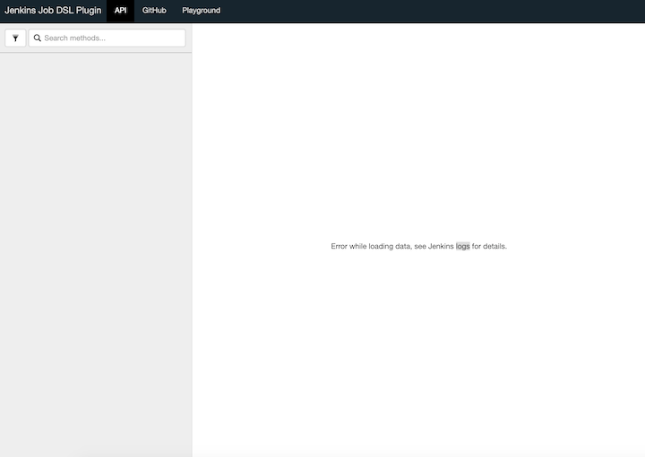
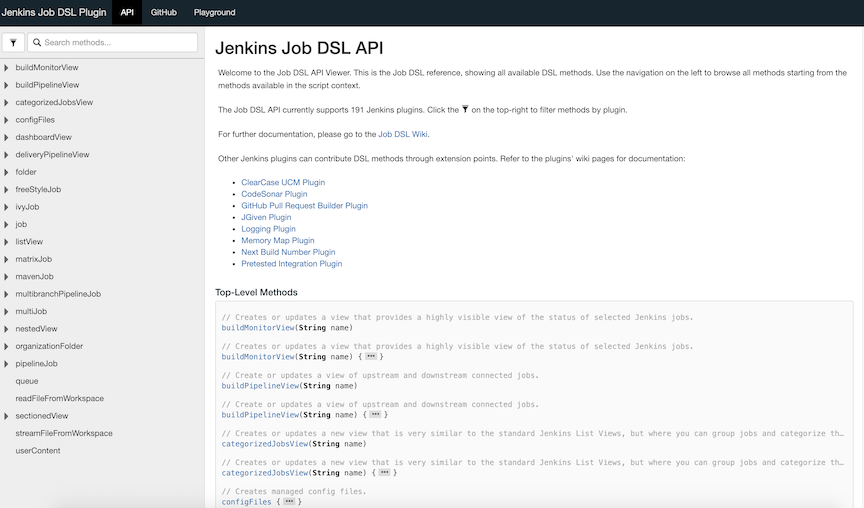

# How to check Jenkins DSL Viewer Page


## Input the url of Viewer Page

```
htpp://jenkins_url/plugin/job-dsl/api-viewer/index.html
```

**For example:**

```
http://192.168.33.12:8080/plugin/job-dsl/api-viewer/index.html
```

## The problems I encounter



### Solution 1

```
Caused by: java.lang.ClassNotFoundException: hudson.tools.JDKInstaller
	at jenkins.util.AntClassLoader.findClassInComponents(AntClassLoader.java:1374)
	at jenkins.util.AntClassLoader.findClass(AntClassLoader.java:1327)
	at jenkins.util.AntClassLoader.loadClass(AntClassLoader.java:1080)
	at java.lang.ClassLoader.loadClass(ClassLoader.java:357)
	... 118 more
```

#### install jdk-tool

**Add new plugin to plugins.txt**

```
jdk-tool:1.2
```

[plugins.txt](plugins.txt)


### Problem 2, the docker process keep exit

**The memory is not enough of the node (VM)**

**My case: change vm memory from 512m to 1g, now it works fine**



