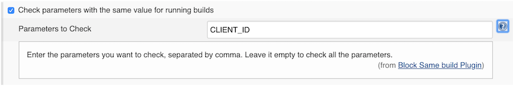
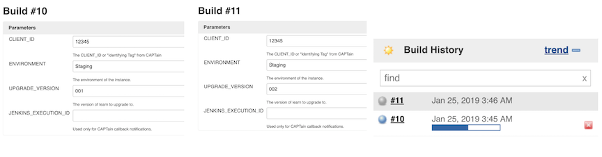
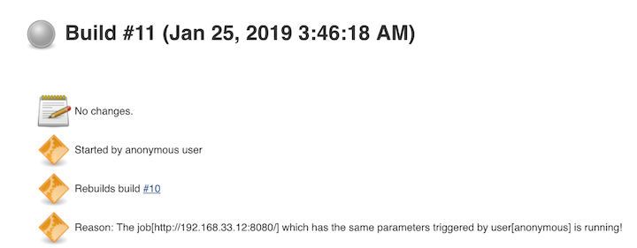
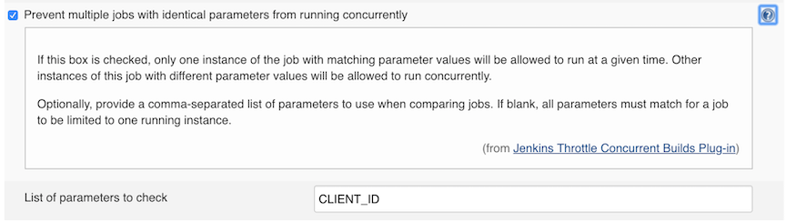
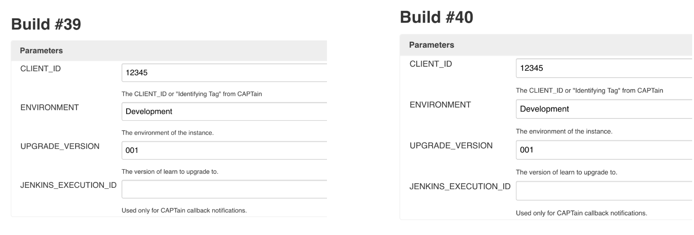
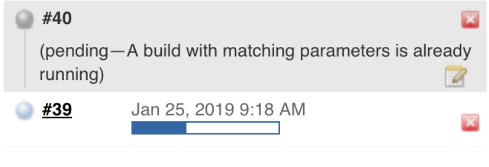
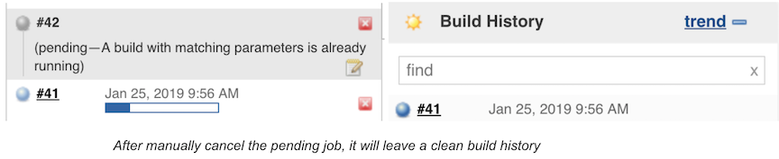

# Prevent Jenkins concurrent build job with same parameter

## Objective

Deploy-tool for Jenkins job should detect whether another job or build is already running with same input parameter `CLIENT_ID` (same site) and newly new created build should fail immediately. **This is to mitigate the risk of clicking the same retry button twice by accident**


## Proposal

Currently, there are couples of solutions to solve this solution. However, they all have both pros and cons, and the disadvantage part may cause unpredictable time and space complexity and uncertainty to the operator on existing Jenkins jobs. Therefore, My proposal incline to Jenkins official provided plugins to solve this problem, there are several advantages:

* The plugins work clearly, which can be applied to jobs immediately, also can help to reduce changes to our existing Jenkins jobs code 
* The plugins fit for different kinds of jobs and not limit to this situation
* The plugins can be used to the large batch of concurrently running jobs and will not increase pressure on servers significantly

Of course, there are programmable methods to solve this solution, before the Jenkins job running, we can run the bash or groovy script to curl the Jenkins API, loop the whole builds, get the build parameters which their status are running, and abort the identical build immediately. the advantages of this method:

* We can edit the output contents, and give the operators clearer information

## Optional Solutions

### Option 1: Install new Jenkins plugin: block-same-builds


**Plugin Information:**

*  Plugins page: `https://plugins.jenkins.io/block-same-builds`
*  ID: **block-same-builds**
*  Latest Version: 1.3
*  Minimum Jenkins requirement: `1.625.3`
*  Description: **A plugin for Jenkins CI that blocks the running builds with the same configured parameters.**

**Job configuration:**



```

checkBuildJobProperty {
// Enter the parameters you want to check, separated by comma.
checkPars(String value)
on(boolean value)
}
```

**Standalone Jenkins job DSL Example**

```
properties {
    checkBuildJobProperty {
        checkPars('CLIENT_ID')
        on(true)
     }
}
```

**How it works**

In the example, "**CLIENT_ID**"  is the parameter set to check.

Build the job, with "CLIENT_ID": 12345, then **rebuild** the job with same  "CLIENT_ID": 12345.

**When the first job is running**, the rebuild job will stop immediately and turn to gray. The build will totally stop.



Click into the build 11, **we can see the reason why build stop: Reason: The job[jenkins-url] which has the same parameters triggered by user [username] is running!**




**Pros for block-same-builds plugin:**

* The official and stable plugin can be easily applied in this scenario and reused in other jobs. without too many changes on existing codes
* Easily configure and works for multiple parameters
* Quickly abort the build before the job begins without manually operate

**Cons for block-same-builds plugin:**

* Only works single job's builds
* Leave aborted job (gray job) on the build history panel
* Need to install a new plugin to Jenkins

### Option 2: Update already exists Jenkins plugin "throttle-concurrent" to the new version


#### Plugin Information:

* plugins page: `https://plugins.jenkins.io/throttle-concurrents`
* plugin GitHub page: `https://github.com/jenkinsci/throttle-concurrent-builds-plugin/blob/master/README.md`
* ID: **throttle-concurrents**
* Latest Version: **2.0.1**
* Minimum Jenkins requirement: **1.642.3**
* Description: This plugin allows for throttling the number of concurrent builds of a project running per node or globally.


**The new feature we need to solve the problem: Prevent multiple jobs with identical parameters from running concurrently**


**Job configuration:**



```
throttleJobProperty {
 
    // The maximum number of concurrent builds of this project (or category) to be allowed to run per node.
    maxConcurrentPerNode(Integer value)
 
    // The maximum number of concurrent builds of this project (or category) to be allowed to run at any one time, across all nodes.
    maxConcurrentTotal(Integer value)
     
    // Categories can be used to throttle multiple projects.
    categories(Iterable<String> value)
     
    throttleEnabled(boolean value)
     
    // input "project" for Throttle this project alone, input "category", Throttle this project as part of one or more categories
    throttleOption(String value)
     
    // If this box is checked, only one instance of the job with matching parameter values will be allowed to run at a given time.
    limitOneJobWithMatchingParams(boolean value)
    paramsToUseForLimit(String value)
     
    matrixOptions {
        throttleMatrixBuilds(boolean value)
        throttleMatrixConfigurations(boolean value)
 }
}
```

**Standalone Jenkins job DSL Example**

```
properties {
     throttleJobProperty {
        maxConcurrentPerNode(10)
        maxConcurrentTotal(10)
        throttleEnabled(true)
        throttleOption('project')
        // 'category'
        limitOneJobWithMatchingParams(true)
        paramsToUseForLimit('CLIENT_ID')
        matrixOptions {
          throttleMatrixBuilds(false)
          throttleMatrixConfigurations(false)
         }
     }
  }
```

**How it works:**

In the example, "**CLIENT_ID**"  is the parameter set to check.

**Build the job, with "CLIENT_ID": 12345, then rebuild the job with same  "CLIENT_ID": 12345.** 



**When the first job is running, the rebuild job will become to the pending state and will show why this job is pending**



However, after the first job finished, the rebuild job will **RUN** with the same parameter.  This can prevent concurrent build with the same parameter on the one job, which can help to alleviate the pressure on servers


**We can MANUALLY cancel this pending job based on this pending info, "A build with matching parameters is already running".**

The positive aspect of this method, no matter we wait for the rebuild finish or cancel the pending job manually,  there are no failed jobs or aborted jobs left on Build history panel, which can leave a clean build history for the operator.



**Pros for throttle-concurrent plugin:**

* The official and stable plugin can be easily applied in this scenario and reused in other jobs. without too many changes on existing codes
* Easily configure and works for multiple parameters
* After manually abort the build, it will leave a clean build history
* Already installed plugin, just need to be updated
* The pending info is clear, and we can easily tell what's going on with this build

**Cons for throttle-concurrent plugin:**

* Block the build not abort, need to manually cancel the rebuild, otherwise, it will run again with the same parameter
* Only works single job's builds now, may block the multiple jobs within one throttle category in the future.

### Option 3: Call Jenkins API firstly in the script

**Steps:**

* Call the Jenkins API in bash script shell, before the actual deployment job is running
* Check the running status and build parameters,
* List all running builds, abort the build if the duplicated parameter (CLIENT_ID) is found

**We can list one Jenkins job all build status by curl the Jenkins API. **

For example, list my local Jenkins one job all build from `http://192.168.33.12:8080/job/Parameter-Category-Test1/api/json?tree=builds[building,id,number,result]&pretty=true`

```
{
  "_class" : "hudson.model.FreeStyleProject",
  "builds" : [
    {
      "_class" : "hudson.model.FreeStyleBuild",
      "building" : true,                            # The building is true
      "id" : "42",
      "number" : 42,
      "result" : null
    },
    {
      "_class" : "hudson.model.FreeStyleBuild",
      "building" : false,
      "id" : "41",
      "number" : 41,
      "result" : "SUCCESS"
    },
    {
      "_class" : "hudson.model.FreeStyleBuild",
      "building" : false,
      "id" : "40",
      "number" : 40,
      "result" : "SUCCESS"
    },
    {
      "_class" : "hudson.model.FreeStyleBuild",
      "building" : false,
      "id" : "39",
      "number" : 39,
      "result" : "SUCCESS"
    },
    {
      "_class" : "hudson.model.FreeStyleBuild",
      "building" : false,
      "id" : "38",
      "number" : 38,
      "result" : "SUCCESS"
    },
    {
      "_class" : "hudson.model.FreeStyleBuild",
      "building" : false,
      "id" : "37",
      "number" : 37,
      "result" : "SUCCESS"
    },
    {
      "_class" : "hudson.model.FreeStyleBuild",
      "building" : false,
      "id" : "36",
      "number" : 36,
      "result" : "ABORTED"
    },
...
```

**If the building is true and the result is null**, means the **build is running**, we can list all running builds, and check their parameters, for example, "CLIEND_ID"


**Pros for call Jenkins API firstly:**

* Can output more clear information for operators as we want
* Maybe works for multiple jobs

**Cons for call Jenkins API firstly:**

* A lot of changes to our existing Jenkins DSL code, and cannot be applied to other jobs easily 
* Still need to figure out how to get the parameters of one build
* Need loop all build on one job no matter it's running or not, and list running builds, get their parameters, check the duplicate. This whole process may cause a huge pressure and time complexity on the Jenkins job.
* May face the unauthenticated access the data problem when fetching the data with the script
* Unforeseen risks may happen to the job and Jenkins servers


