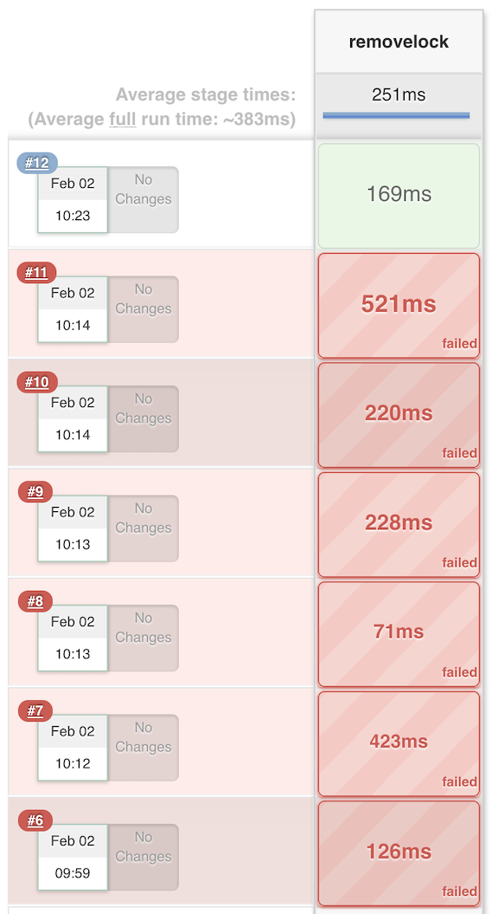
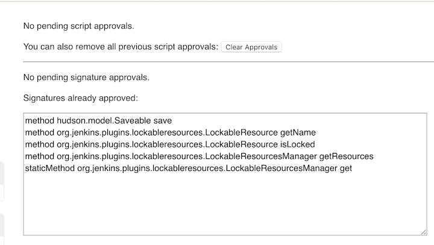

# Lockable Resources and Remove It


## Plugin Information

[Lockable Resources Plugin](https://wiki.jenkins.io/display/JENKINS/Lockable+Resources+Plugin)


## Pipeline usage

[Controlling the Flow with Stage, Lock, and Milestone](5Localresource.md) 

### Usage (JenkinsfileTest):


```
node {

properties( [
  parameters( [
    string( name: 'CLIENT_ID', defaultValue: '', description: 'The CLIENT_ID or "Identifying Tag" from CAPTain' ),
    choice( name: 'ENVIRONMENT',  choices: ['Development', 'Testing', 'Staging', 'Production','Installer_Test'], description: 'The environment of the instance.' ),
    string( name: 'JENKINS_EXECUTION_ID',  defaultValue: '', description: 'Used only for CAPTain callback notifications.' )
  ] ),
  buildDiscarder( logRotator( daysToKeepStr: '7', numToKeepStr: '' ) ),
] )

stage('Prepare') {
      echo "1.Prepare Stage"
      echo "Hello ${CLIENT_ID}"
      echo "Hello ${ENVIRONMENT}"
      echo "Hello ${JENKINS_EXECUTION_ID}"
    }
    
  stage('Test') {
      		echo "2.Test Stage"
      		echo "Lock start"
             
     		lock(name:"CLIENT_ID", resource:"${CLIENT_ID}",inversePrecedence: true)
     		{	
      		echo 'inside the lock'
      		sh 'sleep 60'
      		milestone()
     		}
            
     		echo "Lock finished"
     		sh 'sleep 20'
     		
     		
    }
    
    stage('Build') {
        echo "3.Build Docker Image Stage"
    }
    stage('Push') {
        echo "4.Push Docker Image Stage"
    }
    stage('Deploy') {
        echo "5. Deploy Stage"
    }
}
```

1.Create a build with `CLIENT_ID` equals to `6666`


2.Create new build with same `CLIENT_ID` `6666`, and the new build will lock at **Test Stage**


3.**After the lock released, the second build will get the parameters, and finish the job**


## Delete locakable resources

### After build the job with lock inside Pipeline job, there will leave tons of lock resources inside `configuration system`, need delete it on schedule 


### Build a new `clean-lockable-resources_test` job

`clean-lockable-resources_test.groovy`

```
properties( [
  buildDiscarder( logRotator( daysToKeepStr: '180', numToKeepStr: '30' ) ),
  disableConcurrentBuilds(),
  parameters( [
    booleanParam( name: 'NO_COMMIT',
                  defaultValue: false,
                  description: 'Simulates cleanup without actually removing anything' ),
  ] ),
] )

stage ("removelock") {
  def manager = org.jenkins.plugins.lockableresources.LockableResourcesManager.get()
  def resources = manager.getResources().findAll {
      !it.locked
  }
  currentBuild.description = "${resources.size()} locks"
  resources.each {
      println "Removing ${it.name}"   
      manager.getResources().remove(it)
  }
  manager.save()
}

```

**After run this job, several errors happened**



**Errors**

```
Scripts not permitted to use staticMethod org.jenkins.plugins.lockableresources.LockableResourcesManager get. Administrators can decide whether to approve or reject this signature.
Scripts not permitted to use method org.jenkins.plugins.lockableresources.LockableResourcesManager getResources. Administrators can decide whether to approve or reject this signature.
Scripts not permitted to use method org.jenkins.plugins.lockableresources.LockableResource isLocked. Administrators can decide whether to approve or reject this signature.
Scripts not permitted to use method org.jenkins.plugins.lockableresources.LockableResource getName. Administrators can decide whether to approve or reject this signature.
Scripts not permitted to use method hudson.model.Saveable save. Administrators can decide whether to approve or reject this signature.
```

**Pass all these method as administrator**



**The job passed**


```
Started by user unknown or anonymous
Running in Durability level: MAX_SURVIVABILITY
[Pipeline] properties
[Pipeline] stage
[Pipeline] { (removelock)
[Pipeline] echo
Removing 12345
[Pipeline] echo
Removing 23456
[Pipeline] echo
Removing 6666
[Pipeline] echo
Removing 666
[Pipeline] }
[Pipeline] // stage
[Pipeline] End of Pipeline
Finished: SUCCESS
```


### Build a new `clean-lockable-resources` job with PARAMETER 

```
def runCleanup() {
  def manager = org.jenkins.plugins.lockableresources.LockableResourcesManager.get()
  def lockableResources = manager.resources.findAll { resource ->
    [ 'bbms::', 'learn::security::', 'learn::sonar::', 'uws::' ].any { prefix ->
      resource.name.startsWith( prefix )
    }
  }
  lockableResources.each { resource ->
    if ( resource.locked ) {
      echo "Not removing $resource.name because it is locked"
    } else if ( resource.reserved ) {
      echo "Not removing $resource.name because it is reserved by $resource.reservedBy"
    } else {
      if ( params.NO_COMMIT ) {
        echo "Not removing $resource.name because no-commit mode is on"
      } else {
        println "Removing $resource.name"
        manager.resources.remove( resource )
      }
    }
  }

  manager.save()
}
```


