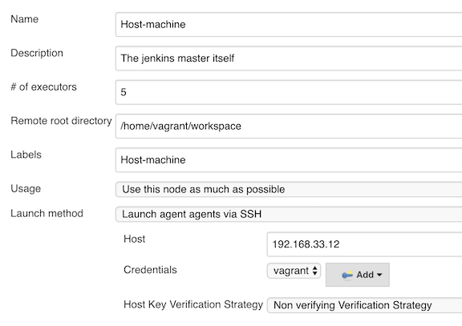
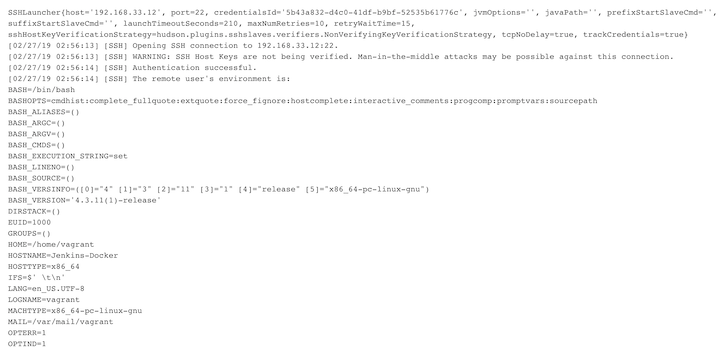

# Docker Jenkins Master with it's Host Machine as Agent

### Why we need add host machine Jenkins agent

* Easy to set the environment
* The Jenkins is running at your virtual machine not at docker process

### Step one: Check Ip of virtual machine

```
$ ip addr
3: eth1: <BROADCAST,MULTICAST,UP,LOWER_UP> mtu 1500 qdisc pfifo_fast state UP group default qlen 1000
    link/ether 08:00:27:23:de:7f brd ff:ff:ff:ff:ff:ff
    inet 192.168.33.12/24 brd 192.168.33.255 scope global eth1
       valid_lft forever preferred_lft forever
    inet6 fe80::a00:27ff:fe23:de7f/64 scope link
       valid_lft forever preferred_lft forever
```

**192.168.33.12**


### Step two: Add one location as your work directory 

```
mkdir /home/vagrant/workspace
```

### Step Three: Add virtual machine as Jenkins agent

`Manage Jenkins -> Manage Nodes -> New Node`




**`Host Key Verification Strategy: None Verifying verification Strategy` Not Recommended**

**Error:**

```
No java running on the virtual machine
```
Modern Jenkins versions have the following Java requirements:

* Java 8 runtime environments, both 32-bit and 64-bit versions are supported
* Since Jenkins 2.164, **Java 11 runtime environments are supported**
* Older versions of Java are not supported
* Java 9 and Java 10 are not supported
* Java 12 is not supported


### Step Four: Install Java8 on virtual machine 

#### Reference: [Install Oracle Java 8 / 9 in Ubuntu 16.04, Linux Mint 18](http://tipsonubuntu.com/2016/07/31/install-oracle-java-8-9-ubuntu-16-04-linux-mint-18/)

```
$ sudo add-apt-repository ppa:webupd8team/java
$ sudo apt update
$ sudo apt install oracle-java8-installer
```

```
$ javac -version
javac 1.8.0_201
```

#### Problems I encountered 

when I do `sudo apt update`

```
Could not resolve 'archive.ubuntu.com'
```
**ping it: unsuccessfully**

```
ping us.archive.ubuntu.com
ping: unknown host us.archive.ubuntu.com
```

#### Solution

```
vi /etc/resolv.conf
nameserver 8.8.8.8 
nameserver 8.8.4.4
```

```
$ ping us.archive.ubuntu.com
PING us.archive.ubuntu.com (91.189.91.23) 56(84) bytes of data.
64 bytes from economy.canonical.com (91.189.91.23): icmp_seq=1 ttl=63 time=226 ms
64 bytes from economy.canonical.com (91.189.91.23): icmp_seq=2 ttl=63 time=226 ms
```

Then: 

```
$ sudo add-apt-repository ppa:webupd8team/java
$ sudo apt update
$ sudo apt install oracle-java8-installer
```

### Log for new successful jenkins agent 




