# CKA 考纲与K8S基础概念解读

## CKA认证介绍

### Certificated Kubernetes Administrator

* 面向`Kubernetes`管理员的认证项目
* 考核日常运维k8s集群所需的:

知识、技能，以及**熟练度**

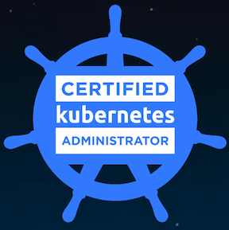


### CKA认证介绍

* 费用:$300(含一次补考机会)
* 在线远程监考、3小时上机实操、开卷(可查K8S手册)
* 有效期 `2` 年
* 网络连通性、熟练度

报名链接: `https://www.cncf.io/certification/cka/`


### 考纲解读

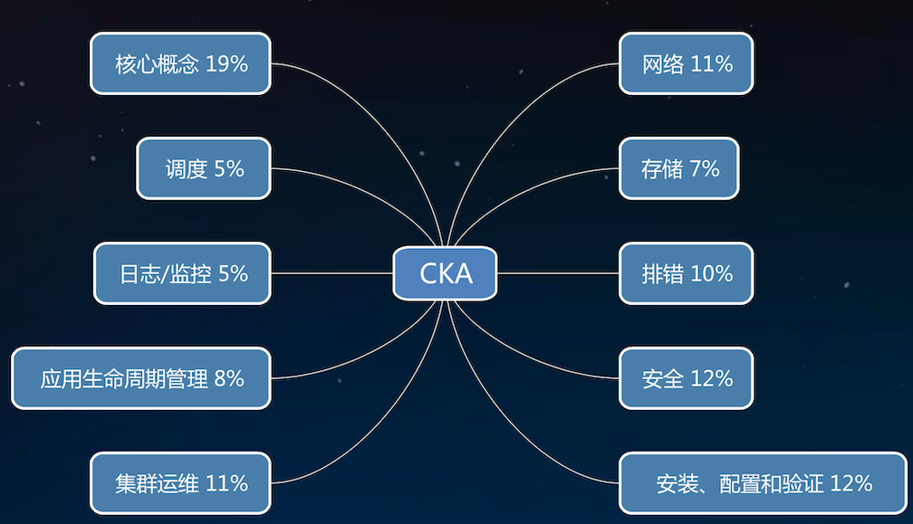

访问 `https://github.com/cncf/curriculum` 查看考纲最新版本

## Kubernetes架构

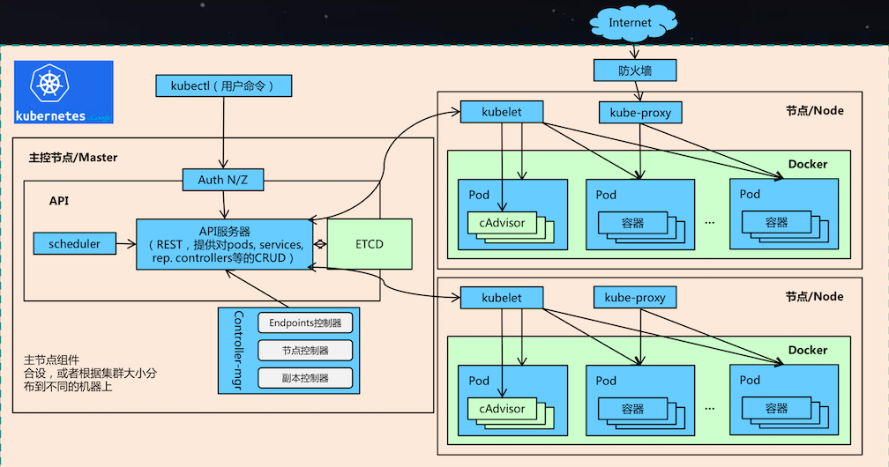

## Kubernetes工作原理

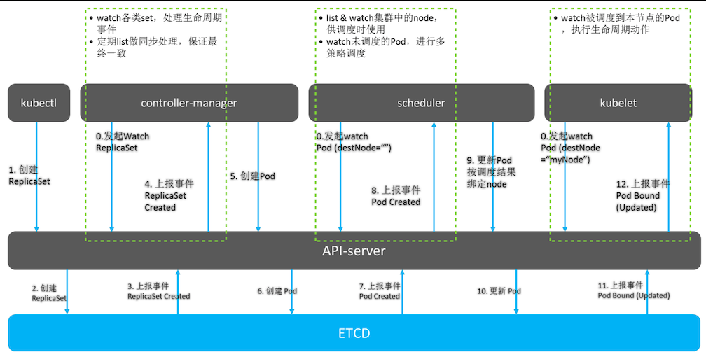

## Kubernetes基本概念

### Pod

* 一组功能相关的Container的封装
* 共享存储和`Network Namespace`
* K8S调度和作业运行的基本单位(`Scheduler`调度，`Kubelet`运行)
* 容易“走失”，需要`Workload`和`Service`的“呵护”

### Workloads (Deployment, StatefulSet, DaemonSet, Job...)

**一组功能相关的Pod的封装**

### Service

* `Pod`“防失联”
* 给一组`pod`设置反向代理


### `Kubernetes API` 对象的基本构成

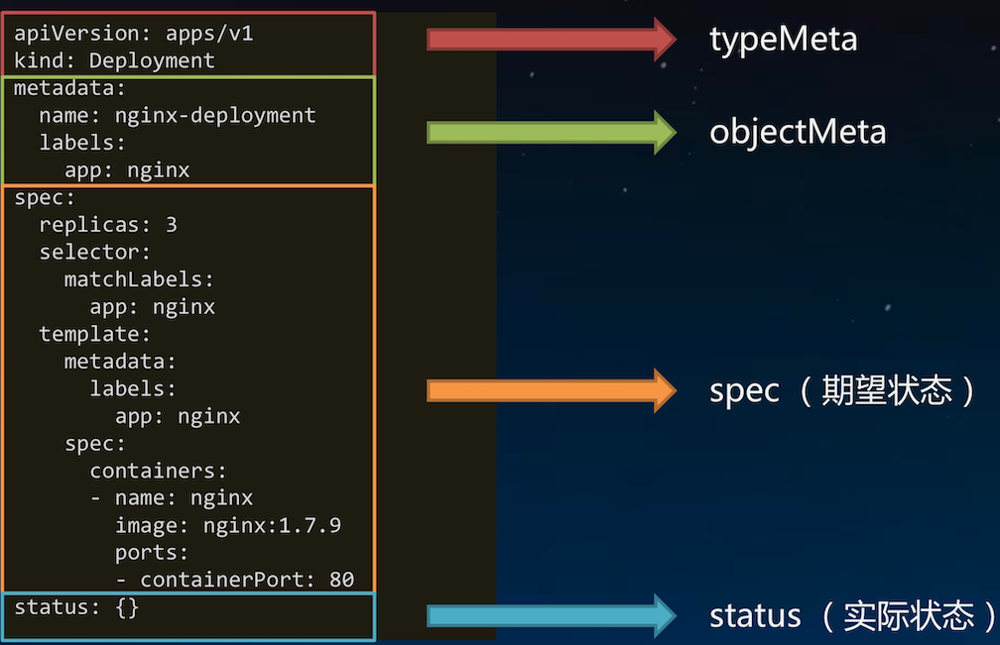


## 使用kubectl与集群交互 😘💁

### Basic Commands (Beginner):

* **create**: 从文件或`stdin`创建资源
* **expose**: 为**deployment**，**pod**创建**Service**。
* **run**: Run a particular image on the cluster
* **set**: Set specific features on objects

### Basic Commands (Intermediate):

* **get**: 最基本的查询命令。如 `kubectl get rs`，`kubectl get deploy`，`kubectl get svc`，`kubectl get rs/foo`.
* **explain**: **查看资源定义**。如 `kubectl explain replicaset` 👍
* **edit**: 使用系统编辑器编辑资源。如 `kubectl edit deploy/foo`
* **delete**: 删除指定资源，支持文件名、资源名、`label selector`。 如 `kubectl delete po -l foo=bar`


### Deploy Commands:

* **rollout**: `Deployment`, `Daemonset`的升级过程管理(查看状态、操作历史、暂停升级、恢复升级、回滚等) 
* **rolling-update**: 客户端滚动升级，仅限R`eplicationController`
* **scale**: 修改`Deployment`, `ReplicaSet`, `ReplicationController`, `Job`的实例数
* **autoscale**: 为`Deploy`, `RS`, `RC`配置自动伸缩规则(依赖`heapster`和`hpa`)

### Cluster Management Commands:

* **certificate**: Modify certificate resources.
* **cluster-info**: 查看集群信息
* **top**: 查看资源占用率(依赖`heapster`)
* **cordon**: 标记节点为`unschedulable`
* **uncordon**: 标记节点为`schedulable`
* **drain**: 驱逐节点上的应用，准备下线维护
* **taint**: 修改节点`taint`标记

### Troubleshooting and Debugging Commands:

* **describe**: 查看资源详情👍
* **logs**: 查看`pod`内容器的日志👍
* **attach**: `Attach`到`pod`内的一个容器
* **exec**: 在指定容器内执行命令👍
* **port-forward**: 为`pod`创建本地端口映射👍
* **proxy**: 为`Kubernetes API server`创建代理
* **cp**: 容器内外/容器间文件拷贝


### Advanced Commands:

* **apply**： 从文件或`stdin`创建/更新资源
* **patch**: 使用`strategic merge patch`语法更新对象的某些字段
* **replace**: 从文件或`stdin`更新资源
* **convert**: 在不同`API`版本之间转换对象定义

### Settings Commands:

* **label**: 给资源设置**label**
* **annotate**: 给资源设置`annotation`
* **completion**: 获取`shell`自动补全脚本(支持`bash`和`zsh`)👍

### Other Commands:

* **Other Commands:** Print the supported API versions on the server, in the form of "group/version"
* **config**: 修改`kubectl`配置(`kubeconfig`文件)，如`context`👍
* **help**: Help about any command
* **version**: 查看客户端和`Server`端`K8S`版本

## kubectl实用技巧

### `kubectl`命令太多太长记不住?

**查看资源缩写**

```
kubectl describe 'enter'
```

**配置`kubectl`自动完成**

```
source <(kubectl completion bash)
```

### `kubectl`写 `yaml`太累，找样例太麻烦?

**用`run`命令生成:**

```
kubectl run --image=nginx my-deploy -o yaml --dry-run > my-deploy.yaml
```

**用`get`命令导出**

```
kubectl get statefulset/foo -o=yaml --export > new.yaml
```

**`Pod`亲和性下面字段的拼写忘记了**

```
kubectl explain pod.spec.affinity.podAffinit
```


## 实机操作

### Get cluster basic info

```
$ kubectl cluster-info
```

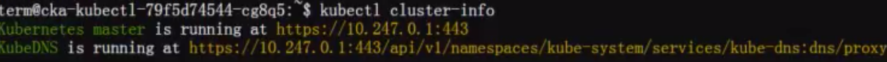

```
$ kubectl get componentstatus
$ kubectl get cs
```
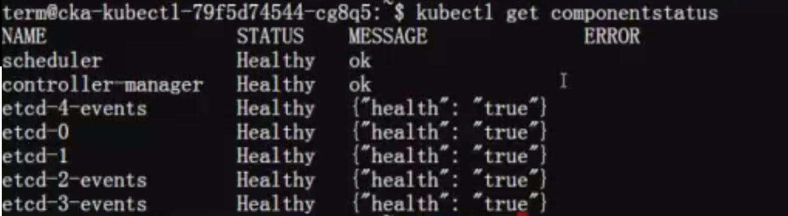


### Create simple deployment and get infos 

```
$ kubectl run nginx --image nginx --port 80 
```
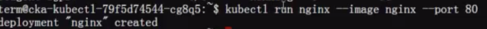

```
$ kubectl get pod --watch   # watch creating process
```
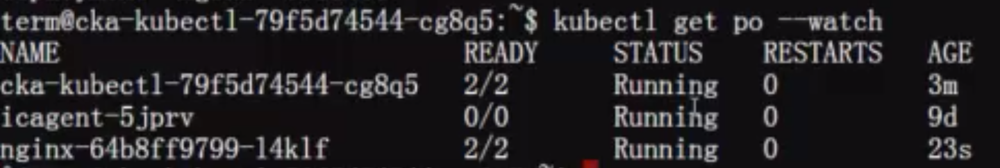

```
$ kubectl get deploy/nginx
$ kubectl get deploy nginx
```
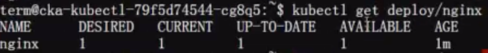

```
$ kubectl get deploy/nginx -owide
```
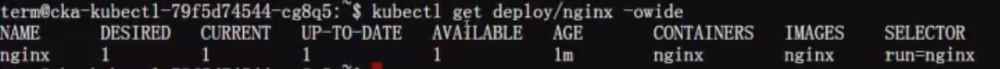

```
$ kubectl get po -owide
```

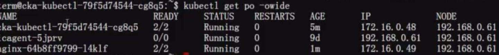


### Describe deployment and pods

```
$ kubectl describe
```

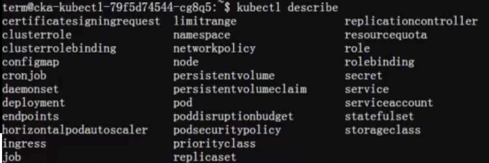


### scale deployment

```
$ kubectl scale deployment nginx --replicas
```
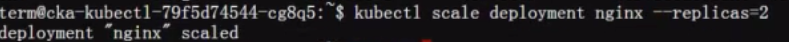

```
$ kubectl get deploy
```
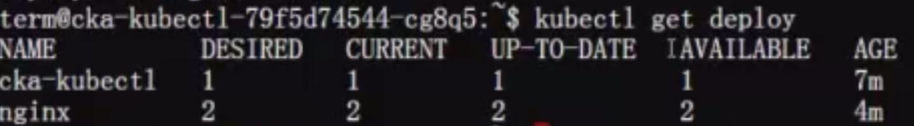


