# Kubernetes 调度管理

## 大纲

* 理解资源限制对`Pod`调度的影响
* 使用`label selector`调度`Pod`
* 手动调度`Pod`
* 调度失败原因分析
* 使用多调度器
* 解调度器的配置


## Kubernetes 调度相关基础概念

### `Scheduling`:为`Pod`找到一个合适的`Node`


### Node 定义

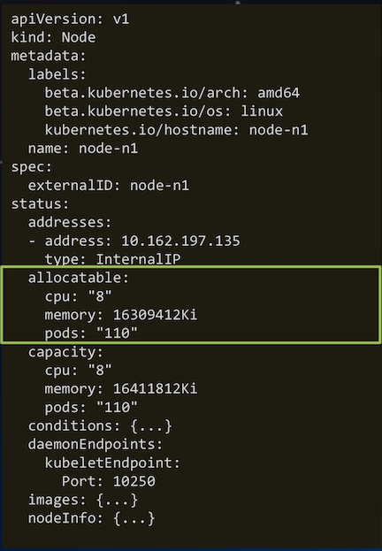 

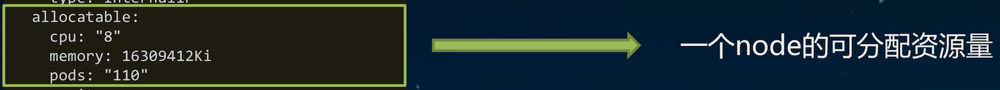 

### Pod 定义

```
apiVersion: v1 
kind: Pod 
metadata:
  labels:
    run: my-pod
  name: my-pod
  namespace: default 
spec:
  containers:
  - image: nginx
    imagePullPolicy: Always
    name: my-pod
    ports:
    - containerPort: 80
      protocol: TCP 
    resources:
      requests:
        memory: "10Gi"
        cpu: "500m"
      limits:
        memory: "10Gi" 
        cpu: "500m"
  schedulerName: default-scheduler
  nodeName: node-n1
  restartPolicy: Always
  nodeSelector: {...}
  affinity: {...}
  tolerations: {...} 
status: {}
```

**执行 `kubectl explain pod.spec` 查看 `pod.spec` 提供的完整配置字段**

### Pod 中影响调度的主要属性字段

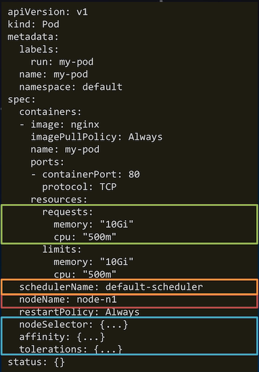 

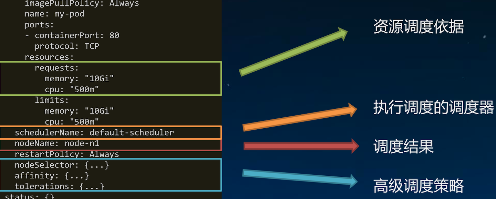 

**执行 `kubectl explain pod.spec` 查看 `pod.spec` 提供的完整配置字段**

## Kubernetes 中的资源分配

### K8S 调度器的资源分配机制

#### 1.基于`Pod`中容器`request`资源“总和”调度👍

* **`resoureces.limits`影响`pod`的运行资源上限，不影响调度** 👍
* `initContainer`取**最大值**，`container`取**累加值**，**最后取大者**, 即**`Max(Max(initContainers.requests), Sum(containers.requests))`**
* **未指定`request`资源时， 按`0`资源需求进行调度**👍

#### 2.基于资源声明量的调度，而非实际占用

* 不依赖监控，系统不会过于敏感
* 能否调度成功:`pod.request < node.allocatable - node.requested`

#### 3.`Kubernetes node` 资源的盒子模型

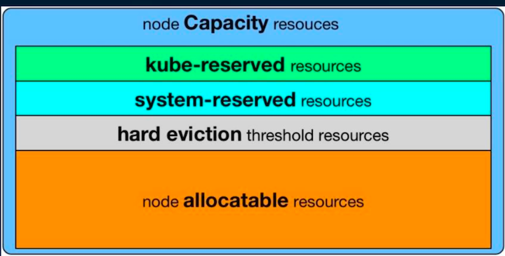 

#### 4.资源分配相关算法

* `GeneralPredicates`(主要是`PodFitsResources`)
* `LeastRequestedPriority`
* `BalancedResourceAllocation`，平衡`cpu/mem`的消耗比例

### Pod 所需资源的计算

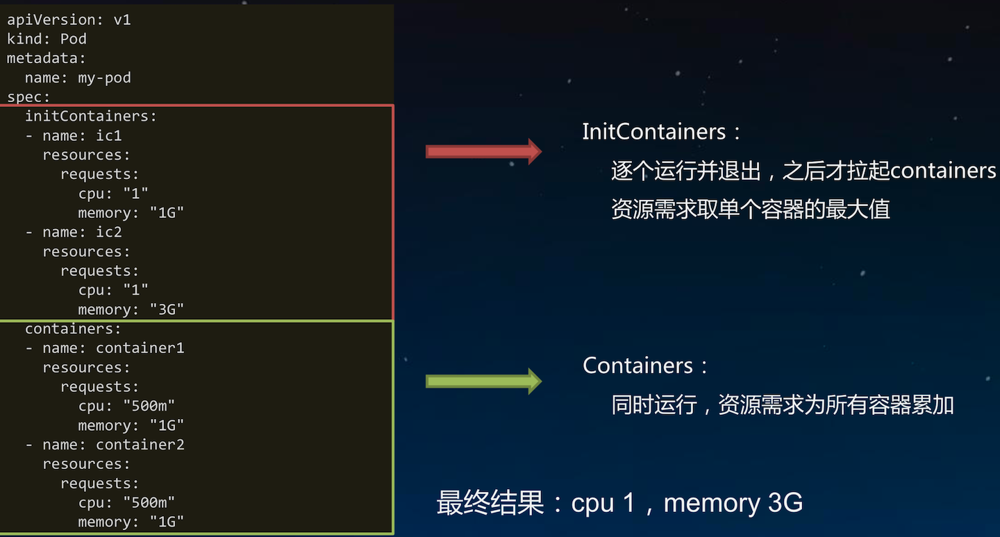 

#### InitContainers: Max(initContainers.requests) => `1G CPU & 3G Memory`
#### Containers: Sum(containers.requests) => `1G CPU & 2G Memory`
#### Total: Max(Max(initContainers.requests), Sum(containers.requests)) => `1G CPU & 3G Memory`

## Kubernetes 中的高级调度及用法

### 1.`nodeSelector`:将 `Pod` 调度到特定的 `Node` 上

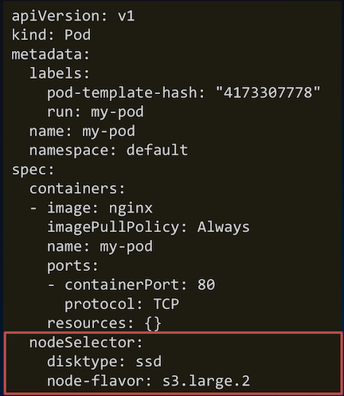 

* **语法格式**:`map[string]string`
* 作用:
  * 匹配`node.labels`
  * 排除不包含`nodeSelector`中指定`label`的所有`node`
  * 匹配机制 —— 完全匹配

```
nodeSelector:
  disktype: ssd 
  node-flavor: s3.large.2
```
 
### 2.`nodeAffinity:nodeSelector` 升级版

```
spec:
  affinity: 
    nodeAffinity:
```
#### 与`nodeSelector`关键差异

* 引入运算符:`In`，`NotIn` (`labelselector`语法)
* 支持枚举`label`可能的取值，如 `zone in [az1, az2, az3...]`
* 支持**硬性过滤**和**软性评分**
* 硬性过滤规则支持指定 **多条件之间的逻辑或运算**
* 软性评分规则支持 **设置条件权重值**

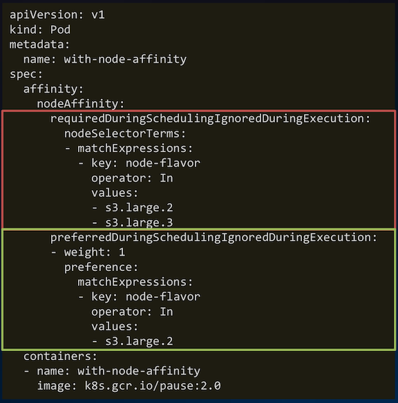 

* **`requiredDuringSchedulingIgnoredDuringExecution`硬性过滤**: 排除不具备指定`label`的`node`

```
requiredDuringSchedulingIgnoredDuringExecution: 
  nodeSelectorTerms:
  - matchExpressions:
    - key: node-flavor 
      operator: In 
      values:
      - s3.large.2
      - s3.large.3
```

* **`preferredDuringSchedulingIgnoredDuringExecution`软性评分**: 不具备指定`label`的`node`打低分， 降低`node`被选中的几率


```
preferredDuringSchedulingIgnoredDuringExecution: 
- weight: 1
  preference: 
    matchExpressions: 
    - key: node-flavor
      operator: In
      values:
      - s3.large.2
```

### 3.`podAffinity`:让某些 `Pod` 分布在同一组 `Node`上

```
spec:
  affinity: 
    podAffinity:
```

#### 与`nodeAffinity`的关键差异

*  定义在`PodSpec`中，**亲和与反亲和规则具有对称性**
*  `labelSelector`的匹配对象为`Pod`
*  **对`node`分组，依据`label-key = topologyKey`，每个`label-value`取值为一组**✌️
*  硬性过滤规则，**条件间只有逻辑与运算**

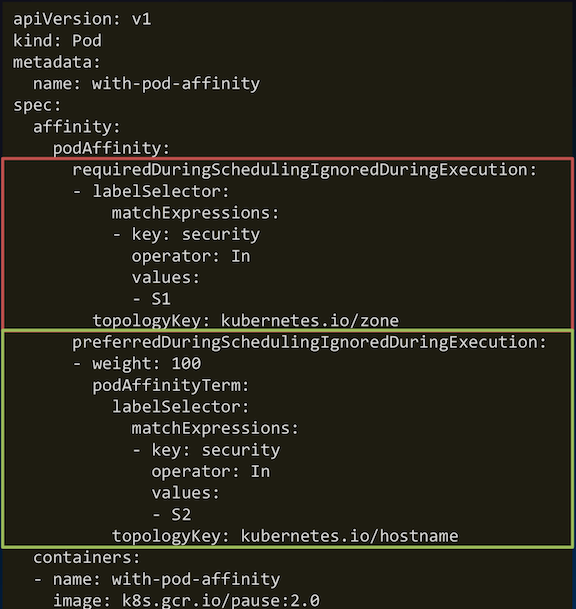 

* **硬性过滤**: 排除不具备指定`pod`的`node`组

```
requiredDuringSchedulingIgnoredDuringExecution: 
- labelSelector:
    matchExpressions:
    - key: security
      operator: In 
      values:
      - S1
  topologyKey: kubernetes.io/zone
```

* **软性评分**: 不具备指定`pod`的`node`组打低分， 降低该组`node`被选中的几率

```
preferredDuringSchedulingIgnoredDuringExecution: 
- weight: 100
  podAffinityTerm:
    labelSelector:
      matchExpressions: 
      - key: security
        operator: In
        values:
        - S2
    topologyKey: kubernetes.io/hostname
```
### 4.`podAntiAffinity`:避免某些 `Pod` 分布在同一组 `Node` 上

```
spec:
  affinity: 
    podAntiAffinity:
```

* **与`podAffinity`的差异**
  * 匹配过程相同
  * 最终处理调度结果时取反
* 即
  * **`podAffinity`中可调度节点，在`podAntiAffinity`中为不可调度**
  * **`podAffinity`中高分节点，在`podAntiAffinity`中为低分**
 

 


## 手动调度和`DaemonSet`

[What is DaemonSet](https://github.com/Chao-Xi/JacobTechBlog/blob/master/k8s_tutorial/k8s_adv24_DaemonSet_StatefulSet.md#daemonset-%E7%9A%84%E4%BD%BF%E7%94%A8)

### 1.手动调度`Pod`(不经过调度器)

```
apiVersion: v1
kind: Pod
metadata:
  labels:
    run: my-pod
  name: my-pod
  namespace: default 
spec:
  containers:
  - image: nginx
    imagePullPolicy: Always 
    name: my-pod
    ports:
    - containerPort: 80
      protocol: TCP
  nodeName: node-n1
```
 

#### 适用场景:

* 调度器不工作时，临时救急 
* 封装实现自定义调度器

#### 小故事:

* 过去几个版本的`Daemonset`都是由`controller`直接指定`pod`的运行节点，不经过调度器。
* 直到`1.11`版本，`DaemonSet`的`pod`由 `scheduler`调度才作为`alpha`特性引入


### `DaemonSet`:每个节点来一份

* 每个`node`上部署一个相同的`pod`
* 通常用来部署集群中的`agent`，如果网络插件:
  * `集群存储守护程序`，如`glusterd`、`ceph`要部署在每个节点上以**提供持久性存储**；
  * `节点监视守护进程`，如`Prometheus`监控集群，可以在每个节点上运行一个`node-exporter`进程来**收集监控节点的信息；**
  * `日志收集守护程序`，如`fluentd`或`logstash`，**在每个节点上运行以收集容器的日志**


```
apiVersion: apps/v1 
kind: DaemonSet 
metadata:
  name: my-daemonset
spec:
  selector:
    matchLabels:
      name: my-daemonset 
  template:
    metadata:
      labels:
        name: my-daemonset
    spec:
      containers:
      - name: container
        image: k8s.gcr.io/pause:2.0
```

#### 等价于👇

```
apiVersion: apps/v1 
kind: Deployment 
metadata:
  name: my-deploy 
spec:
  replicas: <# of nodes>
  selector: 
    matchLabels:
      podlabel: daemonset 
  template:
    metadata:
      labels:
        podlabel: daemonset 
    spec:
      affinity: 
        podAntiAffinity:
          requiredDuringSchedulingIgnoredDuringExecution: 
          - labelSelector:
              matchExpressions: 
              - key: podlabel
                operator: In 
                values:
                 - daemonset
            topologyKey: kubernetes.io/hostname 
    containers:
    - name: container
    image: k8s.gcr.io/pause:2.0
```

### 2.`Taints`:避免 `Pod` 调度到特定 `Node` 上

```
apiVersion: v1
kind: Node
metadata:
  labels:
    beta.kubernetes.io/arch: amd64 
    beta.kubernetes.io/os: linux 
    kubernetes.io/hostname: node-n1
  name: node-n1
spec:
  externalID: node-n1
  taints:
  - effect: NoSchedule 
    key: accelerator 
    timeAdded: null 
    value: gpu
status: {...}
```

#### 带`effect`的特殊`label`，对`Pod`有排斥性

* 硬性排斥 `NoSchedule`
* 软性排斥 `PreferNoSchedule`

#### 系统创建的`taint`附带时间戳

* **`effect`为`NoExecute`**
* 便于触发对`Pod`的超时驱逐

#### 典型用法:预留特殊节点做特殊用途

#### 给`node`添加`taint`

```
kubectl taint node node-n1 foo=bar:NoSchedule
```

#### 删除`taint`

```
kubectl taint node node-n1 foo:NoSchedule-
```

### 3.`Tolerations`:允许 `Pod` 调度到有特定 `taints` 的 `Node` 上

```
apiVersion: v1
kind: Pod
metadata:
  labels:
    run: my-pod
  name: my-pod
  namespace: default 
spec:
  containers:
  - name: my-pod
    image: nginx
  tolerations:
  - key: accelerator
    operator: Equal
    value: gpu
    effect: NoSchedule
```

**无视排斥**👇

```
apiVersion: v1
kind: Node
metadata:
  labels:
    beta.kubernetes.io/arch: amd64 
    beta.kubernetes.io/os: linux 
    kubernetes.io/hostname: node-n1
  name: node-n1
spec:
  externalID: node-n1
  taints:
  - effect: NoSchedule
    key: accelerator 
    timeAdded: null 
    value: gpu
status: {...}
```

#### 完全匹配

例:`<key>=<value>:<effect>`

#### 匹配任意`taint value`

* `Operator`为`Exists`，`value`为空
*  例:` <key>:<effect>`

#### 匹配任意 `taint effect`

* `effect`为空
* 例: `<key>=<value>`

**注`:<key>=<value>:<effect>`为 `kubectl describe pod`中的写法**

## 调度结果和失败原因分析

### 1.调度失败原因分析

* 调度失败原因分析

```
kubectl get pod [podname] –o wide
```

* 查看调度失败原因

```
kubectl describe pod [podname]
```

* 调度失败错误列表(kubernetes 1.9版本)

[https://github.com/kubernetes/kubernetes/blob/release- 1.9/plugin/pkg/scheduler/algorithm/predicates/error.go#L25-L58](https://github.com/kubernetes/kubernetes/blob/release- 1.9/plugin/pkg/scheduler/algorithm/predicates/error.go#L25-L58)


### 2.调度失败原因分析

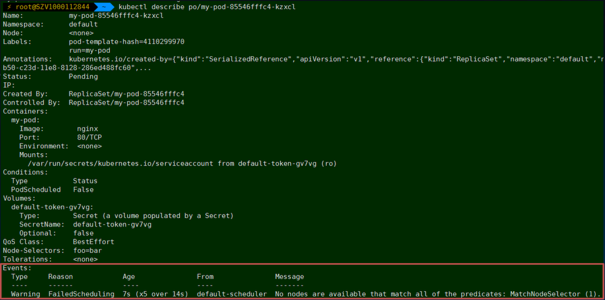 

## 多调度器及调度器配置

### 1.多调度器

```
apiVersion: v1
kind: Pod
metadata:
  labels:
    run: my-pod
  name: my-pod
  namespace: default
spec:
  containers:
  - image: nginx
    imagePullPolicy: Always
    name: my-pod
    ports:
    - containerPort: 80
      protocol: TCP
  schedulerName: my-custom-scheduler
```

 


#### 适用场景:

集群中存在多个调度器，分别处理不同类型的作业调度

#### 使用限制:

建议对`node`做资源池划分，避免调度结果 写入冲突

### 2.自定义调度器配置

**`--policy-config-file`自定义调度器加载的算法，或者调整排序算法权重**

```
{
  "kind" : "Policy",
  "apiVersion" : "v1",
  "predicates" : [
    {"name" : "PodFitsHostPorts"}, 
    {"name" : "PodFitsResources"}, 
    {"name" : "NoDiskConflict"}, 
    {"name" : "NoVolumeZoneConflict"}, 
    {"name" : "MatchNodeSelector"},
     {"name" : "HostName"}
  ],
  "priorities" : [
    {"name" : "LeastRequestedPriority", "weight" : 1}, 
    {"name" : "BalancedResourceAllocation", "weight" : 1}, 
    {"name" : "ServiceSpreadingPriority", "weight" : 1}, 
    {"name" : "EqualPriority", "weight" : 1}
],
  "hardPodAffinitySymmetricWeight" : 10, 
  "alwaysCheckAllPredicates" : false
}
```

**执行 `kube-scheduler --help` 查看更多调度器配置项**

## 实机操作

### 1.check cluster

```
$ kubectl get node
```
 

### 2.manual schedule 

```
$ cat manuk-schedule.yaml
```
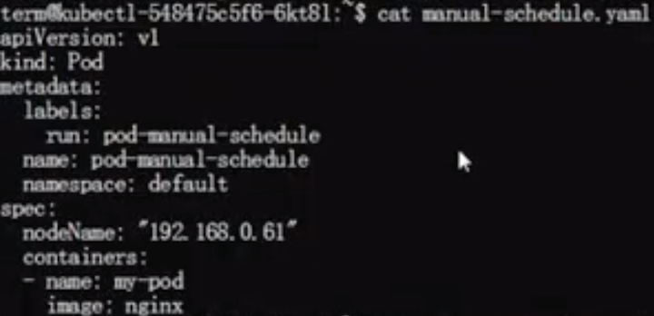 

```
$ kubectl get po -o wide
```
 

**Describe the pod, there actually no scheduler work in the whole process**

 

**Delete `nodeName: "192.168.0.61"`**

 

**Now, scheduler work in the initializing process**


### 3.node affinity 

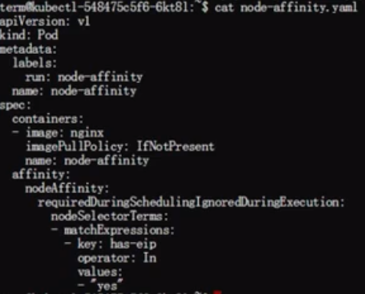 

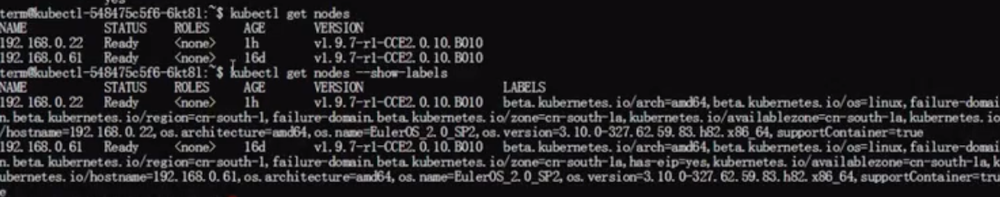 

```
kubctl get nodes --show-label
```

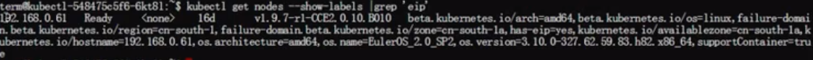 

```
kubctl get nodes --show-label | grep 'value-name'
```

#### schedule the node affinity pods to the `192.168.0.61`

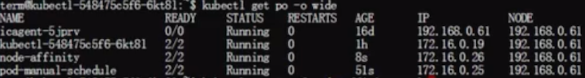 

### 4.pod affinity 

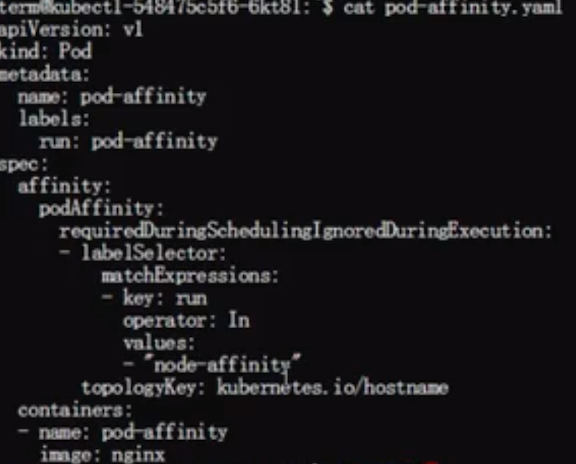 

**value: "node-affinity"**

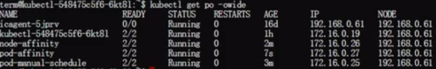 

#### schedule the pod affinity pods to the `192.168.0.61`

### 5.pod anti-affinity 

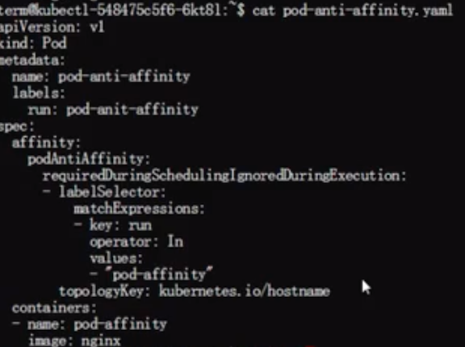 

### 6.taint node

* **untainted node**

```
$ kubectl taint 192.168.0.22 gpu=yes:NoSchedule-
```

* **tained node**

```
$ kubectl taint 192.168.0.22 gpu=no:NoSchedule
```


### 7.pod-tolerations

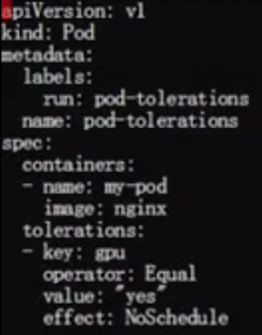 


