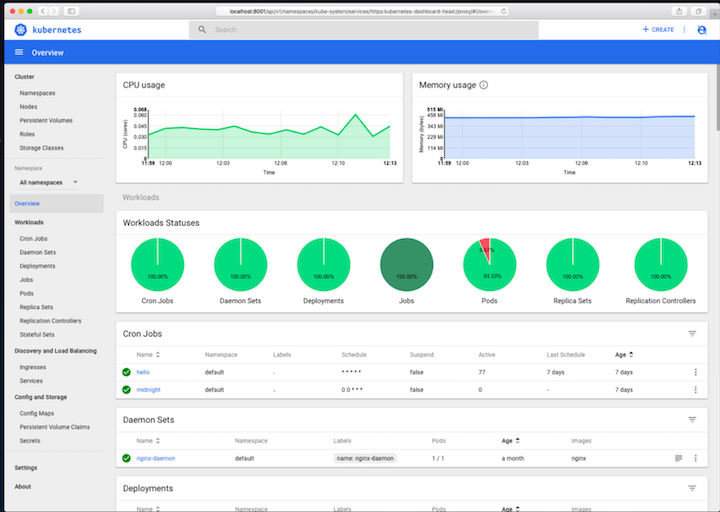
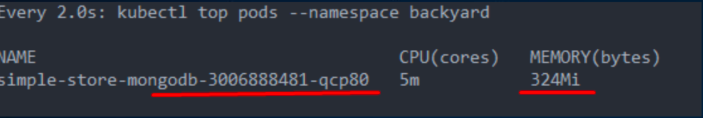
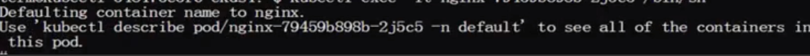
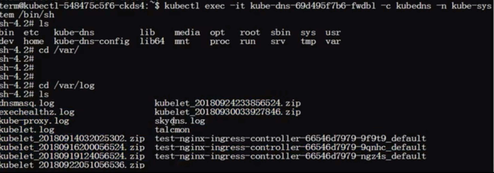
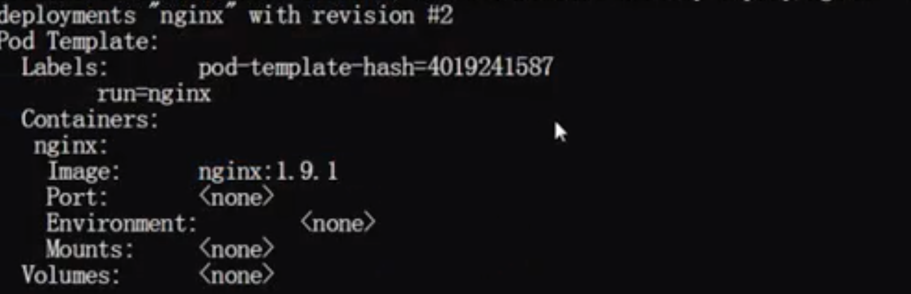
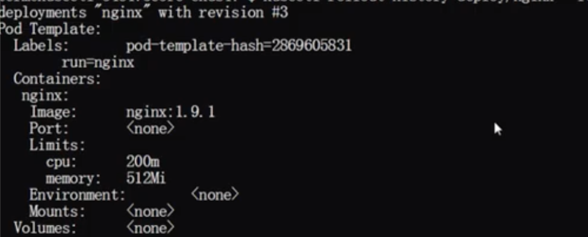

# K8S 日志、监控与应用管理实训

### 大纲

* 监控集群组件
* 监控应用
* 管理组件日志
* 管理应用日志
* Deployment升级和回滚
* 配置应用的不同方法
* 应用弹性伸缩
* 应用自恢复

## 监控集群组件

**集群整体状态:**

```
$ kubectl cluster-info
Kubernetes master is running at https://api.cluster01-us-east-1.animal.bbsaas.io
KubeDNS is running at https://api.cluster01-us-east-1.animal.bbsaas.io/api/v1/namespaces/kube-system/services/kube-dns:dns/proxy
system-services-kubernetes-dashboard is running at https://api.cluster01-us-east-1.animal.bbsaas.io/api/v1/namespaces/kube-system/services/https:system-services-kubernetes-dashboard:/proxy

To further debug and diagnose cluster problems, use 'kubectl cluster-info dump'.
```

**更多集群信息:**

```
$ kubectl cluster-info dump
$ kubectl cluster-info dump > cluster-info.txt
$ kubectl get ns
```

**通过插件部署:**

```
$ kubectl get pod etcd -n kube-system
$ kubectl describe pod kube-apiserver -n kube-system
```

**组件metrics:**

```
$ curl localhost:10250/stats/summary
```

**组件健康状况:**

```
$ curl localhost:10250/healthz
```

### `Heapster + cAdvisor`监控集群组件


对接了`heapster`或`metrics-server`后 展示`Node` CPU/内存/存储资源消耗

```
$ kubectl top node {node name}
```
😍😍😍😍😍😍

* **`cAdvisor`既能收集容器CPU、内存、文件系统和网络使用统 计信息，还能采集节点资源使用情况;**
* `cAdvisor`和`Heapster`都不能进行数据存储、趋势分析和报警。 因此，还需要将数据推送到`InfluxDB`，`Grafana`等后端进行存储和图形化展示。
* **`Heapster`即将被`metrics-server`替代**. 

### Kuberneetes Dashboard UI



Kubernetes Dashboard用于监控/展示 

**Kubernetes所有的资源对象:**

* `Cluster`(Node，PV等) 
* `Workload`(Pod，Deployment等) 
* `Config`(Configmap，Secrets等)

### 监控应用

```
$ kubectl describe pod
```

**对接了`heapster`或`metrics-server`后，展示Pod CPU/内存/存储资源消耗:**

```
$ kubectl top pod {pod name}
```



```
$ kubectl get pod {pod name} --watch 
```

✌️

## 管理K8S组件日志

### 组件日志:

```
/var/log/kube-apiserver.log 
/var/log/kube-proxy.log 
/var/log/kube-controller-manager.log 
/var/log/kubelet.log
```

### 使用`systemd`管理:

```
$ journalctl –u kubelet
```

### 使用`K8S`插件部署: 👍

```
$ kubectl logs -f kube-proxy
```

## 管理K8S应用日志

### 从容器标准输出截获:👍

```
$ kubectl logs -f {pod name} –c {container name} 
$ docker logs -f {docker name}
```

### 日志文件挂载到主机目录:

```
apiVersion: v1
kind: Pod
metadata:
  name: test-pd 
spec:
  containers:
  - image: gcr.io/google_containers/test-webserver
    name: test-container
    volumeMounts:
    - mountPath: /log
    name: log-volume 
  volumes:
  - name: log-volume 
  hostPath:
  # directory location on host 
    path: /var/k8s/log
```

### 直接进入容器内查看日志: 👍

```
$ kubectl exec -it {pod} -c {container} /bin/sh 
$ docker exec -it {container} /bin/sh
```

## Deployment升级与回滚

### 1.创建Deployment:

```
$ kubectl run {deployment} –image={image} –replicas={rep.}
# 或使用yaml文件形式，重点配置replicas和image字段。
```

### 2.升级Deployment:

```
$ kubectl set image deployment/nginx-deployment nginx=nginx:1.9.1
$ kubectl set resources deployment/nginx-deployment -c=nginx --limits=cpu=200m,memory=512Mi
```

### 3.升级策略:

```
minReadySeconds: 5 
strategy:
  type: RollingUpdate 
  rollingUpdate:
    maxSurge: 1 #默认25% 
    maxUnavailable: 1 #默认25%
```

### 4.暂停Deployment:

```
$ kubectl rollout pause deployment/nginx-deployment
```

### 5.恢复Deployment:

```
$ kubectl rollout resume deployment/nginx-deployment
```

### 6.查询升级状态:

```
$ kubectl rollout status deployment/nginx-deployment
```

### 7.查询升级历史:

```
$ kubectl rollout history deploy/nginx-deployment
$ kubectl rollout history deploy/nginx-deployment --revision=2
```

### 8.回滚:

```
$ kubectl rollout undo deployment/nginx-deployment --to-revision=2
```


## 应用弹性伸缩

```
$ kubectl scale deployment nginx-deployment --replicas=10
```

### 对接了heapster，和HPA联动后:

```
$ kubectl autoscale deployment nginx-deployment --min=10 --max=15 --cpu-percent=80
```

## 应用自恢复:`restartPolicy` + `livenessProbe`

### Pod Restart Policy: `Always`, `OnFailure`, `Never`
### livenessProbe: `http/https Get`, `shell exec`, `tcpSocket`

###  tcp socket的liveness探针 + `always restart`例子

```
apiVersion: v1
kind: Pod 
metadata:
  name: goproxy 
spec:
  restartPolicy: Always   ❤️
  containers:
  - name: goproxy
    image: k8s.gcr.io/goproxy:0.1 
    ports:
    - containerPort: 8080 
    livenessProbe:        ❤️
      tcpSocket: 
        port: 8080
      initialDelaySeconds: 15 
      periodSeconds: 20
```

## 实机操作

**集群整体状态:**

```
$ kubectl cluster-info dump > a.txt
```

**从容器标准输出截获:**

```
# kubectl logs -f {pod name} –c {container name} 
$ kubectl logs -f redis-part1-part2 -c redis
```

**登录到一个pod去查看container的信息:**

```
$ kubectl exec -it nginx-62323232v-2j5c5 /bin/sh
```





**快速创建一个deployment:**

```
$ kubectl run nginx --image=nginx --replicas=2
deployment "nginx" created
```

**升级Deployment:**

```
$ kubectl run redis --image=redis
deployment "redis" created
```

```
$ kubectl set image deploy/nginx nginx=nginx:1.9.1
deployment "nginx" image updated
```

```
$ kubectl edit deploy nginx
Edit cancelled, no changes made
```

**查询升级状态:**

```
$ kubectl rollout status deploy nginx
deployment "nginx" successfully rolled out 
```

**查询升级历史:**

```
$ kubectl rollout history deploy/nginx
deployments "nginx"
REVISION CHANGE-CASUE
1        <none>
2        <none>
```

```
$ kubectl history deploy/nginx --revision=2
```


**设置deployment的性能**

```
$ kubectl set resources deployment/nginx -c nginx --limits=cpu=200m,memory=512Mi
deployment "nginx" resource requirements updated
```

```
$ kubectl rollout history deploy/nginx --revision=3
```


**回滚:**

```
$ kubectl rollout undo deploy/nginx --to-revision=2
deployment "nginx"
```

**应用弹性伸缩**

```
$ kubectl scale deploy/nginx --replicas=10
deployment "nginx" scaled
```