# Kubernetes 网络实训

## 大纲

* `Pod`网络
* `CNI`
* `Service`概念
* 部署和配置网络`load balancer`
* `Ingress`概念 
* 配置和使用集群`DNS`

## `Pod`网络

### 一个`Pod`一个`IP`

* 每个`Pod`独立`IP`，**`Pod`内所有容器共享网络`namespace`(同一个`IP`)** => [Pause container function](https://github.com/Chao-Xi/JacobTechBlog/blob/master/k8s_tutorial/k8s_adv33_interview.md#2k8s%E7%9A%84-pause-%E5%AE%B9%E5%99%A8%E6%9C%89%E4%BB%80%E4%B9%88%E7%94%A8%E6%98%AF%E5%90%A6%E5%8F%AF%E4%BB%A5%E5%8E%BB%E6%8E%89)
* **容器之间直接通信，不需要`NAT`**
* **`Node`和容器直接通信，不需要`NAT`**
* 其他容器和容器自身看到的`IP`是一样的


### 集群内访问走`Service`，集群外访问走`Ingress`

### `CNI(container network interface)` 用于配置`Pod`网络， 不支持`docker`网络

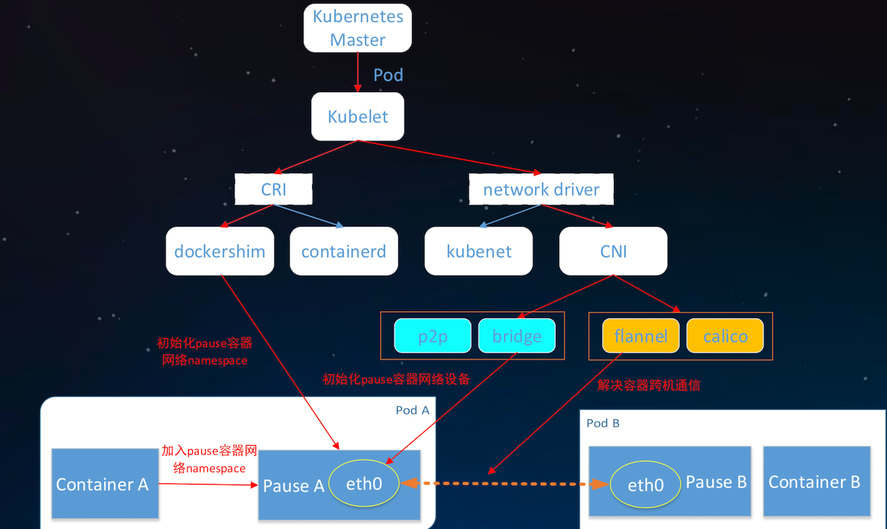

#### Pause 容器：

* 保证一个pod内的所有`container`共享一个`namespace`
* `eth0` is the first Ethernet interface, as internet interface inside **Pause 容器**
* `flannel`解决容器跨机通信, 通过不同pod内的	`eth0`通信


## CNI

### CNI: Container Network Interface

* 容器网络的标准化
* **使用`JSON`来描述网络配置**
* 两类接口:
  * **配置网络 -- 创建容器时调用**
  * `AddNetwork(net NetworkConfig, rt RuntimeConf) (types.Result, error)`
  * **清理网络 -- 删除容器时调用** 
  * `DelNetwork(net NetworkConfig, rt RuntimeConf) error`

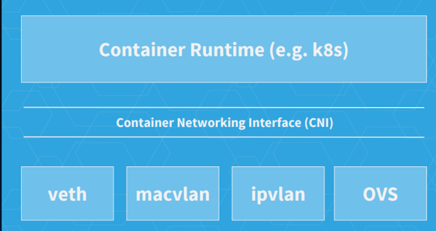

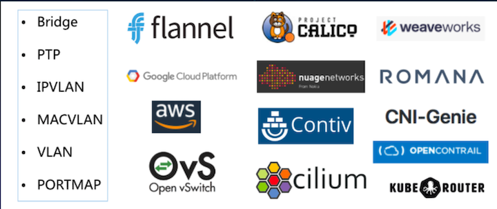

### CNI插件:`host-local + bridge`

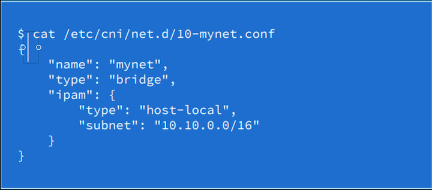

**`CNI plugin`二进制文件: `/opt/cni/bin/{host-local, bridge...}`**


## service

### Kubernetes Service

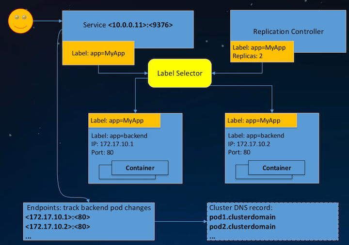

### `Service`和`Endpoints`定义

#### Service

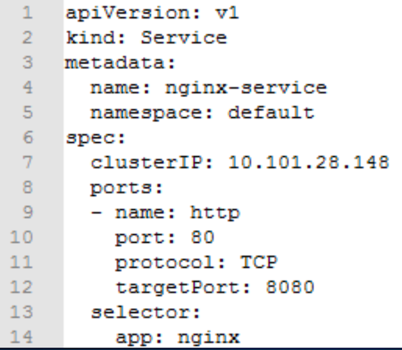

* **Port 80**: The port export to outside
* **Target port 8080**: The port open for endpoint

#### Endpoint

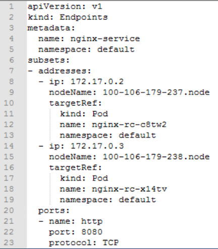


* **Port 8080**: **Port open for service**


## 部署和配置网络`load balancer`

### `LoadBalancer`类型`Service`

* 同时是`Cluster IP`类型
* 需要跑在特定的`cloud provider`上
  * `Service Controller`自动创建一个外部`LB`并配置安全组
  * 对集群内访问，`kube-proxy`用`iptables`或`ipvs`实现了云服务提供商LB的部分功能:**L4转发，安全组规则**等

```
kind: Service 
apiVersion: v1 
metadata:
  name: my-service 
spec:
  selector:
    app: MyApp
  ports:
  - protocol: TCP
    port: 80
    targetPort: 9376
  clusterIP: 10.0.171.239
  loadBalancerIP: 78.11.24.19 #外部LB IP 
  type: LoadBalancer
```

❤️❤️❤️

```
clusterIP: 10.0.171.239
loadBalancerIP: 78.11.24.19 #外部LB IP 
type: LoadBalancer
```

## Ingress

### `Ingress`是授权入站连接到达集群服务的规则集合

* 支持通过`URL`方式将`Service`暴露到`K8S`集群外，`Service`之上的`L7`访问入口
* 支持自定义`Service`的访问策略
* 提供按域名访问的虚拟主机功能 
* 支持`TLS`

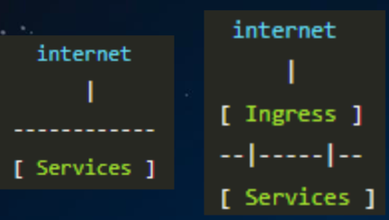

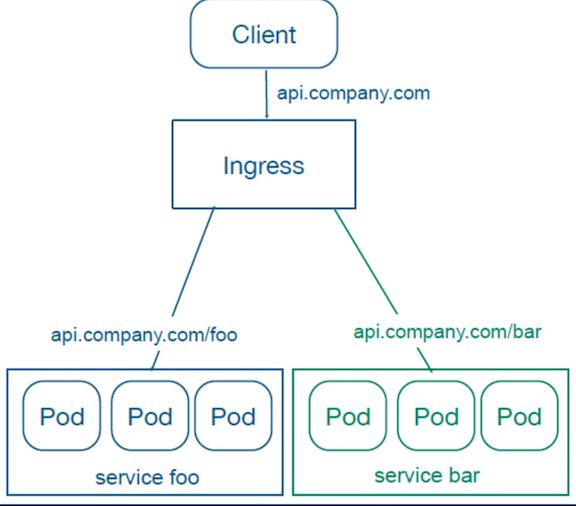

```
apiVersion: extensions/v1beta1 
kind: Ingress 
metadata:
  name: test-ingress 
spec:
  tls:
  - secretName: testsecret 
  backend:
    serviceName: testsvc 
    servicePort: 80
```

❤️❤️❤️

```
tls:
  - secretName: testsecret 
  backend:
    serviceName: testsvc 
    servicePort: 80
```

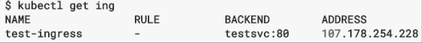

* **ADDRESS**: `Ingress`的访问入口地址，由`Ingress Controller`分配 
* **BACKEND**:`K8S Service + Port`
* **RULE**: 自定义的访问策略。 
* 若规则为空，则访问`ADDRESS`的所有流量都转发给`BACKEND`

```
apiVersion: extensions/v1beta1 kind: Ingress
metadata:
  name: test 
spec:
 rules:
 - host: foo.bar.com
  http:
    paths:
    - path: /foo             ❤️
    backend: 
      serviceName: s1 
      servicePort: 80
    - path: /bar
    backend:                 ❤️
      serviceName: s2 
      servicePort: 80
```

**当LB准备就绪时，`Ingress Controller`填充`ADDRESS`字段**

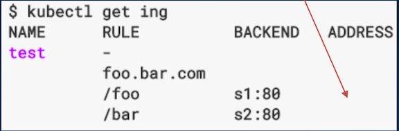


## Kubernetes DNS

* **解析`Pod`和`Service`的域名的，`K8S`集群内`Pod`使用**
  * **`kubelet`配置`--cluster-dns`把`DNS`的静态`IP`传递给每个容器**
* **`Kube-dns`和`CoreDNS`**
* 对`Service`:
  *  **A记录:**
  *  **普通Service:**`my-svc.my-namespace.svc.cluster.local` -> **`Cluster IP`**
  *  **headless Service:** `my-svc.my-namespace.svc.cluster.local` -> **`后端Pod IP列表`**
  * **SRV记录:**
  * `_my-port-name._my-port-protocol.my-svc.my-namespace.svc.cluster.local` -> `Service Port`
* 对`Pod`

**A记录:**

```
pod-ip(1,2,3,4).my-namespace.pod.cluster.local -> Pod IP
```

## 实机操作

### 1.Create clusterIp service

```
$ kubectl create service clusterip my-svc-cp --tcp=80:80
service "my-svc-cp" created

$ kubectl get svc
```

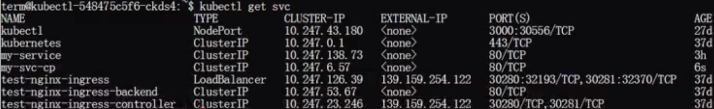
 
```
$ curl 10.247.6.57:80
curl: (7) Failed to connect to 10.247.6.57 port 80: Connection refused
```

**Because of no endpoint**

```
$ kubectl describe service my-svc-cp
```
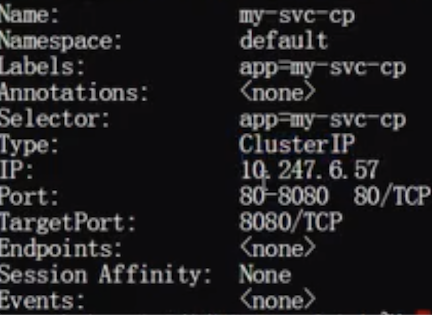

### 2.Create nodeport service

```
$ kubectl create service nodeport my-svc-np --tcp=1234:80
service "my-svc-np" created
```
```
$ kubectl describe service my-svc-np

```
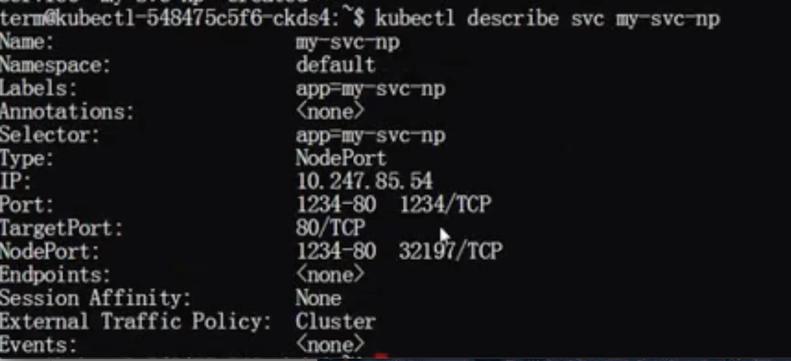

```
$ curl 10.247.85.54:1234
curl: (7) Failed to connect to 10.247.85.54 port 1234: Connection refused
```

### 2.Create headless service

```
$ kubectl create service clusterip my-svc-headless --clusterip="None"
service "my-svc-headless" created
```


### 3.create back pod for service

```
$ kubectl run hello-nginx --image=nginx
deployment "hello-nginx" created
```
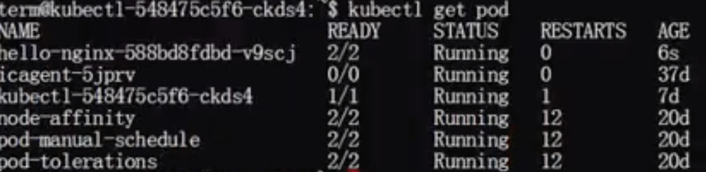


### expose deployment with ClusterIp service

```
$ kubectl expose deployment hello-nginx --type=ClusterIP --name=my-nginx --port=8090 target-port=80
service "my-nginx" exposed
```

```
$ kubectl get svc
```
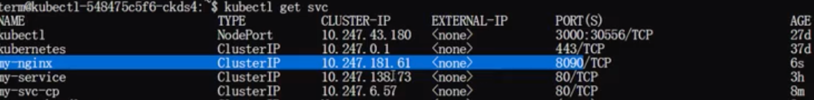

```
$ curl 10.247.181.61:8090
```

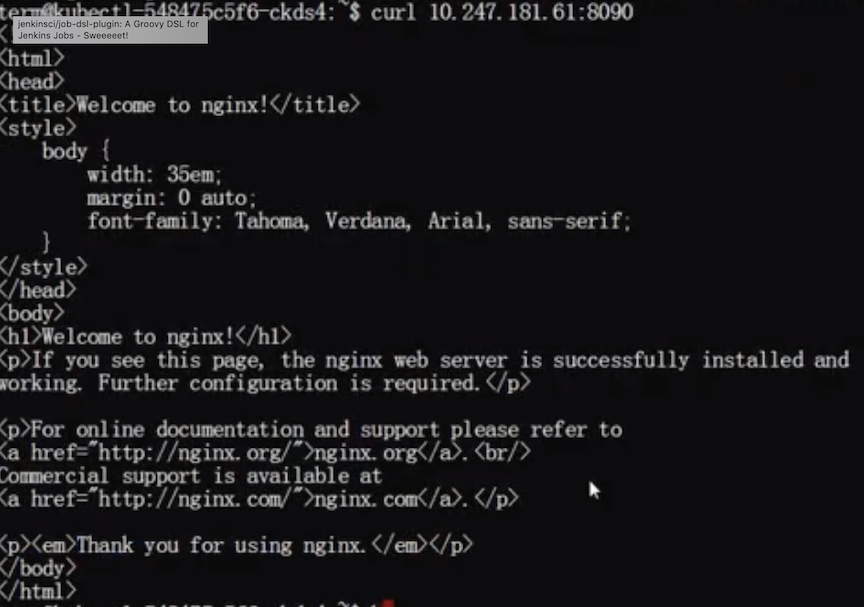

#### we can also see the endpoints

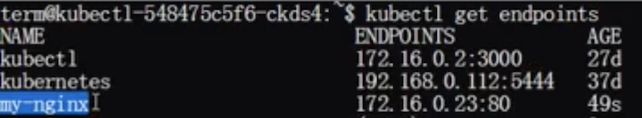


### Practice `nelookup` the service, but no `nslookup` offered

**create a busybox with nslookup pod and can stay longer to do the job**

```
$ wget https://kubernetes.io/examples/admin/dns/busybox
```

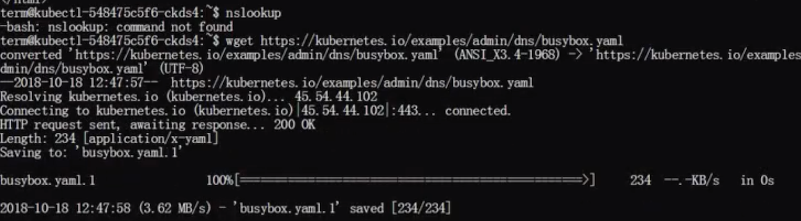


```
$ less busybox.yaml

apiVersion: v1
kind: Pod
metadata:
  name: busybox
  namespace: default
spec:
  containers:
  - name: busybox
    image: busybox:1.28
    command:
      - sleep
      - "3600"
    imagePullPolicy: IfNotPresent
  restartPolicy: Always
```

```
$ kubectl get pod
```


#### exec the pod and `nslookup` the service

```
$ kubectl exec -it busybox --nslookup kubernetes.default
```

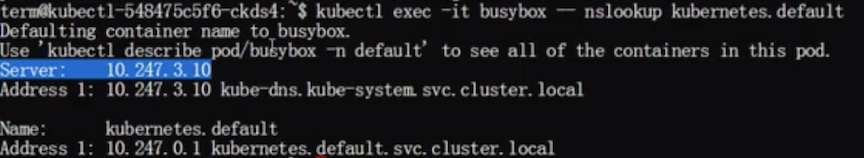

```
$ kubectl exec -it busybox --nslookup my-nginx
```
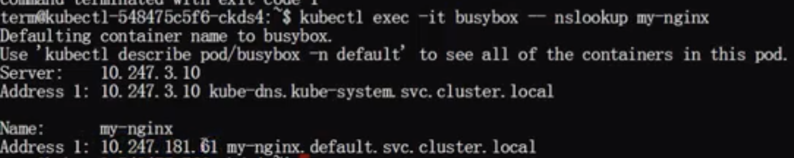

```
$ kubectl exec -it busybox --nslookup busybox
```


