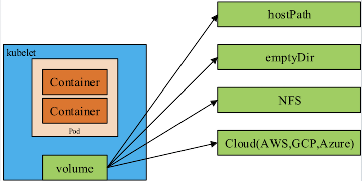
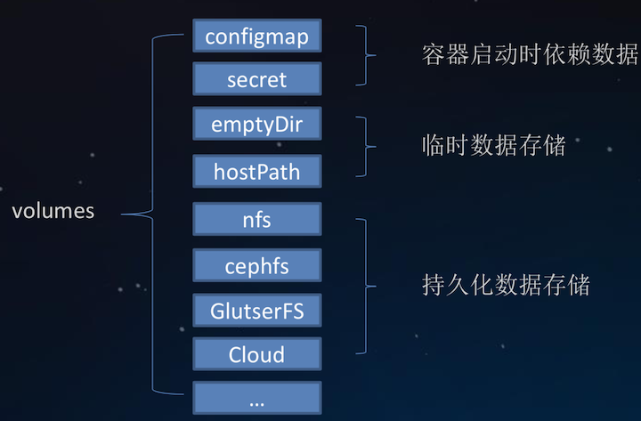
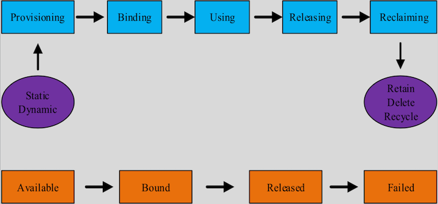
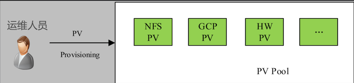
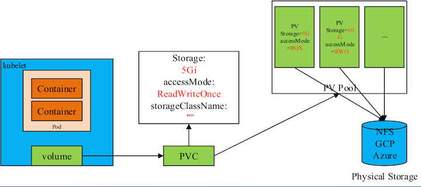
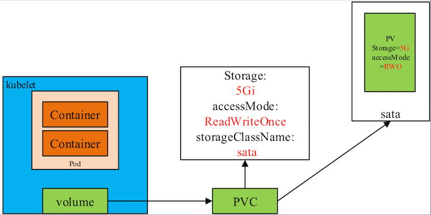
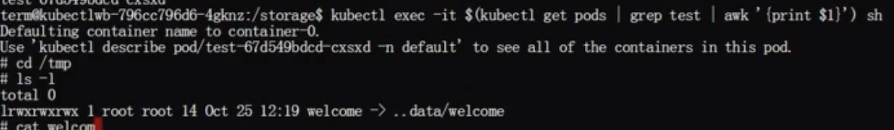
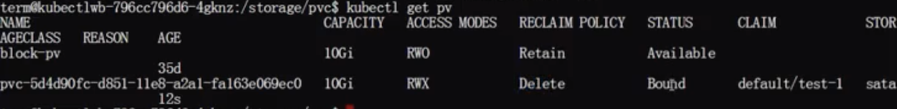
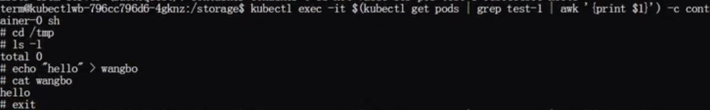

# K8S存储管理实训

## 大纲

* 为何需要存储卷?
* 普通存储卷
* 应用中使用普通卷
* 持久化存储卷(PV)
* 持久化存储卷申明(PVC)
* 应用中使用持久化卷

## 为何需要存储卷?

容器部署过程中一般有以下三种数据:

* 启动时需要的初始数据，可以是配置文件
* 启动过程中产生的临时数据，该临时数据需要多个容器间共享 
* 启动过程中产生的持久化数据

**以上三种数据都不希望在容器重启时就消失，存储卷由此而来**，它可以根据不同场景提供不同类型的存储能力。



### 普通存储卷(volume)



存储没有单独资源对象，与`Pod`的生命周期一起

```
apiVersion: v1 
kind: Pod 
metadata:
  name: test-pd 
spec:
  containers:
  - image: k8s.gcr.io/test-webserver
    name: test-container 
    volumeMounts:
    - mountPath: /test-pd
      name: test-volume 
  volumes:
  - name: test-volume 
    hostPath:
      # directory location on host
      path: /data
```

### 应用中使用普通卷

创建`configmap`预制数据卷:

```
kubectl create –f configmap.yaml
kubectl create –f deployment_cfgmap.yaml
```

```
apiVersion: v1
data:
  wangbo: hello-world
kind: ConfigMap 
metadata:
  name: test
spec:
     containers:
     - image: nginx:1.0 
       imagePullPolicy: IfNotPresent 
       name: container-0 
       volumeMounts:
       - name: test
         mountPath: /tmp
     volumes:
     - configMap:
         defaultMode: 420
         items:
         - key: wangbo
           path: welcome
         name: test
       name: test
```
```
$ kubectl exec -t test-12345 sh
# cat /tmp/welcome
hello-workld
```

**创建`emptyDir`临时存储数据卷:**

```
kubectl create –f deployment_emptydir.yaml
```

## 持久化存储卷(PersistentVolume)

* 存储系统与应用系统区分开，单独资源对象，
* 它不直接和`Pod`发生关系，通过另一个资源对象 `PersistentVolumeClaim`来绑定关联

### PV生命周期



❤️❤️

```
apiVersion: v1
kind: PersistentVolume 
metadata:
  name: pv0003 
spec:
  capacity: 
    storage: 5Gi
  volumeMode: Filesystem
  accessModes:
  - ReadWriteOnce 
  persistentVolumeReclaimPolicy: Recycle 
  storageClassName: slow
  mountOptions: - hard
  - nfsvers=4.1 
  nfs:
    path: /tmp
    server: 172.17.0.2
```

### 持久化存储卷(PersistentVolume)

`Provisioning`: PV的预制创建有两种模式: **静态模式和动态模式**

### 静态模式:除创建`PVC`外，还需手动创建`PV`





```
apiVersion: v1
kind: PersistentVolumeClaim 
metadata:
  name: mongodb-pv-claim 
  labels:
    app: mongodb 
spec:
  accessModes:
    - ReadWriteOnce
  resources: 
    requests:
      storage: 5Gi
---
apiVersion: extensions/v1beta1 
kind: Deployment
metadata:
  name: rsvp-db 
spec:
  replicas: 1 
  template:
    metadata: 
      labels:
        appdb: rsvpdb 
    spec:
      containers:
      - name: rsvpd-db
      image: mongo:3.3
      ports:
      - containerPort: 27017 
      volumeMounts:
      - name : mongodb-persistent-storage
        mountPath : /data/db 
      volumes:
      - name: mongodb-persistent-storage 
        persistentVolumeClaim:
          claimName: mongodb-pv-claim
```

### 动态模式:只需创建`PVC`，系统根据`PVC`自动创建`PV`



**支持的自动创建存储类型**

#### Create StorageClass

```
apiVersion: storage.k8s.io/v1 
kind: StorageClass
metadata:
  annotations: 
    storageclass.beta.kubernetes.io/is-default-class: "false"
  labels: kubernetes.io/cluster-service: "true"
  name: sata 
parameters:
  kubernetes.io/description: "" 
  kubernetes.io/hw:passthrough: "false" 
  kubernetes.io/storagetype: BS 
  kubernetes.io/volumetype: SATA 
  kubernetes.io/zone: az1.dc1
provisioner: flexvolume-huawei.com/fuxivol 
reclaimPolicy: Delete
```

```
apiVersion: v1
kind: PersistentVolumeClaim 
metadata:
  name: mongodb-pv-claim 
  labels:
    app: mongodb 
spec:
  accessModes:
    - ReadWriteOnce
  resources: 
    requests:
      storage: 5Gi 
  storageClassName: sata
---
apiVersion: extensions/v1beta1 
kind: Deployment
metadata:
  name: rsvp-db 
spec:
  replicas: 1 
  template:
    metadata: 
      labels:
        appdb: rsvpdb 
    spec:
      containers:
      - name: rsvpd-db
        image: mongo:3.3
        ports:
        - containerPort: 27017 
        volumeMounts:
        - name : mongodb-persistent-storage
        mountPath : /data/db 
     volumes:
     - name: mongodb-persistent-storage 
       persistentVolumeClaim:
         claimName: mongodb-pv-claim
```

## 持久化存储卷申明(`PersistentVolumeClaim`)
 
**用户真正关心自己想要的**

```
apiVersion: v1
kind: PersistentVolumeClaim 
metadata:
  name: mongodb-pv-claim 
  labels:
    app: mongodb 
spec:
  accessModes:            # 存储访问模式，此能力依赖存储厂商能力
    - ReadWriteOnce
  resources: 
    requests:
  storage: 5Gi            # 存储大小
 storageClassName:sata    # 存储类型，适配不同场景
```

## 应用中使用持久化卷

**应用中使用持久化卷**

```
$ Kubectl get storageclass

```

* 创建`pvc`，定义需要的访问模式，存储大小及存储类型: `Kubectl create –f pvc.yaml`
* 创建`deployment`，绑定该`pvc`:` Kubectl create –f deployment_pvc.yaml`


## 实机操作

**1.Quick find and exec into the pod**

```
$ kubectl exec -it $(kubectl get pods | grep test | aws '{print $1}') sh
```




**2.list pv and pvc**

```
$ kubectl get pv
```



```
$ kubectl get pvc
```


**3.Quick find and exec into the pod with specific container**

```
$ kubectl exec -it $(kubectl get pods | grep test-1 | aws '{print $1}') -c container-0 sh
```


**4.Quick find and delete the pod with specific container**

```
$ kubectl delete pods $(kubectl get pods | grep test-1 | aws '{print $1}')
```